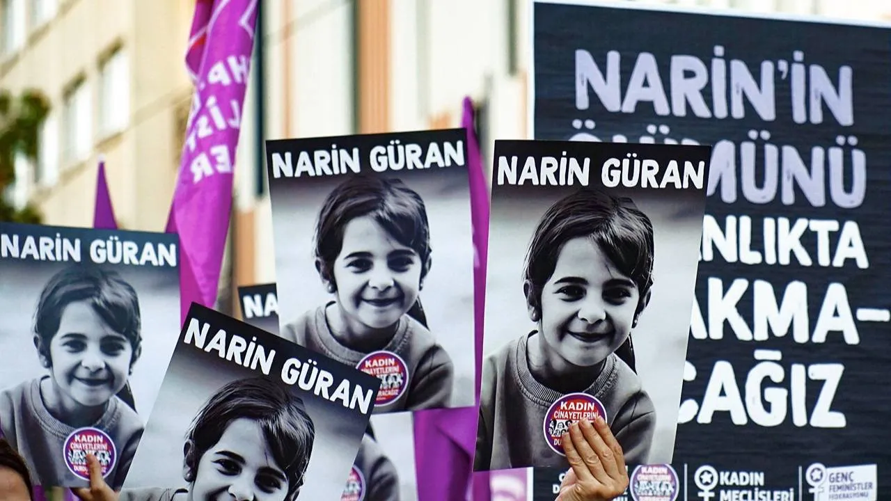
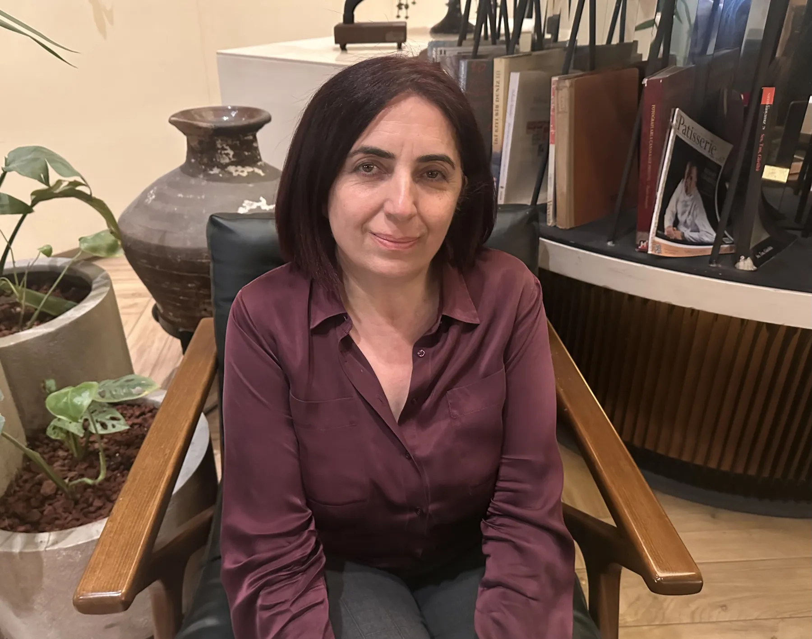
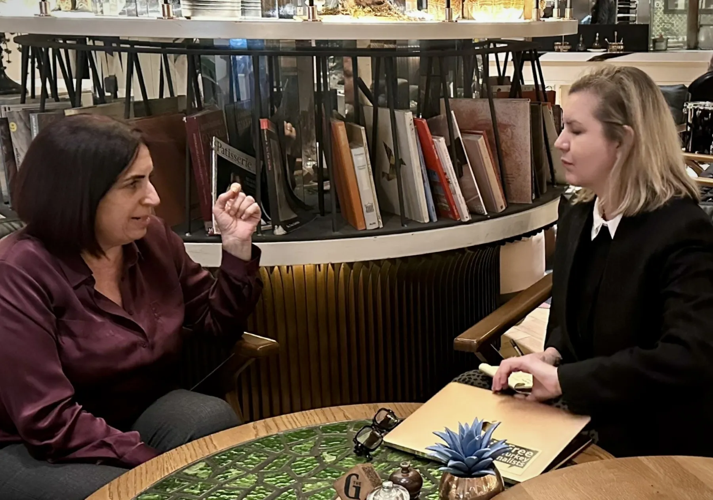

{fig-align="center" width="70%"}

> "They spat into the mother's mouth during interrogation. The family was unable to convey their case — there is a language barrier, an Eastern reticence. I, too, believe Narin was abused. Every second the Güran family spends in prison is a crime against humanity in which most of us are complicit. Because, contrary to everyone, I said 'The family cannot be guilty,' I experienced a kind of social exclusion in Diyarbakır, I was left alone, greetings were cut off."

**Narin Güran** would have been 10 years old today, had she not been killed in August 2024. The file of Narin Güran — one of the murders of girl-children that has shaken all of Turkey — appears in some sense to have been legally concluded with developments last week. **Nevzat Bahtiyar**, who initially directed suspicion toward the family by claiming that uncle **Salim Güran** committed the murder and that he gave him the body to bury, was sentenced in retrial to 17 years in prison for "qualified aiding in the deliberate killing of a child." Before this verdict was announced, the documentary "Şeytantepe" by 140journos brought the contradictions in the case file back to public attention and reopened the debate. Last week, father **Arif Güran** also joined the discussion in an interview with my colleague **İsmail Saymaz**, complaining that suspicions of Narin having been sexually abused — either before or after being killed by Nevzat — were not investigated.

I wanted to talk about the debate over the court rulings and the errors in the investigation with **Sevilay Çelenk**, DEM Party Diyarbakır MP, who has been following the case very closely from day one. After all, Sevilay — a communications expert and longtime academic — has insisted from the very start, at the cost of standing against her own party and even the civil-society circles she came from, on the "the family is innocent" argument that has only just become popular. In fact, exactly because of this, at one point in Diyarbakır people stopped greeting her. Those who reacted against Çelenk are people who, like many of us, were quick to take as "true" the rumours about the family. Talking to her, I came to feel — with an aching heart — that none of us is free of this collective delusion, and that without realizing it, we have all played some role in the spiralling of these errors.

Having pored over forensic and expert reports, listening to all the defendants in court for hours, following the lawyers' work — Sevilay Çelenk is assertive. According to her, every second the three Güran family members — sentenced to aggravated life imprisonment on the word of a paedophile like Nevzat Bahtiyar — spend in prison is a crime against humanity.

## "There is no conspiracy in this case; the inexperience and inadequacy of the gendarmerie lie at the root of the investigation's errors"

**— As someone who has watched almost every hearing from the very beginning, you arrived very quickly at the point — only now being discussed by many — that "members of the Güran family cannot have committed this murder." The date you wrote your first** [**article**](https://bianet.org/yazi/narin-e-hakikat-borcumuz-var-olaylar-nasil-guran-ailesinin-aleyhine-dondu-304164) **on this was January 2025. The opening of this debate today seems to have been influenced by the recently released** [**"Şeytantepe"**](https://www.youtube.com/watch?v=iMn0bEshf6w) **documentary by 140journos. According to that documentary, Nevzat Bahtiyar was somehow exonerated with the help of the gendarmerie. If this theory is realistic, who is Nevzat Bahtiyar that the gendarmerie would protect and shelter him? Or, through an acquaintance within the gendarmerie, can a villager be favoured for so long in a case under such intense national scrutiny?**

Since we are going to talk about the documentary and the gendarmerie, let me recall the claim there. Expert witness Tuncay Beşikçi says, "This is a gendarmerie conspiracy." I do not agree with this at all. I also think that calling it "conspiracy" damages the essence of this matter. Because when you say "conspiracy," sensation comes to mind, and a tinge is created that overshadows the gravity of the event. In my view there is no conspiracy at all. The fundamental problem in this case is the inexperience and inadequacy of the gendarmerie. The Diyarbakır Gendarmerie has no crime-scene-investigation knowledge or experience. Once journalists, politicians, rights organizations… everyone fixed their attention there, in my view the gendarmerie even forgot what it knew. It failed to do many things it was expected to do — or could have done in a calm environment. And of course, from the second day of the incident, the phrase "These things happen out there" began circulating everywhere. By this they were implying, "Out there, children can be killed by family for revenge."

## "I think they understood the truth the day they caught Nevzat, but they could not turn back from their mistake"

**— With this phrase, an implicit reference was constantly being made to intra-family sexual relations or incest. The thesis that Narin had seen a relationship between her mother and her uncle — that is, "saw something she should not have seen" — and was therefore killed by the perpetrators of the relationship, suddenly became very popular.**

Yes, at first the mother and uncle were named. When that didn't stick, theories about the older brother were produced. Yet Enes was nowhere in the story at the start. This was put forward through the so-called "narrowed base" study. This time the thesis that **Enes** might have done "something" to Narin was processed for months. And these people were tortured and ill-treated in custody. The gendarmerie made so many mistakes… They got these people to sign untruthful, incorrect statement transcripts. Because under the pressure they were under, they didn't know what to do. And now it appears that, in fact, Nevzat Bahtiyar's circle continually directed the investigation toward the family. There were fake Facebook messages and so on. As a result, even the family's most distant relatives were taken into custody and questioned, while the closest place to the point where the child disappeared — Nevzat's house — wasn't visited even once. By the 19th day, when Nevzat was caught, the investigation had advanced from such a wrong starting point that they could no longer say "Not the family, but Nevzat." Because all the authoritative voices of the state — from **Ali Yerlikaya** to **Yılmaz Tunç** and **Mahinur Göktaş** — had made statements in this vein. They could not later come out and say "It was Nevzat after all." Yet I believe they understood it the day they caught Nevzat.

**— If those running the investigation on the state side actually understood the day Nevzat was caught that he was the one who killed Narin, why did the trial not proceed in that direction?**

Expectations had been raised so far in another direction that there was no turning back.

{fig-align="center" width="70%"}

*Nevzat Bahtiyar*

## "Everyone made the same mistake — every segment of society"

**— Yet this is a country that has seen countless cases of women and small girls killed after being sexually abused. So why was this possibility pushed to the back, and the thesis of dark intra-family relationships given so much credit?**

Here it is not just one segment that made the mistake, everyone did. For instance, before coming to meet you, I re-read your [interview](https://t24.com.tr/yazarlar/cansu-camlibel/eren-keskin-guran-ailesi-o-aciklamayi-yapmadan-onceki-aksam-bazi-milletvekilleri-ailenin-yanindaymis-narin-in-ailesinin-bir-adli-tipcidan-gorus-aldigini-dusunuyorum,46387) at the time with the experienced lawyer **Eren Keskin**. While only 25 days had passed since the incident, with the family not yet having stood trial, Eren Keskin too openly and gravely accuses the family, saying, "They will pin it on the older brother or on Nevzat Bahtiyar, they'll save the family." This was the general conviction in society, and because it was such, the gendarmerie, while interrogating Nevzat, said, "Take it easy. All of Turkey is behind you. Speak comfortably." This interrogation footage is in the documentary. Such an interrogation cannot be!

But while saying this, I do not think — as some do — that "Nevzat was protected for some other reason." From what I see, the gendarmerie's stance was not because Nevzat had a value for someone. They could not turn back from the mistakes they had made from the very beginning. They were so unable to turn back that they all became entangled together in this lie.

## "Galip Ensarioğlu's statement was very wrong; he doesn't really know the family, he heard the rumours like everyone else and believed them — the cost of what he did was very heavy"

**— Don't the practices we've been observing for decades lie at the root of the assumption or prejudice that the state protects perpetrators? The recent revelations in the Gülistan Doku case are clear examples. Indeed, wasn't the impression that the Güran family was being protected formed by an AKP politician, Galip Ensarioğlu, coming out in the early days of the incident and saying, "We know almost all members of the family. We have a close friendship. There are things we sometimes don't know, sometimes know and shouldn't say"?**

I never spoke with him personally. In fact I tried to talk to everyone. From the AKP I think I met with about 40 people, all very long meetings. But I did not speak with **Galip Ensarioğlu** because what he did was very wrong. I think when he said that sentence, in this climate of social polarization, he could not foresee that the AKP's bad track record in cases of femicide and child murder would be charged to the family, creating a horrifying public outrage. After all, at that time I, too, was hearing about the relationship between the uncle and the mother. But these are not things we as MPs can definitively establish. Also, how well Ensarioğlu knows that village is debatable. The reason he said "We know the family well" is voting tendencies. The AKP can produce two or three MPs from Diyarbakır. The villages voting for the AKP have been clear since the days of Milli Selamet. The reason he said "We've known them for forty years" is just that, no more. So there's no great friendship. He had clearly been convinced by the rumours like everyone else… Yet had he really known the family well, he should not have been so easily convinced that this child was killed within the family. But he heard the rumours, believed them and made a statement on top of them. The cost of this was very heavy. At one point during the process I thought he might come out and explain this. He did not. Because clearly, he had received a serious lynching.

{fig-align="center" width="70%"}

## "Today, in the Gülistan Doku case, a decision is being made about who is expendable"

**— Setting aside what Ensarioğlu believed or said, I want to come back to society's prior assumption that the state will once again protect somebody and the crime will go unpunished. Do you think it is precisely because of this awareness — and to repair this — that today's Justice Minister Akın Gürlek took up the Gülistan Doku case? When and why does the state stop protecting those it once protected?**

A decision is being made about who is expendable. I never built long sentences on the **Gülistan Doku** file because I do not speak about things I do not know. I just take a principled stance against femicide. Beyond that I don't get involved. But the visible thing is this: for five years not even her body has been found. And we are not at all surprised when we hear, when we see this — because, yes, they have always been protected. Because we know this too, we projected all our existing consciousness onto the Narin Güran file.

## "The government saw a 200-vote village in Tavşantepe that they could expend, and stepped back"

**— In one of your articles you summarized this collective state of mind very effectively: "We tried to take revenge for the years wasted by the AKP, but this was an impossible revenge. The phrase 'There are things we know and cannot say' locked our suspicions onto this. And we tried to settle scores with the AKP through this. But in the end, the AKP government was again the one who slipped out of this affair."**

That's how it happened, unfortunately. And that situation left us with the feeling that real reckoning was happening — as if we had won. Yet that was not the truth. They saw a 200-vote village they could easily expend there, and stepped back.

{fig-align="center" width="70%"}

*Father Arif Güran*

## "Father Arif Güran asked me, 'Your party is in power here, will you not have a policy against this oppression?' — I cannot forget that"

**— I never quite understood that part either. Was a portion of the Güran family voting for HÜDA-PAR, for example? Or how can anyone be sure they all collectively voted for the AKP?**

According to the vote rates announced by the Supreme Election Board, in Tavşantepe the majority of votes go to the AKP. But 20–30 votes from the village always go to the DEM Party. For instance, the mother **Yüksel Güran** is known as a DEM Party supporter — the daughter of a family that migrated from a forcibly evacuated village in Derik. On the other hand, father Arif Güran, against allegations of close ties with Hizbullah, says, "In our village only one person prays — that is my mother-in-law. And she is a DEM Party supporter."

Looking at Arif Güran's statements, he is in fact expressing his expectations from those in power rather than from a particular political party. To explain what he means by "those in power," I'd like to share a dialogue we had. Months ago when I went to the village, they had me conduct an inspection. He was there too, as were the lawyers. He turned to me and said, "Honourable MP, you are putting in tremendous effort. If it weren't for you, we wouldn't be sitting here keeping this justice vigil. They wouldn't allow it. Your party is in power here." These words really moved me, I cannot forget them. "Here it is the DEM Party that produces 8 MPs. Here all the municipalities belong to the DEM Party. Here those in power are the DEM Party. Will you not have a policy against this oppression?" he asked. Whether or not he is a DEM Party supporter, he had hoped that the DEM Party's understanding of justice and its stance in the women's struggle would help him.

**— And Arif Güran had great expectations of the Diyarbakır Bar Association.**

Yes, absolutely. We are talking about a village and a family that has experienced such a horrifying targeting. And this man comes out and says, "Our Bar knows us. They will not look at us through the eyes of the others. We thought that while everything else was demonising us, they would not. But there too, they did this to us." When you put all of Father Arif Güran's observations side by side, you see — there is a very wise side to the man. What he has lived through over a year and a half has, I think, made him a different person.

## "DEM Party fell into the same clichés as everyone else, but everyone was there; charging the errors in the file to our party is ideological — opposition in safe waters"

**— Behind Arif Güran's disappointment with the Diyarbakır Bar lies the fact that the media, society — a bit of all of us — were too quick to form opinions about the family, and that they too fell into this. Didn't your party, the DEM Party, in the end, fall into the same clichés?**

It did.

**— So the DEM Party, which produces 8 MPs from Diyarbakır and claims to know the people and the region better than anyone else, also could not really set out a different line from other political parties or the average view. Why?**

I figured out the reason for this only quite recently. In answering this question, I want to return again to your interview with Eren Keskin. You had asked a very good question: "Has the women's movement been able to overcome political polarizations, the polarizations in society?" Unfortunately the women's movement has not overcome polarizations. But on the other hand I should also say: at the point we have now reached, I find it extremely ideological to charge the errors in the Narin file to the DEM Party. That is what İsmail Saymaz does in the documentary too. Charging something to the DEM Party, putting it in the crosshairs, is an easy way out. As a party we did fall into clichés, but everyone fell into the same clichés together. These criticisms directed at us, without taking on those in power, are a form of opposition in safe waters. The DEM Party is seen as expendable. The documentary too commits this injustice. The only politician seen in the documentary is our co-chair **Tülay Hatimoğulları**. This is a great injustice.

In bringing this criticism, I do not want to harm the documentary's function in the rights struggle. I want 5 million people to watch it. If the wind in public opinion is going to change, we will set aside the injustice done to us. But it is unjust to act as if the DEM Party was the first to come out and speak on this. Together with my advisor we did a chronological archive search. The first politician to bring it onto the political agenda was **Ümit Özdağ.** "Narin died as a result of your decadent, pig-tie-wedding-producing feudal culture," he said. He was making a Hizbullah allusion through the "pig tie" reference. **Özgür Özel** in his statement on 9 September emphasized "feudal relationship." On 10 September, then Interior Minister Ali Yerlikaya, when reminded by journalists that "You did not offer condolences to the family," said, "It is quite open, there is not much more to say. It is a situation that everyone, when they read it, understands and feels. Is there a need to explain it again? I hope we never face such a tableau in which we are ashamed of our humanity." Yet injustice is being done to Tülay Hatimoğulları, who made the first statement days after all these statements, on 16 September.

**— But the impression that the DEM Party circles were among those who fanned the Hizbullah-connection allegation is not entirely groundless either, surely…**

Yes, in our party in the early days too — unfortunately — there are grave statements from one or two hasty MPs. Because this is being poured everywhere. Not everyone has our experience. Younger people can be more superficial. So yes, there are a few statements that were made.

**— And it's impossible not to notice the sentence Ms. Tülay made by going to Tavşantepe at the time:** **"Weapon depots etc... The residents of certain villages in the region that have been turned into the bases of certain political parties should know that these weapons turn around and shoot the villager themselves, these weapons turn around and make the people kill each other."**

Our people had perhaps something like the following reflex: when the area suddenly began to be othered with arguments such as incest and child-killing, they perceived this as something directed at the entire Kurdish society and reacted. I'm not saying this because I justify them — I'm trying to analyze why those reactions were given in the first place.

{fig-align="center" width="70%"}

*DEM Party Diyarbakır MP Sevilay Çelenk*

## "Because, contrary to everyone, I said 'The family cannot be guilty,' I experienced a kind of social exclusion in Diyarbakır, I was left alone, greetings were cut off"

**— Ultimately, a party that wages a struggle for the rights of the Kurdish people also made statements that served the othering of a Kurdish family. So Arif Güran told you too, that this was not the stance expected of the DEM Party.**

Of course it isn't expected. This is very grave and very wrong. But the unseen thing is this: everyone was there. From the CHP to the Yeni Yol Group, everyone spoke, everyone said something. At the first hearing there were MPs from every party in the courtroom, and they all sat next to one another. But there is a DEM Party accusation in the documentary as if they were not in the story at all. The CHP isn't in the documentary at all, for example. I may have my own grievances. I really had a hard time during this process. I experienced a kind of exclusion in Diyarbakır.

**— Why?**

Because Sevilay Çelenk came out on 30 January 2025 and suddenly said something that ran contrary to everyone. She opposed what the entire country was saying. Now some are racing to say "We said it too," but at that time no one said that the Güran family could not have committed this murder in this way. After that a few articles came out properly examining the contradictions: **Yıldıray Oğur**'s article, **Ali Duran Topuz**'s article. Then the court's reasoned judgment came out and the discussion was cut as if with a knife. None of those who today say "We said it" have the courage to say "this verdict is debatable" on those television programmes. They say two sentences and move on. I was left alone. Not just DEM Party circles but also women's circles, legal circles… you understand it from the cessation of greetings when you go somewhere — you face a great reaction. It is very hard to operate in such an environment.

## "Those with different views in the party always listened to me, but I am sad that we couldn't bring it to the point of forming a legal commission"

**— You have long been in the media, in academia, in civil society but you are relatively new to politics. How much did you struggle inside the DEM Party?**

There were times I struggled, but I can also say with an open heart that they always said, "Hocam, let's talk about this," and we talked. We held three separate long conversations and each ended as one in which I had left very serious question marks in their minds. After the verdict, on 28 December, I called the party from the courtroom. I called the two relevant commissions. I called our Women's Council and Children's Council co-spokespersons, "Don't make any big statements. I have been watching here for three days. Something very strange happened here. Let's wait for the reasoned judgment. Let's not say anything that will put the Party in a difficult position around it. Let us issue a cautious statement," I said. In fact, in the courtroom I had a tense exchange with someone from my own party. Because they had been horrified at my words on the family possibly not being guilty. I left the courtroom and went straight to my mother's house just opposite the courthouse. Although I was authorized and assigned to follow the trial, I did not say a single word to the media. My party also did what I had recommended — issued no statement to the effect that the family was guilty. Since that day, attention has continued to be paid to this in the party. But is anyone looking at what the justice ministers, the interior ministers said?

In fact the Deputy Gendarmerie Commander came to the Parliament and gave information, saying things like "The Narin case has been solved in the most perfect way. From now on it is just gossip." Ultimately, when everyone in the DEM Party was in the mode of "Close this file," the party would not have allowed an MP who continued to scrutinize the file — even without being convinced by what I was saying — to keep up this argument. There could have been a parting of ways. I am someone who, with the group leader in front of me and MPs behind me, shouted at Vice President **Cevdet Yılmaz** in Parliament, "You are making a historic mistake," and put my question to him. Then I made an appointment and met with him. So I waged this struggle everywhere, including in Parliament. Inside the party as well… Then Gergerlioğlu joined too. In the end many people inside told me, "What a great job you are doing." One day someone said, "The Güran family may not have done it, but we are not as familiar with the file as you are." Well then, you should have set up a legal commission, and your MPs in that commission would all have looked at the file together. Our party has so many lawyer-MPs. I could not bring it to that point. I am very sorry about that.

{fig-align="center" width="70%"}

*Mother Yüksel Güran*

## "In the intensity of the peace process, no one realized this was the judicial scandal of the century"

**— At the point we have come to, despite your effort, does the DEM Party seem to have managed to stand somewhere against the widespread conviction concerning the family?**

It did not. Unfortunately, we are not in a position to say "no" to that. But to say "the DEM Party shaped this" is something else entirely. After all there is a party dealing with many matters. And there is also a peace process that started right after the period of the murder. So a period that coincides with that. In that intensity, they could not realize that this case is — as I have called it — "the judicial scandal of the century."

## "They spat into the mother's mouth during interrogation"

**— Why do you say "the judicial scandal of the century"? Isn't our recent history full of many other contentious, problematic cases?**

An eight-year-old child is murdered. The whole country, with its law enforcement, its judiciary, its media, locks onto that place. And from day one, everyone treats the family — who lost their only daughter — as "killers." On the day the child's body is found, the mother is tortured. On the day they find their child's lifeless body, in interrogation, they open her mouth and spit into it. She herself says this. My heart aches as I repeat this sentence.

## "On a paedophile's word, three members of a family received aggravated life sentences"

**— Are they doing this during the gendarmerie interrogation?**

I no longer know that level of detail but probably yes. Interrogation is something that happens in police custody. Her son is tortured and then the footage is shown to the mother. They are trying to get 18-year-old Enes to say "I did it." The child loses his mind there. An 18-year-old. These are people who lost a member of their family. Even just watching the birthday video they prepared for Narin makes you understand: that little child was being raised like a princess in that home. The only girl. This is the judicial scandal of the century, because the highly likely perpetrator — a sociopath, a paedophile — is slipping out of this as easily as drawing a hair from butter. With the sentences he has uttered, three members of a family are receiving aggravated life sentences.

## "The family members spoke for hours in court — no one listened to them"

**— And he is doing this without speaking very much, actually.**

Yes, in court he uttered only four sentences. People who lie speak little like this. As little as Nevzat Bahtiyar speaks, the mother and uncle speak that much. And without ever stopping… The person I looked at most suspiciously was the uncle, but you look at his body language, you look at what he says — there's no air of someone trying to hide something. There's no anxiety like "What if I let something slip and it turns more against me?" My dear Enes, under that horrific trauma, speaks for two hours. The mother, in her broken Turkish, says "We were a happy family." They tell and tell, but no one listens to them. It struck me as utterly horrifying.

## "The family was unable to convey its case — there is a language barrier, an Eastern reticence"

**— While searching for an answer to the question "Why couldn't this family explain themselves, make their voices heard?", you mentioned the language barrier in your articles. Mother Yüksel Güran expresses herself in Kurdish, her Turkish is very weak. But isn't there also a cultural barrier or jargon factor? Even when they speak Turkish, words that mean one thing for us can mean something else for them, right? Their vocabulary seemed to fall short of conveying their case.**

You expressed it very well. They fell very short in conveying their grievances. Actually some of the men interestingly express themselves well. Father Arif Güran, for example, expresses himself well, but uncle Salim cannot. There is the Eastern reticence you point to. Yet the listeners want from them an emotional outburst right away. The mother, for example, could never get her statements approved by Turkey. The woman has never seen a camera in her life and suddenly she sees herself in dozens of live broadcasts. I watched her very carefully in court. She does not have the psychology of someone guilty. In court she once said, "Today they told me 'My condolences,' and just imagine, I was happy even about that." How heavy a state of mind this is, people don't understand.

The sentences she uses are different too. For example she says, "Maybe the child came home…" She wants to say, "The child may have come home but I don't know," but instead she says, "Maybe the child came home…" When that is taken and turned into a headline, it's a horrible thing of course.

## "I, too, believe that Narin was abused"

**— Last week, in his** [**interview**](https://halktv.com.tr/makale/mahkemenin-reddettigi-narin-guran-kesfini-ben-yaptim-1025121) **with İsmail Saymaz, father Arif Güran for the first time openly stated his belief that Nevzat Bahtiyar sexually abused his daughter. To what extent was this issue scrutinized in court?**

The Güran family's lawyers said this in court. They said "PSA was not examined." It wasn't a revelation to me; I reached this conclusion because I followed the trial, read all the reports and joined the on-site inspections. The lawyers were really very good. I, too, think Nevzat sexually abused the child. But everything happened in 18 minutes. I think the child quickly woke up to the fact that something was about to happen to her. At first, because she knew Nevzat Bahtiyar, when he called her she went to him, but then she immediately woke up to the fact that something was off. When Nevzat panicked, I think he killed her right away. So I do not think he threw her into the barn and killed her after abusing her there. I could be wrong, of course. It's very upsetting to talk about these things anyway.

**— Even if he killed first and abused after, that would say something else about the killer's personality, presumably…**

I have said a few times that this could have been the case. After the incident, his car stands there for 39 minutes for no reason. There can be two reasons. The first is what you said; the second is that maybe he tried to dismember the body. Indeed one of the child's legs is severed. He probably wasn't sitting there meditating for 39 minutes. In the forensic report there is no penetration of the child but there is PSA fluid in the underwear region. This cannot be explained.

**— Is that why Arif Güran says, "They turned my daughter into a woman!" — or for another reason?**

He says, "They are saying 'PSA cannot be in a child, only in adult women or men.' That is, they made these statements as though my daughter were an adult woman." He says it to react to the comments. He doesn't use it in the sense of "they raped her." But ultimately the family circle believes in the abuse. I heard this in a very wide context in the area.

## "The process is at a historical crossroads, the party's energy is locked there"

**— Just now, while answering criticisms directed at the DEM Party through the Narin file, you made a statement that stuck with me. You said, "Our party has to deal with very different issues. And then there's the heavy workload of the peace process in this period." Wouldn't this be perceived as feeding the perception that "Their only agenda is the Kurdish question"?**

First of all, for our party, the resolution of the Kurdish question really is a very fundamental matter. Very fundamental and very urgent. The economic, sociological dimensions of the Kurdish question, intertwined with the women's question, are well known. But the fact that this is so does not mean that the DEM Party does not work in other areas. Look at the recent miners' protests, the workers' protests… one of our MPs spent the night with them. As for animal rights, we are there too; with earthquake survivors we set up separate solidarity. We are in every kind of struggle and everywhere. But this does not mean that we can do everything as fully as possible. We are 57 people, after all. The process is also at a very historical crossroads, so a great deal of energy is locked there. But on the other side too, we really do more than what we can.

## "The decision to lay down arms is not something that can be reversed"

**— You said, "The process is at a historical crossroads," but according to Murat Karayılan, "the process has been frozen."**

Actually he is making a situational assessment. After all, the ruling bloc takes one step forward and two steps back, doesn't do anything significant about the expected legal framework, while the other side is expected to say "We have laid down arms" — or to do what is required. While doing this, the state side is watching the developments in Syria and Iran. Given this, for the other side to say "we have laid down arms" may no longer look strategically correct. In my view the process is actually not in the freezer, but I read Karayılan's words as "If this continues, the conditions for laying down arms will also disappear." That is, he is hinting at this. Of course, what is meant should be explained by the organization itself. Because my personal feeling is that the decision to lay down arms is not reversible. That was a very big, very historical step that cannot be reversed. Everyone sees this.

## "The organization itself can explain what it means, but in my view we should not arrive at the point of 'We didn't actually lay down arms'"

**— But didn't Murat Karayılan, with this latest statement, in some way challenge the expectation that they would lay down arms?**

In some sense it can be called a challenge. Essentially it's a situational assessment. The Kurdish society which has had such a bad experience is in the middle of a brand-new conjuncture beginning with the Iran war. If in the current environment none of the expected steps are being taken, I think he is trying to say that they are aware that the state too is reconsidering the situation. Most likely they themselves will explain more. I think it should be so. If you ask my opinion, we should not arrive at the point of "We didn't actually lay down arms." That is my view.

{fig-align="center" width="70%"}

## "Öcalan has no opportunity to produce thought on a file like Narin other than from what he hears within four walls from the screens"

## "When I heard what he said, I thought, 'I wish accurate information had been provided to him,' I spoke with Sırrı Süreyya Önder"

**— One of those who made statements emphasizing the "feudal order" on Narin was Abdullah Öcalan. In a letter he sent to the PKK congress last May, he claimed the Güran family descended from a mullah family that participated in the conquest of Istanbul. He said, "That regrettable incident in Tavşantepe is connected to the tribe; through the agency of that tribe, that terrible element of rape inside has been expressed as a massacre against a tiny girl-child unparalleled. It is a symbolic incident but its meaning is very striking. This is the expression of a culture." So he too in some way joined the tribe / feudal order critique.**

There is the following situation: someone who has been imprisoned for 27 years follows what is happening only through statements on the television channels he can watch. Journalists say one thing, rights organizations say something similar — even the Diyarbakır Bar says the same thing. Everyone in unison says, "The family is guilty." **Öcalan** has no opportunity to produce thought other than from what he hears within four walls. When I heard him use the expressions you reminded me of, I thought, "I wish accurate information had been provided to him." Yesterday, on the first anniversary of his death, I spoke with Sırrı Süreyya Önder about this matter. "The information that the family may not have killed Narin needs to reach there," I said. **Sırrı** already knew that I was closely interested in the topic, he had read my articles. He told me, "Hocam, I am absolutely behind you to the end. I will explain this matter too if necessary." With the speed of a person who feels real interest in stories, he understood what I told him. Not everyone had understood as fast as Sırrı. But Öcalan thought what came from a limited information source — but was conveyed by different circles in the same way — was correct. Of course no one is fully free of prejudices. He is not either. That's how it is.

## "Öcalan is someone who has experienced none of the phases of the transformation in IT and social media"

## "Among the things he says, those giving the feeling 'This is not quite so' will naturally occur"

**— What you describe is, in a sense, an anecdote specific to the Narin file, but couldn't it also be interpreted as an example fitting the question marks about how much and how Öcalan can evaluate what is happening outside?**

We are talking about so many years that have passed under heavy isolation. He is someone who can meet with a limited circle of people. It is unclear whether he can read whatever he wants. Yet still he reads a lot, and on certain matters he produces a more realistic Middle East analysis than many of the actors on today's political stage. For instance, on the likely course of the Iran war he makes a very good analysis. But in terms of grasping the sociology and psychology of society, seeing its tendencies and analyzing this multilayered thing, 27 years of isolation is something very serious. He has not experienced any phase of the transformation in information technologies. He has not experienced social media or the new media. So in the end the practice of getting information in prison is what he has. So naturally, of course, among the things he says to us, those giving the feeling "This isn't quite so" will occur. Yet still we see someone who handles macro issues with a very serious organizational genius.

## "Why does the family receive life imprisonment while Nevzat gets 17 years?"

## "Every second Yüksel, Enes, and Salim Güran spend in prison is a crime against humanity in which most of us are complicit"

**— Let's wrap up by recalling the latest situation in the Narin Güran case. At the hearing on 16 April at the Diyarbakır 8th High Criminal Court, Nevzat Bahtiyar was sentenced to 17 years in prison without discretionary reduction for "qualified aiding in the deliberate killing of a child." In the announced reasoned decision it says, "It has been concluded that the defendant participated in the act of killing the victim by being beside defendant Salim, by reinforcing the decision to commit the offense before and during the act, and by aiding after the commission of the act, in the capacity of one who aids the killing; thus, in line with the Court of Cassation's ruling, a conviction was rendered against the defendant for the offense of qualified aiding in the deliberate killing." Why, in your view, is this decision flawed?**

If Nevzat is standing next to Salim like this, if he is reinforcing the killing motivation, what becomes of the role of the mother and the brother? Why do they receive life imprisonment while Nevzat Bahtiyar gets 17 years? Everything is becoming so absurd! The Court of Cassation, with this retrial, is making a completely different interpretation from the court of first instance — and the Court of Cassation has no right to make such an interpretation outside of its review of legal compliance. There is no new situation that would form the basis for this either.

Every second that Yüksel Güran, Enes Güran, and Salim Güran spend in prison is a crime against humanity in which most of us are complicit. None of them should remain in prison even for a second. As guilty parties to a murder they had no part in, and exposed to terrible slanders, they are in their cells gazing at the ceiling. I really cannot think of anything more grave.

As one last thing, I'd also like to say this: another misfortune of this family is that, because some of the family's members were called HÜDA-PAR or JİTEM, the people I had hoped would at some point take up the file — names from rights organizations, the women's movement, the legal community — kept their distance. I know how those who put this information into circulation reached people, because they reached me too. I don't want to talk about that part. Everyone investigating this matter was reached and people were tried to be stopped with phrases like "You don't know these things."

## "Another misfortune of the family was that the information that they are 'JİTEM members' was put into circulation by someone"

**— Could you explain exactly what you mean?**

Because they reached me too, with a journalistic instinct I did some research. The Güran family has another branch — children of the maternal aunt, so the surnames are different. The information that one of these people, whose name was associated with Yeşil, was a former PKK confessant entered circulation. In a region where for 40 years a kind of state of war has continued, whichever family you scratch, on one side you may find a PKK confessant, a PKK member, or a JİTEM operative.
