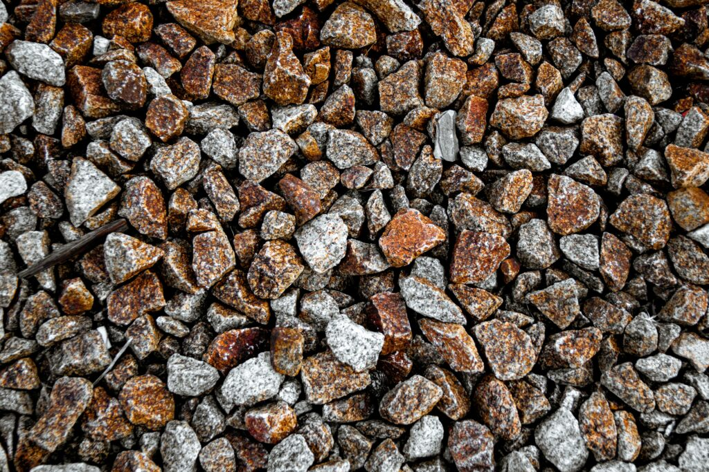
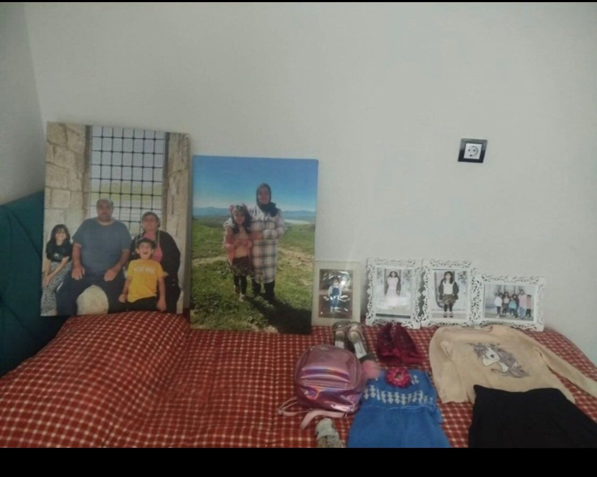
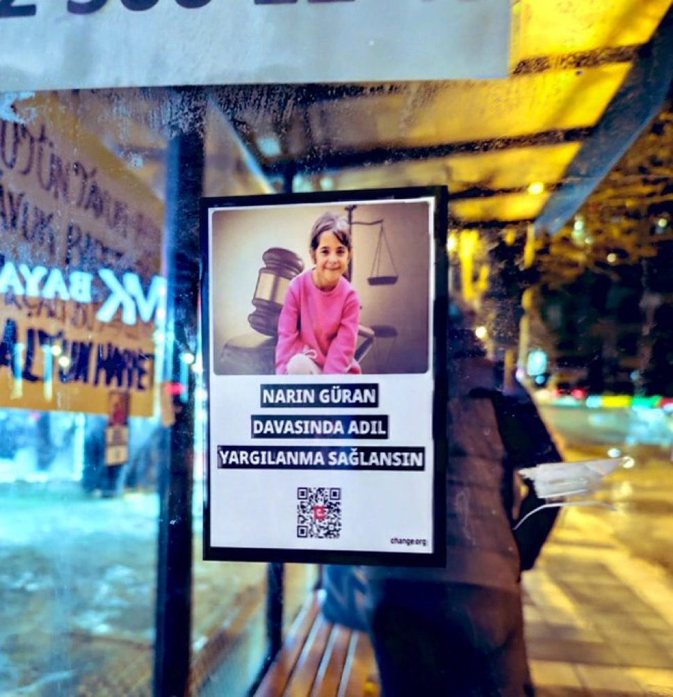
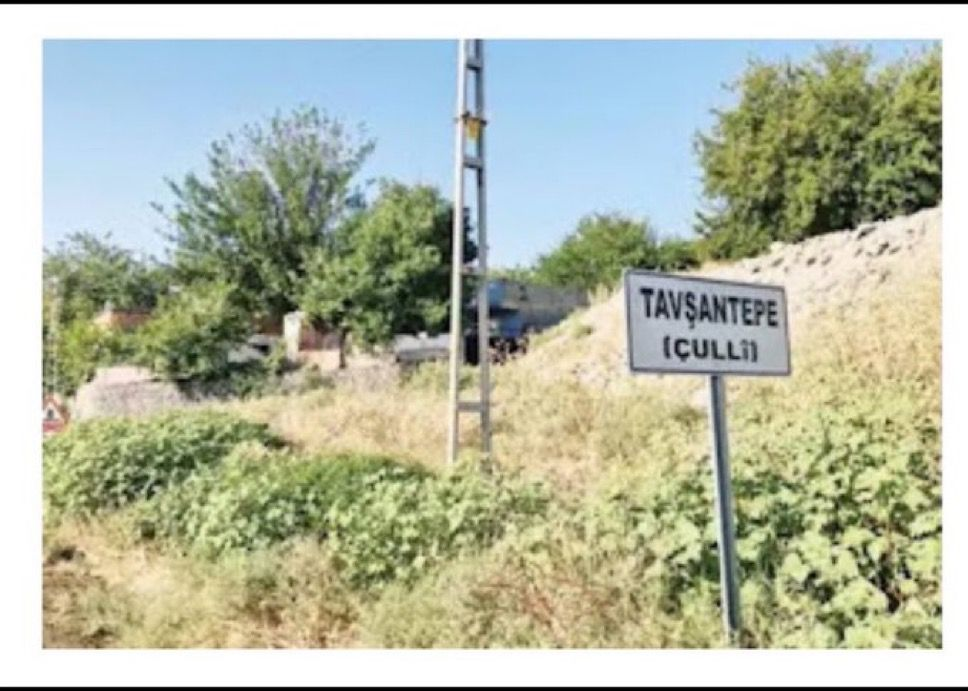

*What followed the murder of Narin Güran was no different from a modern stoning ritual. The target was once again a woman: Yüksel Güran, who was lynched by an entire society while mourning her own child, her dignity and past buried in a cell. This piece, poured from the conscience of a journalist, is a cry of truth addressed to institutions that stayed silent, a society complicit in the lynch, and the execution of justice.*

**Hilal Seven – London**

{fig-align="center" width="70%"}

Remember that horrifying scene etched into our memories by the film "The Stoning of Soraya M.": A woman is buried up to her waist in the village square and the first stone is thrown. Then the stones rain down; small, large, sharp… Most of those throwing stones are familiar faces: neighbours, relatives, villagers. While the woman is still breathing, the crowd's verdict of execution has long been delivered.

Since 21 August, when Narin Güran disappeared, this scene has been playing in my mind as I watched events unfold. Because what we witnessed was no different from a modern stoning ritual. Headlines, television commentary and social media lynching took the place of stones; but the target was the same: A woman.

That woman's name was Yüksel Güran. A mother mourning her own child was declared a "killer" from the very first days. While there was no evidence whatsoever, before anyone had even come close to the truth, stones began raining down on her. Türkiye's media and public opinion buried a grieving mother in the ground and placed her on a target. Every headline was a stone, every comment a blow. Today Yüksel Güran may be breathing in a cell; yet society has long since buried her life, her honour and her past by tearing them to shreds. Moreover, most of those who carried out this collective execution feel not the slightest pang in their conscience.

## A Modern Execution: Rhythm 0 and Marina Abramović

To understand this societal hysteria, one must look back to 1974, to Marina Abramović's *Rhythm 0* performance. Abramović placed 72 objects on a table — a rose, honey, a razor blade and a loaded pistol among them — and left this note: "I am an object. During this time you can do anything to me."

At first, gentle hands reached for the rose, spread the honey; as the hours progressed, they gave way to savagery. Her clothes were cut with the razor, her skin was slashed, a gun was held to her head. Years later Abramović would say of those moments: "I was ready to die." The crowd's reflex in the Narin Güran case was exactly this. On stage was not an artist but a real family; yet the appetite for lynching was the same.

{fig-align="center" width="70%" fig-alt="A scene from Marina Abramović's Rhythm 0 (1974) performance."}

From the very first days the mother was convicted, the entire family was besieged, the neighbourhood was combed through. The words that came from people's mouths were sharper than those razor blades. Why does the worst-case scenario come to mind first? Why do we choose to accuse rather than understand? That dark impulse that brought Abramović to the point of death in six hours tore apart the Güran family's privacy and reputation.

The real problem is this: this evil is not the work of just a few people. Thanks to this lynch, some were rewarded, some were promoted, and some continue their lives as though nothing happened. As a society, we are not outside this evil but at its very centre. Yet there is a forgotten difference: what Abramović experienced was an art performance testing boundaries. What happened after Narin was not a performance; it was organised, real and deliberate evil that descended upon a family, a neighbourhood and a life.

## A Call to Truth: Technical Evidence and Expert Opinions

I ask you to spare just 11 minutes of your time. This short animated film lays bare the realities of the Narin Güran murder, withholding no detail:



If this has piqued your curiosity, I ask you to spare another 35 minutes to watch the documentary produced by Mind Vorteks:



After this striking introduction, be sure to make time for the {comprehensive broadcast that examines the case's real truths through the lens of law, politics and media}[1]. These 2 hours and 47 minutes are a debt we owe to the memory of a child and to justice.

In this broadcast, forensic informatics expert Tuncay Beşikçi, who presents scientific {reports}[2] that could change the course of the case, makes a striking observation: "The great manipulation mechanisms of the past are now operating through the death of an 8-year-old child. Perception is being managed through media and bureaucracy."

Beşikçi's technical analyses fundamentally demolish the lie of {narrowed-base station records}[3], the case's biggest pillar. Image records and internet traffic clearly show that:

- Salim Güran was in his own home at the time of the incident.
- Enes and their mother Yüksel Güran were likewise in their own home.
- Six-year-old Eren's testimony also corroborated this technical data.

{fig-align="center" width="70%" fig-alt="Enes, Narin, Yüksel and family."}

Despite this, the court signed off on life imprisonment sentences while ignoring this concrete data. It was not only the base station records; forensic medicine findings were also left in the dark. Meanwhile, the time of the murder was fixed by three camera images, the duration of the murder was established, and it was certain from those cameras that the perpetrator was Nevzat Bahtiyar — yet this evidence was disregarded.

Child psychiatry specialist Prof. Dr. Veysi Çeri, speaking in the same broadcast, drew attention to the PSA (Prostate Specific Antigen) test found on the body. Emphasising that detecting PSA on a body that had been in water for 19 days was no ordinary finding, Çeri noted that this could point to systematic abuse. Yet the media and public opinion chose to push these technical facts aside and direct all arrows at the family. I urge you to read the comprehensive post shared from the {account of X user Dr. Islamzade}[4], written with Narin's justice profile photo, covering the details from A to Z.

Another benefit of listening to this broadcast from start to finish is seeing the accurate journalism analyses of important journalists such as Atakan Sönmez and Ali Duran Topuz regarding the case; and becoming aware of the assessments made by former presidents of the Diyarbakır Bar Association Mehmet Emin Aktar, family lawyer Onur Akdağ and other legal professionals, delivered as though lecturing from a university podium. I have asked you to devote roughly five to six hours to these broadcasts; your valuable time and your unprejudiced attention… After all, what is half a day of your time to understand the savage tearing of a tiny 8-year-old human being from this world? Would it be too much to listen once more to Arif Güran and his speech that made all our hair stand on end?

## The Execution of Justice: Nevzat Bahtiyar and the Güran Family

Narin was an 8-year-old child whose happiness could be read in her eyes in every photograph, and whose upbringing in a loving environment was evident in everything about her. Sadly, she was torn from life within the merciless reality of the geography where she was born. When we look at the course of the case, a picture that is difficult to explain with rational thought emerges: Nevzat Bahtiyar, the name at the centre of material evidence and contradictory statements, was for some reason turned into the figure whose accounts were "taken as the basis" during the trial.

{fig-align="center" width="70%"}

On the other hand, the mechanism of justice operated with an entirely different severity for the fifteen members of the Güran family. While allegations of severe torture in interrogation rooms filled the air, the most fundamental principle of law — "the benefit of the doubt belongs to the defendant" — was virtually suspended for this family. We must now stop and ask: How did these people — whose statements contained not a single contradiction, who raised their children with great care, and who had no rational motivation to murder their child — suddenly become the perpetrators of the gravest crime? Let us recall the moment they met when they visited the graves of the murdered family members days later.

The real question that wounds our conscience at this point is this: How can a person who kidnapped and killed Narin and then continued with life as though nothing had happened, notable for their cold-bloodedness, be perceived as though they were the "least culpable" party in the case? As things stand today, Yüksel Güran, Enes and Salim Güran have lost not only their freedom but all their reputation and family integrity. They are now behind four walls, mourning their one and only child while trying to pay the price of a murder to all of society.

## The Scales of Conscience: A Call to Institutions and Society

For those who once used their pen and social media power to demonise this family, perhaps today is the time to look in the mirror. It is not too late for anything. Examine the data presented for the sake of your conscience; if you were party to even the slightest injustice, show the virtue of apologising. Stand against the systematic injustice that targeted this family simply because they are Kurdish.

Today the world is debating the dark networks that abuse girls, the Epstein case. In this vile world where kings and presidents are implicated, we see how Virginia Giuffres who seek justice are driven to death. Today the blind system that tore Narin from life is imposing a similar helplessness on her mother. A woman, under the lynch of eighty million, is unjustly wasting away before our eyes. Speak up before it is too late.

From the opposition media that brazenly turned the family into news material to corner the government — what did this family do to you? A family whose child attended a Qur'an course, whose women covered their heads, who were deemed worthy of lynching simply because they are Kurdish, and who were turned into "the other's other" because their members held different political views. Everyone united and lived out their rebellion against what they hated through the Gürans. The government wing that dared not question the state apparatus, the opposition that could not speak up against the handicaps in the justice system, the secular segment that seethed inside at the sight of a covered person yet did not dare reveal its Islamophobia, and the Kurdish politics that wrote off the family from the start saying "they don't vote for us anyway, they're not one of us"… All of them failed in their stance.

Just as those who targeted Alevis in the past, those who threw forks at Ahmet Kaya, or those who prepared the process that led Tahir Elçi to his death are remembered today, so too will history remember those who entrusted the scales of conscience to populist figures who fancied themselves artists. This country's innocent people, whose hearts have been burned in every era, will never forget the injustices they have suffered, and will never shelve those who betrayed humanity in this case. That mob which accused an uncle who couldn't even afford to plaster his house of being "rich enough to buy the media" is under an enormous burden of guilt.

{fig-align="center" width="70%" fig-alt="Tavşantepe (Çulli)"}

Think for a moment about why the Güran family's children work on construction sites. A family that cannot even pay its lawyers' fees, that struggles to bring two morsels home — how can you brand these people as powerful, land-owning and wealthy enough to be exempt from punishment? History, whether written or oral, always illuminates such evils. Tomorrows always shed light on todays; the voice of truth may be faint today, but tomorrow it will make consciences roar.

## Journalism and Conscience: Bearing Witness to Truth

As a woman journalist, I had only one compass throughout this process: the principle our culture taught us of standing by the oppressed. Unlike those who succumbed to the hunger for popularity, we must see that this case is a matter of honour. My words are to my own quarter; to the honourable bearers of the socialist and humanist struggle:

- **Dear Saturday Mothers:** Yüksel Güran is a mother who could not even attend her child's funeral. Should you not extend your hand to her?
- **Dear Human Rights Association:** Why did you stay silent while family members were subjected to severe torture, while Yüksel Güran was forced to give a statement in a language she does not know?
- **Dear Women's Movements:** Why did you ignore Yüksel Güran's identity as a "woman" and the lynch she was subjected to?

Let me remind you; father Arif Güran, speaking to DEM Party MP Ömer Faruk Gergerlioğlu after the court ruling, {said}[5]: "They buried my family alive in the courtroom. Everything was evaluated one-sidedly."

{fig-align="center" width="70%"}

Moreover, secular and religious segments virtually united; they described the people of Tavşantepe as "superhuman" beings who killed children through rituals. Some regional correspondents tried to overcome their professional failures by profiteering from this case; they turned an entire extended family into a tool for their own interests.

Even the Diyarbakır Bar Association, which fights against rights violations in Kurdistan, turned a blind eye to the severe torture endured by fifteen family members. While one had a ruptured eardrum and another bore marks of torture on their body, the attitude of the Bar President shattered our hope for humanity. The most painful part was this: a woman was forced to express the profound devastation she experienced in her mother tongue in the language of the "male state" that had planted a fig tree in her hearth. This is plainly torture through language. Women's rights advocates sat in silence in the face of this oppression.

## A Candle in the Dark

This country watched 35 people being burned alive in Madımak, the killers of Hrant Dink, Ceylan and Cemile going unpunished. Now the same judicial system has decided that Narin's killers are her family. An entire truth was sacrificed so that a media showman could get a promotion, channels could gorge on ratings, and some could gain fame. Yet life is not entirely dark. Since 21 August, there is a conscientious group numbering in the hundreds who left their work behind and have been meticulously following documents and case notes, trying to make the Güran family's innocence heard.

On the other hand, good journalists still exist. If you have not yet read Faruk Bildirici's {observations}[6] in his piece dated 14 August 2025, please read it now. Then, please carefully read the article series "The Silence of the Lambs" by Ali Duran Topuz, {published on the İlke TV news site}[7], in which he covers every important piece of information that went unreported in this case.

In addition, read from beginning to end at least once the {article series by DEM Party Diyarbakır MP Sevilay Çelenk}[8], penned in the manner of an investigative journalism masterclass, which begins with the words "We owe Narin a debt of truth." Look, and you will see: the truth is actually plain as day. Never mind the efforts of the media lynchers who deceived millions — look at the research of the many conscientious people who devoted their efforts to this case. And finally, spare three and a half minutes to listen to the words of Narin's grandmother:



*In this video by The National News, hear the pain of Remziye, the grandmother whose grandchild lies beneath the ground and whose daughter has been imprisoned in a cell.*

{fig-align="center" width="70%"}

## An Assignment of Justice for the Future

Dear people of my eighty-million-strong country, whose presumption of conscience is mired in mud: If you wish, do not watch or read any of this, continue to wrongly accuse people as you have from the very first day; but know this: Berze, Ferhat, Leyla, Remziye, Rana, Melek, the late Nuri Karakaş and dozens of beautiful-hearted people whose names I cannot list are shouldering your shame. They are fighting the battle for justice for Narin without rest, day and night. I owe these beautiful people two words: Thank you for existing. The world turns thanks to the grace of people like you. The voice of conscience in these lands is heard thanks to you.

To be accountable, to turn back from error, to be able to apologise… To go beyond the hunger for popularity and remain "human"… That is our real test. Let us apologise to the people of Tavşantepe. Let us say "stop" to this disgrace against humanity inflicted upon Enes's stolen youth and Salim Güran. For a moment, put yourself in Yüksel Güran's place; feel what it would be like to try to describe an unimaginable pain in an unknown language.

{fig-align="center" width="70%"}

**I appeal to all your consciences: Who really killed Narin?**

In this case, everyone who contributed to the lynch has stained Narin's memory. Societal rot has been made flesh and bone. It was very easy to convict a family simply because they are Kurdish and poor. This case is another shade of the Kurdish question. In these lands where news is reported under bombs, where rights-based journalism is practised despite every kind of pressure and violence, in the words of a woman from Urfa fighting for justice for Narin: "A city as ancient as Diyarbakır should not have done this." Indeed, some journalists working in the region acted even more ruthlessly than that dark character in the film *Nightcrawler*. From its law enforcement to its judiciary, from its media to its self-proclaimed human rights advocates, a male-dominated order built its own fiction upon the death of a girl child.

To all the women in the Güran family, foremost among them Yüksel Güran; to all our women friends in prison who fight for a free and dignified world… And to all the mothers whose efforts helped you stay human against all odds…

**Happy International Working Women's Day.**

::: external-refs
1. Narin Güran Dossier / Law, Politics, Media: Where Did We Stand? (X Space broadcast) | https://x.com/i/spaces/1YpJkkZDOQMJj/peek?s=20
2. Tuncay Beşikçi: Analysis of Narrowed-Base Reports and Expert Opinion via ChatGPT | /en/blog/posts/tuncay-besikci/chatgpt-darbaz-raporlarinin-analizi/
3. Tuncay Beşikçi: The Narrowed-Base Story | /en/blog/posts/tuncay-besikci/daraltilmis-baz-hikayesi/
4. Dr. Islamzade: Justice for Narin – comprehensive post (X post) | https://x.com/islamzade24/status/2017275235926520133?s=46&t=pcIwnIlfHwdnQBKeErX0wA
5. Gergerlioğlu: Justice Must Be Served for Narin Güran and Her Family | https://www.omerfarukgergerlioglu.com/basin/gergerlioglu-narin-guran-ve-ailesi-icin-adalet-saglanmali/37522/
6. Faruk Bildirici: What was written and said about the Narin Güran murder? (14 August 2025) | https://www.farukbildirici.com/2025/08/14/narin-guran-cinayeti-icin-neler-yazildi-neler-soylendi/
7. Ali Duran Topuz: The Narin Güran Case 1 – The Silence of the Lambs | /en/blog/posts/ali-duran-topuz/2025-10-21-Narin-Guran-vakasi-1/
8. Sevilay Çelenk: We owe Narin a debt of truth (bianet article series) | https://bianet.org/yazi/narin-e-hakikat-borcumuz-var-olaylar-nasil-guran-ailesinin-aleyhine-dondu-304164
:::
