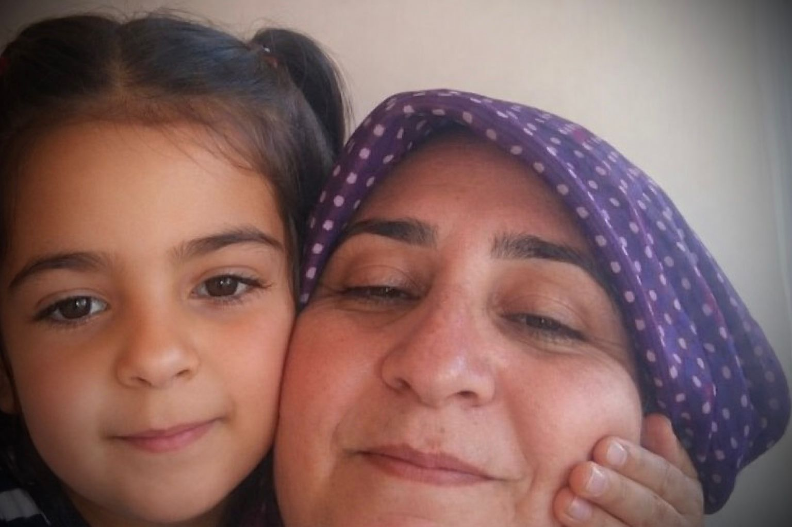

{fig-align="center" width="70%" fig-alt="From the Güran Family's collection, shared with the Author."}

In the sweltering heat of Maycomb, Alabama, Tom Robinson was convicted not by evidence, but by the "banality of prejudice" – the collective need of a terrified society for a culprit who looked the part. Decades later, a similar tragedy has unfolded in Diyarbakır, Turkey.

In August 2024, 8-year-old Narin Güran vanished from a Quran course. After 19 days, her body was found hidden under stones in a riverbed. While the nation mourned, the focus shifted from the predator to an easier target: her mother, Yüksel Güran. She became the modern Tom Robinson, sacrificed on the altar of a sensationalist media and a judiciary that decided her guilt before the first autopsy.

## Where the Rose Ends and the Razor Begins

> Lacking immediate answers, the media handed the public "razor blades". Within days, Yüksel Güran was no longer a grieving mother but a "cold-hearted accomplice" in a televised drama.

Marina Abramovic's 1974 performance, *Rhythm 0*, revealed a terrifying truth: when a person is stripped of humanity, the crowd chooses the razor over the rose. As Abramovic stood still, offering objects for pleasure or pain, the public dove headfirst into violence.

The Güran family saw the truth in Abramovic's work firsthand. Lacking immediate answers, the media handed the public "razor blades". Within days, Yüksel Güran was no longer a grieving mother but a "cold-hearted accomplice" in a televised drama. This was a modern stoning performed with microphones, turning a house of mourning into a crime scene of the imagination.

{fig-align="center" width="70%" fig-alt="From the Güran Family's collection, shared with the Author."}

## When Physics Refutes the Prosecution

The prosecution's narrative eventually hit the wall built by the family's attorney, Onur Akdağ, and forensic informatics expert Tuncay Beşikçi.

Beşikçi's {reports}[1] proclamation and a thorough critique: "Perception is being managed through media and bureaucracy." He dismantled the "narrowed cell tower analysis" (*daraltılmış baz*) – a technique claiming meter-by-meter accuracy, which Beşikçi proved has zero standing in international forensic literature.

The findings by Akdağ and Beşikçi are irrefutable:

**The pedometer truth:** During the alleged murder, Salim Güran's phone – Narin's uncle – recorded zero activity. His pedometer showed only 45 steps, and the device was connected to a fast-charging cable.

**The digital footprints:** At 15:28 – the supposed moment of concealment – Salim was paying bills via mobile banking and browsing news.

> While the Gürans never deleted content from their devices, the state's "star witness," Nevzat Bahtiyar, performed multiple professional data wipes.

Onur Akdağ has {highlighted}[2] a critical institutional failure: an audio recording from 15:08 – proving Salim was home with his children – was mysteriously deleted 24 hours after the phone was handed over to the gendarmerie.

While the Gürans never deleted content from their devices, the state's "star witness," Nevzat Bahtiyar – who confessed to hiding the body – performed multiple professional data wipes. Beşikçi's analysis revealed Nevzat Bahtiyar's phone was "dead" during the murder, suggesting an ambush confirmed by specialized forensic imaging.

Furthermore, Professor Dr. Veysi Çeri revealed the presence of PSA (Prostate-Specific Antigen) on the victim's body – biological proof of a single-perpetrator sexual assault. This "smoking gun" points to an individual predator, yet it was sidelined to maintain the "family conspiracy" script.

The Diyarbakır courtroom echoed Hannah Arendt's *Banality of Evil*. Nevzat Bahtiyar, the neighbor who admitted to hiding the body, was labeled a "poor soul" (*gariban*) by the media. This allowed a cold-blooded accomplice to manipulate the court while the Güran family was demonized. Forensic data suggests Bahtiyar was the only one whose presence matched the timing of the ambush.

## Mourning in a Forbidden Language

Yüksel Güran, a native Kurdish speaker, was forced to defend her life in Turkish under immense psychological coercion, mirroring Alejandro G. Iñárritu's *Babel*: a mother screams her grief in a language that is not the one she used for lullabies, and justice becomes a cruel translation. Her primal *feryad* (lament) was treated as mere noise by the state.

The Güran case is a Kurdish tragedy. In a polarized landscape, the family committed the sin of remaining linguistically Kurdish but ideologically aligned with the state. Consequently, they were punished with silence.

Amidst technical jargon stands Remziye, Yüksel's 80-year-old mother. Her journey to the distant cells of Erzincan Prison evokes Yılmaz Güney's *Yol* (The Road). Trapped between the state's weight and suffocating traditions, her only weapon is her prayer rug. The Kurdish Women's Movement's refusal to support this grandmother is the ultimate indictment of modern morality.

{fig-align="center" width="70%" fig-alt="From the Güran Family's collection, shared with the Author."}

On International Women's Day, Yüksel's name was an invisible stain. Human rights organizations abandoned her because she wasn't a political activist. When ideology replaces evidence, justice is the first casualty.

## The Silence of Conscience

The most dangerous weapon was the microphone. During the initial search, a "media gallows" was constructed. Reporters sought ratings through a modern witch hunt, broadcasting baseless allegations as fact. This pre-packaged guilt pressured the judiciary; to acquit the family now would be to admit to a 19-day-long lie. The media didn't just report the news; they became the architects of a life sentence.

> This is fundamentally a Kurdish problem – the tragedy of a people whose mother tongue is suppressed and whose identity is hollowed out.

This is more than a legal failure; it is a deep-seated societal sickness – the byproduct of a century of a rigid, fascist education system that manufactures enemies. It is the effort of an unconscious public, deprived of true democracy, to sanitize a killer by sacrificing the innocent.

{fig-align="center" width="70%" fig-alt="Protesters hold portraits of eight-year-old Narin Güran, during a protest at Kadıköy district in Istanbul, on September 8, 2024. (Photo by Ozan KOSE / AFP)"}

This is fundamentally a Kurdish problem – the tragedy of a people whose mother tongue is suppressed and whose identity is hollowed out. It is the story of minds broken by the state, turned against one another in a fratricidal struggle. It is a crisis of the "impoverished other". It is a human catastrophe where state institutions abandon the defenseless, and self-proclaimed democrats stain their hands with evil for public relations. In this world, a "viral moment" outweighs the sanctity of a mother's life.

In *To Kill a Mockingbird*, Maycomb returns to "normal", leaving Tom Robinson in the dust. In Turkey, the news cycle has moved on, but Yüksel remains behind bars, and the true killer remains in the shadows. When we ignore the forensic truth provided by experts like Beşikçi and advocates like Akdağ, we execute Justice itself.

Forgive us, Yüksel. History will remember Narin, whose song was cut short. It will remember Yüksel, struck through her womanhood. And it will remember the truth, which, though buried under stones, refuses to die.

*"Mockingbirds don't do one thing but make music for us to enjoy… That's why it's a sin to kill a mockingbird."*

*– Atticus Finch*

::: external-refs
1. Tuncay Beşikçi: Analysis of Narrowed-Base Reports and Expert Opinion via ChatGPT | /en/blog/posts/tuncay-besikci/chatgpt-darbaz-raporlarinin-analizi/
2. Onur Akdağ: Critical institutional failure – deleted audio recording (X post) | https://x.com/avonurakk/status/2003808836084257147
:::
