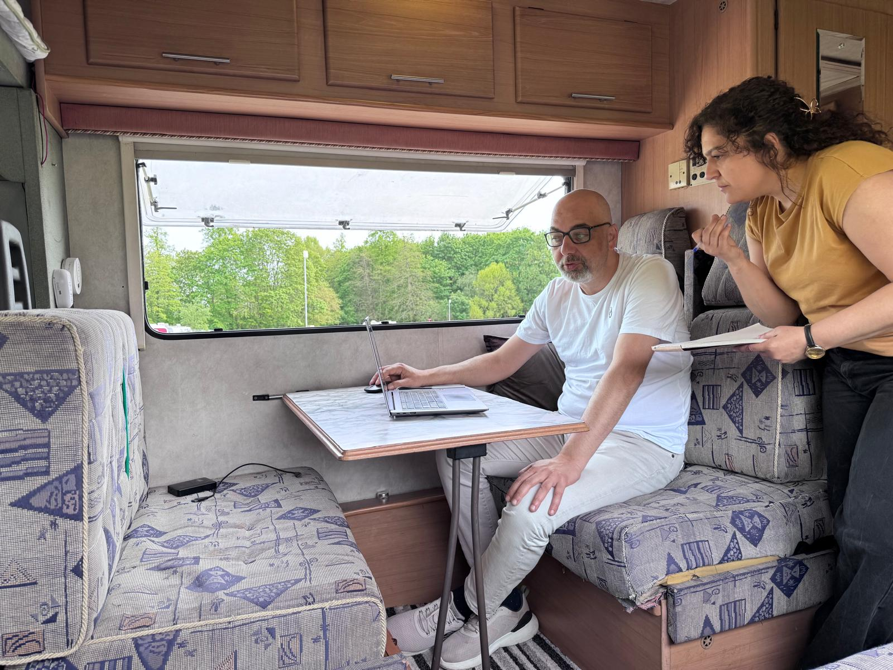
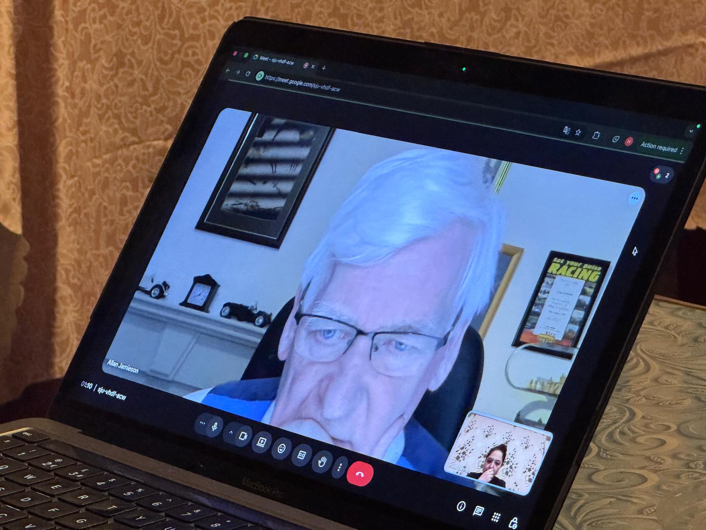

{fig-align="center" width="80%"}

*Hilal Seven / London*

The file concerning eight-year-old Narin Güran — who disappeared on 21 August 2024 in the village of Tavşantepe, Diyarbakır, and whose lifeless body was found 19 days later in the bed of the Eğertutmaz stream near her home — is far from being a closed investigation. Due to evidentiary disputes and contradictions in technical analyses, the file has become one of the rare judicial files whose reopening is now under serious discussion.

In recent months, the file has come up not only inside courtrooms but also within relevant state institutions, under the heading of renewed technical evaluation. While certain inquiries underway within the Ministry of Justice are debating whether the existing file contains sufficient technical clarity to support its rulings, the possibility of a "keşif" — a re-examination on site — has also been brought to the table.

Although the convictions handed down by the Diyarbakır 8th Heavy Penal Court were upheld by the Court of Cassation in December 2025, exhausting the ordinary judicial route, the file now stands at the critical threshold of the Constitutional Court (AYM) application process.

This news report, in which all of these matters will be addressed, is not a text based merely on official statements.

It was prepared on the basis of meetings held in Ankara with Ministry of Justice officials; face-to-face and written interviews with experts working in digital forensics, forensic medicine, and law in Turkey and across Europe (the United Kingdom, Germany, and Belgium); and official correspondence sent to international regulatory bodies.

The work involved more than 100 interviews, drawing on the assessments of figures from a wide range of disciplines — from digital forensic experts to forensic medicine professionals, from lawyers to human rights advocates, from academics to journalists. A multi-layered analytical process was carried out to understand the technical, legal, and social dimensions of the file.

The final phase of the fieldwork was conducted in the village of Tavşantepe, where on-site observations and inspections allowed the technical data to be assessed alongside the reality on the ground.

This roughly five-month investigation focuses less on the existing claims in the file and more on the processes by which evidence was produced, the limits of the technical methods used, and the differences in interpretation that have surfaced during the trial.

In this first part of the file, we discuss the scientific limits of HTS data and biological findings; yet there is a "zero point" at which all of these technical debates begin: 21 August 2024, 15:11 — the moment Narin was last seen on camera. The 19 days that elapsed between the moment ordinary life was suspended in Tavşantepe and the morning of 8 September, when her lifeless body was discovered, were not merely a search operation. They were also the period in which contradictory testimonies, false tip-offs, and efforts that increasingly hampered the search obscured the central question that remains unresolved to this day: how did Narin disappear after 15:11?

## A social wave growing in the shadow of the investigation

The public reaction that followed Narin Güran's disappearance quickly turned into an intense flow of information on social media. Over time, however, this flow drifted away from the production of verified information and evolved into a structure dominated by premature judgments.

The journalists I spoke with describe the period as marked by serious pressure for speed both on social media and in mainstream media, which weakened information-verification processes. The commentary that emerged while the investigation was still under judicial confidentiality, together with content blaming family members, shows that the file was dragged early on into a "social trial."

## The scientific limits of cellular data: the expert report and technical contradictions

The "Narrow-Area Base" report, prepared on the instruction of the Diyarbakır Public Prosecutor's Office and signed by a three-member panel of experts, plays a decisive role in the conviction ruling. Composed of technical personnel from public security units, the panel analyzed HTS (Communication Traffic System) data on a microscopic scale, claiming to identify the suspects' locations at the moment of the incident with metre-level precision and offering location-determination data for specific rooms inside the house, such as the "kitchen" or an "empty room."

This report, however, brought to the surface a fundamental technical divergence within the digital forensic literature. International digital forensic literature and technical regulatory bodies emphasise the inherent physical limits of cellular data. According to those standards, base-station records (CDR) are not data points that pinpoint a device's coordinates; they are probability data showing only which coverage area a device was being served by. Therefore, location determination is defined not as the result of a technical "measurement" but as an "inference" made by an expert that must always be presented together with margins of error. This scientific threshold is a reminder that HTS analyses should be evaluated not as absolute proof but as expert opinions with methodological limitations. Field measurements taken on the same device with different subscriptions (SIM cards) showing variability prove that signal data cannot be considered independently of environmental factors, base-station load, and geographical obstacles. As a result, whether HTS records constitute absolute proof of location or only a limited probabilistic inference forms the most fundamental scientific and legal axis of debate in the case.

## Can base-station data be definitive evidence? HTS, narrowed base, and forensic science standards

Digital forensic expert Tuncay Beşikçi, in our face-to-face interview, stated that HTS data, by its nature, does not provide a location determination but only limited information about which base-station coverage area a device may have been within. According to Beşikçi, this data consists of broad-area coverage information and does not technically allow precise room-level location determination.

{fig-align="center" width="70%"}

Beşikçi noted that elements such as signal strength, base-station coverage, and environmental variables directly affect how the data is interpreted, and emphasised that the absence of signal strength (dBm) information from operator records — common in such datasets — makes the precision of retrospective analyses even more disputable.

He also said that the approach known as "narrowed base" (daraltılmış baz) is not a technical standard, and that it can instead be regarded as an analytic method based on the after-the-fact interpretation of past HTS data.

This technical debate is not limited to differences in methodology; it also extends to whether the approach used aligns with international forensic science standards. In this context, official correspondence with the UK-based Forensic Science Regulator (FSR) clarified the regulatory framework concerning cell-site analysis.

{fig-align="center" width="70%"}

The October 2023 Code of Practice issued by the FSR defines the limits of cell-site analysis explicitly. According to the text:

> "Pinpointing the phone to a specific location is almost always impossible."

In the same regulation, the determination of location is defined as "inference" — that is, an expert interpretation — and it is stated that this interpretation must always be presented together with the limits of the method, margins of error, and uncertainties. The error rates and limitations of the method used must also be explicitly disclosed to the opposing party.

Article 99.11.5 of the code calls particular attention to technical limits:

> "Large rural macro cells may provide service over 10–20 km, thus offering much lower precision."

This framework strengthens the argument that the "narrowed base" method used in the Turkish file does not have a one-to-one standardised counterpart in the international literature.

At this point the ISO 17025 accreditation standard becomes relevant. This standard requires that measurement and analysis methods used in forensic laboratories be verifiable, that measurement uncertainty be reported clearly, and that results be reproducible.

In assessments made within this framework, it is stated that if "narrowed base" analyses are presented without a clearly defined measurement uncertainty, the result obtained is not an absolute location determination but rather an interpreted dataset.

Therefore, both the technical interviews with Beşikçi and the official correspondence with the FSR converge on the same point: HTS data does not directly produce a location, but only a limited probability area.

The critical question for Turkey thus becomes: to what extent is a dataset that is scientifically uncertain sufficient to produce "definitive conviction" in criminal law?

## Theory and reality: dynamic deviations in field measurements

Beyond theoretical debate, the field tests we conducted in Tavşantepe allowed us to see the technical contradiction with the naked eye. Simultaneous signal measurements taken at the homes of Salim Güran, Arif Güran, and Nevzat Bahtiyar — and at critical surrounding points — using two separate Turkcell lines on the same device revealed dramatic variability in the data. Even though we remained at a fixed point, the signals constantly jumped between different cells, and each measurement produced different coverage-area data. This concretely demonstrated that location determinations claimed to be made "at the room level" cannot carry scientific certainty due to dynamic signal behaviour and geographical deviations on the ground.

{fig-align="center" width="50%"}

{fig-align="center" width="80%"}

## Forensic Institute Founder Prof. Allan Jamieson: "A process built on weak evidence"

Prof. Allan Jamieson — the world-renowned forensic medicine expert known for his role in the Diana case in the United Kingdom and the founder of The Forensic Institute — stated, in his comments on the biological findings and technical evaluations raised in the Narin Güran case, that there are serious question marks regarding the scientific reliability of the evidence in the file.

In particular, in his assessment of the PSA (Prostate-Specific Antigen) finding, Jamieson said that such a marker cannot, on its own, be interpreted as strong forensic evidence:

> "PSA is also produced by women, but in very small amounts, and the locations where it is found are generally not the places where it was reported on Narin's body. Therefore, this is meaningless. I would probably expect it in blood, but it would not be on the body, and it would be at undetectable amounts."

{fig-align="center" width="70%"}

When reminded that the file reports PSA findings on different areas such as "the vagina, the outside of the underwear, the skirt and the headscarf," Jamieson raised methodological questions about the laboratory methods and test choices used:

> "How was this defined? Which test did they use for PSA? Why did they use PSA rather than another stain marker?"

Referring also to past observations on Turkey's forensic infrastructure, Jamieson said he had been in Turkey in 2013 and expressed his criticisms of certain laboratory processes:

> "In 2013 I was in Ankara, I went to five different places in Turkey. They were building things in the middle of the desert with the windows open; you cannot do that in a laboratory. So basically, these people are not experts. To begin with, I do not believe in this. Because they had only just started."

While describing the evidentiary structure in the case as "weak," Jamieson defined the methodological approach that should be followed for defence or forensic evaluation as follows:

> "There are probably a lot of people who are going to go to prison, but there is very bad (weak) evidence. So I would start with the 'expert': what is their expertise, where were they trained? The next step is always to ask: how do you know that?"

In his evaluation of a few rooted hair samples among the biological evidence, Jamieson drew attention to the limits of mitochondrial DNA analysis. Noting that hair samples can be examined in two different ways, he said:

> "There are two different ways a hair can be tested: one is standard DNA, the other is mitochondrial DNA. With mitochondrial DNA, the mother's DNA will be present in that hair."

For this reason, he emphasised that hair analysis alone cannot produce a definitive result in identifying a perpetrator.

Explaining his approach to case analysis through "reconstruction" of events, Jamieson summarised the basic logic of forensic examination as follows:

> "From a bird's-eye view, you should have two strategic aims: first, to test the existing evidence; second, to evaluate possible alternative scenarios. What I do is to reconstruct the events from beginning to end in my mind and see what may have happened."

Stating that forensic examination, by its very nature, requires a questioning method, Jamieson concluded:

> "Our work, so to speak, requires a bit of stubbornness; if you tell me something, I look at the evidence."

## The meeting in Ankara: the possibility of an on-site "keşif" on the table

Within the framework of Minister of Justice Akın Gürlek's "Century of Justice" vision, a more active examination process has been initiated in files that have deeply affected the public conscience. The technical examination processes revived in the Gülistan Doku and Rabia Naz investigations have brought the Narin Güran file to a similar threshold of "re-evaluation."

In order to follow this process closely on site, I held a meeting in Ankara with officials of the newly established Department for the Investigation of Unsolved Crimes within the General Directorate of Criminal Affairs of the Ministry of Justice. During the meeting, the possibility of re-evaluating the file not only at a desk but, where necessary, in the field — that is, the option of "conducting a keşif" — was directly placed on the agenda.

## A precedent for 75 provinces and 638 files

The case carries a structural significance for the Turkish judicial system that goes beyond Narin Güran alone. A ruling delivered without addressing the contradictions in the suspects' statements and the scientific gaps in the technical data may result in serious rights-violation rulings during the AYM or ECHR processes.

Re-examining this file in light of scientific data will also serve as an illuminating precedent for the work being done on 638 files in 75 provinces and on 693 victims still awaiting clarification.

## Confronting the technical contradictions

This meeting became a platform on which the technical method used in the file (narrowed base) was confronted with international standards. The UK-based Forensic Science Regulator (FSR) report I presented to officials clarified the following critical point that could change the course of the case:

## The Ministry: "It cannot be calculated in the city anyway"

While I was laying out the technical limits and scientific uncertainties of narrowed-base analyses with data, a Ministry official gave the short, clear answer that effectively closed the discussion: "Narrow base cannot be calculated in the city anyway."

This brief sentence became the most concrete proof of the impasse — even from the technical perspective in Ankara — into which the reports presented in the file with claims of "centimetre-by-centimetre location determination" had run. The official's stance also explained why the possibility of a site visit (keşif) is being considered so seriously.

## Conclusion: science or interpretation?

My purpose in going to Ankara was to ask, directly to those concerned, about the scientific limits of digital data. The general framework that emerged from the meeting was not the outright rejection of evidence sets, but rather the approach of testing the limits of existing technical methods on site (through keşif).

The Narin Güran file is no longer merely a murder investigation; it is a major methodological debate about how telecommunication data should be interpreted within the law. As long as the contradiction between HTS analyses and field reality remains unresolved, claims of "technical certainty" will continue to hang in the air.

Yet the most fundamental question still stands: to what extent can data whose technical certainty is in doubt form the legal basis of a definitive ruling?

## Procedural and substantive debates in the legal process

Former Constitutional Court rapporteur Ali Rıza Çoban, who evaluates the Narin Güran murder case within the framework of an "impunity project," voices significant criticisms regarding both procedure and the assessment of evidence. Çoban argues that, in the file, the framework concerning the perpetrator's identity and the motivation for the act has not been fully clarified by concrete and definitive data:

> "One of the most fundamental problems in the case is that three people have been convicted as 'co-perpetrators' and given the heaviest possible sentence. Yet there is a vital deficiency: it has not been determined exactly by whom and with what motive Narin was killed. This is where the greatest weakness of the case lies. It is striking that, in such a critical case concluded in two months by a local court at a speed unfamiliar in Turkey, the concrete perpetrator has not been clarified."

According to Çoban, while the court reached the "co-perpetrator" conclusion (the legal definition: those who, in the commission of the offence, act in unity of intent and action and jointly take part in the decision) on the basis of HTS records and camera footage, it failed to reach a "sübut" (proven establishment of the offence with definitive evidence) that would set out the manner in which the crime was committed beyond doubt. This directly opens to debate one of the fundamental principles of criminal procedure: "in case of doubt, the defendant benefits."

The report also draws attention to the speed of the trial. It criticises the preparation of the indictment within a month of the discovery of Narin's body, arguing that the evidence entered the file before being technically deepened. Çoban states that this speed, when considered together with public pressure, creates risks for the right to defence and for evidentiary debate:

> "In Turkey, this indictment was written very quickly. The body was found on 8 September; on 21 October the indictment was leaked in writing to the press; and on 23 October the court accepted it. In a case as complex and as full of uncertainty as this, that speed is a serious problem. We can think of this as having been done solely to ease public pressure. With so much uncertainty, it is unusual for such heavy sentences to be upheld this quickly."

Çoban also assesses that the existing uncertainties in the file may lead to a finding of "rights violation" during the Constitutional Court process, or may open the way for a substantive re-examination of the file.

This case is not independent of the justice problems in the trials in Turkey. The available data may place these individuals in the position of "suspects," but it may not be sufficient to prove directly that they are "perpetrators." During the AYM stage, the framing of which fundamental rights have been violated must be very carefully constructed. It is not easy to predict what will happen in current AYM practice; however, if the file passes the "admissibility" stage and is taken into substantive review, the likelihood of a violation finding or a remand of the file due to the deficiencies it contains is high.

Tomorrow, within the framework of the question "how and why did Narin Güran disappear?", the first 19 days that elapsed until Narin was found will be re-examined step by step.

::: external-refs
1. Forensic Science Regulator (FSR) | https://theforensicinstitute.com/
2. ISO 17025 standard | https://www.iso.org/standard/66912.html
3. Tuncay Beşikçi: The Story of "Narrowed Base" | /blog/posts/tuncay-besikci/daraltilmis-baz-hikayesi/
4. Trial Monitoring Association — Trial Observation Report Within the Framework of the Right to a Fair Trial | https://davaizleme.net.tr/adil-yargilanma-hakki-cercevesinde-dava-gozlem-raporu/
:::
