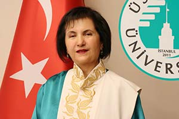

{fig-align="center" width="80%"}

*Hilal Seven / London*

> In the words of a senior bureaucrat with expertise in judicial regulation and criminal practice: "Perception is above fact."

The file of eight-year-old Narin Güran, who disappeared in Tavşantepe village near Diyarbakır on 21 August 2024 and whose lifeless body was found 19 days later, has gone down as one of the most complex processes in Turkey's history. If a child vanishes a few steps along a path running towards her home, in the middle of a village made up of her own relatives, how should the safety of this system be questioned?

In the first part of our dossier, published yesterday, we argued that the Narin Güran file cannot be treated as a closed legal case, and that it has the potential to be reopened as a file under technical, legal and scientific scrutiny.

In this second part we go back to the very beginning of the file under two headings. In the first section we examine the points where law-enforcement strayed from a rational plan, how the judicial mechanism turned into a "data chaos" through breaches of secrecy, and the obstacles that the forensic language barrier can pose to the pursuit of truth. Through Prof. Krzysztof Kredens's academic analysis, Mehmet Emin Aktar's legal experience and journalist Şirin Bayık's field testimony, we step by step examine the process the state carried out in the face of the silence of a village.

In the second section, we analyse the wave of "moral panic" produced by the media; how the local reality of Tavşantepe was drowned in the noise of Turkey; what the statements coming from the village tried to answer about why Narin disappeared; and how different media theories affected the search operations.

## 1. A bird's-eye view from Turkey to Tavşantepe: how did the system go blind?

On 21 August 2024, around 3 p.m., Narin Güran said she would head home after leaving Qur'an class, but did not return that evening. After the family's own searches yielded no result, around 8 p.m. her elder brother Baran Güran, followed by her uncle Salim Güran, filed a missing-person report with the gendarmerie. The most critical hours, which were to determine the fate of the investigation, were initially set wrongly through a technical loss of focus: the gendarmerie concentrated on camera footage from after 6 p.m. and saw no need to examine the earlier hours. In a process where finding Narin would take 19 days, this is how the first fatal misstep was taken.

In the days that followed, rational tracking became badly blurred by unverified reports. The fact that a red sandal found by Narin's cousin Muhammet was first declared to belong to Narin and later corrected by the family — though this contradiction was registered as one of the early entries that increased law-enforcement's suspicion of family members. The fire in the village, caused by electrical cables touching, was framed in the media as an attempt to "cover something up", which firmly hardened both social pressure on the investigating authorities and the suspicion directed at the family.

On 26 August, the assumption that bloodstains found on rocks near Narin's home belonged to Narin, combined with technical interruptions in mother Yüksel Güran's televised statement that same day being relayed to the press, rapidly produced a public perception that her son Enes Güran was a suspect. Enes Güran was the first to be taken into custody; although the report dated 28 August on the bite mark on his arm stated that the mark could have formed at the earliest on 22 August, the media did not hesitate to declare Enes the "prime suspect".

From the moment the JASAT team joined the search on the sixth day of the investigation, non-rational methods gave way to mystical pursuits. Two JASAT officers took family members to a religious figure in Diyarbakır, where Narin's brother Muhammet, while being "read over" by a hodja, went into a trance and gave a supposed address; a fresh search based on those statements was even entered into the record. Likewise, two individuals from Urfa, claiming they could locate Narin using a blood sample taken from the family, led law-enforcement and the Güran family all the way to the Syrian border — a clear example of just how far the process had departed from a rational plan.

From the day Narin went missing, Turkey was plunged into an enormous information pollution and an emotional chaos. As in Mabel Matiz's lines, the gulf between the data appearing on screens and the reality felt in people's consciences grew ever deeper. What drew millions to this case was not merely curiosity; it was that great storm between the contradictory information "seen by the eye" and the pure search for justice that "the chest knows".

At the heart of this storm was not only a physical search operation, but also the step-by-step collapse of one of the fundamental fortresses of the rule of law: the right to non-stigmatisation. Every detail that leaked to the press before the concrete data in the file had matured — every detail that caused the investigation to advance unhealthily — pushed the judicial process not down a rational path, but into a dead end governed by prejudgements.

In investigations meant to protect the right to non-stigmatisation, the failure of the authorities themselves to observe the principle of confidentiality led to all members of Narin's family being met with prejudgement in the eyes of the public. Former Diyarbakır Bar Association President Mehmet Emin Aktar, who has followed the case closely and from time to time made statements about it, summed up the situation in a phone interview as follows:

{fig-align="center" width="70%"}

> "From the very start, a perception was created: 'this family is guilty, this family is guilty.' Once that perception was built, naturally it became difficult for anyone to stand by this family or take on their defence. (…) Let us take a look — is there nothing suspicious here? Something is presented to us; should we be content with only what is presented? Those who raised these questions were of course criticised."

The search process in the field was shaped less by a technical plan than by the movement created by incoming tips. The communication traffic that began at 8:43 p.m. — built around still-unverified reports of a "red car" and a "foreign suspect" — sent law-enforcement units to different points.

### Rumours of the "cold-blooded family"

After the news of Narin's disappearance, we had a Google Meet conversation with journalist Şirin Bayık, who arrived in Tavşantepe on the morning of 22 August and followed the process from the field on behalf of İlke TV. In this long interview Bayık told me she had been in the field from the very beginning and had followed the process regularly, and shared both her notes and her archive as part of this work.

{fig-align="center" width="70%"}

In our conversation I particularly tried to understand how the press, the media and society reacted in those first 19 days after Narin's disappearance. I also asked her, as a journalist who observed events in the village first-hand, how she assessed her initial impressions and testimony.

Şirin Bayık stated that she had never shared her testimony and field notes about this period in detail anywhere before, and that this was the first time she was conveying them so comprehensively.

> "From the very start of the process, I have been following it through a dynamic working file containing documents, information and interviews. While doing news work in the conditions of the region, our first stop was to meet the family. In the village, unusually, there was a striking silence brought on by the missing-person case. Our request to meet the father, together with my cameraman, was declined on health grounds. We then went to the house where the mother was. Inside, two female gendarmerie officers were on duty. The mother conveyed the daily routines that had become widely known. At that moment I observed that the elder brother Enes Güran, who was in the room, was physically very exhausted, his eyes bloodshot. Our first encounter took shape in this way, where journalistic reflex and human observation were intertwined."

These early observations by Şirin Bayık, contrary to the "cold-blooded family" narrative that would form in the public mind in the following days, set out the concrete picture of the first hours of the case. But these human details gave way, in later stages of the investigation, to technical disputes. For instance, the fact that a red sandal found by Narin's brother Muhammet later turned out not to belong to Narin and was acknowledged as such by the family was quickly entered into the official records as a behaviour increasing law-enforcement's suspicion of family members, and was relayed to the prosecutor's office conducting the investigation.

As the process continued to be shaped by such inconsistencies between rational data and family statements, in the days that followed it was later accepted by the family that the red sandal Narin's brother Muhammet had seen did not belong to Narin. This deepened law-enforcement's suspicions. The fire that broke out afterwards in the village, caused by cables touching each other, was framed in the media as an attempt to cover something up, and law-enforcement's suspicion of the family was further entrenched.

The process of finding Narin quickly evolved into a phase in which the family was treated as suspect. The bloodstain found on 26 August and later determined not to belong to Narin made suspicions concrete. On the same date, Narin's mother's televised speech was severed from its context due to technical glitches; the mother's distress over her son Enes smoking was interpreted in the public sphere as evidence that Enes was a suspect. According to the report dated 28 August, the bite mark on Enes's arm could have formed at the earliest on 22 August — pointing, in other words, to a day after Narin's disappearance. The media nevertheless continued to treat Enes as the prime suspect. The DNA found in Salim Güran's vehicle then locked the file entirely onto this axis.

The application area of modern forensic sciences was at times overshadowed by "mystical" methods in this file. As of the sixth day, two JASAT officers took some family members to a well-known "hodja" in Diyarbakır. New suspects were sought based on the words "salçalı makarna" (pasta with tomato paste) which Narin's brother Muhammet uttered there while in a trance. Two people from Urfa, claiming to have a testing device, even took the mother and JASAT teams all the way to the Syrian border, claiming they knew where Narin was.

### A language barrier in the taking of statements: "An individual's capacity to tell their own story can be limited by the structure of the system and power relations"

After I began researching this file, I first collected and assessed the information and data I obtained from the Turkish field. I also considered it important to look at how such files could be read within the field of forensic linguistics. I saw that the findings in Turkey were related not only to the sequence of events but also to how narratives were constructed. For this reason I did not leave the process to local data alone.

In this framework I had a Google Meet conversation with Prof. Krzysztof Kredens of the Aston Forensic Linguistics centre at Aston University in the UK. I conveyed to him both the process in the file and the way the media in Turkey framed the event.

{fig-align="center" width="70%"}

We talked about how the media perceived the event during the days of Narin's disappearance and the search, society's reflexes, and how the family's statements were interpreted. I asked in particular how the fact that the family — whose mother tongue is Kurdish — made statements in Turkish was received in society, and how this could be read in the legal process.

We also discussed how forensic linguistics looks at such files, how narratives are constructed, and how power relations affect the process. In this conversation, Prof. Kredens offered the following assessment of the case:

> "One of the central aims of forensic linguistics is to examine whether everyone in the criminal justice system has an equal 'voice'. Regardless of financial situation, ethnicity or gender, the narratives confronting each other in court must be granted equal opportunity to be expressed on both sides; these narratives must not only be uttered but also effectively 'heard'.
>
> In every case, however, there are competing hypotheses, and what is often decisive is not what the 'objective truth' is but which narrative is presented more persuasively.
>
> Within this framework, ethnic tensions, social oppositions such as secularism vs. religion, and public-opinion dynamics can contribute to certain narratives becoming dominant. An individual's capacity to tell their own story can be limited by the structure of the system and power relations. On one side stand the power of the state and the public support that lines up behind the prosecution; on the other side, factors such as the language barrier and socio-economic disadvantage can create a marked power asymmetry between the parties. This leads to the prosecution's narrative being found more persuasive, while alternative narratives remain less visible. As a result, public perception can structurally make it harder for the parties to express themselves on an equal footing."

The power asymmetry Kredens points to explains, with a universal frame, the social judgement mechanism that overtook rational evidence in the Narin Güran file even while the search was still going on. As the 19-day search continued, the placement of a village surrounded by language barriers and socio-cultural disadvantage under a magnifying glass set in the light of misleading narratives nationwide created the ground for the system and the public to build their own "persuasive narrative". The investigation thus turned not so much into a legal inquiry as into a process in which the narrative the public wanted to hear was being constructed.

## 2. From Tavşantepe to Turkey: truth in the grip of media and politics

All of us, suddenly, went missing along with Narin. According to everything I have learned in this five-month-long research, the Narin Güran case is a mirror of Turkey's last three decades. What we see when we look into that mirror is not just a murder; it is the anatomy of a system in which institutions blind one another, perception defeats fact and collective conscience goes bankrupt. The peoples of Turkey have long since stopped asking questions; they now want only to make their own voice heard, to vent their own anger and to deliver their own verdict.

While working on this file and writing these lines, in the face of a mass of data whose tragedy is hard to bear even in one's mind, one of the recordings I took refuge in — in order to remain measured and to make objective assessments — was Maya Perest's "Yok bana bu cihanda bir yer" (There is no place for me in this world). I would later realise just how much these lyrics summarised the Narin Güran case: a person's life, mother tongue and cry could become utterly meaningless in the face of an appetite for lynching and of unethical ambitions.

For 19 days millions chased the question "Where is Narin?", yet who she really was, the games she loved or the dreams she nurtured found no place in anyone's mind. Society and the media, instead of seeking the truth, chose the easiest path and condemned Narin to a fiction: she was said to have "disappeared because she saw something she should not have seen", and the matter was locked behind a tabloid veil of mystery.

Yet the scientific data in criminology and child psychology pointed to an entirely different reality: when a child disappears, the statistically most likely scenario is that the perpetrator comes from a social circle in which the child knows them well enough to call them "neighbour uncle" or "auntie nearby". In what the literature calls "grooming", gifts like sweets, chocolate or money are not childhood joys but criminological tools used to break down a child's safety barriers.

### The "red flag" that was missed

After Narin disappeared, a detail mother Yüksel Güran shared in her statement to the gendarmerie was vital precisely on this scientific ground. The mother stated that a few days before Narin's disappearance, a neighbour had given the child money, that Narin had bought a large amount of sweets with that money, and that she herself, growing suspicious, had warned her daughter.

In criminologist Dr Michael O'Connell's model, this is the most concrete sign of the "relationship-building" stage between the perpetrator and the child. Although in forensic psychology this is recognised as an "open target identification" signal (a red flag), the fact that the person in question was never questioned over the course of 19 days on suspicion of this "grooming process" is also the answer to why the investigation came to nothing. The truth was buried not only in the riverbed but also on the dusty shelves of the statement records where this scientific data was ignored.

### Media ethics and moral panic: the truth on trial against ratings

> *"Press freedom is a blessing when we are inclined to write against others; but it is a calamity when we find ourselves crushed under a mob of aggressors." — Samuel Johnson*

At this point we encounter a plane on which the media has become not just a vehicle of transmission but the very builder of the process. Prof. Nazife Güngör defines the media's stance in this case not merely as a professional error but as the sign of a deep "social disease". For Güngör, the uninterrupted broadcasts about Narin's disappearance strayed entirely from the aim of informing the public; they turned into a mechanism that scratched society's most primitive impulses and placed ratings and click counts (traffic) above human dignity and children's rights.

{fig-align="center" width="70%"}

Güngör's analysis grows sharper here:

> "The media's only concern should not be ratings and circulation. The sensational attitude displayed in such cases pulls society away from the search for justice and drives it towards a collective delirium, casting it into a more 'pathological' state of mind. Information pollution obstructs the rational progress of the legal process while opening unhealable wounds in social conscience."

> *"Journalism is organised gossip." — Edward Eggleston*

Assoc. Prof. Esra Arsan, in a much sharper conceptualisation, characterises journalistic practices in the field as "showmanlike news-making". For Arsan, Tavşantepe became, for many reporters, not a "centre for the search for truth" but a "stage for performance". Arsan's field observations show how the ethical codes of journalism were suspended, with these concrete data:

{fig-align="center" width="70%"}

**Channels of gossip and unverified information**

Those reporting from the region filled the gaps in technical data with neighbourhood gossip. This did not merely violate the presumption of innocence — it obliterated it.

**Dramatisation and performance**

The excessively dramatic attitude reporters adopted during live broadcasts, their tearful tones, and how they positioned themselves as heroes of the event. For Arsan, this is a "reality show" aesthetic that kills the objectivity of journalism and cuts viewers off from rational thought.

**Objectifying victim and suspect**

Every speculation about Narin's private life, the family's past and the village's socio-cultural make-up was served to millions without passing through any ethical filter.

Arsan ties this to the chronic blindness in the "mainstream media's" view of the region:

> "This perspective, which ignored the socio-political reality of the region and the language barrier and sought only 'a tragedy that will fetch ratings', fed not justice but only chaos. A journalist is one who chases the truth; not one who twists it to build their own show."

These two academic perspectives support one of the file's most important claims: in this process the media did not merely relay the news; through the "moral panic" it generated, it placed an invisible pressure on law-enforcement and the judiciary that made rational decision-making harder. Under this pressure, the line between real evidence and fabricated narratives was blurred, and public conscience was shaped not by "information" but by "perception".

Mehmet Emin Aktar elaborates on this perception operation as follows:

> "When morality-related allegations about the mother came up, I rejected them flatly. From the very beginning, the public's gaze was never allowed to move outside the family."

### The keystone of the investigation: technical lapses and the perception operation

The fundamental gap in the file was that the camera footage from the critical hours (around 3 p.m.) was not examined and that the "red car" information was not incorporated into the investigation. In the 19 days that passed before the lifeless body was found, a public perception formed that — instead of finding evidence to look for a suspect — people were first turned into suspects and then had evidence sought against them. Law-enforcement's drift from rational methods made it even harder to bring the process to light.

The Narin Güran case became, in a sense, the cracked mirror of the justice system, of media ethics and of social conscience. What we saw when we looked into that mirror was a collective loss of conscience and the truth's sacrifice to noise. Narin was a child with a sun-strewn face, but after her loss her family was left in the shadow of an enormous "monstrous family" portrait.

In an atmosphere where no one asked anyone else "how are you", where judgement reigned in place of empathy, we had long since given up looking for rational answers in those days. Along with Narin, the truth, ethics and that "delicate" conscience that makes us human were no doubt buried in the waters of the Eğertutmaz creek. Even if the voice of truth in this file is sacrificed to noise, the cracks in that mirror will keep cutting into our consciences.

At the end of 19 days, the news that came from the Eğertutmaz creek was, beyond the loss of a child, also the registration of the heavy fog descended upon society and justice. In this process the heavy climate of accusation that surrounded the village's young people and the entire family evolved to a point that recalled the statements of those with authority. In this atmosphere where information pollution turned everyone against everyone else, only one path to the truth remains: **"This war must end / We must go back to the beginning."** Setting aside divisions and carrying out the analysis of these 19 days from the beginning and properly is our only responsibility towards the memory of a truth as "delicate" as Narin.

*In our next piece we will examine the role of the media in the investigation and prosecution between 8 September and 28 December 2024, and the transition to the trial process.*

::: external-refs
1. Hilal Seven — Ministry of Justice approves: 'On-site examination' on the agenda in the Narin Güran file | /en/blog/posts/hilal-seven/2026-05-04-adalet-bakanligi-onayladi-narin-guran-dosyasinda-kesif/
2. Aston Institute for Forensic Linguistics | https://www.aston.ac.uk/research/institutes/institute-forensic-linguistics
3. Diyarbakır Bar Association | https://www.diyarbakirbarosu.org.tr/
:::
