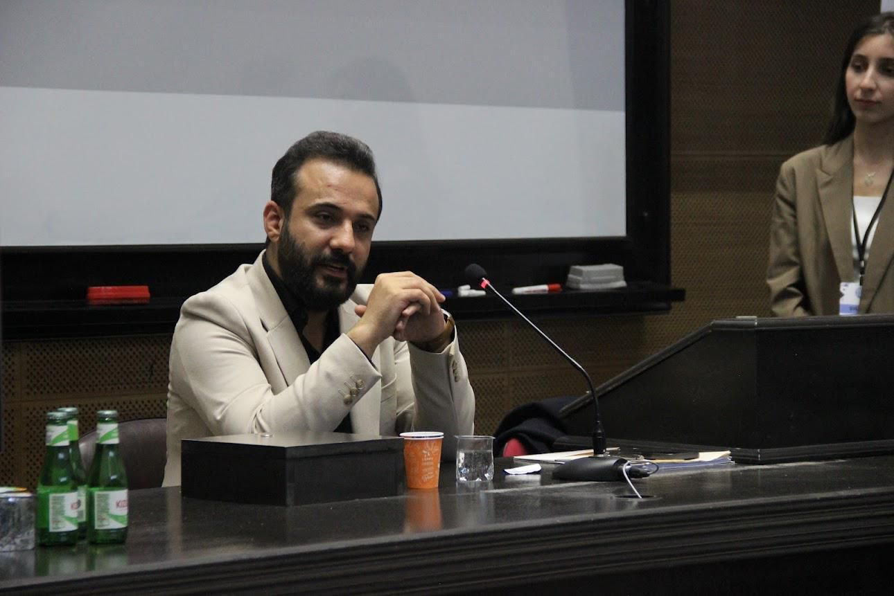
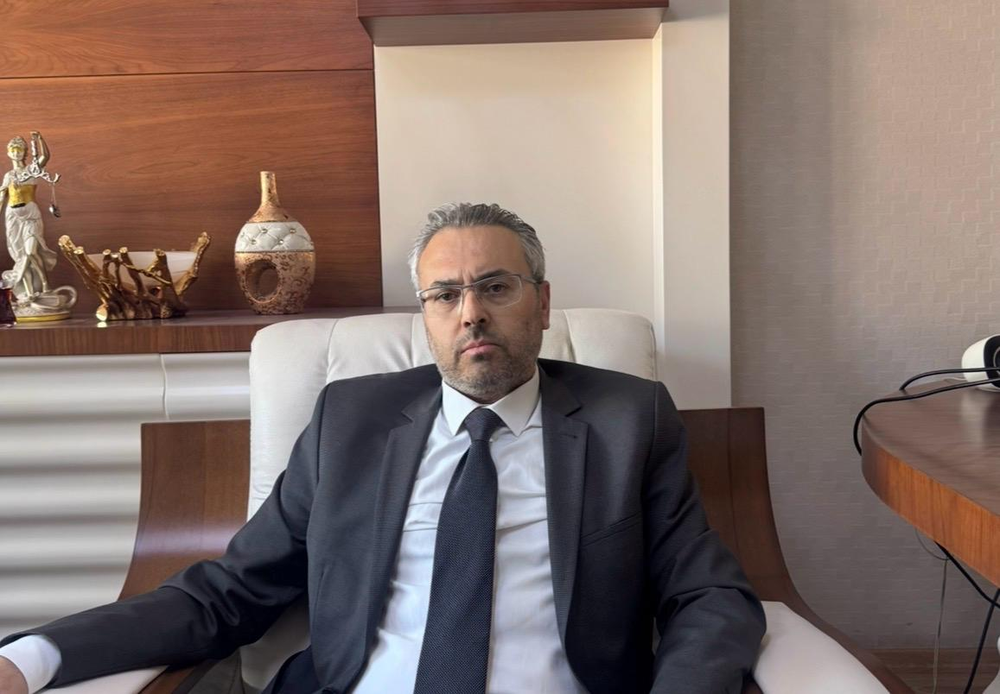
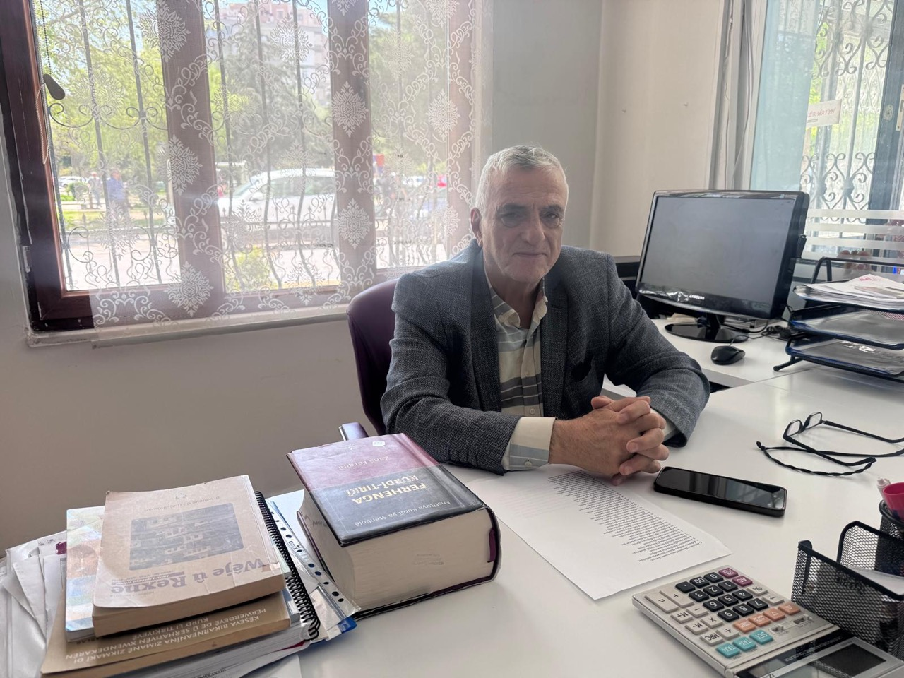

{fig-align="center" width="80%"}

*Hilal Seven / London*

The Narin Güran case has become one of those processes in Turkey where the gulf between legal data and public perception has only deepened. While those following the file closely have described the court's rulings as a "loss of reason", a large segment of society has been pulled away from the substance of the case by information pollution and intense controversy. The walls built around the law, forensic medicine and technical data have made it difficult to lift the fog over the murder.

On 28 December 2024, the Diyarbakır Regional Court of Justice, 1st Penal Chamber, sentenced the mother, the uncle and the elder brother to aggravated life imprisonment, and Nevzat Bahtiyar to 4.5 years; the lawyers later applied for cassation and carried the file to the Court of Cassation.

Yet despite the time that has passed, the questions of "who killed Narin, why, and how?" still have not been answered with a concrete sequence of events capable of putting the public conscience at ease.

## Scientific gaps and the dissenting opinion

The striking turning point of the case was the dissenting opinion written by Appellate Court President Mehmet Selim Erem on the appellate ruling adopted by majority vote. In his dissent, Erem underscored the "principle of moving from evidence to suspect", which is critical in this case, thus recalling an important pillar of modern criminal law. He then set out many shortcomings affecting the substance of the case: he argued that the DNA findings and hair samples obtained in the file should be re-evaluated by the Forensic Medicine Institute so that their connection with the suspects could be established beyond dispute; that the PSA finding so widely debated in the public should be reconsidered in all its dimensions; and that, in order to test the reliability of the reports drawn from the camera footage of the Daran-2 military base area — which was used as evidence that Narin had crossed the path — new footage should be obtained through reconstruction.

One of the most prominent passages of the dissent is the following note by the Chamber President:

> "It is contrary to law to convict the defendants as written in the ruling, by treating the narrowed-cell-tower report — which can only be accepted as supplementary evidence — as if it were definitive material proof and on that basis declaring the acts established."

Erem stressed that many critical pieces of evidence, from camera footage to cell-tower reports, from DNA findings to hair samples, had been examined incompletely. Finding it contrary to the ordinary course of life that three family members would form a consensus and commit a murder in such a short period, this dissent registered, in the highest possible legal language, that the case rests on technical impossibilities.

## The "45-step" paradox in the Narin Güran case: did the hardware signal refute it?

In the Narin Güran murder case, the life sentence handed down to Salim Güran was built upon the disputed "narrowed cell-tower signal" data. Yet a piece of technical data capable of shaking the trajectory of the case to its foundations came directly from the phone's own hardware. The accelerometer records that entered the file turned the moving scenario drawn by the court into a biomechanical impossibility.

Although the prosecution argued that Salim Güran moved across an area of hundreds of metres at the time of the murder, the pedometer data on the suspect's phone refuted this claim. During the time slice marked as the hour of the murder, only 45 steps were registered. The fact that, physically, only 45 steps were taken by a person who is supposed to have committed a murder, concealed evidence and coordinated across a wide stretch of village land entered the records as a technically inexplicable situation. The court ignored both the periods during which the phone was charging and the manual face-recognition records, and based its decision on the speculative "software" signals rather than the definitive "hardware" data.

## From a citizen's attention to the courtroom

The story of how this technical contradiction came to light is one of the striking aspects of the case. A visually impaired citizen living in Istanbul who closely follows the Narin Güran file — owing to his interest in sport and in this particular application — reached out to the defence to bring his suggestion into the file: that the working principles of pedometer applications could shed light on this case.

The "45-step" reality that emerged from the inquiry made on the basis of this suggestion was indeed displayed on the courtroom screens by the presiding judge, but at the decision stage it was left behind by the focus on signal tracking.

## Acquittal in the US, conviction in Turkey: the Katrina Haney precedent

A striking precedent that overlaps almost exactly with the Salim Güran file occurred in 2022 in the US state of Florida. In the Katrina Haney case, the prosecution argued, on the basis of signal records, that the suspect had been active at the time of the offence. However, the "0-step" health data presented by the defence caused all charges to collapse.

The Florida court issued an acquittal on the principle that "for a person to move, the accelerometer of that phone has to be triggered". In Turkish judicial practice, by contrast, the "45 steps" — a hardware reality — were bypassed through a fictional signal model. This scientific gap, also emphasised by Appellate President Erem, retained its heat on the road to the Court of Cassation as the case's largest legal hole.

## The PSA finding: a technical riddle and Erem's dissent

Appellate Court President Mehmet Selim Erem's dissent — which has entered the historical record — laid bare the case's scientific shortcomings, in particular through the PSA (Prostate-Specific Antigen) data. The dissent in the file brought into the open technical gaps capable of altering the trajectory of the trial.

### A race against time

Drawing attention to the PSA finding in the forensic medical reports, Erem stated that the focus must be on the decomposition caused by Narin's lifeless body remaining in hot weather and underwater for 19 days. The fact that the data in the report was not investigated for whether it could be a "transfer" caused by decomposition was recorded as one of the case's shortcomings. Pointing to the regions from which the swabs had been taken, Erem openly voiced his serious doubts as to the possibility of external sexual abuse and the chance that contamination had occurred through such a route.

The Chamber President emphasised that PSA, DNA findings and hair samples must be reconsidered, in all their dimensions, in a way that leaves no room for doubt. While indicating the legal method that should be followed to reach the material truth, Erem made the failure to deepen the existing examinations a subject of criticism.

### A scenario contrary to the ordinary course of life

Among the most prominent parts of the dissent were objections to the "joint perpetration" construction. Finding it contrary to reason and logic that the mother, brother and uncle would commit a murder simultaneously, with a shared purpose and within a window of seconds, Erem rejected this allegation by saying it "does not fit the ordinary course of life".

The Narin Güran case has come up against the risk of being closed without expert examinations being completed and without concrete answers to the question of "exactly who committed the offence". This intervention by President Erem became the highest-level confirmation of the technical impossibilities in the file.

## Zola's warning: the buried truth

As the judicial process in the Narin Güran case enters a new phase, we met in Istanbul with Lawyer Muhammet Fatih Demir, defence counsel for Enes Güran. Demir offered the following important legal assessments regarding the appellate dissent and the upholding by the Court of Cassation of the trial court's ruling:

{fig-align="center" width="70%"}

> "The most fundamental question of a criminal case is clear: did the defendant in fact commit the offence attributed to him? In seeking the answer to this question, the event must first be set out in all its dimensions, and the act constituting the offence must be concretely identified. In this case, however, those fundamental questions were left unanswered; and yet a verdict was handed down."

Muhammet Fatih Demir went on to detail the impasse experienced during the trial and the point now reached, in these terms:

> "Throughout the trial, many practices contrary to procedural rules were witnessed; the defence lawyers' objections to the reports in the file and their justified requests for further investigation were rejected. The verdict built on top of these gaps has satisfied neither the legal community nor the public. As a result, innocent people have been punished."

This verdict, handed down without filling the gaps in consciences and without dispelling the question marks, brings to mind once again that famous warning of Émile Zola that has gone down in history:

> "When truth is buried underground, it gathers such an explosive force that on the day it bursts forth, it blows everything up with it."

## Institutional paralysis and justice in the shadow of "show"

Throughout 2025, the case file put civil society's conscience to a great test. Yet during this process, institutions kept their distance from the file in a kind of "paralysis". Tahir Elçi Foundation Chair, Lawyer Mahsun Batı, stressed that at the root of this reluctance lay the perception of the case merely as "a judicial incident", with its human-rights-violation dimension overlooked. Batı offered the following sharp criticism of the tabloid-like shell built around the case and of the stance taken by institutions:

{fig-align="center" width="70%"}

> "When I saw, at the first hearing, that the bar association was striking a showman-like pose, I got somewhat upset. Because of our reaction to them, we did not follow the case ourselves."

The torture allegations voiced in court by mother Yüksel Güran and elder brother Enes Güran became a point of self-criticism for institutions. After Türkan Elçi brought the issue to the agenda of the Parliament, the foundation began meetings with the case lawyers and started pursuing the allegations.

## The bars of language: translation, or a miscarriage of justice?

The life sentence the court built upon "contradictory statements" collided with the linguistic reality of Diyarbakır. MED-DER Co-Chair Dr. Remzi Azizoğlu summed up the deep abyss experienced by suspects who were forced to give statements in Turkish or with whom the court tried to "communicate" through unqualified interpreters, in these terms:

{fig-align="center" width="70%"}

> "People express things in whichever language they learned them. Our feelings are formed in our mother tongue and can only be fully expressed in that tongue. The same is true of idioms; each language has its own idioms. They cannot be translated word for word into another language. Therefore, in such a situation, even if a person knows the other language, they cannot fully express themselves; if they don't know it, that is already a major problem. Even if you are very fluent in two languages, it is hard; you cannot expect this from an ordinary citizen."

Azizoğlu went on to elaborate the legal consequences of this situation:

> "The person often expresses themselves wrongly, and this leads to legal errors. Even if an interpreter is used, the emotions cannot be conveyed in full. Because for that emotion to be conveyed correctly, the interpreter must also have lived through similar experiences. In court, a judge cannot understand correctly a defendant who cannot express themselves correctly, and in that situation cannot give the right ruling. The judge must say: 'I do not understand you, what is being told here is not consistent, find a suitable interpreter.' If they don't say so, that court is biased."

## The distance of politics and the risk of "collective victimhood"

As the verdict became final and the file moved on to the Constitutional Court, the approaches of politics continued to be shaped on that delicate balance between the "search for truth" and "social expectation". DEM Party Group Deputy Chair Gülistan Koçyiğit stressed that, despite the Court of Cassation's affirmation, the gap in the public conscience had still not been filled:

> "What we still don't know is: what happened to Narin, how was Narin killed? The answer to these questions has not yet been given. The judicial process has not been able to fill that fundamental gap in the public conscience."

Koçyiğit argued that the principle of the personality of guilt had been violated and that the village of Tavşantepe as a whole had been pushed into a lynch atmosphere. Describing this picture — in which children have been forced to drop out of school — as "collective punishment", Koçyiğit noted that this is one of the greatest obstacles to the establishment of justice:

> "There is a picture in which the villagers were collectively blamed, the children dropped out of school, and the village as a whole was pushed into a lynch atmosphere. We do not accept these things. We do not accept the victimhood produced by violating the principle of the individuality of guilt. The logic of collective punishment is one of the greatest obstacles in the way of establishing justice."

## Researcher's note: on the trail of the truth

When I began working on the Narin Güran case, I tried to understand not only a murder file but also the way a truth has remained buried beneath layers. In preparing this work, I followed the path of digging a well with a needle in order to sift the data. Yet, as my colleague Şirin Bayık aptly put it; that intense rain of accusations and media downpour — in which "before one allegation is closed, the next falls" — turned the work of separating the truth into a responsibility in itself.

The aim of this series of articles is to open a level-headed and universal window onto the plain justice that Narin, her family, and every group battered in the course of this process deserve.

In the next piece, we will take up what has happened from the Court of Cassation ruling to the present day, the Constitutional Court process, and why this file — which appears to be "closed" — has in fact not been closed at all, along with the new phases of the legal struggle.

::: external-refs
1. Hilal Seven — Ministry of Justice approves: 'On-site examination' on the agenda in the Narin Güran file | /en/blog/posts/hilal-seven/2026-05-04-adalet-bakanligi-onayladi-narin-guran-dosyasinda-kesif/
2. Émile Zola — J'Accuse…! | https://en.wikipedia.org/wiki/J%27Accuse...!
3. Tahir Elçi Foundation | https://tahirelcivakfi.org/
4. MED-DER (Mesopotamia Language and Culture Research Association) | https://med-der.com/
:::
