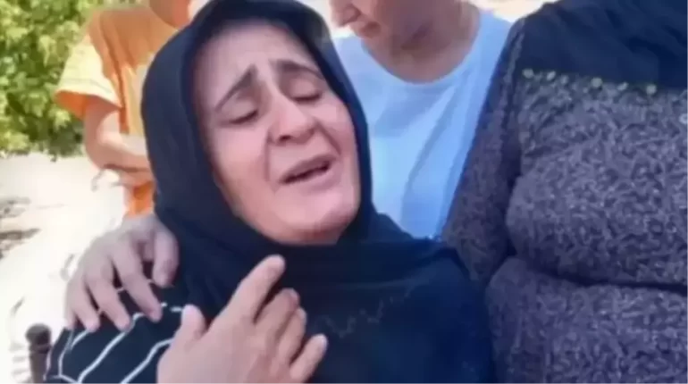
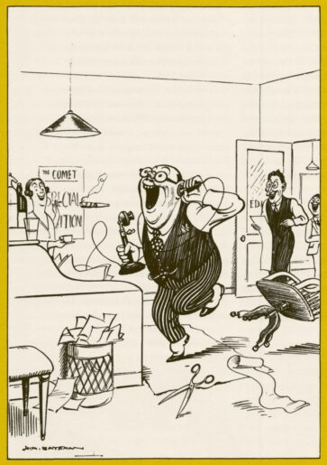

{fig-align="center" width="80%"}

*Hilal Seven / London*

In the Narin Güran case, the process that began with the first spark struck by DEM Party's Sevilay Çelenk for retrial to come onto the agenda evolved into a new phase with the "retrial" calls voiced from the parliamentary rostrum by names such as Ömer Faruk Gergerlioğlu, Mehmet Ekmen, Şahzade Demir, Türkan Elçi and Cengiz Çandar.

With the affirmation by five members of the Court of Cassation of the aggravated life sentences, the file appeared legally closed and the public seemed convinced by the "perpetrator" portraits drawn by the headlines; yet the real storm broke out in the X (Twitter) rooms that had become the digital court of the case. The comprehensive investigations written by journalist Ali Duran Topuz last October, The National News's report with Narin's family, the debates that lasted until dawn in the X rooms — largely with the participation of lawyers and playing a role in keeping the case on the agenda from day one — and then the "Retrial" demand that rose with the signatures of 128 names, found wide echo in the opposition press and began to put in question the unshakable "conviction" that had been built up until then.

## Şeytantepe: how influential can a documentary be?

Released days before Nevzat Bahtiyar's critical hearing, the *140journos* documentary "Şeytantepe" set off something of an earthquake in social memory. The work, which reached more than one million viewers in its first week, presented camera footage and lawyers' statements together and confronted the public with a sharp self-criticism: *"Could the scenario we were told have been wrong?"*

## The "fiction theatre" in the courtroom

When Nevzat Bahtiyar appeared before the judge on 16 April, his hair-raising answer that **"If I had killed Narin, I would have torn her body into pieces"** marked the peak of the contradictions in the file. The new 17.5-year sentence — stretching from destruction of evidence to participation in murder — is also the most concrete sign that the courts, from the local level up to the Court of Cassation, have continuously changed scenarios. Bahtiyar's testimony, which has by now changed eight times, and the fact that the presiding judges have constructed a different sequence of events in each ruling, are an open manifestation that it is not justice but a "fiction" that is being pursued.

## A "perception" play in London

The play "Sus" (Silence), staged in London last April and dealing with the Narin Güran murder, served to the world fictional certainties such as the cleaning of the house, the headscarf said to belong to Narin and the washing of the carpets — details which the court itself found to be untrue and which the media's tabloid stories had dragged the investigation towards. As one audience member put the question: *"Is it art, or manipulation, when a tragedy whose trial is still ongoing is turned, by a lawyer's hand, into a tool of 'perception management'?"*

The viewer, noting that this attempt under "the cloak of art" carries the risk of implanting a false truth into collective memory, conveyed the chilling consistency on stage with these words:

> *"The play opens with a scream: 'Nazlı!' (the Narin character). Everything we saw in the press about the Narin case was in the play. 'Why was the house cleaned?', 'Why was Narin's headscarf there?', 'Why were the carpets washed?'… And there was constant emphasis on this: 'I did not see, I did not hear, I do not know.'*
>
> *At the end of the play the mother is talking to the ghost of her daughter (Narin). She speaks of three doors. She says there is no escape but through the door of the state, the door of the man and the door of the father — but, interestingly, the father character is not on stage at all. The lines of Aunt Hatice while folding laundry with the mother were also striking, for example: 'Our words too, just like this laundry, must be neatly aligned, the same and consistent.'*
>
> *In my view, the real problem with this play was this: there is still an ongoing case, and you cannot make a play about a case in which the perpetrator of Narin has not been clarified. Especially when the person who writes it is a lawyer, they should know better that this play cannot be written. I felt very uncomfortable about this play in every sense. The accents were poor, the subject had not been well studied, there were no characters in the play — we watched stereotypes. At the end of the play the audience applauded, but I personally saw many people who were uncomfortable."*

## A new phase in the investigation: the unclosed parenthesis

Signs that the Narin Güran file, which seems "closed", is in fact still open evolved into a new dimension in recent days through statements from the highest levels of the state. The move launched by the Ministry of Justice over the Gülistan Doku murder, and Akın Gürlek's announcement that, through the **"Unsolved Murders Investigation Unit"** set up within the Ministry, 638 files would be reopened in 75 provinces, became a turning point also for the Narin case. Gürlek's remark on a live CNN Türk broadcast about "the possibility of retrial in the event of new evidence or a secret witness" raised even louder the voices calling for "justice" from the parliamentary rostrum.

## Technical data and legal errors: the Levent Mazılıgüney analysis

The most debated issue in this new phase is the enormous gaps on the technical side of the investigation. Forensic-IT specialist Levent Mazılıgüney — at once a lawyer, a doctor and a civil engineer — whom I met in his office in Ankara, conveys the procedural errors in the file and how data presented as "scientific" has turned into mere illusion, with these shaking words:

{fig-align="center" width="70%"}

> "This case was not a courtroom but a gladiatorial arena in which society wanted to see blood; and that craving was served up to the institutions. I personally felt the hesitation in the presiding judge's eyes; he too knew that such a trial should not have been held. There has been no accounting for why the cameras that did not work for 18 days, and Nevzat's house just 100 metres from the path on which Narin was last seen, were not searched. Even though our security forces have capabilities far beyond those of the National Criminal Office, the fact that this footage was not examined by the UKB — among many other lapses — is unacceptable."

Mazılıgüney goes on to expose what he calls the biggest "technical scandal" that forms the basis of the conviction in the case:

> "The investigation's greatest problem is the scientific monstrosity called **'narrowed cell-tower' (daraltılmış baz)**. This is an entirely fabricated method. Data that I cannot verify cannot be evidence in law. The highest levels — even the Justice Minister himself — were misinformed on the basis of this fabricated data. There is only one person whose guilt is certain: Nevzat Bahtiyar. But because the evidence was not assessed in time, today not even a direct piece of evidence concerning him can be presented. If politics decides, the judiciary will have to accept this retrial."

## "Turkey's Dreyfus affair: Narin Güran"

According to Lawyer Mustafa Demir, one of the defence counsels in the Narin Güran case, this file is not merely a murder case; with its legal errors and its social-lynching dimension it is "Turkey's Dreyfus affair". With Demir we discussed the obstacles faced by the lawyers and the critical bend expected at the Constitutional Court.

{fig-align="center" width="70%"}

### How does the door to retrial open?

Demir stresses that, despite the finalised verdict, justice is still possible:

> "If there is evidence in the file that was not assessed, a false witness statement, or concrete data refuting a report on which the verdict was based, the court is obliged to accept a retrial. As counsels we make the request, but the Chief Public Prosecutor's Office at the Court of Cassation also has the authority to act of its own motion. In its settled case law, the General Assembly would never accept 'joint perpetration' on the basis of the existing evidentiary structure in this file."

### The scandal in the digital data

Mustafa Demir harshly criticises the "WhatsApp calls" allegation at the heart of the investigation:

> "The WhatsApp story is entirely a fiction. On a phone handed to a court clerk without technical expertise, a list was produced in which the times had been shifted by 2.5 hours. For these calls — which have no counterpart in HTS records — the assumption is then produced that they were 'made via WhatsApp'. You will either call this an 'honest mistake' or you will say 'they made a call appear that did not exist' and accept that it was a frame-up. We see here that the prosecutor, in order to blur legal responsibility, handed the file to an unauthorised clerk rather than to an expert."

### From suspect to evidence — and "confirmation bias"

For Demir, the fundamental problem is the inversion of one of the most established principles of criminal law:

> "Normally one moves from evidence to suspect, but here exactly the opposite happened. They decided on the suspects in their heads and then tried to produce evidence to fit them. As Lawyer Muhammet Demir, one of our case lawyers, has frequently emphasised, this is called **'confirmation bias'**. The investigating authority got stuck on the prior assumption that 'this family is guilty'. The mindset that found the mother — going to her child's grave to pray in the morning — suspect and had the grave opened, took as its focus not what happened to Narin but how to make the family appear guilty. The right to a fair trial was violated from the very first step."

### "The fruit of the forbidden tree is also forbidden"

Mustafa Demir seals the unlawful evidence-collection process in the file with these words:

> "Under the label of an 'intelligence operation', without any concrete justification, everyone's phones were seized. The fruit of the forbidden tree is also forbidden; evidence obtained unlawfully cannot form the basis of a verdict. We are still carefully examining the recordings of the 40 different cameras on which the gendarmerie and the prosecutor's office did not dwell. This file — in which the right to defence has been restricted, the language barrier ignored, and which has moved with the lynching psychology of society — will one day be reopened, without doubt. Because it is not possible for this verdict to find a place in people's consciences."

## "You shot me through my honour": from material truth to a chastity inquisition

The Narin Güran investigation turned not so much into the illumination of a murder as into a "morality trial" placing mother Yüksel Güran's private life at its centre. Narratives built on illicit-relationship allegations devoid of concrete evidence steered justice off the course of material truth and prepared the ground for a social execution. While a mother's right to mourn was being taken away, technical lapses were buried under mind-reading and tabloidised allegations. Furthermore, her line **"*I was forced to worry about my honour before I had even mourned my child*"** kept finding a place in the media, again under the depiction of "a mother who does not grieve for her own child's death".

{fig-align="center" width="70%"}

One of the most critical ruptures in this process was the **"language barrier"** which Mustafa Demir highlighted. Yüksel Güran's phrase, broadcast in the media as a haughty challenge — *"Are the Gürans bigger than the state?"* — was in reality a cry built on the interrogative form of Kurdish: **"Are the Gürans bigger than the state, that they could commit such a murder and conceal it?"**

The cost of thinking in Kurdish and trying to speak in Turkish added another stone to the wall of prejudice built up from the start of the case. Yüksel Güran's words, which shook the courtroom, summed up the heavy psychological pressure that exceeds legal limits:

> "You threw me here, I could not go to my child's grave. You did not let me live the pain of Narin. You shot me through my honour. How could I kill Narin? I am a mother. You put me in such a state that I was forced to worry about my honour before I had even mourned my child. This is slander, this is a sin."

## A journalist in the field: the path and the "51 seconds" test

After my contacts in Ankara, I went to the heart of the case, to Tavşantepe. I wanted to check on the ground the sequence of events the court had built on the "narrowed cell-tower" data and camera footage. During the on-site inspection I carried out together with my colleagues Şirin Bayık and Selman Çiçek, we put under the magnifier the critical timeframe on which the ruling rests.

According to the scenario accepted by the court, Narin, after leaving the path where she was last seen, reaches her home in only **51 seconds**, and is killed there within minutes due to an event she witnesses. I tested this route personally. Even when I climbed that rather rough path with adult steps and at speed, the time exceeded **two minutes**. Now one has to ask: how was an entire country made to believe this "51-second" claim, which is refuted by a journalist's simple on-the-ground check?

## Digital impossibilities: a murder, or a bill payment?

Within the few-minute narrow window in which Narin is alleged to have been killed, at 3:28 p.m., the reports submitted to the court show that uncle Salim Güran — sentenced to aggravated life as a joint perpetrator — had paid a bill by face-recognition on his phone, and there are also records of phone-image data indicating that he was actively using his phone. The question, then, is this: into what chain of reasoning does it fit that a person within the same minutes pays a bill, reads news on the internet and commits an unplanned murder?

When I walked along the path leading up from the Qur'an class to Narin's home, retracing her last steps, the picture I saw was this: from law-enforcement to "screen detectives", everyone had chosen, instead of carrying out on-site research, to lift a fabricated scenario to the screens without question and to believe these irrational scenarios.

## The deadlock of journalism and writing the truth as a necessity

In this process, the sober journalism efforts of digital platforms such as Serbestiyet, Bianet, İlke TV and Halkweb — as the clearest indicator of the great deadlock the media is in — still cannot reach a sufficient audience.

In these days when good journalism is in agony and good journalists are in exile or in prison, writing about the Narin Güran case and similar unilluminated files has gone beyond a choice for me. Coming from the other end of the world to depict the rights violations, legal monstrosities, the exclusion of science and the disappearance of the social meaning of justice on the soil where I was born has now become a duty.

## The labyrinth of truth and the guidance of science: the David Canter analysis

The Narin Güran file is not just a tragic child murder; it is an enormous test of Turkey's justice mechanism and socio-political condition, of its political deadlock and of its social conscience. In order to look for the truth beyond slogans, I knocked on the door of a living legend in this process: Prof. David Canter, regarded as the British pioneer in modern crime-fighting of the "offender profiling" method.

{fig-align="center" width="70%"}

Canter, who solved the "Railway Rapist" case that terrified London with a pinpoint profile and who launched the discipline of "Geographical Profiling" in criminal investigations, is regarded today as one of the world's most famous "Mindhunters". A figure who has provided expert opinion in hundreds of files, from Jack the Ripper to modern serial-murder cases, he laid out from the perspective of science the technical blind spots in the Narin file, the "confirmation bias" that paralyses justice, and how courtrooms turn into so many "socio-legal theatres".

### David Canter: "The investigation was conducted wrongly from the very start"

> "In the adversarial system, the reliability of expert evidence must be rigorously tested; this is a deep-rooted principle. But sometimes courts can reject useful information that does not fit the direction of the case by not regarding it as 'expert opinion'. One of the most critical aspects of this file is that, although there is DNA evidence from more than one source, what is really dangerous is the case's becoming a 'headline' focus.
>
> When a case becomes the centre of national attention, the police fall into the rush to 'respond'. This creates an enormous pressure on both investigators and the judge. The idea that judges are individuals concerned only with the facts, entirely independent of outside influence, is an illusion. The event ceases to be objective; if the police investigators could speak honestly, they would probably admit the immense pressure they feel to find a perpetrator and bring charges."

### Cognitive biases and systematic errors

> "Courts ought to be independent, but they are not. Here it is vital to understand the concept of **'confirmation bias'**. As the Nobel laureate Daniel Kahneman has emphasised, when people hold an opinion, instead of behaving rationally, they look only for evidence that confirms it. This is one of the most powerful illusions of our minds.
>
> Just as people read only newspapers that support their own views, the legal system and the police suffer from this bias too. From my own experience I can say this: once a profile of a culprit has formed in the police's minds, no matter what evidence you put in front of them, they reinterpret it to confirm their existing view. In the Narin file too, the system appears to have got stuck on the existing accusation rather than considering alternatives. The 'infallibility' attitude displayed by decision-makers is in fact an effort to protect their own image of rationality. Remember: all legal procedures are generally built to support the original decisions. That is the destructive power of cognitive biases."

### Jack the Ripper and the "Strange Man" syndrome

> "The most important case I have written about is **Jack the Ripper**; because it was never solved, people are still looking for a conclusion. There is another reason a case with sexual components is extraordinarily compelling: the man living alone who confessed to having buried the body. This arouses interest in an 'obscene' way.
>
> What I notice in the Narin Güran file is that the process at the start of the investigation was conducted very badly. The data were poorly collected; instead of building up the larger picture, an assumption was made too early.
>
> In Britain, in a properly conducted investigation, a list of all possible suspects is drawn up and the suspects are eliminated until only those without an alibi remain. But the natural yet flawed reflex for investigators is first to identify a perpetrator and then to look for evidence to confirm that decision. In this case the fact that those who first looked at the matter were inexperienced made the process even harder.
>
> What you have today is the demonstration of how biased the entire system is. You are casting light on this, and the fact that you cannot report these realities in Turkey proves the oppressive shadow cast over the system."

### Social narratives and the role of the media

> "I think the media created an enormous excitement in this story and itself fed that interest. The reason the Jack the Ripper case is so well known is the obscene competition over detail between newly popular newspapers at the time. The cartoonist Bateman has a famous cartoon from the 1930s: a man rushes into the office as if bringing glad tidings, telling the editor he has found 'a terrible murder case' he can write about."

{fig-align="center" width="55%"}

> "Today there is no longer any need for classic newspapers; this interest feeds itself through social media. This process creates crowds that try to solve the case and turn into virtual **'vigilante'** groups. The passion for voicing opinions on social media has replaced the conversations of the neighbourhood teahouse, on an enormous scale.
>
> This is a well-known social phenomenon: identifying a particular 'out-group' (the othered family or suspect) and venting anger at it to get support from your own group. Defining yourself by positioning yourself 'against' a group is one of the most destructive reflections of today's digital culture."

### Socio-legal culture and the public's expectation

> "Your having an outside view of Turkish and Kurdish culture, with your experience in London, depicts the 'socio-legal' dimension of the case wonderfully. We like to think legal systems are objective, but decisions are made by people; and those decisions are affected by culture and social pressure. Courts often decide according to what the public wants to hear from them.
>
> It seems to me that this case is the story of the Turkish judicial system having moved like a **'mob'**. The public's appetite for lynching was fed by social-media attention and caused the court to ignore all due process. One has to wonder: had a little boy been found dead, would there have been the same interest?
>
> The victim's identity and the way the media presents it are critical. As in the Soham case in England, where a photograph of the two murdered young girls wearing a particular football jersey was used… The police admitted to me that the girls were not really interested in that team, but that this image had been constructed to draw public interest.
>
> When an attractive woman or a child as a symbol of innocence is killed, the media seizes on it at once, because putting their photographs on the front pages means 'clicks' and 'attention'. **This is a very famous phenomenon: fiction overtakes reality.**"

### The right to defence and the future of democracy

> "I would definitely not want to be in a Turkish court; we are talking about a climate where even defence lawyers are threatened. That is the biggest problem of prosecution-centred systems without a jury, in which a proper defence cannot be made. In Britain the prosecution is obliged to give the defence all the evidence it holds. In this case (Narin Güran), however, the re-examination of the PSA finding, DNA analysis, the narrowed-cell-tower reports and the digital records have been persistently rejected by the court.
>
> If the defence side is being ignored despite trying every avenue, what does 'defence' mean in that system? I would even bet that even if the court allowed those DNA tests to be done, at some point they would say they had 'lost' the evidence. This is not impossible — I have personally witnessed cases where the police lost the most vital evidence.
>
> What you have here is the demonstration of how biased the entire system is. You are casting light on this, and the fact that you cannot report these realities in Turkey proves the oppressive shadow cast over the system."

### The three pillars of democracy and the Madeleine McCann paradox

> "A true democracy is not just about voting; it rests on three fundamental pillars: an educated public that can understand what is going on, an independent press that holds events to account, and an impartial judiciary as the last line of defence. The file you are working on shows how these pillars have been shaken in a system this open to abuse by social media.
>
> Remember the Madeleine McCann case in Portugal; with no evidence at all, world public opinion believed the family was guilty. Yet it was illogical that 11 professionals would risk their careers to cover up a murder. I see a similar logical error in the Narin case: for a large family to bring a neighbour in to bury a body would massively increase the risk. The neighbour could turn you in at any moment; why would you take that risk? And in such a big family, how would you silence everyone? This whole construction revolves around a single individual constantly changing his story and his narrative. **The solution is in fact very simple: just do the DNA tests honestly.**"

## "One diagnosis, one truth: confirmation bias"

The most shaking moment of my interview with David Canter was that what defence lawyer Mustafa Demir had voiced was confirmed word for word by a scientist thousands of kilometres away. The "fiction" the defence lawyers saw in a local file was sealed, in the language of a world-class expert, as a "systematic judicial error": **Confirmation Bias.** Once the mind has identified a "perpetrator", it is no longer evidence that speaks, but only the constructions that support that decision.

In lieu of a conclusion, I would like to close this file with the first and only question put to me by Baran Güran (Narin's elder brother), with whom I met in Diyarbakır — a question I sat silent for a few seconds before, and which I answered with shame at both the state of my country and my own humanity:

> *"So what do you think will happen now, abla?"*

## Note to the reader

I close this last instalment of the Narin Güran file with a journalist's note and a correction. I have worked on a file I have found among the most shaking of my professional life, the equivalent of at least a year's labour and of considerable volume. In this news file, produced from the reading of thousands of pages of data, dozens of hours of recordings and the transcription of conversations with more than a hundred people, certain material errors have occurred despite all our care and the examinations by different eyes.

Following feedback from attentive readers, these errors have been swiftly corrected. I apologise to all our readers for the errors that arose. Dear readers, if you notice anything in other details we may have missed, please contact me or our team. Errors belong to all of us; the human being is a whole with their mistakes and their virtues. What is virtuous is to turn back from one's mistake and to acknowledge what was wrong.

Thank you for patiently following this series, and my endless gratitude to everyone who contributed to the preparation of the file.

Finally, my thanks to the whole **İlke TV** family for opening space for me to write this series in their valued outlets, and for their great efforts in preparing the file with care and bringing it to publishable form.

See you on the days when the truth of Narin Güran and so many others comes to light, and when justice is delivered.

::: external-refs
1. Hilal Seven — From the trial court to the Court of Cassation: the Narin Güran case | /en/blog/posts/hilal-seven/2026-05-07-ilk-dereceden-yargitaya-narin-guran-davasi/
2. 140journos — Şeytantepe documentary | https://www.youtube.com/@140journos
3. David Canter — Wikipedia | https://en.wikipedia.org/wiki/David_Canter
4. Daniel Kahneman — Wikipedia | https://en.wikipedia.org/wiki/Daniel_Kahneman
5. Confirmation bias — Wikipedia | https://en.wikipedia.org/wiki/Confirmation_bias
6. Madeleine McCann case | https://en.wikipedia.org/wiki/Disappearance_of_Madeleine_McCann
:::
