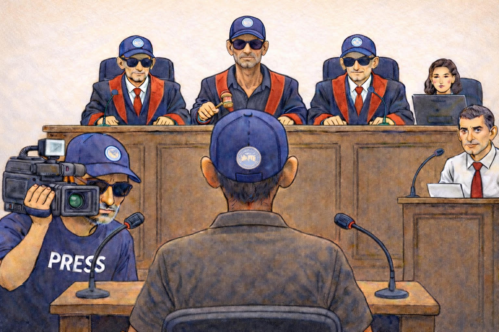
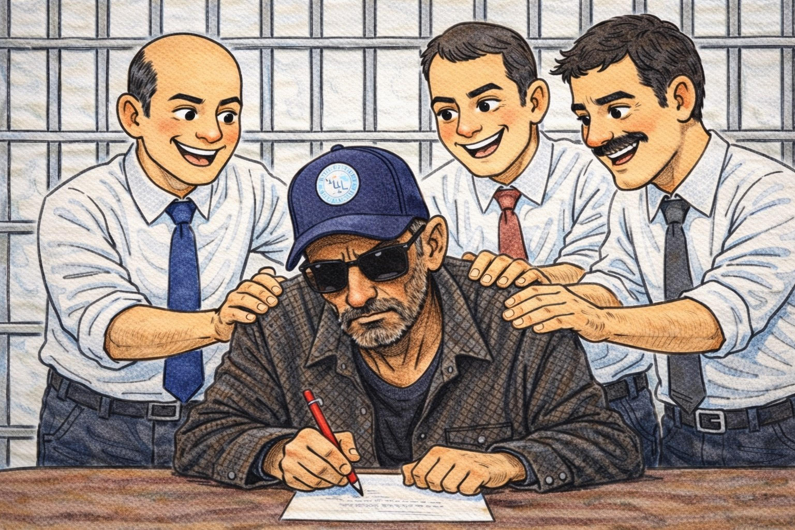
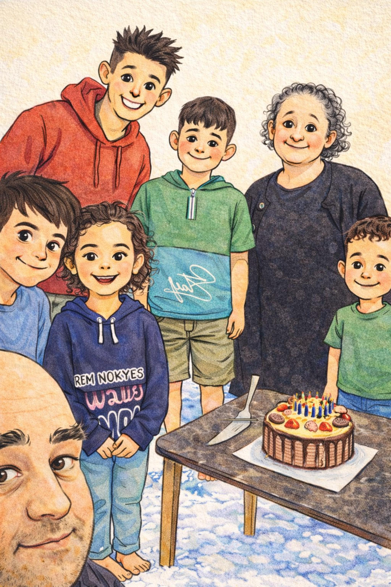
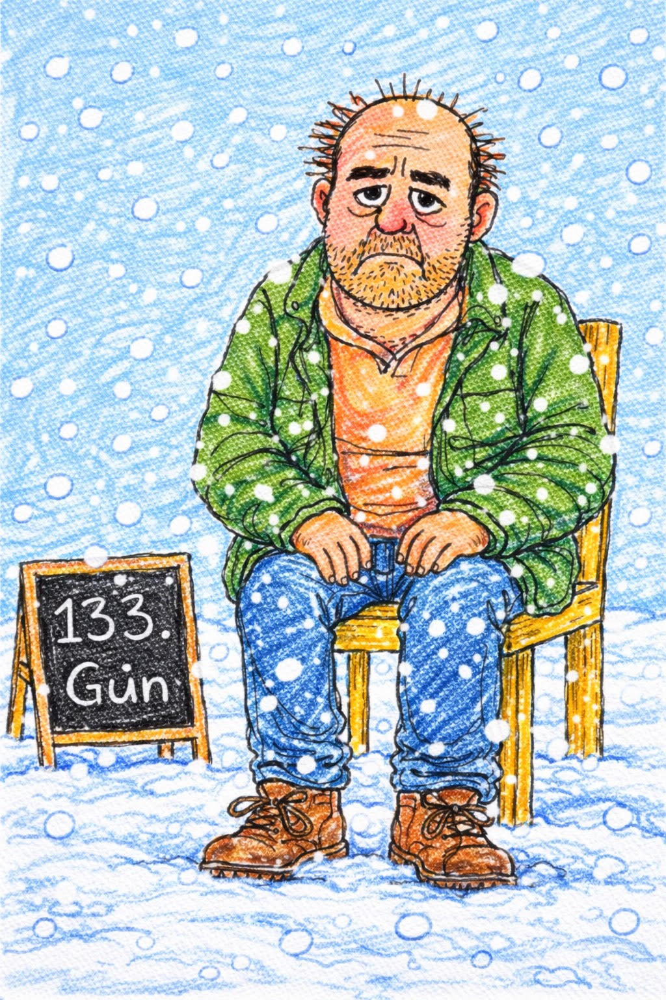

{fig-align="center" width="70%"}

Throughout my life I have heard of, met, and seen many people unjustly imprisoned in various countries. Some had been inside for twenty years; some entered at eighteen and came out at fifty. Some are still inside. But if there is anyone in my life of whom I am absolutely certain that no one has been, is, or will be more unjustly imprisoned, I think it is Yüksel Güran, who in August 2024 lost her daughter Narin Güran to murder. The DEM Party, which a hundred years later is holding talks with the state for the sake of peace for Kurds, owes justice to Yüksel Güran — perhaps right now the Kurd whose problem most urgently needs to be solved, the most pained, the most ill-at-ease, against whom in the early days of the incident they staged demonstrations chanting "Jin, Jiyan, Azadî."

We learned from the news that came from the Court of Cassation on 29 December that our effort to explain to this country — together with Serbestiyet, two parliamentarians, a few journalists, writers and reporters, and a volunteer group whose number does not even reach a hundred — that the murderer of Narin Güran (who, on 21 August 2024, disappeared on the path leading to her home, right in front of her neighbour Nevzat's house, was not found for nineteen days, and was later revealed to have been buried by that neighbour) might in fact be that very neighbour himself, has been in vain. In this story, which has come to resemble the Dreyfus affair but doesn't seem to have ended like it, we have yet to come across a Lieutenant Colonel Georges Picquart capable of resisting the orders he receives, putting the honour of his profession above the rank insignia that will be torn from his shoulders. This is Turkey.

I will not analyze the morbid curiosity for shocking sex stories of a nation that paved the way for a neighbour — most likely a paedophile murderer — to slip out of a child's murder as easily as drawing a hair from butter; nor the rotten media that polishes those stories up and injects them straight back into this nation's veins; nor a state that, while its duty was to set right this whole disgrace, treats it as an opportunity to cover up its own incompetence. There was a time when we even climbed in and out of Nevzat's spiteful head, photographed the crime scene from every angle; even those photographs have yellowed by now, and some have already been lost.

{fig-align="center" width="70%"}

On 19 September 2024, three witness-protection-programme experts came from Ankara to Diyarbakır. Their job, of course, was not to bargain over statements with suspects; that wouldn't have been legal anyway, and would have been the prosecutors' job. In fact there wasn't a single person who wanted to be a witness or who needed protection. These three stopped by Diyarbakır Prison and then left. The very moment they arrived and departed, a flowerpot fell on Nevzat's head (I suppose they slammed the door on their way out, and the pots toppled). Nevzat Bahtiyar gave his statement that famous final form, bringing it into line with the state's homemade, hand-crafted, supposedly invented "Dar-Baz" piece of fake legal evidence. As soon as the statement changed, those three — probably feeling that a bit of *kadayıf* would go nicely with stomachs swollen and soured by liver and ayran — went back to Ankara. They stayed only three days. And what came after that is a story of judges, prosecutors and clerks playing "no one is more blind than he who refuses to see, no one is more deaf than he who refuses to hear."

In the conspiracy by which, in those 132 words above, three people had the light of their lives extinguished by aggravated life sentences, what is in Article 2 of the Constitution — the sentence that "The Republic of Turkey is a democratic state of law" — does not seem to contain either law, or a democracy that has long since been shelved (and never really arrived to begin with), or a state. Countries that have long since severed their ties with law and democracy have certain privileges in which their people take consolation and even pride: the low rate of crime and the trust that the system will absolutely protect you in an ordinary criminal case.

In South America the city where you'll feel safest may be Havana, in the Middle East perhaps Riyadh; in Far Asian Pyongyang, no slipper has been stolen from in front of any door for fifty years — you can go there with peace of mind.

Turkey, of course, is a democratic state of law; obviously Recep Erdoğan is not our official sultan-padishah. If he were, he would come to the Friday royal procession and we would explain our grievances to him there. We are not chasing such baseless claims.

And even if he had set his heart on becoming sultan, that should be partially excused; personally, if I had three palaces — one for winter, one for summer — I too might find it hard to forgive myself for leaving such places on the votes of people who go to Anıtkabir and recite the "Andımız" pledge in protest against peace talks.

Anyway, that is not our subject. In a country whose judges and prosecutors couldn't even take a stance whose worst risk would have been a transfer to a different post — judges who couldn't manage even the one thing they were supposed to do in this life, namely to render a few just decisions — who could possibly give whom a moral lecture? Aspiring to become sultan would be the mildest of these ambitions.

{fig-align="center" width="70%"}

Since we have law in our country, since the courts function like clockwork — what are we mumbling about? Let's get to the point. Yes, there is law, but let's say this time around something slipped through, things didn't go as they should have.

The DEM Party — to which the two parliamentarians I mentioned above also belong — unfortunately, in the early days of the incident, approached the matter with heavy ideological reflexes; intoxicated by the notion that "everything is political," and accusing the entire family — including the slain girl's mother, who was nothing more than a peasant woman — and pointing to the village as the target, organizing marches and shouting "Jin, Jiyan, Azadî," it became complicit in destroying the life, the womanhood, and the freedom of the most pained woman in this story.

Yet the only party that can do something against the conspirators — who, judging by the alarm of the guilty visible on their faces, think they have put a full stop to everything with the Court of Cassation's decision — is right now the DEM Party, the only party in Turkey that currently enjoys the privilege of explaining its grievances at the royal procession.

In the simplest and most condensed form: the party that, a hundred years later, is conducting talks with the state for the sake of peace for the Kurds, owes that very thing to Yüksel Güran and Arif Güran — perhaps the most pained, most ill-at-ease Kurds of this moment.

The matter of this village, against which they once went so far as to organize protests, can no longer be ignored as a third-page news item. The legal Kurdish movement must now solve the matter of these people — who are not symbols of feudal savagery slaughtering their own daughters but rather victims of a stupidity made up of a hundred years of prejudices against Kurds — a matter that is, to its very core, genuinely political.

As for the cheap foolishness of those who attach to themselves titles such as politician, lawyer, journalist, secretary-of-some-children's-rights-association-or-other, and claim to be defending — even loving — a child they have never met more than the mother and father who raised her hand and foot: just as I write this single-line sentence my face has soured into a pickle-shop mask from the disgust inside me; let me cut it short here.

{fig-align="center" width="70%"}

Even when we have done our best to defend these innocent villagers, feeling guilty and ashamed isn't enough; on top of that, sharing this beautiful world in 2026 with cowards who, rather than face a few days of disgrace, have chosen to drag these people into this state and to carry this burden of conscience for life, fills us with despair. Diyarbakır is very cold these days but everyone is bright and merry with the joy of snow; while Father Arif Güran, despite weather of −15 degrees, has been keeping a very mild justice vigil for 133 days on a plastic chair as if he were in the world's most democratic country, waiting for his wife and son to be cleared of his daughter's murder, the Court of Cassation's decision arrived — and now, I suppose, the snow falling on him is pitch black.
