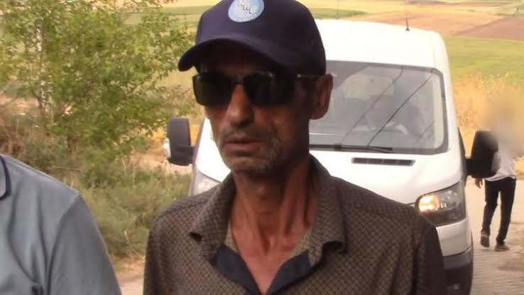

{fig-align="center" width="70%"}

Nevzat Bahtiyar will be among us by 2026 at the latest; this "fine fellow" backed by nearly 85 million people obviously can no longer return to "Şeytantepe" village, and the pleasure of this man's company is something most deserved by the journalists and lawyers who saved him from this murder.

### Dialogue

> **Salim Güran:** Listen up, Nevzat, just now the three of us together wrapped our hands around Narin's throat and killed her. There wasn't room enough for everyone's hands, but for it to count as a joint murder we still went through all the necessary motions. Why did we do this? Because Narin's mother and I were having an affair, and Narin saw us. As for Enes, well, he's a very modern Kurdish young man, you know, he doesn't care about such things. Narin isn't like that — she's very pious. Goes to Quran courses and so on. Anyway, we've decided that if you take this body and dispose of it, we can forget about the three-month estrangement between us. By the way, you can pretend you never even saw Enes if you like — but in that case, how the judge will hand him aggravated life imprisonment too, that I cannot say.
>
> **Nevzat:** All right.
>
> **Judge:** Whereupon it is considered…

---

The plot of the murder that the supposedly sovereign of Turkish media believed in — or pretended to believe in — in December 2024 reads exactly like that uncaricatured dialogue.

(Supposedly sovereign, because I believe almost nothing I read in the Turkish media.)

In this first round of the search for justice we unfortunately could not find that brave and just "human being" who would turn everything around in the bureaucratic chain.

Unfortunately, we are a handful of people fighting against this unprecedented legal disaster. Facing us is a Turkish-Kurdish alliance of a magnitude and filthiness not seen since the Armenian Massacre.

At the head of this dirty alliance stands one of Turkey's most important fronts of democracy: the Diyarbakır Bar Association.

Those who dragged the name of this long-suffering Bar into the cautionary tales of law are now, while everything is in plain sight, smug and proud, thinking they have started climbing the first steps of their political careers by stepping on a bound innocent mother and pushing her behind iron doors.

We have also seen, in this world, a Diyarbakır Bar Association that defends a gendarmerie that tries to cover its incompetence with torture.

Nevzat Bahtiyar will be among us by 2026 at the latest; this "fine fellow" backed by nearly 85 million people obviously can no longer return to "Şeytantepe" village, and the pleasure of this man's company is something most deserved by the journalists and lawyers who saved him from this murder.

After all, what harm could there be in being neighbors with this gentle man — together with your wives and children — who would never lay a finger on a child, who would never kill them?

And besides, God forbid, when an accident happens at home and you call out "Nevzaaaaat!" he comes running, takes the body lying on the floor and walks off with it, and offers the guarantee of not opening his mouth until the body is found — who wouldn't want such a versatile neighbor!

I don't think such a legal disaster would even be possible in North Korea; even there, when the offense is not against the system, ordinary cases conclude more justly.

Let's shift up a gear: even in 2015 in Raqqa, in a zone under ISIS control where there was no state at all, the outcome would have been more just had this incident occurred there.

These extreme examples cannot capture the gravity of the situation, yet not everything has ended.

Turkey's Dreyfus affair is only just beginning.
