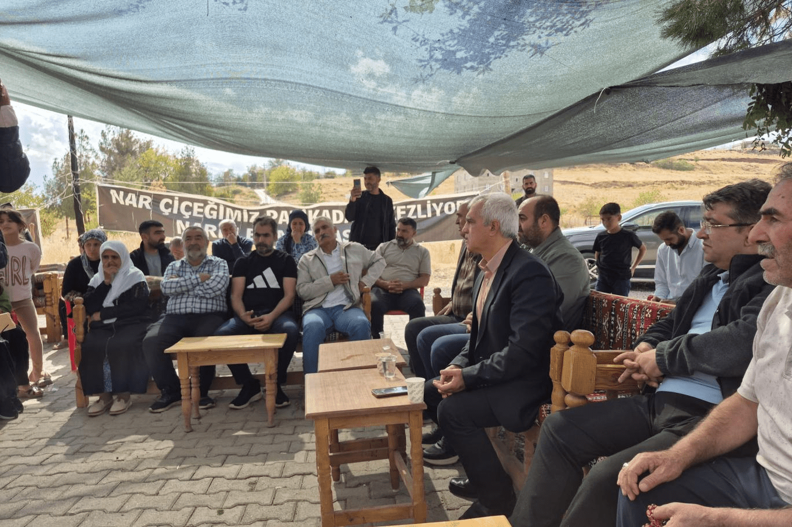

{fig-align="center" width="70%"}

*Independent Türkçe*

## DEM Party MP Ömer Faruk Gergerlioğlu conducted inspections in Narin Güran's village

{fig-align="center" width="70%"}

DEM Party Kocaeli MP Ömer Faruk Gergerlioğlu visited the family in the village of Tavşantepe in Diyarbakır in connection with the murder of 8-year-old Narin Güran. Gergerlioğlu listened to the demands of the Güran family, who have been holding a justice vigil for 54 days, and conducted inspections at the crime scene and in the case file.

In his assessment, Gergerlioğlu said: "Justice must absolutely be served for Narin and her family."

### "They were tried on the basis of urban legends"

Describing the experience of the family who have been keeping vigil at Narin Güran's grave, Gergerlioğlu stated that father Arif Güran, mother Yüksel Güran and uncle Salim Güran are being held in prison under severe conditions. Expressing that the family feel they have been subjected to a media lynch and unjustly accused, Gergerlioğlu said: "These people have been subjected to a trial adorned with urban legends. A great injustice and oppression is taking place."

### Relatives spoke

Fuat Güran, recently released from prison, told Gergerlioğlu that he was in Van on the day of the incident but was arrested on the basis of slander despite this. Narin's sister-in-law Hediye Güran stated that she had been imprisoned without guilt, saying: "I was subjected to oppression, torture and injustice. May God not leave Narin's rights unaccounted for."

Father Arif Güran, speaking to Gergerlioğlu, stated that the trial was not fair: "They buried my family alive in the courtroom. Everything was evaluated one-sidedly. A family was lynched through the lies of the media." Arif Güran said that the base station reports were unscientific and that family members received life sentences on the basis of a person who changed his testimony seven times. The family's elderly mother Remziye Güran called for justice to be served. "Let them fear God, let these slanders come to an end," said the elderly woman, explaining that despite her age she was the one shouldering the upkeep of the household. Melek Güran, wife of Salim Güran, whom Gergerlioğlu also spoke to, said that they were at home on the day of the incident and having dinner with her husband. "Together with my six children, we are witnesses that Salim was at home, but nobody listens to us," said Melek Güran, providing a detailed account relating to the time of the incident.

### He conducted an inspection with lawyers

{fig-align="center" width="70%"}

Gergerlioğlu conducted inspections at the crime scene together with lawyers Mustafa Demir and Onur Akdağ. The lawyers stated that camera and phone records showed that Nevzat Bahtiyar was the last person seen with Narin. Eyewitnesses also stated that Bahtiyar occasionally gave money to Narin. According to the lawyers, the minutes when Narin was last seen correspond to the moment when defendant Nevzat Bahtiyar passed in front of his house. The fact that Bahtiyar called Salim Güran at that very moment was found to be contradictory in terms of the timing of events. The lawyers stated that in enhanced camera footage, Narin was seen as a "shadow" at the same location as Bahtiyar at around 15:11.

Lawyer Onur Akdağ revealed that critical camera footage had been deleted, and that Salim Güran had told the gendarmerie to "check the cameras" after reporting the disappearance, but that the recordings could not be found 15 days later. The lawyers stated that this situation could be attributed to village guard connections and close relationships with law enforcement. Gergerlioğlu and the lawyers tested the "pixel shift" finding in the National Criminal Bureau report on site. In Gergerlioğlu's trial of walking the same path, it was observed that even adults could only climb it in 2 minutes and 14 seconds. This finding demonstrated that it was physically impossible for 8-year-old Narin to have ascended it in 51 seconds. Lawyer Akdağ said that despite PSA (semen protein) being detected on Narin's clothing in the forensic medicine report, identifying DNA tests were not conducted. "Had these tests been carried out, it would have been understood whether the PSA belonged to an outsider," said Akdağ, stating that the forensic process was conducted in an incomplete and superficial manner.

### "The narrowed-base report is not scientific"

The lawyers emphasised that the narrowed-base method, which had become the fundamental pillar of the case, had no scientific validity, and that the court basing its verdict on this report threatened "legal certainty." It was stated that the report contradicted concrete phone data showing that Salim Güran was at home. The lawyers stated that the process of transporting and concealing the body after the murder could not have been carried out in the 6-minute timeframe alleged. "These actions take at least 15 minutes, which shows that the court's narrative is inconsistent," they said. The lawyers drew attention to a 38-minute period of activity at Eğertutmaz Creek. They stated that while Nevzat Bahtiyar was burying Narin's lifeless body, cameras belonging to a military base recorded the moment, but the recordings were not retrieved. The lawyers said that this deficiency prevented the murder from being solved.

### "This case could be the subject of a film"

Gergerlioğlu stated that the event showed how a family was declared guilty through media perception, saying: "What has happened could become a film script in the future. We need to see how societal judgement has been directed." Gergerlioğlu called on the authorities: "The case must be re-examined for the sake of true justice."

*Independent Türkçe*
