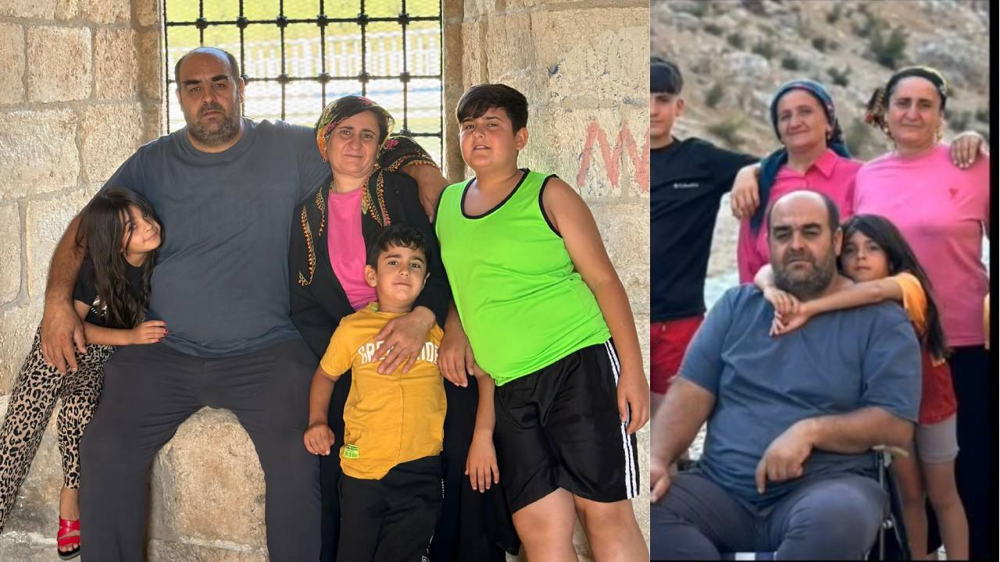
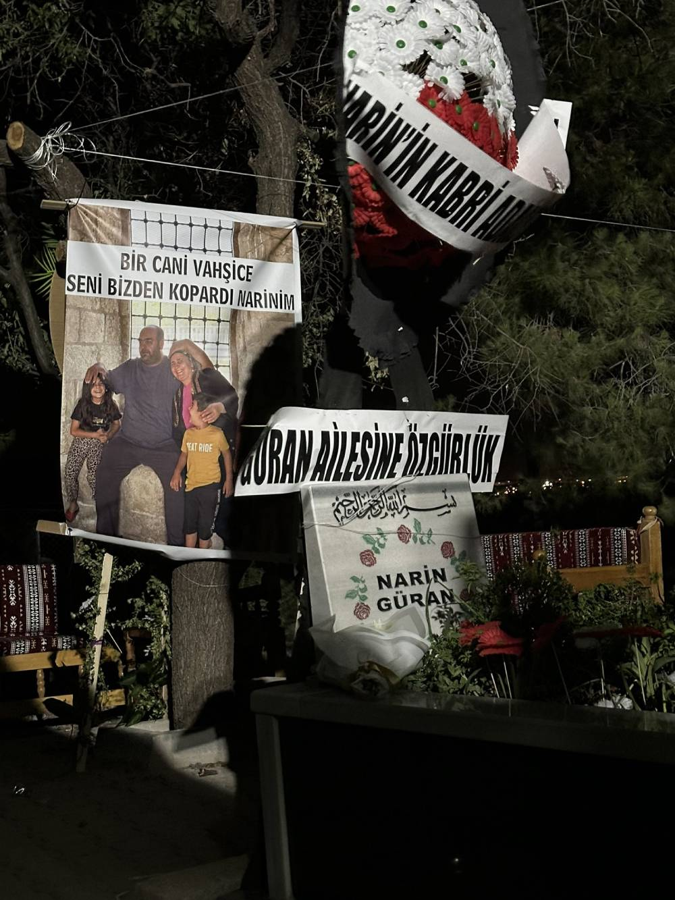
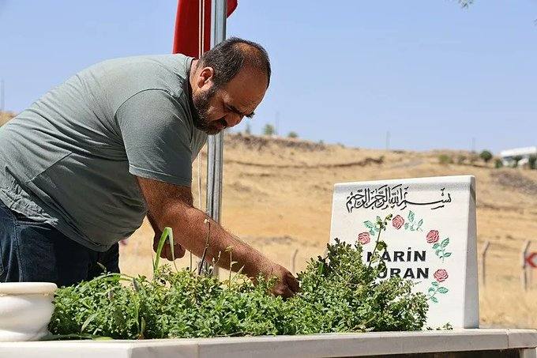

{fig-align="center" width="70%"}

## Critical Time Slices

Narin had asked permission to play with her cousins after coming out of the course; for that reason, her family only realized she was missing three or four hours later. Taking that delay into account, four separate time slices became critical from the standpoint of the investigation: the time before the incident, the time of the incident itself, the time until the family realized the child was missing, and the period after that realization.

All the data we have today — communication activity, message contents, audio recordings, phone activity derived from forensic images, and witness statements — show that during the first three time slices the family members were continuing with their everyday lives, and that from the moment they realized she was missing they began to search frantically. Even Nevzat Bahtiyar's relatives bore witness to this frantic search.

On the evening of the incident, although the first official report was made by older brother Baran Güran at 20:43, before that, at 20:16, mukhtar uncle Salim Güran had already reached the gendarmerie commander on his personal line and asked for a team to be dispatched. So the report was made about an hour after the disappearance was noticed, but there was no real delay.

> At the start, things were not as clear and obvious as they are now. For nineteen days Nevzat Bahtiyar had not been caught, and the time of the incident had not been confirmed as 15:11–15:41.

But let's admit it: at the start, things were not as clear and obvious as they are now. For nineteen days Nevzat Bahtiyar had not been caught, and the time of the incident had not been confirmed as 15:11–15:41. Even though Bahtiyar's capture brought a new and definitive answer to the question "when?", thanks to the assumptions produced by that initial misjudgement and to the "confession" the media gifted him, the answers concerning the other elements of the crime barely changed.

Suspicions conditioned against the family were not abandoned; Nevzat Bahtiyar never managed to acquire serious-murder-suspect status during this process. They must have thought, "How dare we?"

That mother Yüksel Güran and older brother Enes Güran would be put on trial for participation in the deliberate killing of their child was made possible by Nevzat Bahtiyar's third story and by the miraculous "Darbaz" finding produced by his mysterious experts.

## The First Media Milestone: The Crime Scene and the Shaping of the Final Scenario

When we look at the history of the entrenched, ambitious scenario according to which the uncle, mother, and brother participated jointly as perpetrators, we encounter a media turning point. The scenario sprouting up in the investigation became public and started to branch out five days after Narin's disappearance, when mother Yüksel Güran was patched into a daytime television programme.

Repeating her earlier accounts, the mother this time said, "I'm telling this for the first time here," and described a sequence of events about her son Enes spending time with his peers behind the house in the evening hours. This statement was perceived as if a new, critical piece of information about the case had been revealed. The words of a worried woman whose daughter was missing and who, along with her family, was under suspicion — conveyed in her broken Turkish — turned into a sensation that showed how even a small sentence could grow with echoes.

In media and on social media, the mother's words began to be deciphered as if they were a "code." The mother spoke of Enes; Enes was declared a likely culprit. The word "barn" was put forward as the possible scene of the crime. The word "dog" came to be associated with Enes's alleged abuse of animals. The word "tobacco" turned into claims that he was a drug addict. Thus, a single live broadcast hookup, through assumptions built on the mother's words, created a perceptual frame that would influence the course of the investigation.

The actual incident the mother was referring to was, contrary to the scenarios made up on social media, quite ordinary. Yüksel Güran had asked her son for help closing the window, which was hard to shut, in the barn where she kept turkeys, because a dog had eaten one of them. Meanwhile she had also warned the young friends of her son who were smoking on the slope where the barn stood. As for Enes's part, it was simply a dog that had frightened him by chasing him.

{fig-align="center" width="70%"}

### The Cooperation of the Investigation and the Media

Two days after this broadcast, we see that Yüksel Güran was first questioned as a suspect. She was confronted with questions concentrated on her son Enes and on herself. One question in particular stood out: "In statements you made in news stories that have appeared on social media, it appears that you have raised a subject you had not previously shared with the law enforcement. Are there any other subjects you have not shared with the law enforcement?"

But although Yüksel Güran said in the broadcast that she was "telling for the first time," the information she conveyed was already in her earlier statement transcript.

The incident the mother described matched the time the law enforcement was assuming as the time of the incident. Because the focus was on the period between the 16-year-old last witness's "around 18:00" statement (claiming to have seen Narin) and the camera recording showing uncle Salim Güran's car leaving the village at 18:55, the scenario the law enforcement was already pursuing gained increasing strength with media support.

Uncle Salim Güran, as the camera recordings show, before leaving the village at 18:55, had spent time near the slope in front of his other uncle's house — where Narin had stopped before going to the course. Drawing on Narin's anxious behaviour as she went to the course, the assumption that "she saw something she shouldn't have seen" also made this house a suspect location, as I noted in the second piece. At this point we understand that even the accepted reason for the crime was based on the wrong answer to the question "when?".

When we look today, we see that the investigation initially focused on members and relatives of the Güran family. Indeed, those drawn into a fictitious organization under the heading of "harbouring criminals" — through forced interpretations — were initially the subjects of different scenarios and different suspicions. Some family members say in their statements to the media that, because of the law enforcement's directives, even within themselves they had been searching for the killer. Looking at events distorted in the statement transcripts by being given different meanings — such as "the women's argument" and "the questioning of Shepherd Ahmet" — one sees a picture in which everything was uncertain for the family members and everyone looked at one another with suspicion. After this broadcast, we notice that suspicion was "narrowed" against the mother and the older brother.

## The Crime Scene Analysis and the Expert Reports

Meanwhile, an innocent lie added by a small witness to the storyline appears to have feathered the suspicions: a six-year-old child seen on the school camera at 18:43 said he had seen Narin near the slope in front of the barn. Furthermore, this child had other small witnesses; they had heard him calling out to Narin.

These children, initially accepted as witnesses against the family, with the clarification of the time of the incident, would now be counted as having been driven into crime by "a family that uses even children as instruments of organized evil," even though they had previously concentrated suspicion entirely on the family!

Afterwards, until Narin was found and Nevzat Bahtiyar was caught, we began to see headlines in the media such as "A special team is racing against time, on the trail of the 12-minute secret" and "The search for Narin continues: the missing 12 minutes are being investigated."

All televised debates revolved around scenarios near Arif Güran's barn. A retired homicide division chief, taking as his basis the inferences in media and social media, built a story on top of the mother's account that had nothing to do with the time of the incident, went from channel to channel telling it, and continues to do so.

Family members, in the trial process, had to account for "codes" such as "dog, tobacco." In the hope that the case would be illuminated, they had until the indictment was prepared been waiting for the footage from a military base camera to be enhanced. In the end they had to face raw footage from which it appeared no conclusion could be drawn. After the first hearing, the footage was, at Arif Güran's request, submitted to UKB for enhancement, and was simultaneously circulated on social media.

On social media, this speculative crime scene — which would later figure in the reasoned judgment as "the home, barn, or annexes" — became the object of a search for evidence based on garbled camera footage. A social-media account that — as if reading fortunes — was extracting "demons, jinn," "shirtless men," "veiled women" from those frames would later inspire the dark figure in front of the barn that UKB identified and evaluated as Narin, and would boast of its share in Nevzat Bahtiyar's exoneration.

In the trial process, an institution represented by a lawyer whose collaboration with the investigation prosecutors was no secret — and who had at every opportunity vouched for them — was admitted as a participant. Despite the clear determination of the forensic medical report, this time it darkened the question of the "how" of the incident. Now in our scenario there was a struggle starting in the barn and continuing all the way to the house.

In the appellate phase, Tuncay Beşikçi submitted a report concluding that no definitive evidentiary conclusion about the footage was possible; that, taking time and location into account, the dark figure could not have been Narin. Dirk Labudde, while pointing to similar limitations, this time evaluated that a dark figure at a different point on the path could be Narin.

According to the BFI Report — submitted at the Court of Cassation phase, with the best enhancements applied — Narin, about half a minute after being seen on the school camera at 15:11, was reflected on the Daran-2 camera as a small dark figure on the path, near Nevzat Bahtiyar's house. In the footage, on the path there was a large dark figure cutting off her way. The enhanced images showed two shadows, one large and one small, meeting and moving toward Bahtiyar's barn. The report also evaluated the reports prepared by UKB and by Professor Dirk Labudde from Germany; it noted that errors had been identified in the technical analyses performed on the original footage and that the reliability of these reports was weak. The report stated that the activity that appears in the UKB report around Arif Güran's house and barn is not actually present.

{fig-align="center" width="70%"}

## Conspiracy and Social Stigmatization

As Francis Bacon said: *"Once a person believes in something, he sees everything that supports it; what contradicts it he either does not notice at all or dismisses,"* the initial convictions evaporated the truth right before our eyes.

Despite the considerable effort spent on finding both Narin herself and her killer, the Narin Güran case turned, because of cognitive prejudices, almost into a frame-up.

Despite the often genuine concern and grief of society, social-identity-based prejudices turned the case into a process of social stigmatization. Ethnic prejudices manifesting themselves in labels such as "honour killing," "family council," "*omertà*," "a region that does not value its girls"; class-based prejudices associating villagers and the lower classes with improper relationships, dirty secrets, and covered-up crimes; the demonization and misogyny shaped, above all, around the figure of Yüksel Güran — all of these made it easier for perceptions to take the place of facts.

Daytime programmes and panel discussions in the traditional media, and on social media the blue-tick brokers who spread hate, systematically reproduced these social-identity-based prejudices.

Of course, a remark from a ruling-party MP — whose later statement made clear that he knew nothing other than the law-enforcement officials' "forbidden relationship" scenario — saying on an opposition channel: *"Some things are known but cannot be said. They are family friends; we don't want to upset them,"* was another major media milestone. By triggering political prejudices, it created public pressure that affected even ministerial-level state institutions.

Ethnic hatred was veiled with the illusion of "a pro-government family / Hizbullah village," class arrogance with "powerful tribe," and misogyny with the "mother who sacrificed her daughter for her son."

Of Enes Güran — who, while four family members between them could only afford a civil-servant car, thought of themselves as "lords" and believed that people might harm them out of envy; whose horizon for evil was as limited as his horizon for wealth — they fashioned a snobbish psychopath.

Yüksel Güran was cursed both with motherhood-as-sacred and motherhood-as-not-sacred reminders. This woman, whose life and world were almost entirely confined to motherhood, was declared the killer both of her only daughter Narin, whom she had raised with such care, and of Tülin, the disabled daughter she had lost before Narin and looked after for years.

Salim Güran — the "mastermind" deity of the Güran family, said to direct the entire village and clan with storylines no master scriptwriter could have invented, to drill everyone in their statements — at the start could not even remember many issues that were in his favour and that have since been illuminated by the evidence.

It is now more possible to speak of an unscrupulous, amateur, hysterical *collective evil*, rather than a tight-lipped, professional, cool-headed organized evil. By the same token, instead of speaking of the ignorant, feudal, patriarchal villagers of a darkness-of-the-Middle-Ages village, we should be speaking of certified ignorance, urban feudalism, and modern patriarchy in a vast country that has turned into an enormous small place; of the medieval notion of law of those classes whose reflexes against injustice are presumed sharp because of the performances of belonging they put on in political cases…

## Conclusion: A Collective Injustice

As Sevilay Çelenk has said, Narin may not have been able to show us a way out; but the process that began with her killing — which should never have been her fate, and which deeply shook us all — illuminated, in a way no other event could have, a small community of every identity and every world view that gave a chance to the possibility of the Güran family's innocence. This injustice — which, in being unprecedented, has set a precedent — turned, for a handful of people, into a year-long justice vigil.

As one of those in this community labelled, without due process, as "the Güran family's paid trolls," I can now say: the issue is not our naïveté; it is the malice of the majority.
