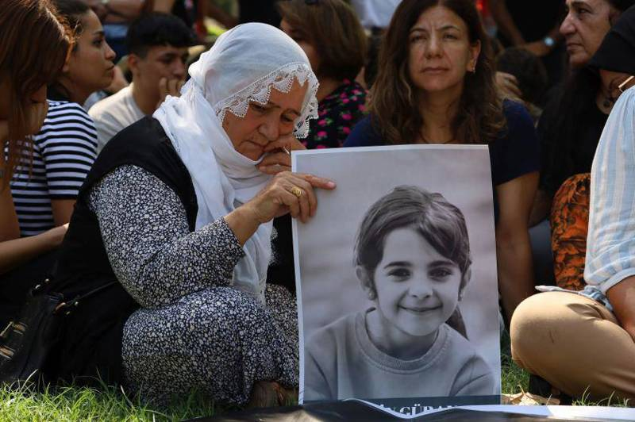
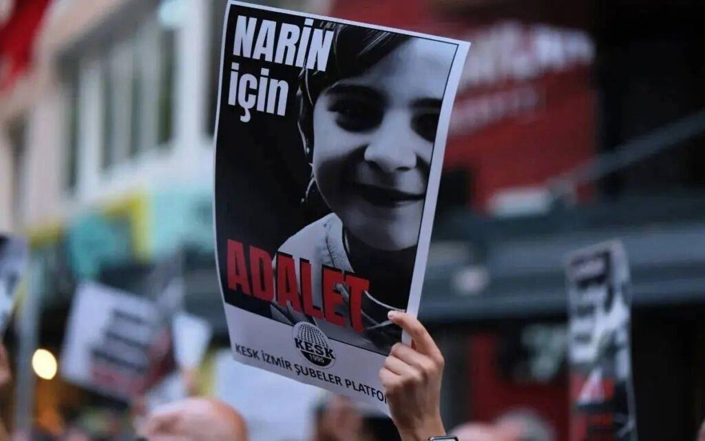
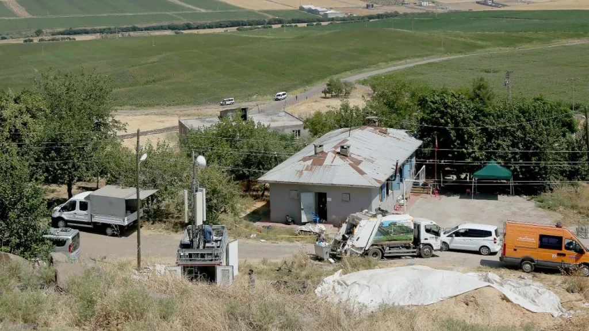

{fig-align="center" width="70%" fig-alt="Narin Güran"}

It is one of the most iconic images in the history of photography. South Vietnamese police chief Nguyễn Ngọc Loan shot a Vietcong guerrilla in the head in front of American photojournalist Eddie Adams, in Saigon. Adams's photograph is known as one of the images that strengthened the anti-war movement. But how much of the truth does what we see in the photograph actually convey? Or can the execution of a human being, regardless of their identity, by itself stir our humane feelings?

John Berger, in his work *Ways of Seeing*, also seeks answers to such questions. There is enormous sympathy throughout the world for Vietnamese guerrillas fighting against American imperialism. It is understandable for the eye looking at the photograph to feel sympathy for someone fighting for the independence of his own country — moreover, captured, with no chance of resisting — and to feel hatred toward the one killing him.

But is the image enough for us to render a judgement on the whole of the truth? Or, returning to the question at the beginning of the article: with our being, our feelings, our thoughts and our beliefs, what meanings do we load onto what we see? Berger asks the following question: if there were negative statements about the executed person under this photograph, would we still carry the same feelings? For example, an alleged rapist, a war criminal, or a collaborator… Depending on belief, ethnic origin, values — and even on psychological state at that moment — each person can give a different answer.

{fig-align="center" width="70%" fig-alt="Eddie Adams's Saigon photograph: South Vietnamese police chief Nguyễn Ngọc Loan executing a Vietcong guerrilla."}

*Image Credit: Eddie Adams*

## The Murder of Which All Turkey Was the Judge

The event that gripped all of Turkey, that turned the attention of every social segment toward a small village in Diyarbakır, began on 21 August 2024 with the disappearance of Narin Güran on her way home from school. At first it didn't draw much attention. She wasn't the first child to go missing in this country. But the case quickly turned, through posts on social media, snowballing like an avalanche, into a hysteria covering all social and class segments. I think there is no other event in Turkey's recent history with such a degree of consensus. After Narin Güran's disappearance and the discovery of her body in a streambed, the convergence of secular, anti-secular, Muslim, Sunni, Alevi, Kurdish, Turkish — all faiths, ethnic origins, and ideologies — at the same point and reacting in unison for different reasons always reminds me of what John Berger wrote about Eddie Adams's photograph. The new media of the new age — social media and the changing reality of media — has, I think, an important role in this.

At Gazete Duvar, where I was working at the time, I confess that I too was, for a brief period, somewhat caught up in this hysteria. I too had the impression that many people from the village had in some way participated in the murder of a girl child, and that a code of silence was being applied. But as the details of the murder emerged, I quickly began to have my doubts.

It is useful to recall the chain of events:

There is no allegation that has not been made about Tavşantepe village, where the murder took place. Even the village's official imam was not spared these allegations. The almost only family member not detained, older brother Baran Güran, was insinuated to be a PKK member through Newroz footage circulated by pro-government media. Footage from "graveyard houses" filmed elsewhere by Hizbullah was shared as if it had taken place in this village. The claim that the family supports Hüda-Par was also voiced in political Kurdish circles. But on some accounts that supported Hizbullah, posts also appeared claiming that Narin Güran had been taken by the PKK to the YPG. From the standpoint of secular nationalist Turks, both of these were grounds for hatred. "Incestuous relations among Kurds," "the family being Kurdish," "support for Hizbullah," etc. — every claim, according to the disposition of the source, circulated among the dark accounts of social media.

## The Post that Triggered Social Media

So how did this process begin?

A piece of writing shared on social media after Narin Güran's disappearance on 21 August perhaps lit the fuse for this whole affair. On 4 September, a note said to have been written by one Murat Çınar Çatalca, who claimed to be a gas-station employee, became news in all the media and on social media.

The note read as follows:

> "Salim Güran is the village mukhtar. In the HTS records, before and after, there are both messages and call records with Narin Güran's mother. On the day of the incident, 15–20 minutes after Narin disappeared, this dog Salim Güran left the village in his own car. He doesn't even take fuel. He goes into a petrol station, buys wet wipes from the shop. The camera recordings were taken. I swear I personally handed the camera recordings to the gendarmerie commander. I was told not to share anything from those images. I was even told that if I shared them I would be charged with leaking evidence to the media. This mukhtar was also in contact with Narin's brother Enes. According to the phone records after the incident, and on the camera recordings, unfortunately Narin was either unconscious or being strangled by Salim's hands lying on the front seat with a dark-brown blanket on top of her. Since the petrol station employees know the mukhtar, there's no doubt. Also, the mukhtar's phone was off, and two hours later he returned to the village in the dark. This time, when he came back, he acted as if he didn't know anything and put on a sad face crying 'What happened to Narin?' to fake grief."

**(The person's statement is quoted directly. Broken sentence structures are his own.)**

This murder, at Gazete Duvar where I was working at the time, was also being intensively discussed at weekly news meetings. Yet the public atmosphere around the murder had taken everyone under its influence. No different voice was emerging. But after reading the news stories, certain doubts began to take shape in me. Yes, there were many allegations about the village. There were many dark spots in the case. But why was no one having any doubts about Nevzat Bahtiyar, the man who had buried the body? I was being cautious because of past cases in which the heavy presence of social media and "neighbourhood pressure" had silenced different voices: cases such as Rabia Naz, or the Musa Orhan case, which ended in the suicide of a young Kurdish woman, could not be discussed in all their dimensions by even fairly clear-headed journalists, simply because of this neighbourhood pressure.

A while later I read in Yıldıray Oğur's column in Karar newspaper "the striking [letter](../../yildiray-ogur/tavsantepe-koyu-masum-olabilir-mi) by Diyarbakırlı Miham Akkul, a master's student in France with no closeness either to the neighbourhood or to the family, who had followed all the news, evidence, and statements from the very beginning." Akkul put into orderly form the doubts I had felt. Within the very dense bombardment of manipulative news, it had become extremely difficult to see and acknowledge the simple truth in front of our eyes. For instance, a child of the family had previously died. According to news stories and posts giving precise dates and hospital names, in 2019 this child had supposedly died by being pushed down the stairs and so on. The only correct piece of information in the news was the name of the hospital. Yet there were dozens of journalists in Diyarbakır following the Narin case who lived there. There was a simple method that, by journalistic principle, should have been followed: you call the hospital and you ask for the death records of this child. As a journalist in Istanbul not really involved with the case, I asked this question.

At the time I was managing a local news network at Gazete Duvar. Duygu Kıt was a young female journalist living in Dersim. I asked Duygu to research this previously deceased family member. A few hours after we discussed the matter, the news landed on my desk. As soon as these stories were published, the hospital management had also looked into the situation and reviewed the records on Narin Güran's older sister.

Let me quote Duygu's report:

> "According to information we have received from hospital sources, in 2009, older sister Tülin Güran — five years old and physically disabled — was taken to the Diyarbakır Children's Diseases Hospital due to pneumonia and passed away there. Accordingly, contrary to the allegations, the hospital's death report on the older sister Güran stated that there were no suspicious circumstances or trauma findings in her death. It was noted that no autopsy was performed on Tülin Güran, since she had died during the course of treatment."

Despite our reporting this, the allegation continued to be voiced on various TV programmes, news stories, and social media posts.

{fig-align="center" width="70%" fig-alt="Narin Güran."}

## A Disinformation Explosion

After the first social media post mentioned above, an enormous explosion of news about the family followed — sometimes manipulating the truth, mostly outright lies. All Turkish media, YouTubers, and Instagram personalities went to the village. It was like a frenzy of the digital world. Above all, the flagship television channel of the opposition media and its reporter were on live broadcast at every hour of the day. In the news stories, the statement that gas-station-employee Murat Çınar Çatalca had given to the gendarmerie also appeared. Furthermore, the owner of the gas station had made similar posts. He was also saying that his employee Murat Çınar Çatalca had been threatened by the Güran family. Of course the security forces were also watching these posts. But there was a small problem. Neither such a gas station nor such an employee existed. The accounts had been closed and had vanished. Who they were, why they had made such posts, is not known. But there was someone else who was reading these news stories.

## The Effect of Social Media on Nevzat Bahtiyar's Statements

Nearly twenty days after Narin's disappearance, in the inspection of the camera at the gendarmerie post in the area, something was noticed. Yet these were the cameras that should have been examined first. Salim Güran, as the village mukhtar, had called the post after Narin's disappearance and reported that the girl was missing. There was a critical piece of information in his conversation with the post commander. In response to the commander's question, Salim Güran had said that Roma might have come to the village and that a red vehicle had been seen leaving the village. Somehow, the law enforcement only thought of inspecting the cameras showing one point at the village exit once the case had entered Turkey's national agenda.

In the camera examinations, on 21 August, the day Narin Güran disappeared, a red vehicle was seen parked near the riverbed at 15:40 and remaining there for fifty minutes. After several days of search, on 8 September, Narin's body was found. The body, in a sack, was lying in the water with a stone placed on top of it. Finding the owner of the red vehicle was not difficult. Salim Güran's neighbour Nevzat Bahtiyar was immediately taken into custody. So why hadn't it been understood from the beginning, in a small village, that the red vehicle belonged to Nevzat Bahtiyar? Because the vehicle belonged to Nevzat Bahtiyar's son, who did not live in the village; he had bought the vehicle just a day earlier.

Nevzat Bahtiyar gave the first statement that led to mukhtar Salim Güran's arrest. Bahtiyar — who had himself joined the searches — used in that first statement, which circulated in the media, exactly the same body-wrapped-in-a-blanket-on-the-front-seat story. Despite the gendarmerie's having taken him into custody, Nevzat Bahtiyar appeared in all news stories as "the witness who turned."

The further details of the case greatly exceed the scope of this article. But one more must be conveyed. Because the claim that there might have been an affair between Salim Güran and mother Yüksel Güran came from here. In his statement to the prosecutor's office, Nevzat Bahtiyar said something he had not said to the law enforcement. In his prosecutorial statement, Bahtiyar said:

> "It was being said that Salim Güran had relationships with Yüksel Güran (Narin's mother) and his uncle's wife Maşallah Güran. But I don't think anyone will give a statement about this. My guess is that Narin saw the sexual relationship he had with one of these women. For this reason I think he could have killed Narin Güran. However, I myself did not see with my own eyes that he had a relationship with one of these women."

This claim had been advanced the day before this statement by a commentator on a daytime programme on a television channel. Bahtiyar was adding to his own statement those of the claims circulating in the media and on social media that he found plausible.

Afterwards, like a snowball turning into an avalanche, every claim — true or false — about the village began to be voiced in live broadcasts and tied to the case. The law enforcement's stance at this stage was a crime-scene-investigation disaster. The vehicle on which Narin Güran's DNA was said to have been found was sitting in front of the house. YouTubers were broadcasting next to the vehicle.

{fig-align="center" width="70%" fig-alt="A scene from Tavşantepe neighbourhood. (Diyarbakır/Bağlar)"}

*A scene from Tavşantepe neighbourhood. (Diyarbakır/Bağlar)*

These are the great question marks concerning the case…

But what if, as Berger expresses in *Ways of Seeing*, all segments of society saw in this case what they wanted to see? The state of mind in which the whole of Turkish society reflected itself within the Narin case is, in this respect, worth studying. In recent years I have been interested in the "Next-Generation Gangs." On TikTok, I had seen a Black Sea mafia leader visit Narin's grave. Sinan Memi, one of the leaders of the Daltonlar — among the most important of the "Next-Generation Gangs" — in a phone conversation tapped by police listening, told a gang member from Diyarbakır who wanted to join them to shoot up Salim Güran's house, saying "There is a charitable deed," without taking any money.

## Media, Society, and the "Mass Psychology of Fascism"

If we return to the famous photograph taken after the Tet Offensive in Vietnam: why did all the strata of Turkish society become so "sensitive" to the murder of a child in a village in Diyarbakır? Was it sensitivity to Narin Güran's interrupted childhood, or did we project onto the photograph we saw our own subtexts?

Did we, as intellectuals, journalists, academics, politicians, secularists, religious people, Kurds or Turkish nationalists, try to fit what was right in front of our eyes into the templates inside our heads? If the latter, then today a mother, an uncle, and a brother are imprisoned as the murderers of their own child without even being able to mourn it. We have lived through, together, what may be told years from now in journalism schools as a communications disaster, or as an example of a hysteria a society collectively fell into.

I think "social media and the media" have a unifying force in the convergence of the hatred that so many people from different cultures, classes, strata, and ideologies feel toward the "other." Wilhelm Reich, in his book *The Mass Psychology of Fascism*, argues that the embedding of this reaction within an ideology and its use is decisive. This reaction directed at what is different has a useful aspect from the standpoint of those in power. In 1930s Germany, fascism uses and channels this reaction. The propaganda minister of fascism, Goebbels, was the first to recognize the importance of and to use the new communications medium of the time, the radio, for this purpose. In Germany, trying to rise from the ruins of the First World War, the working class above all bears intense reaction toward the dominant classes. Had it not been pushed into a premature uprising, there were almost no obstacles in the way of the German Communist Party's seizure of power. Despite this, the social democrats and communists are the most popular parties in the country. The fascist party led by Hitler — the National Socialist Party — places the Jewish bourgeoisie at the heart of its propaganda. It directs the hatred of the poor toward the rich at "the cunning rich Jew." A figure is created against which the unconscious reactions of the lower classes can easily be channelled. For this reason, German fascists win serious votes from particularly the lumpen sections of the working class.

## "Negative Identification" as Social Engineering

In this respect, the Narin case has functioned as a litmus paper, exposing the reaction every social segment in Turkey feels toward others. But I do not know whether there is another example of so many different segments converging so completely around a single event. In the Narin case, Turkish and Kurdish nationalists, secular and anti-secular, Alevi and Sunni, government and opposition were able to meet at the same common point. In one respect, this case stands before us as an example of how easily — through social engineering by those in power — the hatred toward the "other" of which Reich speaks can be made useful. In this respect, we have lived through an experience in which we can also discern what kind of force social media is. With this example of negative-identity narrative, we have seen how easily the source of problems can be sought "elsewhere." Right before our eyes we have lived through how easily, in the case of a village, a family, an identity, reason can be set aside, and how readily hatred can converge.

Finally, with the Minguzzi case as well, another debate is being conducted about "Children Drawn into Crime" through their ethnic identity. Yet, leaving aside the discussion about the causes, sources, and emergence of crime, we have begun to live through another mental paralysis with a shortcut perspective, without even thinking about how this law could be used against the young elements of the political opposition. Let us not forget: hatred toward the "other" is always the greatest weapon used by those in power.

**Notes:**

Reich, W. (2014). *Faşizmin kitle psikolojisi* [The mass psychology of fascism] (Y. Pazarkaya, Trans.). Cem Yayınevi.
