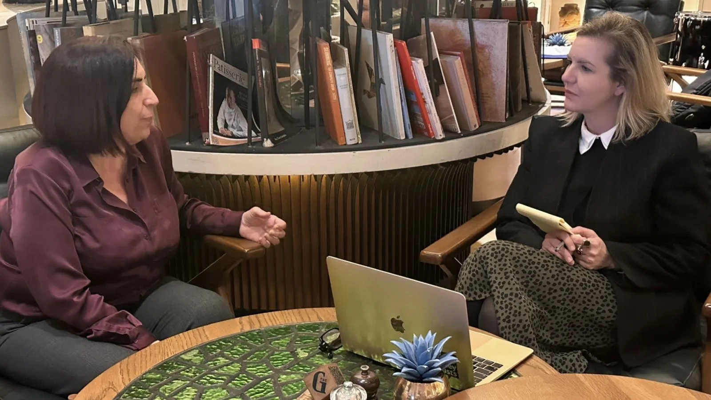
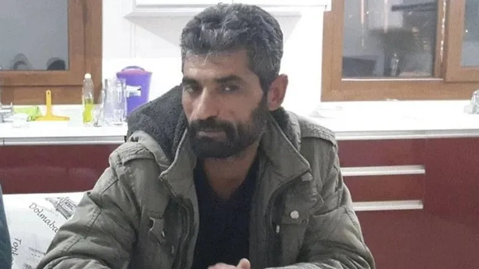
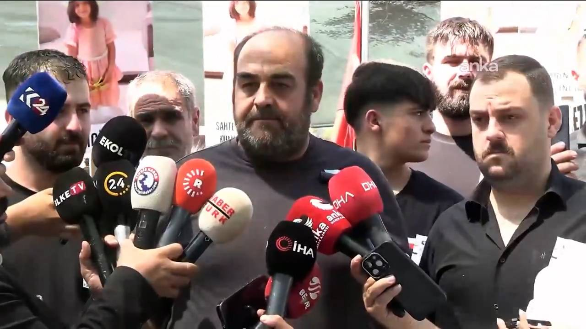
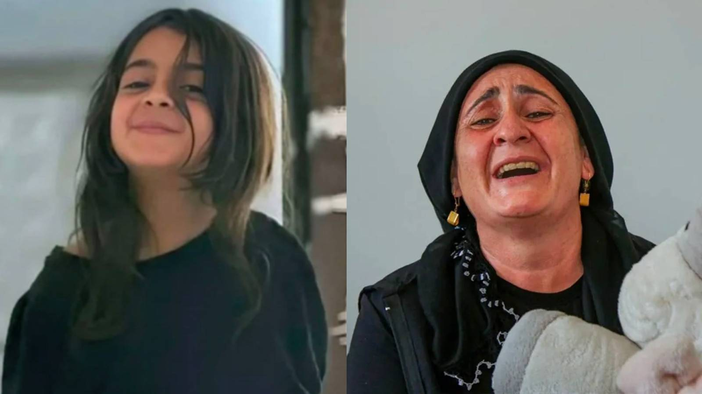

{fig-align="center" width="70%"}

> "Sorguda annenin ağzının içine tükürmüşler. Aile meramını anlatmakta yetersiz kaldı, dil bariyeri var, doğu ketumluğu var. Narin'in istismar edildiğine ben de inanıyorum. Güran ailesinin cezaevinde geçirdiği her saniye çoğumuzun ortaklık ettiği bir insanlık suçudur. Herkesin aksine 'Aile suçlu olamaz' dediğim için Diyarbakır'da bir tür dışlanma yaşadım, tek başıma kaldım, selam sabah kesildi"

**Narin Güran**, 2024 senesinin ağustos ayında katledilmeseydi bugün 10 yaşında olacaktı. Tüm Türkiye'yi sarsan kız çocuğu cinayetlerinden biri olan Narin Güran'ın dosyası geçen hafta yaşanan gelişmelerle birlikte hukuken bir biçimde nihayetlenmiş gözüküyor. En başta şüpheleri aileye yönlendirerek cinayeti Narin'in amcası **Salim Güran**'ın işlediğini, cesedi de gömmesi için kendisine verdiği söyleyen **Nevzat Bahtiyar**, yeniden yargılama sonucunda 'Nitelikli olarak çocuğu kasten öldürmeye yardım' suçundan 17 yıl hapis cezasına çarptırıldı. Bu kararın açıklanmasından önce yayımlanan 140journos'un "Şeytantepe" belgeseli ise dava dosyasına dair çelişkileri gündeme taşıyarak yeniden bir tartışma açtı. Tartışmaya geçen hafta meslektaşım **İsmail Saymaz**'a konuşan baba **Arif Güran** da katıldı; Narin'in Nevzat tarafından öldürülmeden önce ya da sonra cinsel istismara uğradığına yönelik şüphelerin araştırılmadığından yakınıyordu.

Mahkeme kararlarına ilişkin tartışmayı ve soruşturmada yapılan yanlışları ilk günden beri dosyayı çok yakından takip eden DEM Parti Diyarbakır Milletvekili **Sevilay Çelenk** ile konuşmak istedim. Zira bir iletişimci olan ve uzun yıllar akademisyenlik yapan Sevilay Hoca kendi partisini ve hatta içinden çıktığı sivil toplum çevrelerini karşısına almak pahasına en başından beri şimdilerde bir anda popüler olan "aile suçsuz" argümanında ısrar ediyor. Hatta tam bu yüzden bir ara Diyarbakır'da kendisiyle selamı sabahı kesenler olmuş. Çelenk'e tepki koyanların hepsi de çoğumuzun hızla inanma eğilimine girdiği aileyle ilgili tevatürleri yekten "doğru" kabul edenler. Kendisiyle konuşurken aslında hiçbirimizin bu kolektif hezeyandan azade olmadığımızı ve hataların sarmala dönüşmesinde fark etmeden birtakım roller oynadığımızı için sızlayarak fark ettim.

Adli Tıp raporlarını, bilirkişi raporlarını hatmeden, mahkemede tüm sanıkları saatlerce dinleyen, avukatların çalışmalarını takip eden Sevilay Çelenk iddialı. Ona göre Nevzat Bahtiyar gibi bir pedofilin lafıyla ağırlaştırılmış müebbet cezasına çarptırılan Güran ailesinin üç kişinin cezaevinde geçirdiği her saniye bir insanlık suçu.

## "Olayda kumpas falan yok, soruşturmadaki hataların temelinde jandarmanın tecrübesizliği ve yetersizliği var"

**— Siz başından itibaren neredeyse tüm duruşmaları izleyen biri olarak bugün pek çok kimsenin tartışmaya başladığı "Güran ailesinin fertleri bu cinayeti işlemiş olamaz" noktasına çok hızlı geldiniz. Bu konuda ilk** [**yazıyı**](https://bianet.org/yazi/narin-e-hakikat-borcumuz-var-olaylar-nasil-guran-ailesinin-aleyhine-dondu-304164) **kaleme aldığınız tarih Ocak 2025. Bu tartışmanın bugün açılmasında 140journos tarafından hazırlanan ve yakın zamanda yayımlanan** [**"Şeytantepe"**](https://www.youtube.com/watch?v=iMn0bEshf6w) **belgeselinin de etkisi olmuş gibi görünüyor. O belgesele göre Nevzat Bahtiyar bir şekilde jandarmanın da katkısıyla suçtan sıyrıldı. Eğer bu teori gerçekçiyse, Nevzat Bahtiyar kim ki jandarma tarafından koruyup kollansın? Ya da jandarma içinden bir tanıdık üzerinden Türkiye'nin bu kadar gözünün üzerinde olduğu bir dosyada bir köylü bu kadar uzun zaman kayırılabilir mi?**

Madem belgeseli ve jandarmayı konuşacağız, oradaki iddiayı hatırlayalım. Bilirkişi Tuncay Beşikçi, "Bu bir jandarma kumpasıdır" diyor. Ben buna hiç katılmıyorum. "Kumpas" demenin bu meselenin özüne zarar verdiğini de düşünüyorum. Çünkü "kumpas" dediğinizde, sansasyon akla geliyor ve bu olayın vahametini gölgeleyen bir şaibe yaratıyor. Bence orada kumpas falan yok. Bu olayda temel sorun jandarmanın tecrübesizliği, yetersizliği. Diyarbakır Jandarma'nın bir olay yeri inceleme bilgisi ya da tecrübesi yok. Gazeteciler, siyasetçiler, hak örgütleri… herkes oraya dikkat kesilince bana kalırsa jandarma aslında bildiğini de unuttu. Yapması beklenen ya da belki bir sükûnet ortamı olsa yapabileceği birçok şeyi yapmadı. Bir de tabii olayın ikinci gününden itibaren devamlı bir "Oralarda olur böyle şeyler" lafı dolanmaya başladı her yerde. Yani bununla "Oralarda çocuklar aile çevresinde intikam için öldürülebiliyor" iması yapılıyordu.

## "Bence gerçeği Nevzat'ı yakaladıkları gün anladılar ama yanlıştan dönemediler"

**— Bu lafla üstü örtük biçimde mütemadiyen aile içi cinsel münasebet ya da işte ensest ilişki göndermesi yapılı. Narin'in anneyle enişte arasındaki ilişkiyi gördüğü, yani "görmemesi gereken bir şey gördüğü" için ilişkinin failleri tarafından öldürüldüğü tezi bir anda pek popüler olmuştu.**

Evet, ilk başta anne ve amca söylendi. Bu tutmayınca bu sefer ağabey üzerine teoriler üretildi. Oysa Enes hikâyenin içinde hiçbir yerde hiçbir aşamada yoktu başta. Bu "daraltılmış baz" denilen şeye dair çalışmayla ortaya atıldı. Bu sefer de **Enes**'in Narin'e "bir şey" yapmış olabileceği tezi işlendi aylarca. Ve bu insanlar işkence ve kötü muamele gördüler kollukta. Jandarma o kadar hata yaptı ki… Yalan yanlış tutanaklar imzalattılar bu insanlara. Çünkü üzerlerindeki baskıyla ne yapacakları şaşırdılar. Ve şimdi anlaşılıyor ki aslında Nevzat Bahtiyar çevresi mütemadiyen aileye yönlendirmiş soruşturmayı. Atılan sahte Facebook mesajları vesaire var. Bunun sonucunda da ailenin en uzak akrabaları bile gözaltına alınıp sorgulanırken çocuğun kaybolduğu noktaya en yakın yere, yani Nevzat'ın evine bir kere uğramamışlar. 19. günde Nevzat yakalanana kadar soruşturma o kadar yanlış bir yerden ilerlemişti ki artık o noktada "Aile değil, Nevzat" diyemediler. Çünkü **Ali Yerlikaya**'sından **Yılmaz Tunç**'a ve **Mahinur Göktaş**'a, devletin yetkili ağızlarının hepsi bu minvalde açıklamalar yapmıştı. Sonra çıkıp "Nevzat'mış" diyemediler. Oysa Nevzat'ı yakaladıkları gün anlamışlardı bence.

**— Devlet tarafında soruşturmayı yürütenlerin aslında ta Nevzat'ın yakalandığı gün Narin'i öldürenin o olduğunu anladıysa neden mahkeme bu yönde ilerlemedi?**

Beklentiler o kadar başka yönde büyütülmüştü ki oradan dönülemedi.

{fig-align="center" width="70%"}

*Nevzat Bahtiyar*

## "Aynı hatayı herkes yaptı, toplumun tüm kesimleri"

**— Oysa burası kadınların, küçük kızların cinsel istismara uğradıktan sonra öldürüldüğü sayısız vaka görmüş bir ülke. Buna rağmen bu ihtimal neden geri plana atılarak aile içi karanlık ilişkiler tezine bu kadar itibar edildi?**

Burada hatayı tek bir kesim yapmadı, herkes yaptı. Mesela ben sizinle buluşmaya gelmeden o dönem sizin tecrübeli hukukçu **Eren Keskin** ile yaptığınız [söyleşiyi](https://t24.com.tr/yazarlar/cansu-camlibel/eren-keskin-guran-ailesi-o-aciklamayi-yapmadan-onceki-aksam-bazi-milletvekilleri-ailenin-yanindaymis-narin-in-ailesinin-bir-adli-tipcidan-gorus-aldigini-dusunuyorum,46387) yeniden okudum. Henüz olayın üzerinden 25 gün geçmişken, aile henüz mahkemeye çıkmamışken Eren Keskin de açıkça ve vahim biçimde aileyi suçluyor ve "Ya ağabeye ya da Nevzat Bahtiyar'a yıkacaklar, aileyi kurtaracaklar" diyor. Toplumdaki genel kanı buydu ve bu olduğu içinde jandarma Nevzat'ı sorgularken "Sen rahat ol. Bütün Türkiye senin arkanda. Rahat konuş" diyor. Belgeselde var bu sorgu görüntüsü. Böyle bir sorgu olamaz!

Ama bunu söylemekle beraber bazıları gibi "Nevzat başka bir konu nedeniyle korundu" gibi bir şey düşünmüyorum. Benim gördüğüm Nevzat'ın birileri için bir değeri olduğu için değildi jandarmanın tutumu. Baştan itibaren yaptıkları hatalardan dönemediler. Dönemeyecekleri kadar bu yalanın içine dolandılar hep birlikte.

## "Galip Ensarioğlu'nun o açıklaması çok yanlıştı, aileyi aman aman tanıdığı falan yok, herkesin duyduğu dedikoduları duyup inanmış, yaptığının faturası çok ağır oldu"

**— Devletin failleri koruduğuna yönelik ön kabul ya da önyargının kökeninde on yıllardır izlediğimiz pratikler yok mu? İşte Gülistan Dolu dosyasında yakın zamanda ortaya çıkanlar ortada. Nitekim Güran ailesinin korunduğuna dair intibaı da bir AKP'li siyasetçinin, Galip Ensarioğlu'nun daha olayın ilk günlerinde çıkıp "Ailenin hemen hemen tüm bireylerini tanırız. Yakın dostluğumuz var. Bizlerin bazen bilmediği, bazen de bilip söylemememiz gereken şeyler var" demesi olmadı mı?**

Ben kendisiyle hiç konuşmadım. Aslında herkesle konuşmayı denedim. AKP'den sanırım 40 kişiyle falan görüşmüşümdür, çok uzun görüşmelerdi hepsi. Ancak **Galip Ensarioğlu** ile konuşmadım çünkü çok yanlış bir şey yaptı. Bence bu cümleyi kurarken bu toplumsal kutuplaşma iklimi içinde kadın ve çocuk katli vakalarının, AKP'nin oradaki kötü sicilinin buraya fatura edileceğini ve bunun korkunç bir infial yaratacağını hesap edemedi. Sonuçta o dönem benim de kulağıma geliyordu amcayla annenin ilişkisi. Ama bunlar bizim milletvekilleri olarak net tespit edebileceğimiz şeyler değil. Ayrıca Ensarioğlu'nun da o köyü ne kadar tanıdığı tartışılır. "Aileyi iyi tanırız" demesinin sebebi oy eğilimleri. AKP Diyarbakır'dan iki ya da üç milletvekili çıkarabiliyor. AKP'ye oy veren köyler Milli Selamet çizgisinden bugüne belli zaten. "Kırk yıldır tanıyoruz" demesinin nedeni bu, bu kadar. Yani öyle aman aman dostluk falan yok ortada. Dedikodulara herkes gibi ikna olmuş belli ki… Oysa aileyi iyi tanısaydı o kadar kolay ikna olmaması gerekirdi bu çocuğun aile içinde öldürüldüğüne. Ama işte söylentileri duymuş, inanmış ve üzerine açıklama yapmış. Bunun faturası çok ağır oldu. Süreç içinde ben bir noktada kendisi çıkıp bunu açıklar diye düşündüm. Bunu da yapmadı. Çünkü belli ki çok ciddi bir linç yedi.

{fig-align="center" width="70%"}

## "Bugün Gülistan Doku dosyasında harcanabilir olana karar veriliyor"

**— Ensarioğlu'nun neye inandığı ya da ne söylediği bir yana toplumun devletin yine birilerini koruyacağı ve suçun cezasız kalacağına yönelik ön kabulüne dönmek istiyorum. Bugün Adalet Bakanı Akın Gürlek tam da bu algının farkındalığı içinde ve bunu tamir etmek için mi Gülistan Doku işine el attı sizce? Devlet bir dönem koruduklarını korumaktan ne zaman ve neden vazgeçer?**

Harcanabilir olana karar veriliyor. Ben **Gülistan Doku** dosyası üzerine uzun cümleler hiç kurmadım çünkü bilmediğim şey üzerine konuşmam. Sadece kadın cinayetlerine karşı prensip olarak bir yerde konum alırım. Onun dışında bir şey giremem. Ama gözle görünen şey şu; beş yıldır beden dahi bulunamamış. Ve biz bunu duyduğumuzda, gördüğümüzde hiç şaşırmıyoruz çünkü evet hep korundular. Bunu da bildiğimiz için var olan bütün bilincimizi Narin Güran dosyasına yansıttık.

## "İktidar, Tavşantepe'de harcayabilecekleri 200 oyluk bir köy gördü ve kenara çekildi"

**— Siz bu kolektif ruh halimizi bir yazınızda çok etkili biçimde özetlemiştiniz; "Adalet Kalkınma Partisi'yle heba edilmiş yıllarımızın intikamını almaya çalıştık ama bu imkânsız bir intikamdı. 'Bilip de söyleyemediğimiz şeyler var' sözleri bu anlamda bizim şüphelerimizi buraya kilitledi. Ve biz aslında bunun üzerinden AKP ile hesaplaşmaya çalıştık. Ama sonunda yine bu işten sıyrılan da AKP hükümeti oldu."**

Böyle oldu maalesef. Ve bu durum bizi sanki gerçekten de hesaplaşılıyormuş duygusuyla baş başa bıraktı. Sanki biz kazanmış gibi olduk. Oysa hakikat bu değildi. Orada çok kolay harcayacakları 200 oyluk bir köy gördüler ve kenara çekildiler.

{fig-align="center" width="70%"}

*Baba Arif Güran*

## "Baba Arif Güran bana, 'Sizin parti burada iktidardır, bu zulüm karşısında bir politikanız olmayacak mı?' diye sordu, o sözünü unutamadım"

**— Ben o kısmını da hiç tam anlayamadım esasında. Güran ailesinin bir bölümü HÜDA-PAR'a mı oy veriyormuş mesela? Ya da hepsinin topluca AKP'ye oy verdiğinden kim nasıl emin olabiliyor?**

YSK'nın açıkladığı oy oranlarına göre Tavşantepe'de oyların çoğunluğu AKP'ye gidiyor. Ama köyden her zaman 20-30 oy da DEM Parti'ye çıkıyor. Mesela anne **Yüksel Güran**, DEM Partili olarak biliniyor, Derik'ten zorla boşaltılmış bir köyden göç etmiş bir ailenin kızı. Öte yandan baba Arif Güran, Hizbullah ile yakın ilişkide oldukları iddiaları üzerine "Bizim köyde bir tek kişi namaz kılar, o da kayınvalidemdir. O da DEM Partilidir" diyor.

Arif Güran'ın açıklamalarına bakarsanız aslında o siyasi bir partiden ziyade iktidardan beklentilerini ifade ediyor. İktidar derken neyi kastettiğini anlatmak açısından kendisiyle aramızda geçen bir diyaloğu aktarmak istiyorum. Aylar önce köye gittiğimde bana bir keşif yaptırdılar. Kendisi de oradaydı, avukatlar da. Döndü bana dedi ki; "Sayın Vekilim siz çok muazzam bir emek harcıyorsunuz. Siz olmasaydınız biz bu adalet nöbetinde burada oturamıyor olurduk. İzin vermezlerdi. Sizin parti burada iktidardır." Bu sözler beni çok etkiledi hakikaten, unutamadım. "Burada 8 milletvekili çıkaran DEM Parti'dir. Burada bütün belediyeler DEM Parti'nindir. Burada iktidar DEM Parti'dir. Bu zulüm karşısında bir politikanız olmayacak mı?" diye sordu. Kendisi DEM Partili olsun olmasın DEM Parti'nin adalet anlayışının, kadın mücadelesindeki tavrının ona yardımcı olacağını ummuş.

**— Bir de Diyarbakır Barosu'ndan büyük beklentisi olmuş Arif Güran'ın.**

Evet, kesinlikle. Bu kadar korkunç bir hedef gösterilme yaşamış bir köyden ve bir aileden söz ediyoruz. Ve bu adam çıkıp diyor ki, "Baromuz bizi bilir. Bize diğerlerinin gözüyle bakmaz. Her şey bizi şeytanlaştırırken onlar yapmaz diye düşündük. Ama orada da bize bunu yaptılar." Baba Arif Güran'ın tüm bu tespitlerini alt alta koyunca görüyorsunuz, çok bilge bir yanı var adamın. Bir buçuk yılda yaşadıkları da onu bambaşka bir insan yaptı bence.

## "Herkesin düştüğü klişelere DEM Parti de düştü ama herkes oradaydı, dosyadaki hataların partimize fatura edilmesi ideolojik, güvenli sularda muhalefet"

**— Arif Güran'ın Diyarbakır Barosu'na ilişkin hayal kırıklığının arkasında medyanın, toplumun, biraz hepimizin aileye dair ilk günden kanaat geliştirme aceleciliğine onların da düşmüş olması durumu var. Aynı klişelere sizin partiniz de DEM Parti de düşmedi mi nihayetinde?**

Düştü.

**— Yani Diyarbakır'dan 8 vekil çıkartan, bölge insanını, bölgeyi herkesten daha iyi tanıma iddiasında olan DEM Parti de diğer siyasi partilerden ya da ortalama bakıştan farklı bir hat koyamadı aslen ortaya. Neden?**

Bunun nedenini daha çok yakın bir zamanda çözdüm. Bu soruya yanıt verirken yine sizin Eren Keskin söyleşinize dönmek istiyorum. Çok güzel bir soru sormuşsunuz; "Kadın hareketi, siyasi kutuplaşmaları, toplumdaki kutuplaşmaları aşabildi mi?" Maalesef kadın hareketi kutuplaşmaları aşamadı. Ama öte yandan şunu da söylemem lazım. Gelinen noktada Narin dosyasındaki hataların DEM Parti'ye fatura edilmesini de son derece ideolojik buluyorum. Belgeselde İsmail Saymaz'ın yaptığı da bu. DEM Parti'ye bir şeyin fatura edilmesi, onun hedefe konulması kolaycılığı. Biz parti olarak klişelere düşmedik değil ama aynı klişelere herkes birlikte düştü. İktidar karşıya alınmadan bize yöneltilen bu eleştiriler güvenli sularda muhalefet biçimi. DEM Parti harcanabilir görülüyor. Belgesel de bu haksızlığı yapıyor. Belgeselde görülen tek siyasetçi Eş Başkanımız **Tülay Hatimoğulları**. Müthiş bir haksızlık bu.

Bu eleştiriyi getirmekle beraber belgeselin hak mücadelesindeki işlevine zarar versin istemem. Ben istiyorum ki belgeseli 5 milyon kişi izlesin. Kamuoyundaki rüzgâr değişecekse biz bize yapılan haksızlığı paranteze alırız. Ama bu konuda DEM Parti ilk öne çıkıp da söz söyleyenmiş gibi davranılması haksızlık. Danışmanımla kronolojik bir arşiv taraması yaptık. Siyasetin gündemine taşıyan ilk siyasetçi **Ümit Özdağ.** "Narin sizin yozlaşmış, domuz bağı düğünü üreten feodal kültürünüzün sonucu öldü" diyor. "Domuz bağı" referansıyla Hizbullah iması yapıyor. **Özgür Özel** 9 Eylül'deki açıklamasında "feodal ilişki" vurgusu yapıyor. Dönemin İçişleri Bakanı Ali Yerlikaya 10 Eylül'de gazetecilerin "Aileye baş sağlığı dilemediniz" diye hatırlatması üzerine, "Oldukça açık yani daha fazla bir şey demeye gerek yok. Herkesin okuduğu zaman, anladığı, hissettiği bir durum. Tekrar anlatmaya gerek var mı? İnşallah bir daha insanlığımızdan utanacağımız tablo ile karşı karşıya gelmeyiz" diyor. Ama ilk açıklamayı bu açıklamaların hepsinden günler sonra, 16 Eylül'de yapan Tülay Hatimoğulları'na haksızlık yapılıyor.

**— Hizbullah bağlantısı iddiasını köpürtenlerden birinin DEM Parti çevreleri olduğuna ilişkin kanaat tamamen de asılsız değil ama herhâlde…**

Bizim partide de ilk günlerde maalesef aceleci bir iki milletvekilinin vahim açıklamaları var. Çünkü bu boca ediliyor her taraftan. Herkes bizim tecrübemize sahip olmayabilir. Gençler daha yüzeysel olabiliyorlar. Dolayısıyla evet yapılmış birkaç açıklama var.

**— Tülay Hanım'ın o dönem Tavşantepe'ye giderek kurduğu şu cümlenin de dikkat çekmemesi imkânsız ama…** **"Silah deposu vesaire... Bazı siyasi partilerin üssü haline getirilmiş olan bölgedeki kimi köylerin sakinleri şunu bilmelidir ki bu silahlar döner o köylünün kendisini vurur, bu silahlar döner halkı birbirine kırdırır."**

Bizimkilerin belki şöyle bir refleksi oldu. Bir anda oralar ensest, çocuk öldürme falan gibi argümanlarla ötekileştirilmeye başlayınca bunu bütün Kürt toplumuna yönelen bir şey gibi algılayıp tepki verdiler. Buna hak verdiğim için söylemiyorum, neden en başta o tepkilerin verildiğini çözümlemeye çalışıyorum.

{fig-align="center" width="70%"}

*DEM Parti Diyarbakır Milletvekili Sevilay Çelenk*

## "Herkesin aksine 'Aile suçlu olamaz' dediğim için Diyarbakır'da bir tür dışlanma yaşadım, tek başıma kaldım, selam sabah kesildi"

**— Sonuçta Kürt halkı için hak mücadelesi veren bir parti de Kürt bir ailenin ötekileştirilmesine hizmet eden birtakım açıklamalar yapmış oldu. İşte Arif Güran size de söylemiş bunun DEM Parti'den beklenen bir tavır olmadığını.**

Beklenmiyor elbette. Bu çok vahim ve çok yanlış. Ama görülmeyen şey şu; herkes oradaydı. CHP'den Yeni Yol Grubu'na herkes konuştu, herkes bir şeyler söyledi. İlk duruşmada bütün partilerden milletvekilleri vardı salonda, hem de hepsi yan yana oturdu. Ama onlar hiç hikâyede yokmuş gibi bir DEM Parti suçlaması var belgeselde. CHP hiç yok mesela belgeselde. Benim de kendi kırgınlıklarım olabilir. Gerçekten bu süreç içinde çok zorlandım. Bir tür dışlanma yaşadım Diyarbakır'da.

**— Neden?**

E çünkü Sevilay Çelenk 30 Ocak 2025'te çıktı ve bir anda herkese aykırı gelen bir şey söyledi. Bütün ülkenin söylediğine karşı çıktı. Şimdilerde birileri "Biz de söyledik" deme yarışında ama o dönem kimse Güran ailesinin bu cinayeti o şekilde işlemiş olmasının söz konusu olamayacağını söylemedi. Bir iki yazı çıktı sonra çelişkileri doğru biçimde irdeleyen; **Yıldıray Oğur** yazısı, **Ali Duran Topuz** yazısı. Sonra mahkemenin gerekçeli kararı çıktı ve tartışma bıçak gibi kesildi. Bugün "Biz demiştik" diyenlerin hiçbiri cesaret gösterip "bu karar tartışmalıdır" diyemiyor o televizyon programlarında. İki cümle söyleyip geçiyorlar. Ben kaldım tek başıma. Sadece DEM Parti çevreleri değil, kadın çevresi, hukuk çevresi… yani gittiğinde selam sabahın kesilmesinden anlıyorsun ki büyük tepki görüyorsun. Böyle bir ortamda hareket etmek çok zor.

## "Parti içinde farklı görüşü olanlar beni hep dinlediler ama işi bir hukuk komisyonu kurma noktasına getiremediğimiz için üzgünüm"

**— Uzun zamandır medyada, akademide ve sivil toplumdasınız ama siyasette yeni sayılırsınız. DEM Parti içinde ne kadar zorlandınız?**

Zorlandığım zamanlar oldu ama şunu da açık yüreklilikle söyleyebilirim; hep "Hocam bunu konuşalım" dediler ve konuştuk. Üç ayrı konuşma yaptık uzun uzun ve her defasında o konuşma benim akıllarda çok ciddi soru işaretleri bıraktığım bir konuşma olarak noktalandı. Karardan sonra 28 Aralık'ta ben mahkeme salonundan aradım partiyi. İlgili iki komisyonu aradım. Kadın Meclisi ve Çocuk Meclisi eş sözcülerimizi aradım, "Sakın büyük açıklamalar yapmayın. Ben üç gündür burayı izliyorum. Burada çok tuhaf bir şey oldu. Gerekçeli kararı bekleyelim. Parti'yi kendi çevresinde zora sokacak bir şey söylemeyelim. Tedbirli bir açıklama yapalım" dedim. Hatta mahkeme salonunda kendi partimden biriyle çok gerilmiştim. Çünkü o ailenin suçlu olmayabileceğine ilişkim sözlerim karşısında dehşete düşmüştü. Mahkeme salonundan çıktım dosdoğru annemin evine gittim hemen adliyenin karşısındaki. Yetkilendirilmiş ve görevli olarak mahkemeyi izlememe rağmen medyaya tek kelime etmedim. Partim de benim onlara önerdiğim şeyi yaptı, ailenin suçlu olduğuna dair tek açıklama yapmadı. O gün bugündür de buna dikkat ediliyor partide. Ama adalet bakanları, içişleri bakanları neler neler söylemiş bakılıyor mu?

Hatta Jandarma Komutan Yardımcısı Meclis'e gelip bilgi verdi, "Narin olayı en mükemmel şekilde çözülmüştür. Bundan sonrası dedikodudan ibarettir" minvalinde şeyler söyledi. Nihayetinde DEM Parti herkes "Kapatın bu defteri" moduna geçmişken, söylediklerime ikna olmasa dosyayı didik didik etmeye devam eden bir milletvekilinin bu argümanı sürdürmesine izin vermezdi. Bir yol ayrımı olabilirdi. Ben Meclis'te önümde grup başkanı, arkamda vekiller otururken Cumhurbaşkanı Yardımcısı **Cevdet Yılmaz**'a "Tarihi bir hata yapıyorsunuz" diye haykırarak sorumu yöneltmiş bir insanım. Sonra randevu aldım ve görüştüm de kendisiyle. Yani ben bu mücadeleyi Meclis de dahil her yerde sürdürdüm. Parti içinde de… Sonra Gergerlioğlu da eklendi. Sonuçta içerde pek çok kişi "Ne kadar iyi bir iş yapıyorsunuz" dedi bana. Bir gün birisi "Güran ailesi yapmamış olabilir ama biz sizin kadar hâkim değiliz dosyaya" da dedi. E öyleyse bir hukuk komisyonu kuracaktınız ve o komisyondaki vekilleriniz hep beraber bakacaktı dosyaya. Partimizin o kadar hukukçu vekili var. İşi buraya getiremedim. O açıdan çok üzgünüm.

{fig-align="center" width="70%"}

*Anne Yüksel Güran*

## "Çözüm sürecinin yoğunluğu içinde bunun yüzyılın yargı skandalı olduğu fark edilmedi"

**— Gelinen noktada sizin çabanıza rağmen DEM Parti aileye yönelik yaygın kanaate karşı bir yerde durabilmiş gözüküyor mu?**

Durmadı. Buna maalesef "hayır" diyecek bir durumumuz yok. Ama "DEM Parti buna yön verdi" demek çok başka bir şey. Sonuçta bir sürü meseleyle uğraşan bir parti var. Bir de cinayetin olduğu dönemin hemen arkasında başlayan bir çözüm süreci var. Yani ona da denk gelen bir dönem. Bu yoğunluk içinde bu davanın benim söylediğim şekliyle "Yüzyılın yargı skandalı" olduğunu fark edemediler.

## "Sorguda annenin ağzının içine tükürmüşler"

**— Neden "Yüzyılın yargı skandalı" diyorsunuz? Yakın tarihimiz başkaca pek çok ihtilaflı, sorunlu davayla dolu değil mi?**

Sekiz yaşında bir çocuk katlediliyor. Bütün ülke kolluğuyla, yargısıyla, medyasıyla oraya kilitleniyor. Ve tek kız çocuğunu kaybetmiş o aileye herkes ilk günden "katil" muamelesi yapıyor. Çocuğun cesedinin bulunduğu gün anne işkence görüyor. Evladının cansız bedeninin bulunduğu gün sorguda ağzını açıp içine tükürüyorlar. Kendisi söylüyor bunu. Ben bu cümleyi tekrar ederken içim sızlıyor.

## "Bir pedofilin lafıyla bir ailenin üç üyesi ağırlaştırılmış müebbet aldı"

**— Jandarma sorgusu sırasında mı yapıyorlar bunu?**

Artık o kadar detayını bilmiyorum ama herhalde oradadır. Sorgu kollukta olan bir şey. Oğluna işkence yapılıyor ve sonra görüntüsü anneye izlettiriliyor. 18 yaşındaki Enes'e "Ben yaptım" dedirtmeye çalışıyorlar. Çocuk deliye dönüyor orada. 18 yaşında bir çocuk. Bunlar bir aile üyelerini kaybetmiş insanlar. Sadece Narin için hazırladıkları doğum günü videosunu izleseniz bile anlarsınız o küçük çocuk o evde prenses gibi bakılıyormuş. Tek kız çocuğu. Bu yüzyılın adli skandalı çünkü yüksek ihtimalle fail olan bir sosyopat, bir pedofil tereyağından kıl çeker gibi bu işten sıyırılıyor. Onun kurduğu cümlelerle bir ailenin üç üyesi ağırlaştırılmış müebbet alıyor.

## "Aile üyeleri mahkemede saatlerce konuştular, kimse dinlemedi onları"

**— Ve bunu aslında çok da konuşmadan yapıyor.**

Evet, mahkemede kurduğu sadece dört cümle var. Yalan söyleyen insan az konuşur böyle. Nevzat Bahtiyar ne kadar az konuşuyorsa anne, amca o kadar çok konuşuyor. Hem de hiç susmamacasına… Benim en şüpheli baktığım kişi amcaydı ama beden diline bakıyorsun, anlattıklarına bakıyorsun, bir şeyler saklamaya çalışan bir insanın hali yok. "Acaba bir şey ağzımdan kaçırırım da iyice aleyhime döner mi?" kaygısı yok. Enes yavrum, o korkunç travma altında iki saat konuşuyor. Anne o kırık dökük Türkçesiyle, "Biz mutlu bir aileydik" diyor. Anlatıyorlar, anlatıyorlar ama kimse onları dinlemiyor. Bana çok dehşet verici geldi.

## "Aile meramını anlatmakta yetersiz kaldı, dil bariyeri var, doğu ketumluğu var"

**— "Bu aile neden derdini anlatamadı, sesini duyuramadı?" sorusuna yanıt ararken dil bariyerinden bahsettiniz yazılarınızda. Anne Yüksel Güran Kürtçe ifade ediyor kendisini, Türkçesi çok zayıf. Ancak bir de kültür bariyeri ya da jargon faktörü de yok mu? Türkçe konuştuklarında dahi bizim için bir şey ifade eden sözcükler onlar için başka şey ifade edebiliyor değil mi? Kelime dağarcıkları yetersiz kalmış gibi meramlarını anlatmaya.**

Çok güzel ifade ettiniz. Çok yetersiz kaldılar dertlerini anlatmakta. Aslında bazı erkekler ilginç bir biçimde iyi ifade ediyor kendilerini. Baba Arif Güran mesela iyi ifade diyor ama amca Salim edemiyor. Bir sizin dikkat çektiğiniz o doğulu ketumluğu var. Oysa dinleyenler onlardan hemen bir duygu patlaması istiyor. Anne mesela konuşmalarını bir türlü beğendiremedi Türkiye'ye. Kadın hayatında kamera görmemiş, bir anda onlarca canlı yayında kendisini görüyor. Ben mahkemede çok dikkatle izledim onu. Bir suçlu psikolojisi yok üzerinde. Mahkemede "Bugün bana 'başın sağ olsun' dediler ve düşünün ben buna bile seviniyorum" dedi bir gün. Bu ne kadar ağır bir ruh hali anlamıyor insanlar.

Kullandığı cümleler de evet farklı. "Belki çocuk eve gelmiş…" diyor mesela. "Çocuk eve gelmiş olabilir ama ben bilmiyorum" demek istiyor ama onun yerine "Belki çocuk eve gelmiş…" diyor. Alıp oradan manşet atılınca korkunç bir şey tabii.

## "Narin'in istismar edildiğine ben de inanıyorum"

**— Geçen hafta baba Arif Güran, İsmail Saymaz'a verdiği** [**söyleşide**](https://halktv.com.tr/makale/mahkemenin-reddettigi-narin-guran-kesfini-ben-yaptim-1025121) **, Nevzat Bahtiyar'ın kızına cinsel istismarda bulunduğunu düşündüğünü ilk kez bu kadar açık dile getirdi. Bu konu mahkemede ne ölçüde irdelendi?**

Güran ailesinin avukatları bunu mahkemede söylediler. "PSA incelenmedi" dediler. Bana vahiy inmedi ki ben mahkemeyi takip edip, bütün raporları okuyup keşiflere katıldığım için bu sonuca varabildim. Avukatlar gerçekten çok iyiydi. Ben de Nevzat'ın çocuğa cinsel istismarda bulunduğunu düşünüyorum. Ama her şey 18 dakikada olmuş. Çocuk bence çok çabuk uyandı başına bir şey geleceğine. Başta Nevzat Bahtiyar'ı tanıdığı için çağırınca yanına gitti ama sonra bir tuhaflık olduğuna hemen uyandı. Nevzat da panikleyince bence onu hemen öldürdü. Yani ahıra atıp orada istismar ettikten sonra öldürdüğünü düşünmüyorum. Yanılabilirim de tabii. Zaten çok üzüyor bunları konuşmak.

**— Önce öldürüp sonra istismar ettiyse de bu katilin kişiliğine dair başka bir şey söyler herhalde…**

Ben bunun böyle olmuş olabileceğini birkaç kez söyledim. Olaydan sonra aracı 39 dakika nedensiz biçimde orada duruyor. İki nedeni olabilir. Birincisi sizin söylediğiniz, ikincisi de belki cesedi parçalamaya çalıştı. Nitekim çocuğun tek bacağı kopuk. 39 dakika boyunca herhalde oturup tefekkür yapmadı orada. Adli Tıp raporunda çocuğa penetrasyon yok ama işte iç çamaşırı bölgesinde PSA sıvısı var. Bu açıklanamıyor.

**— Arif Güran "Benim kızımı kadın yaptılar ya!" diye bunun için mi diyor ya da ne için diyor?**

"Diyorlar ki 'PSA çocukta olmaz, yetişkin kadınlarda ya da erkeklerde olur.' Yani sanki kızım yetişkin kadınmış gibi bu açıklamaları yaptılar" diyor. Tepki göstermek için söylüyor yorumlara. Yoksa "tecavüz ettiler" anlamında kullanmıyor onu. Ama sonuçta aile çevresi istismar konusuna inanıyor. Ben yörede çok geniş çerçevede duydum bunu.

## "Süreç tarihi bir kavşakta, partide büyük bir enerji oraya kilitleniyor"

**— Biraz önce DEM Parti'ye Narin dosyası üzerinden yönelen eleştirileri yanıtlarken kurduğunuz bir cümle aklıma takıldı. "Partimiz çok farklı konuyla ilgilenmek durumunda. Bir de çözüm sürecinin ağır mesaisi var bu dönemde" dediniz. Bu partiniz hakkında "Tek gündemleri Kürt sorunu" şeklindeki algıyı besleyecek bir ifade olarak algılanmaz mı?**

Şimdi bir kere bizim partimiz bakımından Kürt sorununun çözümü çok temel bir mesele hakikaten. Çok temel ve çok öncelikli bir mesele. Kürt sorununun ekonomik, sosyolojik meselelerle ve kadın meselesiyle iç içe geçmiş boyutları malum. Ama bunun böyle olması DEM Parti'nin diğer alanlarda çalışmadığı anlamına gelmiyor. Son madenci eylemlerine, işçi eylemlerine bakın… bizim bir milletvekilimiz orada onlarla sabahladı. Hayvan hakları deseniz yine biz oradayız, depremzedelerle ayrı dayanışma kuruyoruz. Her türlü mücadelede ve her yerdeyiz. Ama bu demek değil ki biz her şeyi hakkıyla yapabiliyoruz. Zaten 57 kişiyiz. Süreç de çok tarihsel bir kavşakta, dolayısıyla büyük bir enerji oraya kilitleniyor. Ama gerçekten öbür taraflarda da elimizden gelenin fazlasını yapıyoruz.

## "Silah bırakma kararı geri dönülebilecek bir şey değil"

**— Siz "Süreç tarihsel kavşakta" dediniz ama Murat Karayılan'a bakarsanız "süreç donduruldu".**

Aslında bir durum tespiti yapıyor. Sonuçta iktidar bloğu bir adım ileri, iki adım geri atıyor ve beklenen yasal çerçeveyle ilgili kayda değer bir şey yapmıyorken öbür tarafın "Biz silah bıraktık" demesi ya da işte onun gereğini yapması bekleniyor. Bunu yaparken de devlet tarafı Suriye ve İran'daki gelişmeleri izliyor. Hal böyleyken diğer tarafın "biz silahı bıraktık" demesi stratejik olarak artık doğru görünmüyor olabilir. Aslında bana kalırsa süreç dondurucuda değil ama Karayılan'ın sözlerini "Böyle devam ederse silah bırakmanın koşulları da ortadan kalkar" gibi anlıyorum. Yani bunu hissettiriyor. Tabii ne kastedildiğini örgütün kendisi açıklaması gerekiyor. Çünkü benim kişisel hissiyatım odur ki silah bırakma kararı geri dönülür bir şey değil. O geri dönülmeyecek çok büyük çok tarihsel bir adımdı. Bunu herkes görüyor.

## "Örgüt ne demek istediğini kendisi açıklar ama bana kalırsa 'Biz aslında silah bırakmadık' gibi bir noktaya gelinmemeli"

**— Ama Murat Karayılan bu son açıklamayla silah bırakmaları yönündeki beklentiye karşı bir biçimde meydan okumuş olmadı mı?**

Meydan okuma bir yönüyle belki denebilir. Esas olarak bir durum tespiti. Yani bu kadar kötü bir tecrübesi olmuş Kürt toplumu, İran savaşıyla başlayan yepyeni bir konjonktürün ortasında. Şu ortamda beklenen hiçbir adım atılmıyorsa, devletin de durumu bir gözden geçirdiğinin farkında olduklarına dair bir şey söylemek istiyor bence aslında. Daha fazlasını da muhtemelen yine kendileri açıklayacaklar. Öyle olması gerektiğini düşünüyorum. Benim düşüncemi sorarsanız, "Biz aslında silah bırakmadık" gibi bir noktaya gelinmemeli. Benim düşüncem bu.

{fig-align="center" width="70%"}

## "Öcalan'ın, Narin gibi bir dosya üzerine dört duvar arasında ekranlardan duyduklarından başka düşünce üretme imkânı yok"

## "Söylediklerini duyduğumda 'Keşke doğru bilgilendirme sağlansaydı' dedim, Sırrı Süreyya Önder ile konuştum"

**— Narin konusunda 'feodal düzen' vurgusuyla açıklama yapanlardan biri de Abdullah Öcalan olmuştu. Geçen yıl mayıs ayında PKK kongresine gönderdiği mektupta Güran ailesinin İstanbul'un fethine katılan bir molla ailesinden türediğini öne sürmüştü. "Çok esef ettiğimiz o Tavşantepe'deki olay kabileyle ilgilidir, o kabilenin marifetiyle içteki o müthiş o tecavüz unsuru küçücük bir kız çocuğuna yönelik eşi görülmemiş bir katliam olarak ifade bulmuştur. Sembolik bir olay ama anlamı çok çarpıcıdır. Bu bir kültürün ifadesidir" demişti. Yani kabile/feodal düzen eleştirisine bir biçimde o da katılmıştı.**

Şöyle bir durum var; 27 yıldır cezaevinde olan birisi olan biteni ancak izleyebildiği televizyon kanallarındaki açıklamalardan takip ediyor. Gazeteciler bir şey söylüyor, hak örgütleri benzer bir şey söylüyor, hatta Diyarbakır Barosu bile aynı şeyi söylüyor. Herkes hep bir ağızdan "Aile suçlu" diyor. **Öcalan**'ın dört duvar arasında duyduklarından başka düşünce üretme imkânı yok. Ben bu hatırlattığınız ifadeleri kullandığını duyduğumda "Keşke ona doğru bilgilendirme sağlansaydı" diye düşündüm. Dün ölümünün birinci yılında andığımız Sırrı Süreyya Önder'le bu konuyu konuştum. "Narin'i ailenin öldürmüş olmayabileceği bilgisinin oraya ulaşması gerekiyor" dedim. **Sırrı** da benim konuyla yakından ilgilendiğimi zaten biliyormuş, yazılarımı okudu. Bana "Hocam kesinlikle sonuna kadar arkandayım. Ben bu konuyu da gerekirse anlatırım" dedi. Hikayelere gerçek bir ilgi duyan bir insanın hızıyla anladı anlattıklarımı. Herkes Sırrı kadar hızlı anlamamıştı. Ama işte Öcalan sınırlı bir bilgi kaynağından gelen ama farklı çevrelerin aynı biçimde aktardıklarını doğru sandı. Elbette önyargılardan hiç kimse bütünüyle kurtulamıyor. O da kurtulamıyor. Böyle bir şey.

## "Öcalan bilişimdeki dönüşümün hiçbir evresini ve sosyal medyayı tecrübe etmemiş birisi"

## "Söyledikleri arasında 'Bu pek böyle değil' duygusu veren şeyler doğaldır ki olacak"

**— Bu anlattığınız aslında Narin dosyası özelinde bir anekdot ama Öcalan'ın dışarda olup biteni ne kadar ve nasıl değerlendirebildiğine ilişkin soru işaretlerine denk düşen bir örnek olarak da yorumlanamaz mı?**

Ağır bir tecrit altında geçen onca yıldan bahsediyoruz. Sınırlı bir insan çevresiyle görüşebilen biri. Her istediğini okuyup okuyamadığı belli değil. Ama yine de çok okuyor ve belli konularda bugün siyaset sahnesinde gördüğümüz aktörlerin birçoğundan daha gerçekçi bir Orta Doğu analizi yapıyor. Mesela İran savaşının olası gidişatı konusunda çok iyi analiz yapıyor. Ama toplumun sosyolojisini, psikolojisini kavramak, yönelimlerini görmek ve bu çok katmanlı şeyi çözümlemek bakımından da 27 yıllık bir izolasyon çok ciddi bir şey. Bilişim teknolojilerindeki dönüşümün hiçbir evresini tecrübe etmemiş. Sosyal medyayı, yeni medyayı tecrübe etmemiş bir pratik sonuçta cezaevindeki bilgilenme pratiği. Dolayısıyla tabii ki bu anlamda bize söyledikleri arasında "Bu pek böyle değil" duygusu veren şeyler doğaldır ki olacak. Ama yine de makro meseleleri çok ciddi bir örgütlenme dehasıyla ele alan birini görüyoruz.

## "Neden aile müebbet alırken Nevzat 17 yıl ceza alıyor?"

## "Yüksel, Enes ve Salim Güran'ın cezaevinde geçirdiği her saniye çoğumuzun ortaklık ettiği bir insanlık suçudur"

**— Narin Güran davasında son durumu hatırlatarak toparlayalım. Nevzat Bahtiyar, Diyarbakır 8'inci Ağır Ceza Mahkemesi'nde 16 Nisan'da görülen duruşmada 'Nitelikli olarak çocuğu kasten öldürmeye yardım' suçundan takdiri indirim olmaksızın 17 yıl hapis cezasına çarptırıldı. Açıklanan gerekçeli kararda "Maktulün öldürülmesine ilişkin eyleme, sanık Salim'in yanında bulunarak suçun işlenmesinden önce ve eylem sırasında suç işleme kararını kuvvetlendirme, fiilin işlenmesi sonrasında yardımda bulunmak suretiyle öldürme eylemine yardım eden sıfatı ile katıldığı kanaatine varılarak, sanık hakkında maktule yönelik eylemi nedeniyle Yargıtay ilamı doğrultusunda nitelikli kasten öldürme suçuna yardım etme suçundan mahkûmiyet hükmü kurulduğu" deniyor. Size göre bu karar neden hatalı?**

Nevzat bu şekilde Salim'in yanında duruyorsa, öldürme motivasyonunu kuvvetlendiriyorsa, anne ve erkek kardeşin rolü ne oluyor? Neden onlar müebbet alırken Nevzat Bahtiyar 17 yıl alıyor? Her şey o kadar saçma bir hal alıyor ki! Yargıtay bu yeniden yargılama ile ilk derece mahkemesinden tamamen farklı bir yorum yapmış oluyor ki Yargıtay'ın hukuka uygunluk denetimi dışında böyle bir yorum yapma hakkı yok. Buna temel olacak yeni bir durum da yok.

Yüksel Güran, Enes Güran ve Salim Güran'ın cezaevinde geçirdikleri her saniye bizim birçoğumuzun ortaklık ettiği bir insanlık suçudur. Hiçbirinin bir saniye dahi cezaevinde kalmaması gerekiyor. Hiçbir dahillerinin olmadığı bir cinayetin suçlusu olarak ve korkunç iftiralara maruz kalarak hücrede tavan seyrediyorlar. Daha vahim bir şey gerçekten düşünemiyorum.

Son bir şey olarak şunu da söylemek isterim; bu ailenin bir talihsizliği de bu ailenin bazı fertlerine HÜDA-PAR'lı ya da JİTEM'ci denildiği için dosyaya bir noktada el atmalarını umduğum insanlar, hak örgütlerinden, kadın hareketinden, hukuk camiasından isimler uzak durdular. Bu bilgileri dolaşıma sokanların, insanlara nasıl ulaştıklarını bana da ulaşıldığı için biliyorum. Anlatmak istemiyorum hani o kısmını. Bu konuyu araştıran herkese ulaşıldı ve "Siz şunları bilmiyorsunuz" gibi laflarla durdurulmaya çalışıldı insanlar.

## "Ailenin bir talihsizliği de 'JİTEM'ci' oldukları bilgisinin birileri tarafından dolaşıma sokulması oldu"

**— Tam olarak ne demek istiyorsunuz açar mısınız?**

Bana da ulaşıldığı için ben bir gazetecilik dürtüsüyle biraz araştırdım. Bu Güran ailesinin başka bir kolu var, teyze çocukları, dolayısıyla soyadları başka. Bu kişilerden birinin Yeşil ile birlikte ismi geçen, eski bir PKK itirafçısı olduğu bilgisi dolaşıma girdi. 40 yıldır bir tür savaş halinin sürdüğü bir bölgede hangi aileyi kurcalasanız bir tarafında bir PKK itirafçısı çıkabilir, PKK'li çıkabilir, bir JİTEM mensubu çıkabilir.
