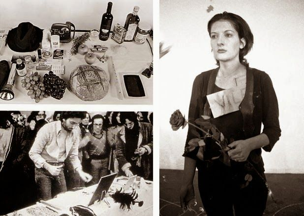
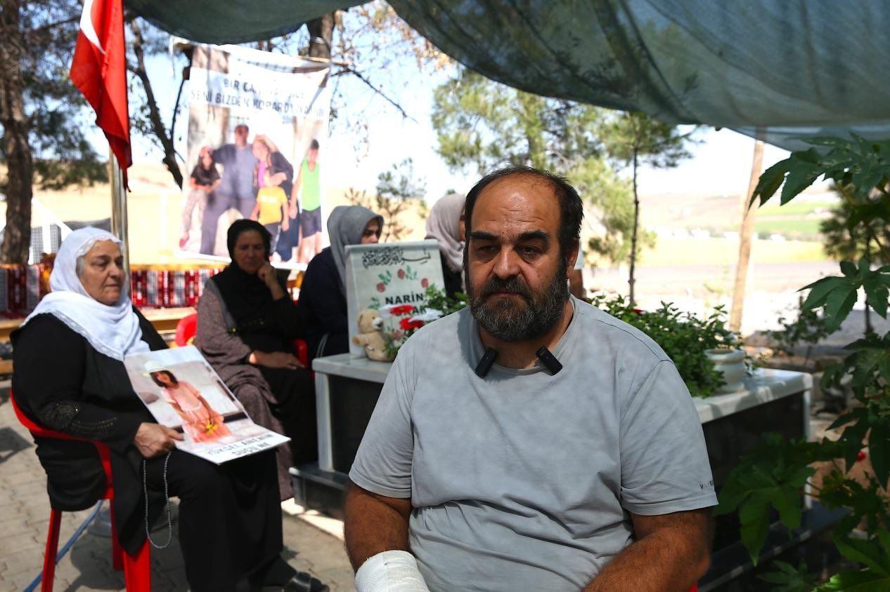
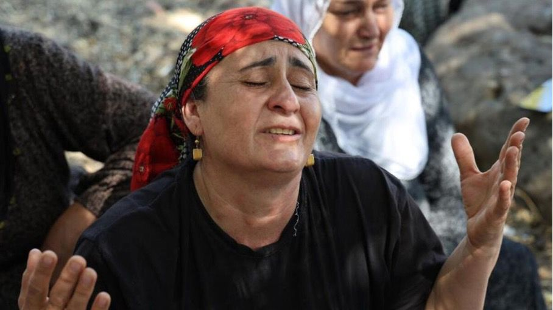

*Narin Güran cinayetinin ardından yaşananlar modern bir taşlama ayininden farksızdı. Hedef yine bir kadındı: Kendi çocuğunun yasını tutarken tüm toplum tarafından linç edilen, onuru ve geçmişi bir hücreye gömülen Yüksel Güran. Bir gazetecinin vicdanından dökülen bu yazı; sessiz kalmış kurumlara, lince ortak olmuş topluma ve adaletin infazına dair bir hakikat çığlığıdır.*

**Hilal Seven – Londra**

{fig-align="center" width="70%"}

"Soraya'yı Taşlamak" filmiyle hafızalarımıza kazınan o korkunç sahneyi hatırlayın: Bir kadın köy meydanında beline kadar toprağa gömülür ve ilk taş atılır. Ardından taşlar yağmaya başlar; küçük, büyük, keskin… Taş atanların çoğu tanıdıktır: komşular, akrabalar, köylüler. Kadın henüz nefes alırken, kalabalığın infaz kararı çoktan verilmiştir.

Narin Güran'ın kaybolduğu 21 Ağustos'tan beri yaşananları izlerken zihnimde hep bu sahne canlandı. Çünkü tanıklık ettiğimiz süreç, modern bir taşlama ayininden farksızdı. Taşların yerini manşetler, televizyon yorumları ve sosyal medya linci aldı; ama hedef yine aynıydı: Bir kadın.

O kadının adı Yüksel Güran'dı. Kendi evladının yasını tutan bir anne, daha ilk günlerde "katil" ilan edildi. Henüz hiçbir delil yokken, gerçeğin kıyısına bile varılmamışken üzerine taşlar yağmaya başladı. Türkiye medyası ve kamuoyu, yaslı bir anneyi toprağa gömüp hedef tahtasına koydu. Her manşet bir taş, her yorum bir darbe oldu. Bugün Yüksel Güran bir hücrede nefes alıyor olabilir; ancak toplum onun hayatını, onurunu ve geçmişini parçalayarak çoktan gömdü. Üstelik bu kolektif infazı gerçekleştirenlerin çoğu, vicdanlarında en ufak bir sızı bile hissetmiyor.

## Modern Bir İnfaz: Rhythm 0 ve Marina Abramović

Bu toplumsal histeriyi anlamak için 1974 yılına, Marina Abramović'in *Rhythm 0* performansına bakmak gerekir. Abramović, bir masanın üzerine gül, bal, jilet ve dolu bir tabanca gibi 72 nesne bırakıp şu notu düşmüştü: "Ben bir nesneyim. Bu süre boyunca bana her şeyi yapabilirsiniz."

Başta güle uzanan, bal süren nazik eller; saatler ilerledikçe yerini vahşete bıraktı. Elbiseleri jiletle kesildi, derisi çizildi, başına tabanca dayandı. Abramović yıllar sonra o anlar için "Ölmeye hazırdım" diyecekti. Narin Güran davasında kalabalığın refleksi tam olarak buydu. Sahnede bir sanatçı değil, gerçek bir aile vardı; ama linç iştahı aynıydı.

{fig-align="center" width="70%" fig-alt="Marina Abramović, Rhythm 0 (1974) performansından bir kesit."}

Daha ilk günlerde anne mahkûm edildi, tüm aile kuşatıldı, mahalle didik didik edildi. İnsanların ağzından çıkan kelimeler, o jiletlerden daha kesiciydi. Neden aklımıza ilk olarak en kötü ihtimal geliyor? Neden anlamak yerine suçlamayı seçiyoruz? Abramović'i altı saatte öldürme noktasına gelen o karanlık dürtü, Güran ailesinin mahremiyetini ve itibarını lime lime etti.

Asıl sorun şu ki; bu kötülük sadece birkaç kişinin eseri değil. Bu linç sayesinde bazıları ödüllendirildi, bazıları terfi aldı, bazıları ise hiçbir şey olmamış gibi hayatına devam ediyor. Biz toplum olarak bu kötülüğün dışında değil, tam merkezindeyiz. Ancak unutulan bir fark var: Abramović'in yaşadığı, sınırları test eden bir sanat performansıydı. Narin'in ardından yaşananlar ise bir performans değil; bir ailenin, bir mahallenin ve bir hayatın üzerine çöken organize, gerçek ve kasıtlı bir kötülüktü.

## Hakikate Çağrı: Teknik Veriler ve Uzman Görüşleri

Sizden sadece 11 dakikanızı ayırmanızı rica ediyorum. Bu kısa animasyon film, Narin Güran cinayetini tüm gerçekliğiyle, hiçbir detayı saklamadan gözlerinizin önüne seriyor:



Şimdi bu kadarı merakınızı cezbetmeye yettiyse asıl belgeseli izlemeniz için bir 35 dakikanızı daha ayırmanızı istiyorum. Mind Vorteks yapımı belgeseli izleyin:



Bu sarsıcı başlangıcın ardından, davanın asıl doğrularını; hukuk, siyaset ve medya süzgecinden geçiren o {kapsamlı yayına}[1] mutlaka vakit ayırın. Bu 2 saat 47 dakika, bir çocuğun anısına ve adalete borcumuzdur.

Bu yayında, davanın seyrini değiştirecek bilimsel {raporlar}[2] sunan adli bilişimci Tuncay Beşikçi, çarpıcı bir tespitte bulunuyor: "Geçmişin büyük manipülasyon mekanizmaları bugün 8 yaşında bir çocuğun ölümü üzerinden devrede. Medya ve bürokrasi eliyle algı yönetilmeye çalışılıyor."

Beşikçi'nin teknik analizleri, davanın en büyük dayanağı olan {daraltılmış baz kaydı}[3] yalanını kökten çürütüyor. İmaj kayıtları ve internet trafiği açıkça gösteriyor ki:

- Salim Güran olay anında kendi evindeydi.
- Enes ve anne Yüksel Güran yine kendi evlerindeydi.
- Altı yaşındaki Eren'in ifadesi de bu teknik verileri doğruluyordu.

{fig-align="center" width="70%" fig-alt="Enes, Narin, Yüksel ve aile."}

Buna rağmen, mahkeme bu somut verileri görmezden gelerek müebbet hapis kararlarına imza attı. Sadece baz kayıtları değil, adli tıp bulguları da karanlıkta bırakıldı. Öte yandan cinayetin işlendiği saat üç kamera görüntüsünde sabit, cinayetin işlendiği süre belli ve failin o kameralardan da anlaşıldığı gibi Nevzat Bahtiyar olduğu kesinken, bu deliller göz ardı edildi.

Çocuk psikiyatrisi uzmanı Prof. Dr. Veysi Çeri ise aynı yayında konuşurken, cesette bulunan PSA (prostat spesifik antijen) testine dikkat çekiyor. 19 gün suda kalmış bir cesette PSA tespit edilmesinin sıradan bir durum olmadığını vurgulayan Çeri, bu bulgunun sistematik bir istismara işaret edebileceğini belirtiyor. Ancak medya ve kamuoyu, bu teknik gerçekleri bir kenara itip tüm okları aileye çevirmeyi tercih etti. Narin için adalet profil fotoğrafıyla, X kullanıcısı Dr. Islamzade'nin {hesabından}[4] paylaşılmış ayrıntılı bilgileri, a'dan z'ye yazılmış bu kapsamlı postu okumanızı rica ediyorum.

Bu yayını baştan sona dinlemenin bir diğer faydası da; Atakan Sönmez, Ali Duran Topuz gibi önemli gazetecilerin davaya ilişkin doğru habercilik analizlerini görmeniz; Diyarbakır Barosu'nun eski başkanlarından Mehmet Emin Aktar, aile avukatlarından Onur Akdağ ve diğer hukukçuların adeta üniversite kürsüsünde ders verircesine yaptıkları değerlendirmelerden haberdar olmanızdır. Yaklaşık beş-altı saatinizi bu yayınlara ayırmanızı istedim; değerli zamanınızı ve önyargısız ilginizi… Peki, sekiz yaşında minicik bir insanın bu dünyadan vahşice koparılışını anlamanız için yarım gününüzü ayırmanız nedir ki? Hepimizin tüylerini diken diken eden o konuşmasıyla Arif Güran'ı bir kez daha dinleseniz çok mu?

## Adaletin İnfazı: Nevzat Bahtiyar ve Güran Ailesi

Narin, bütün fotoğraflarında mutluluğu gözlerinden okunan, sevgi dolu bir ortamda büyüdüğü her halinden belli olan sekiz yaşında bir çocuktu. Ne yazık ki doğduğu coğrafyanın acımasız gerçekliği içinde hayattan koparıldı. Davanın seyrine baktığımızda ise karşımıza rasyonel akılla izahı zor bir tablo çıkıyor: Maddi delillerin ve çelişkili beyanların odağındaki isim Nevzat Bahtiyar, yargılama sürecinde her nedense anlatımları "esas alınan" figür haline getirildi.

{fig-align="center" width="70%"}

Öte yandan, Güran ailesinin on beş üyesi için adalet mekanizması bambaşka bir sertlikle işledi. Sorgu odalarında ağır işkence iddiaları havada uçuşurken, hukukun en temel prensibi olan "şüpheden sanık yararlanır" ilkesi bu aile için adeta askıya alındı. Şimdi durup sormak gerekiyor: İfadelerinde tek bir çelişki olmayan, evlatlarını büyük bir özenle büyüten ve onu katletmek için hiçbir makul motivasyonu bulunmayan bu insanlar, nasıl oldu da bir anda en ağır suçun faili ilan edildiler? Katledilen aile üyelerinin mezarını günler sonra ziyaret ettiklerindeki buluşma anını hatırlayalım.

Bu noktada vicdanları yaralayan asıl soru şudur: Narin'i kaçırıp öldürdükten sonra hiçbir şey olmamış gibi hayatına devam eden, soğukkanlılığıyla dikkat çeken bir isim, nasıl olur da davanın "en az kusurlu" tarafıymış gibi algılanır? Bugün gelinen noktada; Yüksel Güran, Enes ve Salim Güran, sadece özgürlüklerini değil, tüm itibarlarını ve aile bütünlüklerini de kaybettiler. Onlar şimdi dört duvar arasında, hem biricik evlatlarının yasını tutuyor hem de bir cinayetin bedelini tüm topluma karşı ödemeye çalışıyorlar.

## Vicdan Terazisi: Kurumlara ve Topluma Çağrı

Vaktiyle kalemini ve sosyal medya gücünü bu aileyi düşmanlaştırmak için kullananlar için belki de bugün aynaya bakma vaktidir. Hiçbir şey için geç değil. Vicdanınıza sahip çıkmak adına sunulan verileri inceleyin; en ufak bir haksızlığa ortak olduysanız özür dileme erdemini gösterin. Bu aileyi; sadece Kürt oldukları için hedef alan sistematik adaletsizliğe karşı durun.

Bugün dünya; kız çocuklarını istismar eden karanlık ağları, Epstein vakasını tartışıyor. Kralların, başkanların bulaştığı bu iğrenç dünyada adalet arayan Virginia Giuffre'lerin nasıl ölüme sürüklendiğini görüyoruz. Bugün Narin'i hayattan koparan o kör sistem, annesine de benzer bir çaresizliği dayatıyor. Bir kadın, seksen milyonun lincinin altında, haksız yere gözlerimizin önünde eriyor. Çok geç olmadan ses çıkarın.

İktidarı köşeye sıkıştırmak için aileyi fütursuzca haber malzemesi haline getiren muhalif medyadan; çocuğu Kur'an kursuna gitmiş, kadınları başlarını örtmüş, sırf Kürt oldukları için linçlenmesi reva görülmüş, aralarında farklı siyasi görüşlerden aile üyeleri var diye "ötekinin de ötekisi" haline getirilmiş bu aile size ne yaptı? Herkes bir oldu, nefret ettiğine olan isyanını Güranlar üzerinden yaşadı. Devlet mekanizmasını sorgulamaya cesaret etmeyen iktidar kanadı, adalet sistemindeki handikaplara ses çıkaramayan muhalefet, başı kapalı bir insan görünce bile içten içe çıldırdığı halde İslamofobik olduğunu açık etmeye gözü kesmeyen seküler kesim ve "bize oy vermiyor zaten bizden değil" diyerek aileyi baştan mahkûm eden Kürt siyaseti… Hepsi duruşunda sınıfta kaldı.

Geçmişte Alevileri hedef alanlar, Ahmet Kaya'ya çatal fırlatanlar ya da Tahir Elçi'yi ölüme götüren süreci hazırlayanlar bugün nasıl anılıyorsa; vicdan terazisini kendini sanatçı zanneden popülist figürlere emanet edenleri de tarih öyle anacaktır. Bu ülkenin masum ve canı her dönem yanmış mazlum halkı, uğradığı haksızlıkları asla unutmayacak, bu davada insanlığa ihanet edenleri asla rafa kaldırmayacaktır. Evinin sıvasını dahi yaptıramamış bir amcayı "medyayı satın alacak kadar zengin" olmakla suçlayan o güruh, dev bir vebal altındadır.

{fig-align="center" width="70%" fig-alt="Tavşantepe (Çulli)"}

Güran ailesinin çocukları neden inşaatlarda çalışıyor, hele bir düşünün. Aile avukatlarının ücretlerini bile ödeyemiyor, evine iki lokma götürmekte zorlanıyorken; siz nasıl olur da bu insanları güçlü, toprak sahibi ve cezadan muaf olacak kadar para sahibi olarak karalarsınız? Tarih, ister yazılı ister sözlü, bu kötülükleri daima aydınlatır. Yarınlar bugünlere daima ışık tutar; gerçeğin sesi bugün cılız olabilir ama yarın vicdanları gürül gürül inletir.

## Gazetecilik ve Vicdan: Hakikate Tanıklık

Bir kadın gazeteci olarak bu süreçte tek bir pusulam vardı: Kültürümüzün bize öğrettiği mazlumun yanında durma ilkesi. Popülerlik hırsına yenik düşenlerin aksine, bu davanın bir onur meselesi olduğunu görmek zorundayız. Sözüm kendi mahalleme; sosyalist ve hümanist mücadelenin onurlu taşıyıcılarınadır:

- **Sevgili Cumartesi Anneleri:** Yüksel Güran, evladının cenazesine dahi katılamamış bir annedir. Ona elinizi uzatmanız gerekmez mi?
- **Sevgili İnsan Hakları Derneği:** Aile üyeleri ağır işkence görürken, Yüksel Güran bilmediği bir dilde ifadeye zorlanırken neden sustunuz?
- **Sevgili Kadın Hareketleri:** Yüksel Güran'ın "kadın" kimliğini ve maruz kaldığı linci neden görmezden geldiniz?

Hatırlatmak isterim; DEM Parti Milletvekili Ömer Faruk Gergerlioğlu'na konuşan baba Arif Güran, mahkeme kararından sonra {şöyle dedi}[5]: "Mahkemede ailemi diri diri gömdüler. Her şey tek taraflı değerlendirildi."

{fig-align="center" width="70%"}

Dahası, seküler ve dindar kesimler adeta birleşti; Tavşantepelileri ayinlerle çocuk öldüren "insanüstü" varlıklar olarak tanımladılar. Bazı bölge muhabirleri, mesleki başarısızlıklarını bu davadan rant elde ederek aşmaya çalıştı; koca bir sülaleyi kendi çıkarları için araç haline getirdiler.

Kürdistan'da hak ihlalleriyle mücadele eden Diyarbakır Barosu bile, aile üyelerinden on beşinin ağır işkence altında kaldığını görmezden geldi. Birinin kulak zarı patlamış, diğerinin bedeninde işkence izleri mevcutken Baro Başkanı'nın tavrı, insanlığa dair umudumuzu yerle bir etti. En acısı da şuydu: Bir kadın, anadilinde yaşadığı o derin kahroluşu, ocağına incir ağacı diken "erkek devletin" dilinde ifade vermeye zorlandı. Bu, düpedüz anadilde işkencedir. Kadın hakları savunucuları ise bu zulüm karşısında sus pus oturdu.

## Karanlıkta Bir Mum Işığı

Bu ülke; Madımak'ta 35 insanın yakılmasını, Hrant Dink'in, Ceylan'ın, Cemile'nin katillerinin cezasız kalışını izledi. Şimdi aynı yargı sistemi, Narin'in katilinin ailesi olduğuna karar verdi. Bir medya şovmeni terfi alsın, kanallar reytinge doysun, birileri ün kazansın diye koca bir hakikat kurban edildi. Ancak hayat tamamen karanlık değil. 21 Ağustos'tan beri işini gücünü bırakıp belgeleri ve dava notlarını titizlikle takip ederek Güran ailesinin suçsuzluğunu duyurmaya çalışan, sayısı yüzleri bulan vicdanlı bir grup var.

Öte yandan iyi gazeteciler hâlâ var. Faruk Bildirici'nin 14 Ağustos 2025 tarihli {yazısındaki}[6] tespitlerini henüz okumadıysanız lütfen şimdi okuyun. Ardından, Ali Duran Topuz'un İlke TV haber sitesinde {yayınlanan}[7] ve bu davada yazılmayan ne kadar önemli bilgi varsa araştırmasında yer verdiği "Kuzuların Sessizliği" adlı yazı dizisini lütfen dikkatle okuyun.

Bunlara ilaveten, DEM Parti Diyarbakır Milletvekili Sevilay Çelenk'in "Narin'e hakikat borcumuz var" sözüyle başladığı, araştırmacı gazetecilik dersi niteliğinde kaleme aldığı {yazı dizisini}[8] en baştan sona en az bir defa okuyun. Bakın göreceksiniz; gerçek aslında apaçık ortada. Milyonları kandıran medya linççilerinin çabası şurada dursun, bu davaya emek vermiş nice vicdanlı insanın araştırmalarına bakın. Ve son olarak, üç buçuk dakikanızı Narin'in anneannesinin sözlerine kulak vermeye ayırın:



*The National News imzalı bu videoda konuşan; torunu toprağın altında, kızı cezaevinde bir hücreye hapsedilmiş Remziye annenin acısını duyun.*

{fig-align="center" width="70%"}

## Gelecek İçin Bir Adalet Ödevi

Sevgili seksen milyonluk, vicdan karinesi çamura batmış ülkemin insanları: İsterseniz bunları izlemeyin ve okumayın, ilk günden itibaren olduğu gibi birilerini haksız yere suçlamaya devam edin; ancak bilin ki; Berze, Ferhat, Leyla, Remziye, Rana, Melek, bugün aramızda olmayan Nuri Karakaş ve adını sayamadığım onlarca kalbi güzel insan, sizin utancınızı sırtlanıyor. Narin için adalet mücadelesini gece gündüz demeden veriyor. Bu güzel insanlara iki kelime sözü kendime borç biliyorum: İyi ki varsınız. Dünya, sizin gibi insanların yüzü suyu hürmetine dönüyor. Bu topraklarda vicdanın sesi sayenizde duyuluyor.

Hesap verebilir olmak, hatadan dönmek ve özür dileyebilmek… Popülerlik hırsının ötesine geçip "insan" kalabilmek… İşte asıl sınavımız budur. Tavşantepe mahallelilerinden özür dileyelim. Enes'in çalınan gençliğine, Salim Güran'a reva görülen bu insanlık ayıbına "dur" diyelim. Bir an için kendinizi Yüksel Güran'ın yerine koyun; bilinmeyen bir dilde, hayal dahi edilemez bir acıyı tarif etmeye çalıştığınızı hissedin.

{fig-align="center" width="70%"}

**Hepinizin vicdanına sesleniyorum: Narin'i gerçekten kim öldürdü?**

Bu davada; lince katkı sunan herkes Narin'in anısına leke sürmüştür. Toplumsal çürümüşlük etle kemiğe bürünmüştür. Bir aileyi sırf Kürt ve yoksul olduğu için mahkûm etmek çok kolaydı. Bu dava Kürt sorununun başka bir tonudur. Bombaların altında haberlerin yapıldığı, her türlü baskı ve şiddete rağmen hak temelli haberciliğin yapıldığı bu topraklarda, Narin için adalet mücadelesi veren Urfalı bir kadının sözleriyle: "Diyarbakır gibi kadim bir kent bunu yapmamalıydı." Öyle ki bölgede görev yapan bazı gazeteciler, *Nightcrawler* filmindeki o karanlık karakterden bile daha acımasız davrandılar. Kolluğundan yargısına, medyasından sözde hak savunucularına kadar erkek egemen bir düzen, bir kız çocuğunun ölümü üzerinden kendi kurgusunu inşa etti.

Başta Yüksel Güran olmak üzere, Güran ailesindeki bütün kadınların; özgür ve onurlu bir dünya için hak mücadelesi veren cezaevindeki tüm kadın dostlarımızın… Ve inadına insan kalmanızda emeği geçen tüm annelerin…

**Dünya Emekçi Kadınlar Gününüz kutlu olsun.**

::: external-refs
1. Narin Güran Dosyası / Hukuk, Siyaset, Medya: Nerede Durduk? (X Space yayını) | https://x.com/i/spaces/1YpJkkZDOQMJj/peek?s=20
2. Tuncay Beşikçi: ChatGPT'den Daraltılmış-Baz Raporları ve Uzman Mütalaasının Analizi | /blog/posts/tuncay-besikci/chatgpt-darbaz-raporlarinin-analizi/
3. Tuncay Beşikçi: "Daraltılmış baz kaydı" analizi (X paylaşımı) | https://x.com/tuncaybesikci/status/1905629947378483395
4. Dr. Islamzade: Narin için adalet – kapsamlı post (X paylaşımı) | https://x.com/islamzade24/status/2017275235926520133?s=46&t=pcIwnIlfHwdnQBKeErX0wA
5. Gergerlioğlu: Narin Güran ve Ailesi İçin Adalet Sağlanmalı | https://www.omerfarukgergerlioglu.com/basin/gergerlioglu-narin-guran-ve-ailesi-icin-adalet-saglanmali/37522/
6. Faruk Bildirici: Narin Güran cinayeti için neler yazıldı, neler söylendi? (14 Ağustos 2025) | https://www.farukbildirici.com/2025/08/14/narin-guran-cinayeti-icin-neler-yazildi-neler-soylendi/
7. Ali Duran Topuz: Narin Güran Vakası 1 – Kuzuların Sessizliği (İlke TV) | https://ilketv.com.tr/narin-guran-vakasi-1-kuzularin-sessizligi-kurtlarin-gurultusu/
8. Sevilay Çelenk: Narin'e hakikat borcumuz var (bianet yazı dizisi) | https://bianet.org/yazi/narin-e-hakikat-borcumuz-var-olaylar-nasil-guran-ailesinin-aleyhine-dondu-304164
:::
