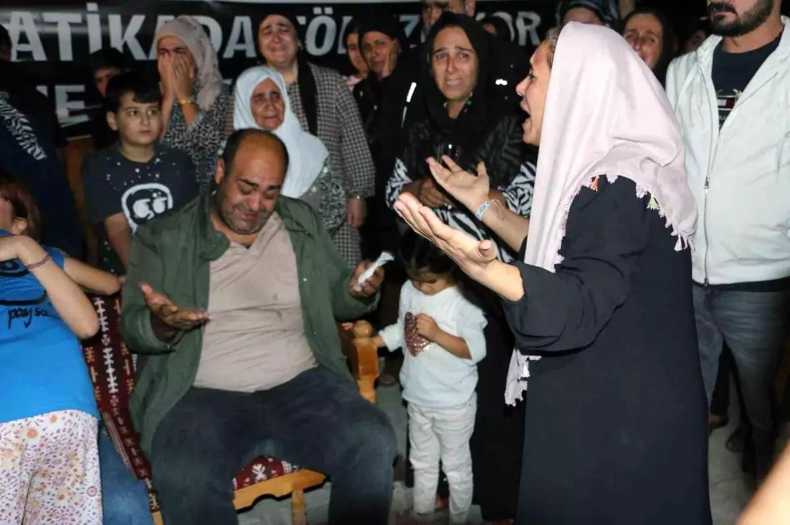

{fig-align="center" width="70%" fig-alt="Güran ailesinin koleksiyonundan, yazarla paylaşılmıştır."}

Alabama'nın Maycomb kasabasının bunaltıcı sıcağında Tom Robinson, delillere göre değil, "önyargının sıradanlığı"yla — korkmuş bir toplumun suçluya benzeyen birine duyduğu kolektif ihtiyaçla — mahkûm edilmişti. On yıllar sonra, benzer bir trajedi Diyarbakır'da yaşandı.

Ağustos 2024'te 8 yaşındaki Narin Güran bir Kuran kursundan kayboldu. 19 gün sonra cesedi bir dere yatağında taşların altına gizlenmiş halde bulundu. Ülke yas tutarken, odak noktası avcıdan daha kolay bir hedefe kaydı: annesi Yüksel Güran. O, modern Tom Robinson oldu; sansasyonel bir medyanın ve ilk otopsiden önce suçluluğuna karar veren bir yargının sunağında kurban edildi.

## Gülün Bittiği ve Jiletin Başladığı Yer

> Acil cevaplardan yoksun kalan medya, halka "jiletler" uzattı. Birkaç gün içinde Yüksel Güran artık yaslı bir anne değil, televizyon ekranlarındaki dramanın "soğukkanlı suç ortağı"ydı.

Marina Abramovic'in 1974 tarihli *Rhythm 0* performansı ürpertici bir gerçeği gözler önüne sermişti: bir insan insanlığından soyutlandığında, kalabalık gül yerine jileti seçer. Abramovic hareketsiz durmuş, zevk ya da acı için nesneler sunmuşken, halk şiddete doğru balıklama dalmıştı.

Güran ailesi Abramovic'in çalışmasındaki gerçeği bizzat yaşadı. Acil cevaplardan yoksun kalan medya, halka "jiletler" uzattı. Birkaç gün içinde Yüksel Güran artık yaslı bir anne değil, televizyon ekranlarındaki dramanın "soğukkanlı suç ortağı"ydı. Bu, mikrofonlarla gerçekleştirilen modern bir taşlama ayiniydi; bir yas evini hayal gücünün suç mahalline çevirmişti.

{fig-align="center" width="70%" fig-alt="Güran ailesinin koleksiyonundan, yazarla paylaşılmıştır."}

## Fizik Savcılığı Çürüttüğünde

İddianamenin anlatısı, sonunda ailenin avukatı Onur Akdağ ve adli bilişim uzmanı Tuncay Beşikçi'nin inşa ettiği duvara çarptı.

Beşikçi'nin {raporları}[1] bir ilan ve kapsamlı bir eleştiriydi: "Algı, medya ve bürokrasi eliyle yönetilmeye çalışılıyor." Metre metre doğruluk iddiasındaki "daraltılmış baz istasyonu analizi" (*daraltılmış baz*) tekniğini söküp attı — Beşikçi'nin uluslararası adli bilişim literatüründe hiçbir karşılığı olmadığını kanıtladığı bir teknik.

Akdağ ve Beşikçi'nin bulguları çürütülemez:

**Adımsayar gerçeği:** İddia edilen cinayet sırasında Salim Güran'ın — Narin'in amcasının — telefonu sıfır aktivite kaydetmişti. Adımsayarı yalnızca 45 adım gösteriyordu ve cihaz hızlı şarj kablosuna bağlıydı.

**Dijital ayak izleri:** 15:28'de — iddia edilen gizleme anında — Salim mobil bankacılıkla fatura ödüyor ve haber okuyordu.

> Güranlar cihazlarından hiçbir içerik silmezken, devletin "yıldız tanığı" Nevzat Bahtiyar birden fazla profesyonel veri silme işlemi gerçekleştirmişti.

Onur Akdağ kritik bir kurumsal başarısızlığa {dikkat çekti}[2]: 15:08'den bir ses kaydı — Salim'in çocuklarıyla evde olduğunu kanıtlayan — telefon jandarmaya teslim edildikten 24 saat sonra gizemli bir şekilde silinmişti.

Güranlar cihazlarından hiçbir içerik silmezken, devletin "yıldız tanığı" Nevzat Bahtiyar — cesedi sakladığını itiraf eden — birden fazla profesyonel veri silme işlemi gerçekleştirmişti. Beşikçi'nin analizi, Nevzat Bahtiyar'ın telefonunun cinayet sırasında "ölü" olduğunu ortaya koydu; bu, uzmanlaşmış adli görüntülemeyle doğrulanan bir pusu olduğunu düşündürüyordu.

Dahası, Prof. Dr. Veysi Çeri kurbanın bedeninde PSA (Prostat Spesifik Antijen) varlığını ortaya koydu — tek failin gerçekleştirdiği bir cinsel saldırının biyolojik kanıtı. Bu "kesin delil" bireysel bir avcıya işaret ediyordu, ancak "aile komplosunu" sürdürmek için kenara itildi.

Diyarbakır mahkeme salonu Hannah Arendt'in *Kötülüğün Sıradanlığı*'nı yankılıyordu. Cesedi sakladığını kabul eden komşu Nevzat Bahtiyar, medya tarafından "gariban" olarak etiketlendi. Bu, soğukkanlı bir suç ortağının mahkemeyi manipüle etmesine olanak tanırken Güran ailesi şeytanlaştırıldı. Adli veriler, Bahtiyar'ın pusu zamanlamasıyla varlığı eşleşen tek kişi olduğunu gösteriyor.

## Yasak Bir Dilde Yas

Anadili Kürtçe olan Yüksel Güran, yoğun psikolojik baskı altında hayatını Türkçe savunmaya zorlandı; bu, Alejandro G. Iñárritu'nun *Babel*'ini andırıyordu: bir anne, ninniler söylediği dil olmayan bir dilde acısını haykırıyor ve adalet acımasız bir çeviriye dönüşüyor. Onun ilkel *feryadı* devlet tarafından salt gürültü olarak değerlendirildi.

Güran davası bir Kürt trajedisidir. Kutuplaşmış bir ortamda aile, dilsel olarak Kürt kalıp ideolojik olarak devletle uyumlu kalma günahını işledi. Sonuç olarak sessizlikle cezalandırıldılar.

Teknik jargonun ortasında Remziye duruyor — Yüksel'in 80 yaşındaki annesi. Erzincan Cezaevi'nin uzak hücrelerine yaptığı yolculuk, Yılmaz Güney'in *Yol*'unu çağrıştırıyor. Devletin ağırlığı ile boğucu gelenekler arasında sıkışmış, tek silahı seccadesi. Kürt Kadın Hareketi'nin bu anneye destek vermeyi reddetmesi, modern ahlakın en büyük iddianamesidir.

{fig-align="center" width="70%" fig-alt="Güran ailesinin koleksiyonundan, yazarla paylaşılmıştır."}

Dünya Kadınlar Günü'nde Yüksel'in adı görünmez bir lekeydi. İnsan hakları örgütleri onu terk etti çünkü siyasi bir aktivist değildi. İdeoloji delillerin yerini aldığında, adalet ilk kurban olur.

## Vicdanın Sessizliği

En tehlikeli silah mikrofondu. İlk arama sırasında bir "medya darağacı" inşa edildi. Muhabirler, asılsız iddiaları gerçekmiş gibi yayınlayarak modern bir cadı avı üzerinden reyting peşinde koştu. Bu önceden paketlenmiş suçluluk yargı üzerinde baskı kurdu; aileyi şimdi beraat ettirmek, 19 günlük bir yalanı kabul etmek demek olurdu. Medya haberi sadece aktarmadı; bir müebbet hapis cezasının mimarları oldu.

> Bu temelde bir Kürt sorunudur — anadili bastırılan ve kimliği içi boşaltılan bir halkın trajedisi.

Bu bir hukuki başarısızlıktan fazlasıdır; köklü bir toplumsal hastalıktır — düşman üreten bir asırlık katı, faşist eğitim sisteminin yan ürünü. Gerçek demokrasiden yoksun bırakılmış bilinçsiz bir halkın, masumları kurban ederek bir katili aklama çabasıdır.

{fig-align="center" width="70%" fig-alt="Göstericiler, 8 Eylül 2024'te İstanbul'un Kadıköy ilçesinde düzenlenen bir protestoda 8 yaşındaki Narin Güran'ın portrelerini taşıyor. (Fotoğraf: Ozan KOSE / AFP)"}

Bu temelde bir Kürt sorunudur — anadili bastırılan ve kimliği içi boşaltılan bir halkın trajedisi. Devlet tarafından kırılmış, kardeş kavgasında birbirine düşürülmüş zihinlerin hikâyesidir. "Yoksul öteki"nin krizidir. Devlet kurumlarının savunmasızları terk ettiği, demokrasi savunucusu geçinenlerin halkla ilişkiler uğruna kötülüğe bulaştığı bir insanlık felaketidir. Bu dünyada "viral bir an", bir annenin hayatının kutsallığından daha ağır basıyor.

*Bülbülü Öldürmek*'te Maycomb "normale" döner, Tom Robinson'ı toz içinde bırakarak. Türkiye'de haber döngüsü çoktan yoluna devam etti, ama Yüksel parmaklıkların ardında ve gerçek katil gölgelerde kalmaya devam ediyor. Beşikçi gibi uzmanların ve Akdağ gibi savunucuların sunduğu adli gerçeği görmezden geldiğimizde, Adaletin kendisini infaz etmiş oluyoruz.

Bizi bağışla, Yüksel. Tarih, şarkısı yarım kalan Narin'i hatırlayacak. Kadınlığından vurulan Yüksel'i hatırlayacak. Ve taşların altına gömülmüş olsa da ölmeyi reddeden hakikati hatırlayacak.

*"Bülbüller bizim keyifle dinlememiz için müzik yapmaktan başka hiçbir şey yapmazlar… İşte bu yüzden bülbülü öldürmek günahtır."*

*– Atticus Finch*

::: external-refs
1. Tuncay Beşikçi: ChatGPT'den Daraltılmış-Baz Raporları ve Uzman Mütalaasının Analizi | /blog/posts/tuncay-besikci/chatgpt-darbaz-raporlarinin-analizi/
2. Onur Akdağ: Kritik kurumsal başarısızlık – silinen ses kaydı (X paylaşımı) | https://x.com/avonurakk/status/2003808836084257147
:::
