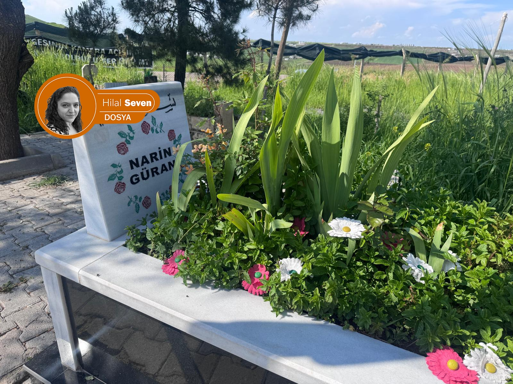
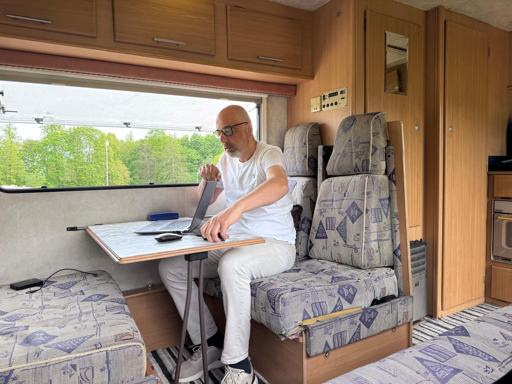
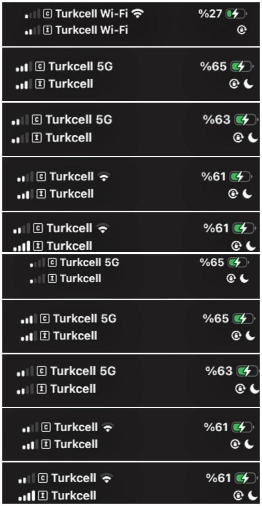
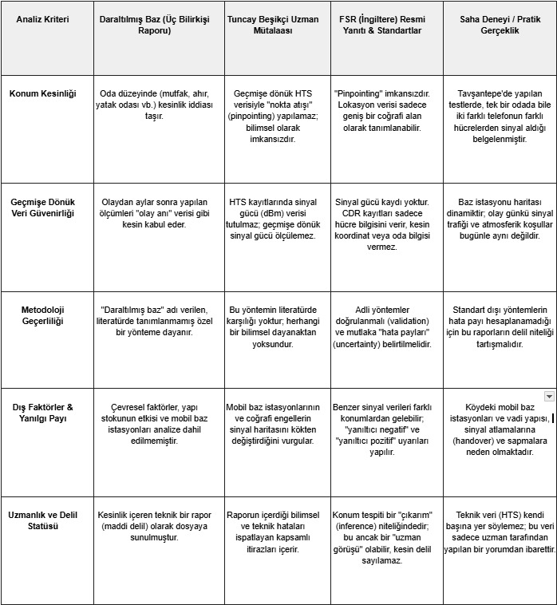

{fig-align="center" width="80%"}

*Hilal Seven / Londra*

Diyarbakır'ın Tavşantepe köyünde 21 Ağustos 2024'te kaybolan ve 19 gün sonra cansız bedeni evine yakın Eğertutmaz dere yatağında bulunan sekiz yaşındaki Narin Güran'a ilişkin dosya, kapanmış bir soruşturma olmaktan çok uzak. Hem delil tartışmaları hem de teknik analizlerdeki çelişkiler nedeniyle dosya, yeniden açılması tartışılan nadir adli dosyalardan biri haline gelmiş durumda.

Son aylarda dosya yalnızca mahkeme dosyaları içinde değil, devletin ilgili kurumlarında da yeniden teknik değerlendirme başlıklarıyla gündeme geliyor. Adalet Bakanlığı bünyesinde yürütülen bazı incelemelerde, mevcut dosya üzerinden karar verilebilmesi için yeterli teknik açıklık bulunup bulunmadığı tartışılırken, "sahada yeniden inceleme" anlamına gelen keşif ihtimali de masaya geldi.

Diyarbakır 8. Ağır Ceza Mahkemesi'nin verdiği mahkûmiyet kararlarının Aralık 2025'te Yargıtay tarafından onanmasıyla olağan yargı yolu tükenmiş olsa da, dosya şu an Anayasa Mahkemesi (AYM) başvuru sürecinin kritik eşiğinde bulunuyor.

Bütün bunların ele alınacağı bu haber dosyası, yalnızca resmi açıklamalara dayanan bir metin değil.

Süreç boyunca Ankara'da Adalet Bakanlığı yetkilileriyle yapılan görüşmeler, Türkiye'de ve Avrupa'da (İngiltere, Almanya ve Belçika) adli bilişim, adli tıp ve hukuk alanlarında çalışan uzmanlarla gerçekleştirilen yüz yüze ve yazılı görüşmeler ile uluslararası düzenleyici kurumlara yönelik resmi yazışmalar temel alınarak hazırlandı.

Çalışma kapsamında 100'ün üzerinde görüşme yapıldı; adli bilişim uzmanlarından adli tıpçılara, hukukçulardan insan hakları savunucularına, akademisyenlerden gazetecilere kadar farklı disiplinlerden isimlerin değerlendirmelerine başvuruldu. Dosyanın hem teknik hem hukuki hem de toplumsal boyutunu anlamak için çok katmanlı bir analiz süreci yürütüldü.

Saha çalışmasının son aşaması Diyarbakır'ın Tavşantepe köyünde gerçekleştirildi, olayın gerçekleştiği coğrafyada yapılan gözlemler ve yerinde incelemelerle teknik veriler sahadaki gerçeklik ile birlikte değerlendirildi.

Yaklaşık beş ay süren bu araştırma, dosyadaki mevcut iddialardan ziyade delil üretim süreçlerini, teknik yöntemlerin sınırlarını ve yargılamaya yansıyan yorum farklarını da kapsıyor.

Dosyanın ilk bölümü olan bu bölümde HTS verilerinin ve biyolojik bulguların bilimsel sınırlarını tartıştık; ancak tüm bu teknik tartışmaların başladığı bir 'sıfır noktası' var: 21 Ağustos 2024, saat 15:11, Narin'in son kez kameralarda göründüğü an. Tavşantepe köyünde hayatın olağan akışının kesildiği o andan, cansız bedeninin bulunduğu 8 Eylül sabahına kadar geçen 19 gün; sadece bir arama faaliyeti değil, aynı zamanda çelişkili ifadelerin, yanlış ihbarların, Narin'i bulmayı gittikçe zorlaştıran çalışmaların gölgesinde, bugün dahi çözülemeyen o büyük sorunun düğümlendiği yerdi: Narin 15:11'den sonra nasıl kayboldu?

## Soruşturmanın gölgesinde büyüyen toplumsal dalga

Narin Güran'ın kaybolmasının ardından oluşan toplumsal tepki, kısa sürede sosyal medyada yoğun bir bilgi akışına dönüştü. Ancak bu akış, zamanla doğrulanmış bilgi üretiminden uzaklaşarak erken kanaatlerin hakim olduğu bir yapıya evrildi.

Görüştüğüm gazeteciler, bu dönemde hem sosyal medyada hem de ana akım medyada ciddi bir hız baskısı oluştuğunu, bunun da bilgi doğrulama süreçlerini zayıflattığını ifade ediyor. Soruşturmanın gizliliği devam ederken yapılan yorumlar, aile bireylerine yönelik suçlayıcı içeriklerle birlikte dosyanın erken bir "toplumsal yargı" sürecine sürüklendiğini gösteriyor.

## Hücresel verilerin bilimsel sınırı: Bilirkişi raporu ve teknik çelişkiler

Diyarbakır Cumhuriyet Başsavcılığı'nın talimatıyla hazırlanan ve üç kişilik uzman heyeti tarafından imzalanan "Dar Alan Baz" raporu, davanın mahkûmiyet hükmünde tayin edici bir rol oynuyor. Kamu güvenliği birimlerinde görevli teknik personelden oluşan heyet, HTS (Haberleşme Trafik Sistemi) verilerini mikroskobik bir ölçekte analiz ederek; şüphelilerin olay anındaki konumlarını metre hassasiyetiyle tanımlamış; konut içerisindeki "mutfak" veya "boş oda" gibi spesifik bölümlere dair yer tespiti verileri sunmuştu.

Ancak hazırlanan bu rapor, adli bilişim literatüründe yer alan temel bir teknik ayrışmayı gündeme getirdi. Buna karşın, uluslararası adli bilişim literatürü ve teknik düzenleyici kurumlar, hücresel verilerin doğasındaki fiziksel kısıtlamalara dikkat çekiyor. Bu standartlara göre; baz istasyonu kayıtları (CDR), bir cihazın koordinatlarını saptamaktan ziyade, sadece o cihazın hangi kapsama alanından hizmet aldığını gösteren birer olasılık verisi. Dolayısıyla konum tespiti, teknik bir 'ölçüm' sonucu değil; uzman tarafından yapılan ve mutlaka hata payları ile birlikte sunulması gereken bir 'çıkarım' (inference) olarak tanımlanıyor. Bu bilimsel eşik, HTS analizlerinin mutlak birer kanıt değil, metodolojik sınırlılıkları olan birer uzman mütalaası olarak değerlendirilmesi gerektiğini hatırlatıyor. Sahada, aynı cihaz üzerinde farklı aboneliklerle (sim kart) gerçekleştirilen teknik ölçümlerin değişkenlik göstermesi; sinyal verilerinin çevresel faktörler, baz istasyonu yükü ve coğrafi engellerden bağımsız düşünülemeyeceğini kanıtlıyor. Sonuç olarak, HTS kayıtlarının mutlak bir konum kanıtı mı yoksa sınırlı bir olasılık çıkarımı mı olduğu sorusu, davanın bilimsel ve hukuki açıdan en temel tartışma eksenini oluşturuyor.

## Baz istasyonu verileri kesin delil olabilir mi?: HTS, daraltılmış baz ve adli bilim standartları

Adli bilişim uzmanı Tuncay Beşikçi, yaptığımız yüz yüze görüşmede, HTS verilerinin doğası gereği bir konum tespiti sağlamadığını, yalnızca cihazın hangi baz istasyonu kapsama alanı içinde olabileceğine dair sınırlı bir bilgi sunduğunu ifade etti. Beşikçi'ye göre bu veriler, geniş alan bazlı kapsama bilgisinden ibaret olup oda bazında kesin konum tespitine teknik olarak imkân vermiyor.

{fig-align="center" width="70%"}

Sinyal yoğunluğu, baz istasyonlarının kapsama alanı ve çevresel değişkenler gibi unsurların verinin yorumlanmasını doğrudan etkilediğini belirten Beşikçi, özellikle operatör kayıtlarında çoğu zaman sinyal gücü (dBm) bilgisinin yer almamasının, geriye dönük analizlerin kesinlik düzeyini daha da tartışmalı hale getirdiğini vurguluyor.

Beşikçi ayrıca, "daraltılmış baz" olarak adlandırılan yaklaşımın teknik bir standart olmadığını, bunun geçmiş HTS verilerinin sonradan yorumlanmasına dayalı bir analiz yöntemi olarak değerlendirilebileceğini ifade ediyor.

Bu teknik tartışma yalnızca yöntem farklılığıyla sınırlı değil; aynı zamanda kullanılan yaklaşımın uluslararası adli bilim standartlarıyla uyumu meselesine de uzanıyor. Bu kapsamda, İngiltere merkezli Forensic Science Regulator (FSR) ile yapılan resmi yazışmalarda cell site analizine ilişkin düzenleyici çerçeveye dair açıklamalar gündeme geldi.

{fig-align="center" width="70%"}

FSR'nin Ekim 2023 tarihli Code of Practice metninde, cell site analizinin sınırları açık biçimde tanımlanıyor. Metne göre:

> "Pinpointing the phone to a specific location is almost always impossible." (Bir telefonun yerini tam olarak tespit etmek neredeyse her zaman imkansızdır.)

Aynı düzenlemede konum çıkarımı "inference", yani uzman yorumu olarak tanımlanıyor ve bu yorumun mutlaka yöntem sınırları, hata payları ve belirsizliklerle birlikte sunulması gerektiği belirtiliyor. Ayrıca kullanılan yöntemin hata oranları ve sınırlılıklarının karşı tarafa açıkça bildirilmesi zorunlu tutuluyor.

Kodun 99.11.5 maddesi ise teknik sınırlara özellikle dikkat çekiyor:

> "Large rural macro cells may provide service over 10–20 km, thus offering much lower precision." (Kırsal bölgelerdeki büyük makro hücreler (baz istasyonları), 10–20 km'lik bir alanda hizmet verebildiği için çok daha düşük bir hassasiyet sunar.)

Bu çerçeve, Türkiye'de dosyada kullanılan "daraltılmış baz" yönteminin uluslararası literatürde birebir standart bir karşılığının bulunmadığı yönündeki tartışmaları güçlendiriyor.

Bu noktada ISO 17025 akreditasyon standardı devreye giriyor. Bu standart, adli laboratuvarlarda kullanılan ölçüm ve analiz yöntemlerinin doğrulanabilir olmasını, ölçüm belirsizliğinin (uncertainty) açıkça raporlanmasını ve sonuçların tekrarlanabilir olmasını zorunlu kılıyor.

Bu çerçevede yapılan değerlendirmelerde, "daraltılmış baz" analizlerinin ölçüm belirsizliği açıkça tanımlanmadan sunulması halinde, ortaya çıkan sonucun mutlak bir konum tespiti değil, yorumlanmış bir veri seti niteliği taşıdığı ifade ediliyor.

Dolayısıyla hem Beşikçi ile yapılan teknik görüşmeler hem de FSR ile gerçekleştirilen resmi yazışmalar aynı noktada birleşiyor: HTS verisi doğrudan konum değil, sınırlı bir olasılık alanı üretebiliyor.

Bu durumda Türkiye açısından kritik soru şuna dönüşüyor: Bilimsel olarak belirsizlik içeren bir veri seti, ceza hukukunda "kesin kanaat" üretmek için ne kadar yeterlidir?

## Teori ve gerçek: Saha ölçümlerindeki dinamik sapmalar

Teorik tartışmaların ötesinde, Tavşantepe'de gerçekleştirdiğimiz saha testleri teknik çelişkiyi çıplak gözle görmemizi sağladı. Aynı cihaz üzerinden Salim Güran, Arif Güran ve Nevzat Bahtiyar'ın evleri ile çevresindeki kritik noktalarda iki ayrı Turkcell hattıyla yaptığımız eş zamanlı sinyal ölçümleri, verilerin dramatik bir şekilde değişken olduğunu ortaya koydu. Sabit bir noktada durulmasına rağmen sinyallerin sürekli farklı hücrelere atladığı ve her ölçümde farklı bir kapsama alanı verisi ürettiği belgelendi. Bu durum, 'oda bazında' yapıldığı iddia edilen konum tespitlerinin, sahadaki dinamik sinyal davranışları ve coğrafi sapmalar nedeniyle bilimsel bir kesinlik taşıyamayacağını somut birer veri olarak önümüze koydu.

{fig-align="center" width="50%"}

{fig-align="center" width="80%"}

## The Forensic Institute Kurucusu Prof. Allan Jamieson: "Zayıf delillerle kurulan bir süreç"

İngiltere'de Diana davasındaki rolüyle bilinen dünyaca ünlü adli tıp uzmanı ve The Forensic Institute Kurucusu Prof. Allan Jamieson, Narin Güran davasında gündeme gelen biyolojik bulgular ve teknik değerlendirmelere ilişkin yaptığı açıklamalarda, dosyada yer alan delillerin bilimsel güvenilirliği konusunda ciddi soru işaretleri bulunduğunu ifade etti.

Jamieson, özellikle PSA (Prostat Spesifik Antijen) bulgusuna ilişkin değerlendirmesinde, bu tür bir belirtecin tek başına güçlü bir adli delil olarak yorumlanamayacağını belirterek şu ifadeleri kullandı:

> "PSA kadınlar tarafından da üretilir ancak çok az miktardadır ve bulunduğu konumlar genellikle Narin'in bedeninde bulunan yerler değildir. Dolayısıyla bu anlamsızdır. Muhtemelen kanda olmasını beklerdim ancak vücudun üzerinde olmazdı ve tespit edilemez miktarda olurdu."

{fig-align="center" width="70%"}

Dosyada PSA bulgularının "vajen, külot dış kısmı, etek ve yazma" gibi farklı bölgelerde rapor edildiğinin hatırlatılması üzerine Jamieson, kullanılan laboratuvar yöntemlerine ve test seçimlerine ilişkin metodolojik sorular yöneltti:

> "Bu nasıl tanımlandı? PSA için hangi testi kullandılar? Neden başka bir leke belirteci yerine PSA'yı kullandılar?"

Türkiye'deki adli altyapıya ilişkin geçmiş gözlemlerine de değinen Jamieson, 2013 yılında Türkiye'de bulunduğunu belirterek bazı laboratuvar süreçlerine ilişkin eleştirilerini şu sözlerle dile getirdi:

> "2013'te Ankara'daydım, Türkiye'de beş farklı yere gittim. Çölün ortasında bir şeyler inşa ediyorlardı, camlar açıktı; bir laboratuvarda bunu yapamazsınız. Yani temel olarak, bu insanlar uzman değil. Başlangıç olarak buna inanmıyorum. Çünkü işe daha yeni başlamışlardı."

Jamieson, davadaki delil yapısını "zayıf" olarak nitelendirirken, savunma veya adli değerlendirme açısından izlenmesi gereken metodolojik yaklaşımı da şu şekilde tanımladı:

> "Muhtemelen hapse girecek çok sayıda insan var ama ortada çok kötü (zayıf) deliller var. Bu yüzden işe 'uzman' ile başlardım: Uzmanlıkları nedir, nerede eğitim aldılar? Bir sonraki aşama ise her zaman şu soruyu sormaktır: Bunu nereden biliyorsunuz?"

Biyolojik deliller içinde yer alan birkaç adet köklü kıl örneklerine ilişkin değerlendirmesinde ise Jamieson, mitokondriyal DNA analizinin sınırlarına dikkat çekti. Saç örneklerinin iki farklı yöntemle incelenebileceğini belirten Jamieson, şu ifadeleri kullandı:

> "Kılın test edilebileceği iki farklı yol vardır: biri standart DNA, diğeri mitokondriyal DNA'dır. Mitokondriyal DNA söz konusu olduğunda, o kılda annenin DNA'sı bulunacaktır."

Bu nedenle tek başına saç analizinin fail tespitinde kesin sonuç üretmeyeceğini vurguladı.

Vaka analizine yaklaşımını "olayların yeniden canlandırılması" (rekonstrüksiyon) üzerinden açıklayan Jamieson, adli incelemenin temel mantığını şu sözlerle özetledi:

> "Kuş bakışı bakıldığında iki stratejik amacınız olmalı: Birincisi mevcut delilleri test etmek; ikincisi olası alternatif senaryoları değerlendirmek. Benim yaptığım şey, zihnimde olayları baştan sona yeniden canlandırmak ve neyin gerçekleşmiş olabileceğini görmektir."

Jamieson, adli incelemenin doğası gereği sorgulayıcı bir yöntem gerektirdiğini belirterek sözlerini şöyle tamamladı:

> "Bizim işimiz tabiri caizse biraz 'dik kafalı' olmayı gerektirir; eğer bana bir şey söylersen, ben delillere bakarım."

## Ankara'daki görüşme: Sahada "keşif" ihtimali masada

Adalet Bakanı Akın Gürlek'in "Adaletin Yüzyılı" vizyonu doğrultusunda; kamu vicdanını derinden etkileyen dosyalarda daha aktif bir inceleme süreci başlatıldı. Gülistan Doku ve Rabia Naz soruşturmalarında canlanan teknik inceleme süreçleri, Narin Güran dosyasını da benzer bir "yeniden değerlendirme" eşiğine getirdi.

Bu çerçevede süreci yerinde takip etmek amacıyla Ankara'da, Adalet Bakanlığı Ceza İşleri Genel Müdürlüğü bünyesinde yeni kurulan Faili Meçhul Suçları Araştırma Daire Başkanlığı yetkilileriyle bir görüşme gerçekleştirdim. Görüşmede, dosyanın yalnızca masa başında değil, gerektiğinde sahada yeniden değerlendirilmesi ihtimali, yani "keşif yapılması" seçeneği doğrudan gündeme geldi.

## 75 İl, 638 dosya için emsal teşkil edebilir

Dava sadece Narin Güran ile sınırlı kalmayan Türk yargı sistemi için yapısal bir öneme sahip. Dosyadaki sanık beyanlarındaki çelişkiler ve teknik verilerdeki bilimsel boşluklar giderilmeden verilecek bir karar; AYM veya AİHM süreçlerinde ağır hak ihlali kararlarıyla da sonuçlanabilir.

Bu dosya bilimsel veriler ışığında yeniden bakılmasının, halihazırda aydınlatılmayı bekleyen 75 ildeki 638 dosya ve 693 maktule ilişkin çalışmalar için de aydınlatıcı bir emsal olacak.

## Teknik çelişkilerin yüzleşmesi

Bu görüşme, dosyadaki teknik yöntemin (daraltılmış baz) uluslararası standartlarla yüzleştiği bir platform oldu. Yetkililere sunduğum İngiltere merkezli Forensic Science Regulator (FSR) raporu, davanın seyrini değiştirecek şu kritik noktayı netleştirdi:

## Bakanlık: "Zaten şehirde hesaplanamaz"

Görüşmede, daraltılmış baz analizlerinin teknik sınırlarını ve bilimsel belirsizliklerini verilerle ortaya koyduğum sırada, Bakanlık yetkilisi tartışmaya son noktayı koyan o kısa ve net yanıtı verdi: "Zaten (dar baz) şehirde hesaplanamaz."

Bu kısa cümle, dosyada "santim santim konum tespiti" iddiasıyla sunulan raporların, bizzat Ankara'daki teknik bakış açısıyla nasıl bir çıkmaza girdiğinin en somut kanıtı oldu. Yetkilinin bu tavrı, saha keşfi ihtimalinin neden bu kadar ciddi bir şekilde masada olduğunu da açıklar nitelikteydi.

## Sonuç: Bilim mi, yorum mu?

Ankara'ya gidiş amacım, dijital verilerin bilimsel sınırlarını doğrudan muhataplarına sormaktı. Görüşmenin genel çerçevesinde; delil setlerinin tamamen reddedilmesi değil, ancak mevcut teknik yöntemlerin sınırlarının sahada (keşif yoluyla) test edilmesi yaklaşımı öne çıktı.

Narin Güran dosyası artık sadece bir cinayet soruşturması değil; telekomünikasyon verilerinin hukuk içinde nasıl yorumlanması gerektiğine dair büyük bir metodolojik tartışmadır. HTS analizleri ile saha gerçekliği arasındaki çelişki netleşmedikçe, "teknik kesinlik" iddiası havada kalmaya devam edecektir.

Ancak en temel soru hâlâ yerinde duruyor: Teknik olarak kesinliği tartışmalı veriler, hukuki olarak kesin bir hükmün temelini ne ölçüde oluşturabilir?

## Hukuki süreçte usul ve esas tartışmaları

Narin Güran cinayeti davasını "cezasızlık projesi" kapsamında değerlendiren eski Anayasa rapörtörü Ali Rıza Çoban, yargılama sürecinde hem usule hem de delil değerlendirmesine ilişkin önemli eleştiriler ortaya koyuyor. Çoban, dosyada failin kimliği ve olayın motivasyonuna ilişkin çerçevenin somut ve kesin verilerle tam olarak netleşmediğini savunuyor:

> "Davadaki en temel sorunlardan biri; üç kişi hakkında 'müşterek fail' sıfatıyla mahkûmiyet hükmü kurulması ve verilebilecek en ağır cezanın verilmiş olmasıdır. Ancak ortada hayati bir eksiklik var: Narin'in tam olarak kim tarafından ve hangi saikle (neden) öldürüldüğü tespit edilebilmiş değil. Davanın en büyük zafiyeti burada yatıyor. Türkiye'de alışık olmadığımız bir hızla, yerel mahkemece iki ay içinde sonuçlandırılan bu kadar kritik bir davada, somut failin netleşmemiş olması düşündürücüdür."

Çoban'a göre mahkeme, HTS kayıtları ve kamera görüntüleri üzerinden "müşterek fail" (Suçun işlenişinde fikir ve eylem birliği içinde olan, karara ortak katılan.) sonucuna ulaşırken, suçun işleniş biçimini kuşkuya yer bırakmayacak bir açıklıkta ortaya koyan bir sübuta (Suçun işlendiğinin kesin delillerle kanıtlanması durumu.) ulaşamadı. Bu durum, ceza yargılamasının temel ilkelerinden biri olan "şüpheden sanık yararlanır" prensibini doğrudan tartışmaya açıyor.

Rapor, yargılama hızına da dikkat çekiyor. Narin'in bedeninin bulunmasının ardından bir ay içinde iddianamenin hazırlanmasını, delillerin teknik olarak yeterince derinleştirilmeden dosyaya girdiği yönünde eleştiriyor. Çoban, bu hızın kamuoyu baskısıyla birlikte değerlendirildiğinde, savunma hakkı ve delil tartışması açısından riskler oluşturduğunu ifade ediyor:

> "Türkiye'de bu iddianame çok hızlı yazıldı. Ceset 8 Eylül'de bulundu, 21 Ekim'de iddaianame yazılı olarak basına düştü, 23 Ekim'de de mahkeme kabul etti. Bu kadar karmaşık ve belirsizliğin olduğu bir olayda bu hız ciddi bir problemdir. Bu durumun, yalnızca kamuoyu baskısını azaltmak amacıyla yapıldığını düşünebiliriz. Bu kadar belirsizlik varken ağır cezaların bu hızla onanması pek olağan bir durum değil."

Çoban ayrıca, dosyadaki mevcut belirsizliklerin Anayasa Mahkemesi sürecinde "hak ihlali" tespitine yol açabileceğini ya da dosyanın esastan yeniden incelenmesine kapı aralayabileceğini değerlendiriyor.

Bu dava, Türkiye'deki yargılamaların adalet sorunlarından bağımsız değildir. Eldeki veriler bu kişileri 'şüpheli' konumuna getirebilir ancak doğrudan 'fail' olduklarını ispatlamaya yetmeyebilir. AYM aşamasında, diğer temel haklar çerçevesinde hangi hakların ihlal edildiğinin çok iyi kurgulanması lazım. Mevcut AYM pratiğinde ne olacağını öngörmek kolay değil ancak dosya 'kabul edilebilirlik' aşamasını geçer ve esastan incelemeye alınırsa, barındırdığı eksiklikler nedeniyle ihlal kararı çıkma veya dosyanın dönme ihtimali yüksektir.

Yarın, "Narin Güran nasıl ve neden kayboldu?" sorusu çerçevesinde, Narin bulunana kadar geçen ilk 19 günlük süreç adım adım yeniden incelenecek.

::: external-refs
1. Forensic Science Regulator (FSR) | https://theforensicinstitute.com/
2. ISO 17025 standardı | https://www.iso.org/standard/66912.html
3. Tuncay Beşikçi: Daraltılmış Baz Hikâyesi | /blog/posts/tuncay-besikci/daraltilmis-baz-hikayesi/
4. Dava İzleme Derneği — Adil Yargılanma Hakkı Çerçevesinde Dava Gözlem Raporu | https://davaizleme.net.tr/adil-yargilanma-hakki-cercevesinde-dava-gozlem-raporu/
:::
