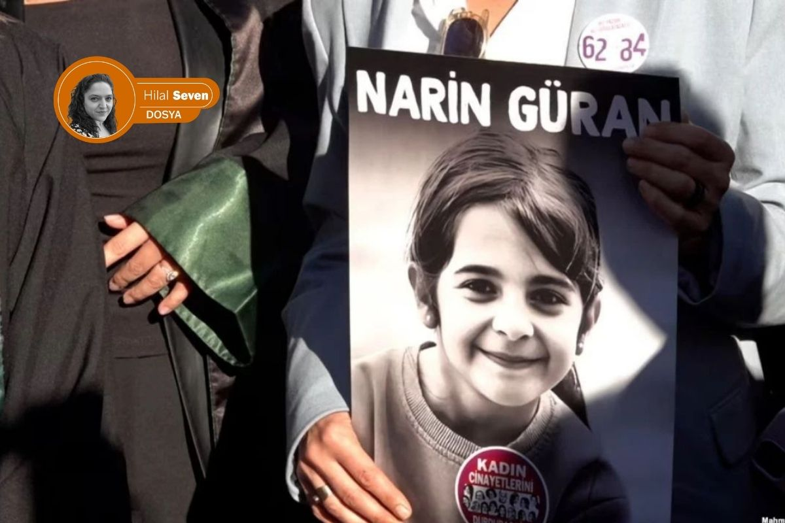
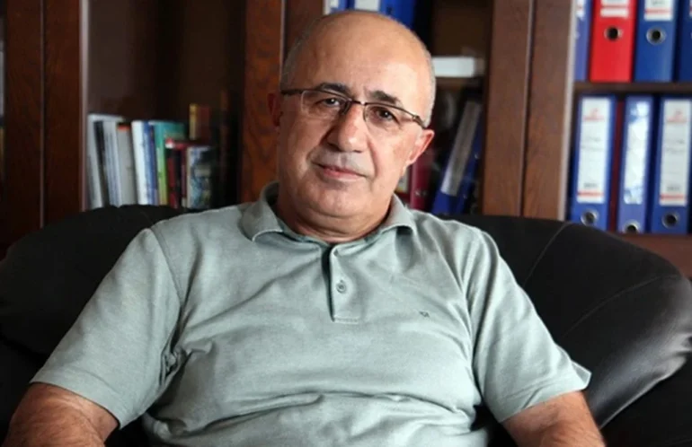
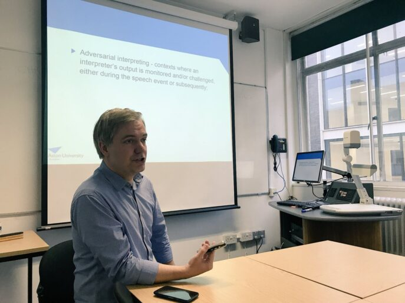

{fig-align="center" width="80%"}

*Hilal Seven / Londra*

> Yargı mevzuatı ve ceza pratikleri konusunda uzman üst düzey bir bürokratın sözleriyle: "Algı, olgunun üzerindedir."

Diyarbakır'ın Tavşantepe köyünde 21 Ağustos 2024'te kaybolan ve 19 gün sonra cansız bedeni bulunan sekiz yaşındaki Narin Güran'a ilişkin dosya, Türkiye tarihinin en karmaşık süreçlerinden biri olarak kayda geçti. Bir çocuk; akrabalarından oluşan köyünün ortasında, evine doğru uzanan bir patikada birkaç adımdan sonra sırra kadem basıyorsa, bu sistemin güvenliği nasıl sorgulanmalıydı?

Dosyamızın dün yayınlanan ilk bölümünde, Narin Güran dosyasının kapanmış bir dava dosyası olarak değerlendirilemeyeceğini; teknik, hukuki ve bilimsel yönleriyle yeniden tartışılan bir dosyaya dönüşebileceğini ele almıştık.

İkinci bölüm olan bu bölümünde ise 2 başlık altında dosyanın ta en başına gidiyoruz; ilk kısımda kolluk güçlerinin rasyonel plandan ayrıldığı noktaları, yargı mekanizmasının gizlilik ihlalleriyle nasıl birer "veri karmaşasına" dönüştüğünü ve adli dil bariyerinin hakikati bulma karşısında yaratabileceği engelleri mercek altına alıyoruz. Prof. Dr. Krzysztof Kredens'in akademik analizi, Mehmet Emin Aktar'ın hukuki tecrübesi ve gazeteci Şirin Bayık'ın sahadaki tanıklığıyla, devletin bir köyün sessizliği karşısında yürüttüğü süreci adım adım inceliyoruz.

İkinci kısımda ise; medyanın yarattığı "moral panik" dalgasını ve Tavşantepe'nin yerel gerçekliğinin Türkiye'nin gürültüsü içinde nasıl boğulduğunu, köyden gelen açıklamaların Narin'in neden kaybolduğu sorusuna bulmaya çalıştığı yanıtları, farklı medya teorilerinin arama çalışmalarını nasıl etkilediğini analiz ediyoruz.

## 1. Türkiye'den Tavşantepe'ye kuş bakışı: Sistem nasıl körleşti?

Narin Güran, 21 Ağustos 2024 tarihinde saat 15:00 sularında Kur'an kursundan çıkarak eve yöneleceğini söylemiş ancak akşam dönmemişti. Ailenin kendi imkânlarıyla yaptığı aramalar sonuç vermeyince, saat 20:00 sularında abisi Baran Güran, ardından amcası Salim Güran jandarmaya kayıp ihbarında bulunmuşlardı. Soruşturmanın kaderini tayin edecek en kritik saatler, teknik bir odak kaymasıyla başlangıçta yanlış belirlenmişti; jandarma kamera kayıtlarında saat 18:00'den sonrasına odaklanmış, öncesini incelemeye ihtiyaç duymamıştı. Narin'i bulmanın 19 gün süreceği süreçte, ilk hayati yanlış adım bu şekilde atıldı.

Takip eden günlerde rasyonel iz takibi, teyit edilmemiş duyumlarla hayli bulanıklaşmıştı. Narin'in kuzeni Muhammet tarafından bulunan kırmızı bir terliğin önce Narin'e ait olduğu beyan edilmiş, sonrasında bu bilgi aile tarafından düzeltilmiş olsa da bu çelişki, kolluğun aile üyelerine yönelik şüphelerini artıran ilk kayıtlardan oldu. Köyde elektrik tellerinin teması sonucu çıkan yangının medyada "örtbas" amaçlı yansıtılması, soruşturma makamları üzerindeki toplumsal baskıyı ve aileye yönelik şüpheyi iyiden iyiye pekiştirdi.

26 Ağustos'ta, Narin'in evine yakın kayalıklarda bulunan kan izlerinin Narin'e ait olduğunun düşünülmesi üzerine ve aynı tarihte anne Yüksel Güran'ın bir televizyon yayınındaki ifadelerinin teknik kesintilerle basına yansıması, oğlu Enes Güran'ın şüpheli olduğu yönünde bir kamuoyu algısı hızlıca oluşturdu. Enes Güran ilk şüpheli olarak gözaltına alınmış; kolundaki diş izine dair 28 Ağustos tarihli rapor, izin en erken 22 Ağustos'ta oluşmuş olabileceğini belirtmesine rağmen, medya Enes'i "baş şüpheli" ilan etmekte tereddüt etmemişti.

Soruşturmanın altıncı gününde arama çalışmalarına dahil olan JASAT ekibi göreve geldiği andan itibaren rasyonel olmayan yöntemler, yerini mistik arayışlara bıraktı. İki JASAT görevlisinin aile üyelerini Diyarbakır'da dini bir figüre götürdüğü ve burada Narin'in abisi Muhammet'in onu bir hocanın okuması esnasında kendinden geçmesi sonucu bir adres tarifi yapmasına sebep olmuş ve bu ifadelere dayalı yeni bir arama yapıldığı bile kayıtlara geçti. Ayrıca Urfa'dan gelen bazı şahısların, aileden aldıkları kan örneğiyle yer tespiti yapabileceklerini iddia ederek kolluk güçlerini ve Güran ailesini Suriye sınırına kadar götürmesi, sürecin rasyonel plandan ne denli saptığını açıkça göstermeye örnekti.

Narin Güran'ın kaybolduğu o günden itibaren Türkiye, devasa bir bilgi kirliliğinin ve duygusal bir kaosun içine düştü. Mabel Matiz'in dizelerinde olduğu gibi; ekranlara düşen her veriyle vicdanlarda hissedilen gerçeklik arasındaki uçurum giderek derinleşti. Milyonlarca insanı bu davaya sürükleyen şey, sadece bir merak değil; "gözle görülen" çelişkili bilgiler ile "göğsün bildiği" o saf adalet arayışı arasındaki bu büyük fırtınaydı.

Bu fırtınanın merkezinde sadece fiziksel bir arama çalışması değil, aynı zamanda hukuk devletinin en temel kalelerinden biri olan "lekelenmeme hakkının" adım adım çöküşü de yer alıyordu. Dosyadaki somut veriler henüz olgunlaşmadan basına sızan ve soruşturmanın sağlıksız ilerlemesine sebep olan her detay, yargı sürecini rasyonel bir hat yerine, peşin hükümlerin yönettiği bir çıkmaza sürükledi.

Lekelenmeme hakkının korunmasını hedefleyen soruşturmalarda gizlilik ilkesinin bizzat makamlarca gözetilmemesi, Narin'in tüm aile fertlerinin kamuoyu nezdinde peşin hükümlerle karşı karşıya kalmasına neden oldu. Konuyla yakından ilgilenen ve yer yer dosyaya dair açıklamak yapan Eski Diyarbakır Baro Başkanı Mehmet Emin Aktar, telefon üzerinden yaptığımız mülakatta bu durumu şu sözlerle özetliyor:

{fig-align="center" width="70%"}

> "Zaten en başta bir algı yaratıldı: 'bu aile suçlu, bu aile suçlu.' Bu algı oluşturulunca doğal olarak bu ailenin yanında durmak, savunmalarını üstlenmek herkes açısından zor hale geldi. (…) Bir bakalım, burada şüpheli bir durum yok mu? Bize bir şey sunuluyor, biz sadece sunulanla mı yetinelim? Bu sorgulamayı yapanlar elbette eleştirildi."

Sahada yürütülen arama süreci, teknik bir planlamadan ziyade gelen ihbarların yarattığı hareketlilikle şekillendi. Saat 20:43'te başlayan haberleşme trafiği; "kırmızı araba" ve "yabancı şüpheli" gibi henüz teyit edilmemiş duyumlar üzerinden kolluk kuvvetlerini farklı noktalara sevk etti.

### "Soğukkanlı aile" söylentileri

Narin'in kaybolduğu bilgisinin ardından 22 Ağustos sabahı Tavşantepe'ye ulaşan ve süreci İlke TV adına sahadan takip eden gazeteci Şirin Bayık ile Google Meet üzerinden bir görüşme gerçekleştirdik. Uzun soluklu bu görüşmede Bayık, olayın en başından itibaren sahada bulunduğunu, süreci düzenli olarak takip ettiğini söyleyerek, kendi notlarını ile arşivini de bu çalışma kapsamında paylaştı.

{fig-align="center" width="70%"}

Görüşmede kendisine özellikle Narin'in kaybolmasının ardından geçen ilk 19 günlük süreçte basının, medyanın ve toplumun gösterdiği refleksleri anlamaya yönelik sorular yönelttim. Ayrıca sahada, köyde yaşananları birebir gözlemleyen bir gazeteci olarak ilk izlenimlerini ve tanıklıklarını nasıl değerlendirdiğini sordum.

Şirin Bayık, bu süreçle ilgili tanıklıklarını ve saha notlarını daha önce hiçbir yerde ayrıntılı biçimde paylaşmadığını, bu görüşme kapsamında ilk kez bu kadar kapsamlı şekilde aktardığını ifade etti.

> "Sürecin en başından itibaren belgeleri, bilgileri ve mülakatları içeren dinamik bir çalışma dosyası üzerinden takibimi sürdürüyorum. Bölge koşullarında haber takibi yaparken ilk durağımız aileyle görüşmek oldu. Köyde, alışılagelmişin dışında, kayıp vakasının getirdiği belirgin bir sessizlik hâkimdi. Kameraman arkadaşımla birlikte baba ile görüşme talebimiz, sağlık durumu gerekçe gösterilerek karşılanmadı. Bunun üzerine annenin bulunduğu eve geçtik. İçeride iki kadın jandarma personeli görev yapıyordu. Anne, sürece dair yaygın olarak bilinen günlük rutinleri aktardı. O esnada odada bulunan abi Enes Güran'ın fiziksel olarak oldukça bitkin ve gözlerinin kan çanağı halinde olduğunu gözlemledim. Gazetecilik refleksi ile insani gözlemin iç içe geçtiği ilk karşılaşmamız bu şekilde gerçekleşti."

Şirin Bayık'ın bu ilk gözlemleri, ilerleyen günlerde kamuoyunda oluşacak "soğukkanlı aile" anlatısının aksine, vakanın ilk saatlerindeki somut tabloyu ortaya koymaktadır. Ancak bu insani detaylar, soruşturmanın ilerleyen safhalarında yerini teknik uyuşmazlıklara bırakmıştır. Örneğin; Narin'in kardeşi Muhammet tarafından bulunan kırmızı bir terliğin Narin'e ait olmadığı bilgisinin daha sonra aile tarafından kabul edilmesi, kolluk birimlerinin aile üyelerine yönelik şüphelerini artıran bir unsur olarak resmî tutanaklara hızlıca geçen başka bir davranış olarak soruşturmayı yürüten savcılığa iletildi.

Süreç, rasyonel veriler ile aile beyanları arasındaki bu tür uyumsuzluklar üzerinden şekillenmeye devam ederken, devam eden günlerde Narin'in erkek kardeşi Muhammet'in gördüğü kırmızı bir terliğin Narin'e ait olmadığı daha sonra aile tarafından kabul edildi. Bu durum kolluğun şüphelerini artırdı. Ardından köyde tellerin birbirine değmesi sonucu çıkan yangın, medyada bir şeyleri örtbas etme girişimi olarak yansıtıldı ve kolluğun aileye yönelik şüphesi pekişti.

Narin'i bulma süreci hızla ailenin şüpheli görüldüğü bir faza evrildi. 26 Ağustos'ta bulunan ve daha sonra Narin'e ait olmadığı belirlenen kan izi, şüpheleri somutlaştırdı. Aynı tarihte Narin'in annesinin televizyondaki konuşması teknik aksaklıklar nedeniyle bağlamından koparıldı; annenin oğlu Enes'in sigara içmesine dair üzüntüsü, kamuoyunda Enes'in şüpheli olduğu şeklinde yorumlandı. 28 Ağustos tarihli rapora göre Enes'in kolundaki diş izinin en erken 22 Ağustos'ta oluşmuş olabileceği, yani Narin'in kaybolmasından bir gün sonrasına işaret edebileceği belirlendi. Ancak medya Enes'i ilk şüpheli olarak görmeye devam etti. Salim Güran'ın aracında bulunan DNA ise dosyayı tamamen bu eksene kilitledi.

Modern adli bilimlerin uygulama alanı, bu dosyada zaman zaman "mistik" yöntemlerle gölgelendi. Altıncı gün itibarıyla iki JASAT personeli, Diyarbakır'da tanınmış bir "hocaya" giderek aileden bazı kişileri götürdü. Narin'in abisi Muhammet'in burada kendinden geçerek söylediği "salçalı makarna" ifadesi üzerinden yeni şüpheliler arandı. Hatta Urfa'dan gelen ve ellerinde test cihazı olduğunu iddia eden iki kişi, anne ve JASAT ekiplerini Narin'in yerini bildiklerini iddia ederek Suriye sınırına kadar götürdü.

### İfade süreçlerinde dil bariyeri: "Bir kişinin kendi hikâyesini anlatma kapasitesi, sistemin yapısı ve güç ilişkileri tarafından sınırlandırılabilir"

Bu dosyayı araştırmaya başladıktan sonra önce Türkiye sahasından elde ettiğim bilgi ve verileri topladım ve değerlendirdim. Aynı zamanda adli dilbilim alanı içinde de bu tür dosyaların nasıl okunabileceğini önemli buldum. Türkiye'deki bulguların sadece olay akışıyla değil, anlatıların nasıl kurulduğuyla da ilgili olduğunu gördüm. Bu nedenle süreci sadece yerel verilerle bırakmadım.

Bu çerçevede İngiltere'de Birmingham Üniversitesi bünyesinde bulunan Aston Forensic Linguistics bölümünde görev yapan Prof. Dr. Krzysztof Kredens ile Google Meet üzerinden bir görüşme yaptım. Ona hem dosyadaki süreci hem de Türkiye'de medyanın olayı nasıl çerçevelediğini aktardım.

{fig-align="center" width="70%"}

Görüşmede Narin Güran'ın kaybolması ve arama çalışmalarının sürdüğü günlerde medyanın olayı nasıl algıladığı, toplumun refleksleri ve ailenin açıklamalarının nasıl yorumlandığı üzerine konuştuk. Ailenin ana dili Kürtçe olmasına rağmen Türkçe demeçler vermelerinin, bu ifadelerin toplumda nasıl karşılık bulduğu ve bunun adli süreçte nasıl okunabileceği konusunu özellikle sordum.

Ayrıca bu tür dosyalara adli dilbilimin nasıl baktığını, anlatıların nasıl kurulduğunu ve güç ilişkilerinin süreci nasıl etkilediğini de tartıştık. Bu görüşmede Prof. Dr. Kredens, davaya ilişkin şu değerlendirmeyi yaptı:

> "Adli dilbilimin temel amaçlarından biri, ceza adalet sistemindeki herkesin eşit bir 'ses'e sahip olup olmadığını incelemektir. Maddi durum, etnik köken ya da cinsiyet fark etmeksizin, mahkemede karşı karşıya gelen anlatıların her iki tarafa da eşit şekilde ifade imkânı sunması, bu anlatıların sadece söylenmesi değil, etkili biçimde 'duyulması' gerekir.
>
> Ancak her davada birbiriyle yarışan hipotezler vardır ve çoğu zaman belirleyici olan, 'nesnel gerçeğin' ne olduğundan ziyade, hangi anlatının daha ikna edici sunulduğudur.
>
> Bu çerçevede etnik gerilimler, sekülerlik-din gibi toplumsal karşıtlıklar ve kamuoyu dinamikleri, belirli anlatıların daha baskın hale gelmesine katkıda bulunabilir. Bir kişinin kendi hikâyesini anlatma kapasitesi, sistemin yapısı ve güç ilişkileri tarafından sınırlandırılabilir. Bir yanda devletin gücü ve savcılığın yanında yer alan kamuoyu desteği dururken, diğer yanda dil bariyeri ve sosyoekonomik dezavantajlar gibi faktörler taraflar arasında belirgin bir güç asimetrisi oluşturabilir. Bu durum, savcılık anlatısının daha ikna edici bulunmasına yol açarken, alternatif anlatıların daha az görünür kalmasına neden olur. Sonuç olarak kamuoyu algısı, tarafların kendilerini eşit şekilde ifade edebilmesini yapısal olarak zorlaştırabilir."

Kredens'in işaret ettiği bu güç asimetrisi, Narin Güran dosyasında daha arama çalışmaları sürerken rasyonel delillerin önüne geçen toplumsal yargı mekanizmasını da evrensel bir gerçeklikle açıklıyor. Henüz 19 günlük arama süreci devam ederken; dil bariyeri ve sosyokültürel dezavantajlarla çevrili olan köyün, ülke çapında yanlış anlatıların ışığında bakılan bir mercek altına alınması, sistemin ve kamuoyunun kendi "ikna edici anlatısını" inşa etmesine zemin hazırlık yaratınca, soruşturma, bir hukuk incelemesinden ziyade, kamuoyunun duymak istediği anlatının inşa edildiği bir sürece dönüştü.

## 2. Tavşantepe'den Türkiye'ye: Medya ve siyasetin kıskacında hakikat

Narin ile bir anda hepimiz kaybolduk. Bu 5 aylık araştırmada edindiğim tüm bilgilere göre Narin Güran davası, Türkiye'nin son otuz yılının bir aynası. O aynaya baktığımızda gördüğümüz, sadece bir cinayet değil; kurumların birbirini körleştirdiği, algının olguyu yendiği ve toplu vicdanın iflas ettiği bir sistem anatomisi. Türkiye halkları uzun yıldır artık soru sormuyor; sadece kendi sesini duyurmak, kendi öfkesini kusmak ve kendi hükmünü vermek istiyor.

Bu dosyayı çalışırken ve bu satırları kaleme alırken, trajedisini sadece zihinde taşımanın dahi güç olduğu o veri yığını karşısında; itidalli kalabilmek ve objektif değerlendirmeler yapabilmek adına sığındığım dinletilerden biri Maya Perest'in "Yok bana bu cihanda bir yer" adlı eseriydi. Esasında bu sözlerin, Narin Güran davasının nasıl da bir özeti olduğunu sonradan fark edecektim: Bir insanın hayatı, ana dili ve feryadı; bazen linç iştahı ve etik dışı hırslar karşısında tamamen anlamsızlaşabiliyordu.

19 gün boyunca milyonlar "Narin nerede?" sorusunun peşinden giderken; onun gerçekte kim olduğu, sevdiği oyunlar veya kurduğu hayaller kimsenin zihninde karşılık bulamadı. Toplum ve medya, hakikati aramak yerine en zahmetsiz yolu seçerek Narin'i bir kurguya mahkûm etti: *"Görmemesi gereken bir şeyi gördüğü için kayboldu"* denilerek mesele magazinel bir sır perdesine hapsedildi.

Oysa kriminoloji ve çocuk psikolojisi alanındaki bilimsel veriler bambaşka bir gerçeğe işaret ediyordu: Bir çocuk kaybolduğunda, failin çocuğun "komşu amca" veya "yakın teyze" diyecek kadar iyi tanıdığı bir sosyal çevreden olma ihtimali istatistiksel olarak en yüksek senaryodur. Literatürde "Grooming" (Hazırlama) olarak adlandırılan bu süreçte; şeker, çikolata veya para gibi hediyeler, birer çocukluk neşesi değil, çocuğun güvenlik bariyerlerini yıkmak için kullanılan kriminolojik araçlardır.

### Gözden kaçan "kırmızı alarm"

Narin kaybolduktan sonra anne Yüksel Güran'ın jandarma ifadesinde paylaştığı bir detay, tam da bu bilimsel zeminde hayati bir önem taşıyordu. Anne, Narin'in kaybolmasından birkaç gün önce bir komşusunun çocuğa para verdiğini, Narin'in bu parayla yüklü miktarda şeker aldığını ve kendisinin bu durumdan şüphelenerek kızını uyardığını belirtmişti.

Kriminolog Dr. Michael O'Connell'ın modeline göre bu durum, failin çocukla kurduğu "ilişki inşası" aşamasının en somut göstergesidir. Adli psikolojide "Açık Hedef Belirleme" sinyali (Red Flag) olarak kabul edilen bu bilgiye rağmen; söz konusu şahsın 19 gün boyunca bu "hazırlama süreci" şüphesiyle sorgulanmaması, soruşturmanın neden sonuçsuz kaldığının da yanıtıdır. Hakikat, sadece dere yatağında değil; bu bilimsel verilerin görmezden gelindiği ifade tutanaklarının tozlu raflarında da boğulmuştur.

### Medya etiği ve moral panik: Hakikatin reytingle imtihanı

> *"Basın özgürlüğü, başkalarına karşı yazmaya meyilli olduğumuzda bir nimet; fakat kendimizi saldırganların kalabalığı altında ezilmiş bulduğumuzda bir felakettir." — Samuel Johnson*

Bu noktada, medyanın sadece bir aktarım aracı değil, sürecin bizzat kurucusu haline geldiği bir düzlemle karşılaşıyoruz. Prof. Dr. Nazife Güngör, medyanın bu vaka üzerinden sergilediği tutumu sadece bir meslek hatası değil, derin bir "toplumsal hastalık" belirtisi olarak tanımlıyor. Güngör'e göre; Narin'in kaybı üzerinden yürütülen kesintisiz yayınlar, kamuoyunu bilgilendirme amacından tamamen saparak toplumun en ilkel dürtülerini kaşıyan, izlenme oranlarını (reyting) ve tıklanma sayılarını (trafiği) insan onurunun ve çocuk haklarının önüne koyan bir mekanizmaya dönüştü.

{fig-align="center" width="70%"}

Güngör'ün analizi şu noktada sertleşiyor:

> "Medyanın tek kaygısı reyting ve tiraj olmamalı. Bu tür vakalarda sergilenen sansasyonel tutum, toplumu adalet arayışından uzaklaştırıp kolektif bir cinnete sürükleyerek daha 'hastalıklı' bir ruh haline büründürüyor. Bilgi kirliliği, adli sürecin rasyonel bir şekilde yürümesini engellerken toplumsal vicdanda onarılmaz yaralar açıyor."

> *"Gazetecilik, organize edilmiş dedikodudur." — Edward Eggleston*

Doç. Dr. Esra Arsan ise sahadaki gazetecilik pratiklerini çok daha keskin bir kavramsallaştırmayla, "şovmenleşen habercilik" olarak nitelendiriyor. Arsan'a göre Tavşantepe, birçok haberci için bir "hakikat arayışı merkezi" değil, bir "performans alanı" haline geldi. Arsan'ın sahadaki gözlemleri, gazeteciliğin etik kodlarının nasıl askıya alındığını şu somut verilerle ortaya koyuyor:

{fig-align="center" width="70%"}

**Dedikodu kanalları ve teyitsiz bilgi**

Bölgeden haber geçenlerin teknik veri boşluklarını mahalle dedikodularıyla doldurması. Bu durum, masumiyet karinesini sadece ihlal etmekle kalmadı, tamamen yok etti.

**Dramatizasyon ve performans**

Habercilerin canlı yayınlarda takındıkları aşırı dramatik tavır, ağlamaklı ses tonları ve kendilerini olayın kahramanı gibi konumlandırmaları. Arsan'a göre bu, haberciliğin nesnelliğini öldüren ve izleyiciyi rasyonel düşünceden koparan bir "reality show" estetiğidir.

**Kurbanın ve şüphelinin nesneleştirilmesi**

Narin'in özel yaşamına, ailenin geçmişine ve köyün sosyo-kültürel yapısına dair yapılan her bir spekülasyonun, etik bir süzgeçten geçmeksizin milyonlara servis edilmesi.

Arsan, bu durumu "merkez medyanın" bölgeye bakışındaki o kronik körlükle birleştiriyor:

> "Bölgenin sosyo-politik gerçekliğini ve dil bariyerini yok sayan, sadece 'reyting getirecek bir trajedi' arayan bu bakış açısı, adaleti değil sadece kaosu besledi. Gazeteci, gerçeğin peşinde koşan kişidir; gerçeği eğip bükerek kendi şovunu kuran kişi değil."

Bu iki akademik perspektif, dosyanın en önemli iddialarından birini destekliyor: Medya, bu süreçte sadece haberi aktarmamış; aynı zamanda yarattığı "moral panik" ile kolluk ve yargı üzerinde rasyonel karar almayı zorlaştıran görünmez bir baskı kurmuştur. Bu baskı altında, gerçek delillerle kurgulanmış anlatılar arasındaki çizgi silikleşmiş, kamuoyu vicdanı "bilgi" ile değil "algı" ile şekillendirilmiştir.

Mehmet Emin Aktar algı operasyonunu şöyle detaylandırıyor:

> "Anneyle ilgili ahlaka dair iddialar geldiğinde bunu kesin bir dille reddettim. Kamuoyunun bakışının aile dışına çıkmasına baştan beri izin verilmedi."

### Soruşturmanın kilit taşı: Teknik ihmaller ve algı operasyonu

Dosyadaki temel eksiklik, kamera kayıtlarının kritik saatlerde (15:00 civarı) incelenmemesi ve "kırmızı araba" bilgisinin soruşturmaya dahil edilmemesi. Cansız bedeni bulunana kadar geçen 19 günde, delil bulup sanık aramak yerine, önce kişileri sanıklaştırıp ardından onlara delil arandığına dair bir kamuoyu algısı oluştu. Kolluk kuvvetlerinin rasyonel yöntemlerden uzaklaşması, sürecin aydınlatılmasını daha da zorlaştırdı.

Narin Güran davası; adalet sisteminin, medya etiğinin ve toplumsal vicdanın bir anlamda kırık aynası oldu. O aynaya baktığımızda gördüğümüz toplu bir vicdan kaybı ve hakikatin gürültüye kurban edilişi oldu. Narin, yüzü güneş saçan bir çocuktu, ancak kaybından sonra ailesi devasa bir "cani aile" tasvirinin gölgesinde bırakıldı.

Kimsenin kimseye "nasılsın" diye sormadığı, empati yerine yargılamanın hüküm sürdüğü bu atmosferde, rasyonel cevap aramayı çoktan bırakmıştık o günlerde. Narin ile birlikte hakikat, etik ve bizi insan kılan o "narin" vicdan da Eğertutmaz dere yatağının sularına gömüldü şüphesiz. Bu dosyada hakikatin sesi gürültüye kurban edilse de, o aynadaki kırıklar vicdanımıza batmaya devam edecektir.

19 günün sonunda Eğertutmaz Deresi'nden gelen haber, bir çocuğun kaybı olmaktan öte toplumun ve adaletin üzerine çöken o ağır sisin de tescili oldu. Bu süreçte köyün gençlerini ve tüm aileyi kuşatan o ağır itham iklimi, söz sahibi kişilerin ifadelerini hatırlatan bir noktaya evrildi. Bilgi kirliliğiyle herkesin birbirine düşmanlaştığı bu atmosferde, hakikate ulaşmanın tek bir yolu kalmıştır: **"Bu savaş tükenmeli / En başa dönülmeli."** Artık ayrışmaları bir kenara bırakıp, bu 19 günün analizini en baştan ve en düzgün biçimde yapmak, gerçeğin Narin kadar "narin" olan hatırasına karşı tek sorumluluğumuzdur.

*Bir sonraki yazımızda; 8 Eylül – 28 Aralık 2024 döneminde soruşturma ve kovuşturmada medyanın rolünü ve yargılama sürecine geçişi inceleyeceğiz.*

::: external-refs
1. Hilal Seven — Adalet Bakanlığı onayladı: Narin Güran dosyasında "keşif" süreci gündemde | /blog/posts/hilal-seven/2026-05-04-adalet-bakanligi-onayladi-narin-guran-dosyasinda-kesif/
2. Aston Institute for Forensic Linguistics | https://www.aston.ac.uk/research/institutes/institute-forensic-linguistics
3. Diyarbakır Barosu | https://www.diyarbakirbarosu.org.tr/
:::
