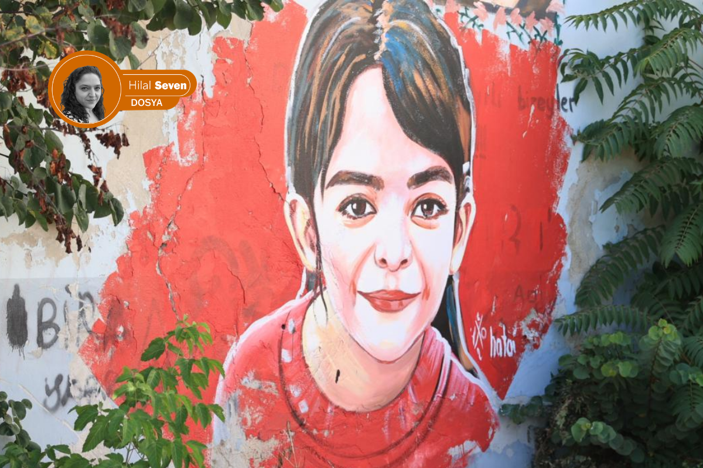
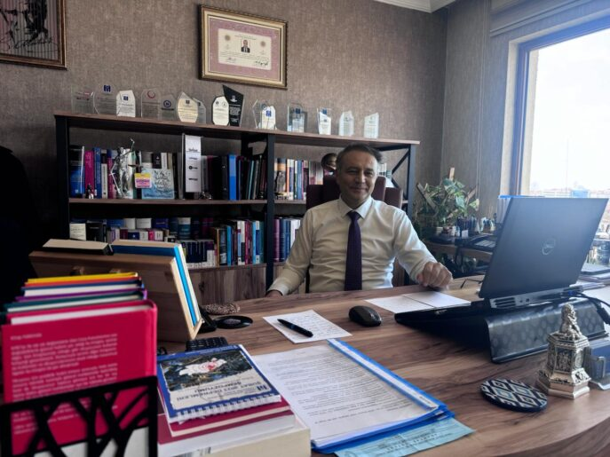
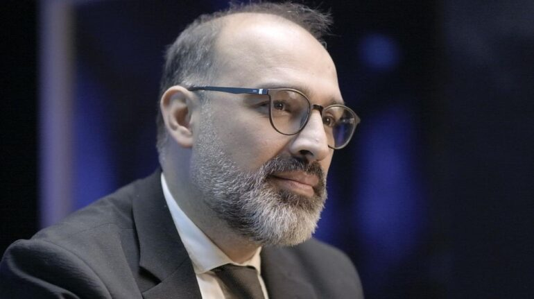
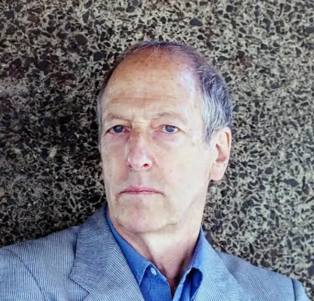

{fig-align="center" width="80%"}

*Hilal Seven / Londra*

Narin Güran davasında, yeniden yargılamanın gündeme gelmesinde, DEM Parti'den Sevilay Çelenk'in ilk kıvılcımı çakmasıyla başlayan süreç; Ömer Faruk Gergerlioğlu, Mehmet Ekmen, Şahzade Demir ve Türkan Elçi ve Cengiz Çandar gibi isimlerin Meclis kürsüsünden yükselttikleri "yeniden yargılama" çağrısıyla yeni bir faza evrildi.

Yargıtay'ın beş üyesinin ağırlaştırılmış müebbet cezalarını onamasıyla, dosya hukuken kapanmış gibi görünmüş ve kamuoyu manşetlerin çizdiği "fail" portrelerine ikna olmuşsa da, asıl fırtına, davanın dijital mahkemesi haline gelen X (Twitter) odalarında koptu. Gazeteci Ali Duran Topuz'un geçtimiz Ekim ayında kaleme aldığı kapsamlı araştırmaları, The National News'in Narin'in ailesiyle yaptığı haber, olayın ilk gününden beri gündemde kalmasında rolü olan ve çoğunluğu hukukçuların katılımıyla oluşan, X odalarında sabahlara kadar süren tartışmalar ve ardından 128 ismin imzasıyla yükselen "Yeniden yargılama" talebi, muhalif basında geniş yankı bularak o güne dek kurulan sarsılmaz "kanaati" sorgulatmaya başladı.

## Şeytantepe: Bir belgesel ne kadar etkili olabilir?

Nevzat Bahtiyar'ın kritik duruşmasından günler önce yayınlanan *140journos* imzalı "Şeytantepe" belgeseli, adeta bir toplumsal hafıza depremi yarattı. İlk haftada 1 milyonu aşkın izleyiciye ulaşan çalışma; kamera görüntüleri ve avukat beyanlarını toplu halde sunarak kamuoyunu sert bir özeleştiriyle yüzleştirdi: *"Acaba bize anlatılan senaryo yanlış mıydı?"*

## Mahkeme salonundaki "kurgu tiyatrosu"

16 Nisan'da hâkim karşısına çıkan Nevzat Bahtiyar'ın, **"Ben Narin'i öldürseydim bedenini parça parça ederdim"** şeklindeki tüyler ürperten yanıtı, dosyadaki çelişkilerin zirvesi oldu. Delilleri yok etmekten cinayete iştirake uzanan 17,5 yıllık yeni hüküm, mahkemelerin yerel düzeyden Yargıtay'a kadar sürekli senaryo değiştirdiğinin de en somut göstergesi. Bahtiyar'ın bugün gelinen noktada 8 kez değişen ifadesi ve mahkeme başkanlarının her kararda farklı bir olay örgüsü inşa etmesi; adaletin değil, bir "kurgunun" peşinden gidildiğinin açık bir tezahürü.

## Londra'da bir "algı" tiyatrosu

Geçtiğimiz Nisan ayında Londra'da sahnelenen ve Narin Güran cinayetini konu edilen "Sus" oyunu, davanın yönünü belirlemede medyanın asparagas haberleri olarak soruşturmayı yanlış yerlere sürükleyen, ev temizliği, Narin'e ait olduğu söylenen yazma ve halı yıkama gibi gerçek olmadığına mahkemenin de kanaat getirdiği ayrıntıları kurgusal birer kesinlik gibi dünyaya servis ederken, oyunun bir izleyicisi soruyor: *"Yargılaması süren bir trajedinin, bir avukat eliyle 'algı yönetimine' alet edilmesi sanat mıdır, yoksa manipülasyon mu?"*

İzleyici, bu "sanat kisvesi" altındaki girişimin toplumsal belleğe sahte bir hakikat yerleştirme riski taşıdığını belirterek, sahnedeki ürpertici tutarlılığı şu sözlerle aktarıyor:

> *"Oyun bir çığlıkla başlıyor: 'Nazlı!' (Oyundaki Narin karakteri) Narin davasında basında gördüğümüz herşey vardı oyunda. 'Ev neden temizlendi?', 'Narin'in yazması neden oradaydı?', 'Halılar neden yıkandı?'… Bir de sürekli şuna vurgu yapıldı: 'Görmedim, duymadım, bilmiyorum.'*
>
> *Oyunun sonunda anne; kızının (Narin'in) hayaletine konuşuyor işte. Üç kapıdan bahsediyor. Devlet, erkek ve baba kapısından başka kaçış olmadığını anlatıyor ama ilginçtir baba karakteri sahnede hiç yok. Yenge Hatice'nin anneyle beraber çamaşır katladıkları andaki replikleri de ilginçti mesela, yenge şey diyor: 'Sözlerimiz de tıpkı bu çamaşırlar gibi birbiriyle düzgün olmalı, aynı ve tutarlı olmalı.'*
>
> *Bence bu oyundaki asıl sorun şuydu, hala devam eden bir dava var ortada ve Narin'in failinin netleşmediği bir davanın tiyatrosu yapılamaz. Hele ki bunu yazan bir avukatsa bu oyunun yazılamayacağını daha iyi bilmeli. Ben çok rahatsız oldum bu oyundan her anlamıyla. Şiveler kötüydü, konuya iyi çalışılmamıştı, oyunda karakter yoktu resmen, tiplemeleri izledik. Oyunun sonunda salondakiler alkışladılar ama ben pek çok kişinin huzursuz olduğunu bizzat gördüm."*

## Soruşturmada yeni bir safha: Kapanmayan parantez

"Kapanmış" gibi görünen Narin Güran dosyasının aslında neden hala açık kaldığına dair işaretler, son günlerde devletin en üst kademelerinden gelen açıklamalarla yeni bir boyuta evrildi. Adalet Bakanlığı'nın Gülistan Doku cinayeti üzerinden başlattığı hamle ve Akın Gürlek'in Bakanlık bünyesinde kurulan **"Faili Meçhul Cinayetleri Araştırma Birimi"** aracılığıyla 75 ilde 638 dosyayı yeniden ele alacaklarını duyurması, Narin davası için de bir dönemeç oldu. Gürlek'in, "yeni bir delil ya da gizli tanık halinde yeniden yargılama ihtimali"ne dair CNN Türk'te katıldığı bir canlı yayındaki çıkışı, Meclis kürsülerindeki "adalet" seslerini daha da yükseltti.

## Teknik veriler ve hukuki hatalar: Levent Mazılıgüney analizi

Bu yeni safhada en çok tartışılan konu, soruşturmanın teknik ayağındaki devasa boşluklar. Ankara'daki ofisinde bir araya geldiğimiz aynı zamanda avukat, doktor ve inşaat mühendisi olan adli bilişimci Levent Mazılıgüney, dosyadaki usul hatalarını ve "bilimsel" diye sunulan verilerin nasıl birer illüzyona dönüştüğünü şu sarsıcı sözlerle aktarıyor:

{fig-align="center" width="70%"}

> "Bu dava bir mahkeme salonu değil, toplumun kan görmek istediği bir gladyatör arenasıydı ve kurumlara bu istek servis edildi. Mahkeme başkanının gözlerindeki tereddüdü bizzat hissettim; o da böyle bir yargılama olmaması gerektiğini biliyordu. 18 gün boyunca çalışmayan kameraların, Narin son görüldüğü patikaya sadece 100 metre mesafede Nevzat'ın evinin neden aranmadığının hesabı verilmedi. Emniyet güçlerimizin Ulusal Kriminal Büro'nun çok üzerinde yetenekleri varken bu görüntülerin UKB tarafından incelenmesi gibi daha nice ihmaller kabul edilemez."

Mazılıgüney, davanın mahkumiyet temelini oluşturan en büyük "teknik skandalı" ise şöyle deşifre ediyor:

> "Soruşturmanın en büyük sorunu, **'daraltılmış baz'** denilen o bilimsel garabettir. Bu tamamen uydurma bir yöntemdir. Benim denetleyemediğim bir veri, hukukta delil olamaz. En üst kademeler, bizzat Adalet Bakanı bile bu uydurma veri üzerinden yanlış bilgilendirildi. Ortada suçluluğu kesin tek bir kişi var; Nevzat Bahtiyar. Ancak deliller zamanında değerlendirilmediği için bugün onunla ilgili bile doğrudan bir delil sunulamıyor. Siyaset karar verirse, yargı bu yeniden yargılamayı kabul etmek zorunda kalacaktır."

## "Türkiye'nin Dreyfus davası: Narin Güran"

Narin Güran davası müdafilerinden Avukat Mustafa Demir'e göre bu dosya, sadece bir cinayet davası değil; hukuki hataları ve toplumsal linç boyutuyla "Türkiye'nin Dreyfus davasıdır." Demir ile avukatların maruz kaldığı engelleri ve AYM'den beklenen kritik virajı konuştuk.

{fig-align="center" width="70%"}

### Yeniden yargılanma kapısı nasıl açılır?

Demir, kesinleşmiş hükme rağmen adaletin hâlâ mümkün olduğunu vurguluyor:

> "Dosyada değerlendirilmeyen bir delil, sahte bir tanık beyanı ya da hükme esas teşkil eden bir raporun aksini ispatlayan somut bir veri varsa, mahkeme yargılamanın yenilenmesini kabul etmek zorundadır. Biz vekiller olarak talep ediyoruz ancak Yargıtay Cumhuriyet Başsavcılığı'nın da re'sen harekete geçme yetkisi var. Genel Kurul, yerleşik içtihatlarında bu dosyadaki mevcut delil yapısıyla 'müşterek failliği' asla kabul etmez."

### Dijital verilerdeki skandal

Mustafa Demir, soruşturmanın merkezindeki "WhatsApp aramaları" iddiasını ise sert bir dille eleştiriyor:

> "WhatsApp hikâyesi tamamen bir kurgudur. Teknik uzmanlığı olmayan bir zabıt katibine teslim edilen telefonda, saatlerin 2,5 saat kaydığı bir liste çıkarılmış. HTS'de karşılığı olmayan bu görüşmeler için 'WhatsApp üzerinden yapılmıştır' denilerek varsayım üretiliyor. Ya buna 'iyi niyetli hata' diyeceksiniz ya da 'olmayan aramayı var gibi gösterdiler' diyerek kumpas olduğunu kabul edeceksiniz. Burada görüyoruz ki savcı, hukuki sorumluluğu muğlaklaştırmak için dosyayı bilirkişi yerine yetkisiz bir katibe teslim etmiş."

### Sanıktan delile giden yol ve "onaylama önyargısı"

Demir'e göre temel sorun, ceza hukukunun en köklü ilkesinin tersyüz edilmesi:

> "Normalde delilden sanığa gidilir ama burada tam tersi oldu. Kafalarında sanıkları belirleyip onlara uygun delil üretmeye çalıştılar; bizim dosya avukatlarımızdan Avukat Muhammet Demir'in de bu davada sıkça vurguladığı bir yorum vardır, buna **'konfirmasyon bias'** (onaylama önyargısı) denir. Soruşturma makamı 'bu aile suçlu' ön kabulüne saplanıp kaldı. Sabah mezara dua etmeye giden anneyi şüpheli bulup mezar açtıran zihniyet, Narin'e ne olduğunu değil, aileyi nasıl suçlu çıkaracağını odak noktasına koydu. Adil yargılanma hakkı ilk etapta ihlal edildi."

### "Yasak ağacın meyvesi de yasaktır"

Mustafa Demir, dosyadaki hukuksuz delil toplama sürecini şu sözlerle mühürlüyor:

> "İstihbarat çalışması denilerek hiçbir somut gerekçe sunulmadan herkesin telefonu toplandı. Yasak ağacın meyvesi de yasaktır; hukuka aykırı delil hükme esas alınamaz. Biz hâlâ jandarmanın ve savcılığın üzerinde durmadığı 40 farklı kameranın kayıtlarını titizlikle inceliyoruz. Savunma hakkının kısıtlandığı, dil bariyerinin görmezden gelindiği ve toplumun linç psikolojisiyle hareket eden bu dosya bir gün mutlaka yeniden açılacaktır. Çünkü bu kararın vicdanlarda yer bulması mümkün değildir."

## "Beni namusumla vurdunuz": Maddi gerçekten iffet sorgusuna

Narin Güran soruşturması, cinayetin aydınlatılmasından ziyade, anne Yüksel Güran'ın özel hayatının merkeze alındığı bir "ahlak yargılamasına" dönüştü. Somut delilden yoksun, yasak ilişki iddiaları üzerine kurulu anlatılar, adaletin rotasını maddi hakikatten saptırarak toplumsal bir infaza zemin hazırladı. Bir annenin yas hakkı elinden alınırken; teknik eksikliklerin üstü, niyet okumalar ve magazinleştirilmiş iddialarla örtüldü. Üstelik **"*daha evladımın acısını bile yaşayamadan namusumun derdine düşmek zorunda kaldım*"** ifadesi de yine medyada — kendi çocuğunun ölümüne üzülmeyen bir anne — tasviriyle yer bulmaya devam etti.

{fig-align="center" width="70%"}

Bu süreçteki en kritik kırılmalardan biri de Mustafa Demir'in dikkat çektiği **"dil bariyeri"** oldu. Yüksel Güran'ın medyada kibir dolu bir meydan okuma gibi yansıtılan *"Güranlar devletten büyüktür?"* ifadesi, aslında Kürtçedeki soru kipiyle kurulmuş bir feryattı: **"Güranlar devletten büyük müdür ki böyle bir cinayeti işleyip saklayabilsin?"**

Kürtçe düşünüp Türkçe konuşmaya çalışmanın bedeli, davanın başından beri örülen ön yargı duvarına bir taş daha ekledi. Yüksel Güran'ın mahkeme salonunu sarsan şu sözleri, hukuki sınırları aşan o ağır psikolojik baskının özetiydi:

> "Beni buraya attınız, evladımın mezarına gidemedim. Narin'in acısını yaşatmadınız bana. Beni namusumla vurdunuz. Narin'i ben nasıl öldüreyim? Ben bir anneyim. Siz beni öyle bir hale koydunuz ki, daha evladımın acısını bile yaşayamadan namusumun derdine düşmek zorunda kaldım. Bu iftiradır, günahtır."

## Sahada bir gazeteci: Patika ve "51 Saniye" deneyi

Ankara temaslarımın ardından davanın kalbine, Tavşantepe'ye gittim. Mahkemenin "daraltılmış baz" ve kamera verilerine dayanarak kurduğu olay örgüsünü yerinde denetlemek istedim. Meslektaşlarım Şirin Bayık ve Selman Çiçek ile birlikte gerçekleştirdiğimiz keşifte, karara esas teşkil eden o kritik süreyi mercek altına aldık.

Mahkemenin kabul ettiği senaryoya göre; Narin, son görüldüğü patikadan ayrıldıktan sonra sadece **51 saniyede** evine varıyor ve orada tanık olduğu bir olay sebebiyle dakikalar içinde öldürülüyor. Bu yolu bizzat test ettim. Oldukça engebeli olan o patikayı, yetişkin adımlarıyla ve hızla çıkmama rağmen süre **2 dakikayı** geçti. Şimdi sormak gerekir: Bir gazetecinin yerinde yaptığı basit bir keşifle çürütülen bu "51 saniye" iddiasına, koca bir ülke nasıl inandırıldı?

## Dijital imkânsızlıklar: Cinayet mi, fatura ödemesi mi?

Narin'in öldürüldüğü iddia edilen birkaç dakikalık dar zaman aralığında saat 15.28'de, müşterek fail sıfatıyla kendisine ağırlaştırılmış hüküm verilen amca Salim Güran'ın telefonundan yüz okuma yapılarak fatura ödediği kayıtlı, bununla beraber telefonunu aktif kullandığına dair telefon imaj kayıtları mahkemeye sunulan raporlar arasında. Bu durumda soru şu: Bir insanın aynı dakikalar içinde hem fatura ödeyip hem internette haber okuyup hem de plansız bir cinayet işlemesi hangi mantık silsilesine sığabilir?

Narin'in son adımlarını takip ederek Kur'an kursundan evine doğru çıkan patikada yürüdüğümde gördüğüm tablo şuydu: Kolluk kuvvetlerinden "ekran dedektiflerine" kadar herkes, yerinde araştırma yapmak yerine kurgulanmış bir senaryoya sorgusuz sualsiz ekranlara taşımayı ve bu akıl dışı senaryolara inanmayı tercih etmişti.

## Gazeteciliğin çıkmazı ve bir zorunluluk olarak hakikati yazmak

Bu süreçte Serbestiyet, Bianet, İlke TV ve Halkweb gibi dijital platformların sağduyulu habercilik çabaları, medyanın içinde bulunduğu büyük çıkmazın en net göstergesi olarak hala yeterli kitleye ulaşamıyor.

İyi gazeteciliğin can çekiştiği, iyi gazetecilerin sürgünlerde ya da cezaevlerinde olduğu bugünlerde; Narin Güran ve benzeri aydınlatılmamış davaları yazmak benim için bir tercihten öteye geçti. Dünyanın bir başka ucundan gelip doğduğum topraklarda yaşanan hak ihlallerini, hukuk garabetlerini, bilimin dışlanışını ve adaletin toplumdaki karşılığının yok oluşunu resmetmek artık bir mecburiyet oldu.

## Hakikatin labirenti ve bilimin rehberliği: David Canter analizi

Narin Güran dosyası, sadece trajik bir çocuk cinayeti değil; Türkiye'nin adalet mekanizmasını ve sosyopolitik durumunu, siyasi çıkmazını ve toplumsal vicdanını test eden devasa bir sınav. Sloganların ötesine geçip hakikati aramak adına, bu süreçte modern polisiye dünyasında "suçlu profili çıkarma" (profiling) yönteminin Britanya'daki öncüsü kabul edilen, yaşayan bir efsanenin; Prof. David Canter'ın kapısını çaldım.

{fig-align="center" width="70%"}

Londra'yı dehşete düşüren "Demiryolu Tecavüzcüsü" davasını nokta atışı profiliyle çözen ve suç soruşturmalarında "Coğrafi Profilleme" disiplinini başlatan Canter, bugün dünyanın en ünlü "Zihin Avcıları" arasında kabul ediliyor. Jack The Ripper'dan modern seri cinayet vakalarına kadar yüzlerce dosyada bilirkişilik yapan bu isim; Narin dosyasındaki teknik kör noktaları, adaleti felç eden "onaylama önyargısını" ve mahkeme salonlarının nasıl birer "sosyo-hukuki tiyatroya" dönüştüğünü bilimin perspektifiyle masaya yatırdı.

### David Canter: "Soruşturma en baştan hatalı yürütülmüş"

> "Çelişmeli yargılama sisteminde (adversarial system) uzman kanıtlarının güvenilirliği titizlikle sınanmalıdır; bu köklü bir ilkedir. Ancak bazen mahkemeler, davanın gidişatına uymayan yararlı bilgileri 'uzman görüşü' saymayarak reddedebilir. Bu dosyanın en kritik yanlarından biri birden fazla kaynaktan gelen DNA kanıtları olsa da, asıl tehlikeli olan husus davanın bir 'manşet' odağına dönüşmesidir.
>
> Bir vaka ulusal ilgi odağı haline geldiğinde, polis 'yanıt verme' telaşına düşer. Bu durum hem soruşturmacılar hem de yargıç üzerinde devasa bir baskı yaratır. Yargıçların sadece gerçeklerle ilgilenen, dış etkilerden tamamen bağımsız bireyler olduğu fikri bir yanılsamadır. Olay artık nesnel olmaktan çıkar; eğer polis soruşturmacıları dürüstçe konuşabilselerdi, bir fail bulup suçlamada bulunmak için üzerlerinde hissettikleri o büyük baskıyı muhtemelen itiraf ederlerdi."

### Bilişsel önyargılar ve sistematik hatalar

> "Mahkemeler bağımsız olmalı ancak değiller. Burada **'onaylama önyargısı'** (confirmation bias) kavramını anlamak hayati önemdedir. Nobel ödüllü Daniel Kahneman'ın da vurguladığı gibi; insanlar bir fikre sahip olduklarında, akılcı davranmak yerine sadece o fikri doğrulayacak kanıtları ararlar. Bu, zihnimizin en güçlü yanılsamalarından biridir.
>
> Tıpkı insanların sadece kendi görüşlerini destekleyen gazeteleri okuması gibi, hukuk sistemi ve polis de bu önyargıdan muzdariptir. Tecrübelerime dayanarak şunu söyleyebilirim: Polislerin kafasında bir suçlu profili oluştuğunda, önlerine hangi kanıtı koyarsanız koyun, onu mevcut görüşlerini doğrulamak için yeniden yorumlarlar. Narin dosyasında da sistem, alternatifleri değerlendirmek yerine mevcut suçlamaya saplanıp kalmış görünüyor. Karar vericilerin sergilediği bu 'yanılmazlık' tutumu, aslında kendi rasyonellik imajlarını koruma çabasıdır. Unutmayın ki; tüm hukuki süreçler genellikle orijinal kararları desteklemek üzere kurulur. Bilişsel önyargılar işte böyle yıkıcı bir güce sahip."

### Jack the Ripper ve "Garip Adam" Sendromu

> "Üzerine yazdığım en önemli vaka **Jack the Ripper**; asla çözülmediği için insanlar hâlâ bir son arıyor. Cinsel bileşenleri olan bir davanın olağanüstü ilgi çekici olmasının bir nedeni daha var: Cesedi gömdüğünü itiraf eden ve yalnız yaşayan o adam. Bu durum, 'müstehcen' bir biçimde ilgi uyandırıyor.
>
> Narin Güran dosyasında fark ettiğim şey, soruşturmanın başlangıcındaki sürecin çok kötü yürütüldüğü. Veriler kötü toplanmış, büyük resmi oluşturmak yerine çok erkenden bir varsayımda bulunulmuş.
>
> Britanya'da düzgün bir soruşturmada tüm olası şüphelilerin listesi çıkarılır ve mazereti olmayanlar kalana dek eleme yapılır. Ancak soruşturmacılar için doğal ama hatalı olan refleks; önce faili belirleyip sonra o kararı doğrulayacak kanıtları aramaktır. Bu vakada, işe ilk bakanların deneyimsiz olması bu süreci daha da zorlaştırmış.
>
> Bugünlerde elinizde olan şey, tüm sistemin ne kadar önyargılı olduğudur. Siz buna bir ışık tutuyorsunuz ve bu gerçekleri Türkiye'de rapor edemiyor oluşunuz, sistemin üzerindeki o baskıcı gölgeyi kanıtlıyor."

### Toplumsal anlatılar ve medyanın rolü

> "Bu hikâyede medyanın devasa bir heyecan yarattığını ve bu ilgiyi bizzat beslediğini düşünüyorum. Jack The Ripper vakasının bu kadar bilinmesinin nedeni, o dönemde yeni popülerleşen gazetelerin birbirleriyle girdiği müstehcen detay rekabetiydi. Karikatürist Bateman'ın 1930'lardan kalma ünlü bir karikatürü vardır; ofise müjde verircesine koşan bir adam, editöre yazabileceği 'feci bir cinayet vakası' bulduğunu haber verir."

{fig-align="center" width="55%"}

> "Günümüzde artık klasik gazetelere ihtiyaç kalmadı; sosyal medya üzerinden bu ilgi kendi kendini besliyor. Bu süreç, vakayı çözmeye çalışan ve adeta **'vigilante'** (kendini yasa yerine koyan) gruplara dönüşen kitleler yaratıyor. Sosyal medyada fikir beyan etme tutkusu, eskiden mahalle kahvesinde yapılan sohbetlerin yerini aldı ve devasa bir boyuta ulaştı.
>
> Bu durum, iyi bilinen bir sosyal fenomendir: Belirli bir 'dış grup' (ötekileştirilen aile veya şüpheli) belirleyip, ona karşı öfke kusarak kendi grubunuzdan destek almak. Kendinizi bir grubun 'karşısında' konumlandırarak tanımlamak, günümüz dijital kültürünün en yıkıcı yansımasıdır."

### Sosyo-hukuki kültür ve halkın beklentisi

> "Londra'daki deneyiminle Türk ve Kürt kültürüne dışarıdan bakman, davanın 'sosyo-hukuki' boyutunu harika resmediyor. Biz hukuk sistemlerinin objektif olduğunu düşünmek isteriz ama kararları insanlar verir; bu kararlar da kültürden ve toplumsal baskıdan etkilenir. Mahkemeler çoğu zaman halkın onlardan ne duymak istediğine göre karar verirler.
>
> Bana öyle geliyor ki bu vaka; Türk yargı sisteminin adeta bir **'güruh' (mob)** gibi hareket ettiğinin hikâyesidir. Halkın bir linç istemesi, sosyal medya ilgisiyle beslendi ve mahkemenin tüm hukuki süreçleri (due process) görmezden gelmesine neden oldu. Şunu merak etmek lazım: Eğer ölü bulunan küçük bir erkek çocuğu olsaydı, aynı ilgi olur muydu?
>
> Kurbanın kimliği ve medyanın bunu sunuş biçimi çok kritiktir. İngiltere'deki Soham vakasında, öldürülen iki genç kızın belirli bir futbol formasını giydiği fotoğrafın kullanılması gibi… Polis bana aslında kızların o takımla pek ilgilenmediğini ama halkın ilgisini çekmek için bu imajın kurgulandığını itiraf etmişti.
>
> Çekici bir kadın veya masumiyet simgesi bir çocuk öldürüldüğünde medya bunu hemen ele alır, çünkü fotoğraflarını manşetlere taşımak 'tık' ve 'ilgi' demektir. **Bu çok ünlü bir fenomendir; kurgu, gerçekliğin önüne geçer.**"

### Savunma hakkı ve demokrasinin geleceği

> "Bir Türk mahkemesinde olmayı kesinlikle istemezdim; zira orada savunma avukatlarının bile tehdit edildiği bir iklimden bahsediyoruz. Jürinin olmadığı ve net bir savunmanın yapılamadığı savcılık odaklı sistemlerin en büyük sorunu budur. Britanya'da iddia makamı elindeki tüm kanıtları savunmaya vermek zorundadır. Ancak bu davada (Narin Güran) PSA incelemesi, DNA analizi, daraltılmış baz raporlarının yeniden tetkiki ve dijital kayıtlar mahkeme tarafından ısrarla reddedilmiş.
>
> Savunma makamı her yolu denediği halde görmezden geliniyorsa, o sistemde 'savunma' ne anlam ifade eder? Hatta iddiaya girerim ki; eğer mahkeme o DNA testlerinin yapılmasına izin verse bile, bir noktada kanıtları 'kaybettiklerini' söylerlerdi. Bu imkânsız değil, zira polislerin en hayati kanıtları kaybettiği vakalara bizzat şahit oldum.
>
> Burada elinizde olan şey, tüm sistemin ne kadar önyargılı olduğudur. Siz buna bir ışık tutuyorsunuz ve bu gerçekleri Türkiye'de rapor edemiyor oluşunuz, sistemin üzerindeki o baskıcı gölgeyi kanıtlıyor."

### Demokrasinin üç sütunu ve Madeleine McCann paradoksu

> "Gerçek bir demokrasi oylamadan ibaret değildir; üç temel sütuna dayanır: Olanı biteni anlayacak eğitimli bir halk, olayların hesabını soracak bağımsız bir basın ve son savunma hattı olan tarafsız bir yargı. Sizin çalıştığınız bu dosyada, sosyal medya tarafından suistimal edilmeye bu kadar açık bir sistemde, bu sütunların nasıl sarsıldığını gösteriyor.
>
> Portekiz'deki Madeleine McCann vakasını hatırlayın; dünya kamuoyu hiçbir kanıt yokken ailenin suçlu olduğuna inanmıştı. Oysa 11 profesyonelin bir cinayeti örtbas etmek için kariyerlerini riske atması mantık dışıydı. Narin davasında da benzer bir mantık hatası görüyorum: Kalabalık bir ailenin, cesedi gömmesi için bir komşuyu işe dahil etmesi riski devasa oranda artırır. Komşu her an sizi ihbar edebilir; neden bu riski alasınız? Ve bu kadar büyük bir ailede herkesi nasıl susturabilirsiniz? Tüm bu kurgu, sürekli hikâye değiştiren tek bir birey ve onun anlatısı etrafında dönüyor. **Çözüm aslında çok basit: DNA testlerini dürüstçe yapın yeter.**"

## "Aynı teşhis, tek hakikat: onaylama önyargısı"

David Canter ile yaptığım bu mülakatın en sarsıcı anı; davanın müdafiilerinden Avukat Mustafa Demir'in dile getirdiği, binlerce kilometre ötedeki bir bilim insanı tarafından harfiyen doğrulanmasıydı. Savunma avukatlarının yerel bir dosyada gördüğü "kurgu", dünya çapında bir uzmanın dilinde "sistematik bir yargı hatası" olarak mühürlendi: **Onaylama Önyargısı (Confirmation Bias).** Zihin bir kez bir "fail" belirlediğinde, artık deliller değil, sadece o kararı destekleyen kurgular konuşmaya başlıyor.

Sonuç yerine; Diyarbakır'da bir araya geldiğim ve görüşmenin sonunda bana yönelttiği, karşısında birkaç saniye sessiz kaldığım ve vermeye çalıştığım esnada hem memleketimin ahvalinden hem de kendi insanlığımdan utanarak yanıtladığım, Baran Güran'ın (Narin'in ağabeyi) o ilk ve tek sorusuyla bu dosyayı kapatmak istiyorum.

> *"Peki sence şimdi ne olacak abla?"*

## Okuyucuya not

Narin Güran dosyasının bu son bölümünü, bir gazeteci notu ve düzeltme metniyle noktalıyorum. Meslek hayatım boyunca en sarsıcı bulduğum, emeği en az bir yıla bedel, oldukça ağır hacimli bir dosya üzerinde çalıştım. Binlerce sayfalık veri okuması, onlarca saatlik kayıt incelemesi ve yüzden fazla kişiyle yapılan görüşmelerin deşifre edilmesi sonucu ortaya çıkan bu haber dosyasında; tüm titizliğimize ve farklı gözler tarafından yapılan incelemelere rağmen kimi maddi hatalar oluşmuştur.

Dikkatli okuyucularımızın geri bildirimleri doğrultusunda bu hatalar ivedilikle düzeltilmiştir. Oluşan bu hatalar için tüm okuyucularımızdan özür dilerim. Değerli okuyucular; gözümüzden kaçmış olabilecek diğer detaylar konusunda bir husus fark ederseniz, bana veya ekibimize lütfen ulaşın. Hatalar hepimiz içindir; insan hatasıyla, sevabıyla bir bütündür. Erdemli olan, hatadan dönmek ve yanlışı kabul etmektir.

Bu yazı dizisini sabırla takip ettiğiniz için teşekkür eder, dosyanın hazırlanmasında emeği geçen herkese sonsuz şükranlarımı sunarım.

Son olarak bu yazı dizisini değerli mecralarında yazmam için bana alan açan; dosyanın özenle hazırlanmasında ve yayına uygun hale getirilmesinde büyük emeği olan tüm **İlke TV** ailesine teşekkür ederim.

Narin Güran ve nicelerinin hakikatinin gün yüzüne çıktığı, adaletin sağlandığı günlerde görüşmek üzere.

::: external-refs
1. Hilal Seven — İlk dereceden Yargıtay'a Narin Güran davası | /blog/posts/hilal-seven/2026-05-07-ilk-dereceden-yargitaya-narin-guran-davasi/
2. 140journos — Şeytantepe belgeseli | https://www.youtube.com/@140journos
3. David Canter — Wikipedia | https://en.wikipedia.org/wiki/David_Canter
4. Daniel Kahneman — Wikipedia | https://en.wikipedia.org/wiki/Daniel_Kahneman
5. Confirmation bias — Wikipedia | https://en.wikipedia.org/wiki/Confirmation_bias
6. Madeleine McCann vakası | https://en.wikipedia.org/wiki/Disappearance_of_Madeleine_McCann
:::
