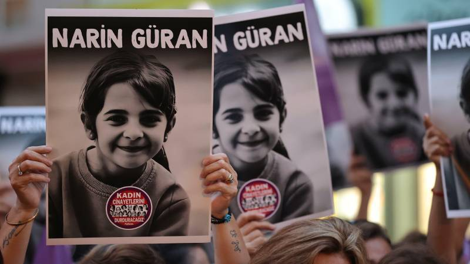

{fig-align="center" width="70%"}

Narin hakkında bu gök kubbe altında söylenebilecek neredeyse her şey söylendi. Ancak mesele tam da burada düğümleniyor: Söylenenlerin çokluğu, hakikatin ortaya çıkmasına hizmet etmedi. Aksine, hakikatin üzerini örten, onu parçalayan ve etkisizleştiren bir gürültüye dönüştü. Bu nedenle sorumluluk hisseden herkesin aynı meseleyi yeniden ele alması gerekir. Çünkü hakikat, yalnızca dile getirilmekle değil; doğru yöntemle ve sağlam bir zeminde savunulmakla anlam kazanır.

Narin olayı, başından itibaren hukukun normatif çerçevesinden kopma riski taşıyan bir süreç olarak ilerledi. Zamanla, hukuki değerlendirmelerin yer yer kamuoyu baskısı ve duygusal tepkilerle gölgelendiği bir tablo ortaya çıktı. Bu durum, meselenin sıradan bir adli vakadan daha fazlası olduğunu göstermektedir. Burada yalnızca bir suç ya da fail tartışması değil; hakikatin nasıl kurulduğu, yönlendirildiği ve algılandığı sorusu vardır.

Bu çarpılma iki temel dinamik üzerinden ilerledi. İlki, hakikatin sınırlarının fark edilmeden daraltılmasıydı. Tartışmalar yoğunlaştıkça, toplum gerçeği aradığını düşünürken aslında kendisine sunulan sınırlı bir çerçeve içinde dönüp durdu. İkincisi ise daha dolaylı bir biçimde ortaya çıktı: Hakikati savunan söylemlerin niteliği zayıfladıkça, savunulan şeyin kendisi de itibarsızlaştı. Duygusal, tutarsız ya da yöntemsel olarak eksik argümanlar, zamanla hakikatin görünürlüğünü artırmak yerine azaltan bir etki yarattı.

Bu iki dinamiğin kesişiminde, yüksek sesli ancak düşük içerikli tartışmalar ortaya çıktı. Ortak bir rasyonel zemin üretilemedi; tartışmalar ilerlemek yerine tekrar etti.

Bu noktada meselenin toplumsal ve politik boyutunu da göz ardı etmemek gerekir. Narin olayı, yalnızca bireysel bir trajedi değil; aynı zamanda toplumsal reflekslerin nasıl çalıştığını gösteren bir örnek haline gelmiştir. Kadın ve çocuklara yönelik şiddetin zaten görünür olduğu bir zeminde, bu tür vakalar hızla sembolik anlamlar yüklenerek tartışılmaktadır. Olayın kendisinden çok, onun etrafında kurulan anlatılar öne çıkmaktadır.

Bu durum, olayın bir tür temsile dönüşmesine yol açmaktadır. Ancak burada söz konusu olan yalnızca basit bir temsil ilişkisi değildir. Süreç, belirli aşamalar üzerinden işleyen bir dönüşüm mekanizmasına sahiptir. Bu mekanizma, gerçek, temsil, yeniden üretim ve yer değiştirme şeklinde ilerleyen bir zincir olarak düşünülebilir.

İlk aşamada **gerçek**, olayın henüz yorumlanmamış, ham ve dağınık olgular bütünüdür. Ancak bu gerçek, toplumsal dolaşıma doğrudan bu haliyle girmez.

İkinci aşamada **temsil** devreye girer. Medya, sosyal ağlar ve çeşitli aktörler aracılığıyla olay belirli anlatı kalıpları içine yerleştirilir; bazı unsurlar öne çıkarılırken bazıları geri planda bırakılır. Böylece gerçek, olduğu gibi değil, belirli bir çerçeve içinde görünür hale gelir.

Üçüncü aşama olan **yeniden üretim** sürecinde, bu temsil farklı kanallar aracılığıyla sürekli tekrar edilir. Her tekrar, anlatıyı biraz daha sadeleştirir, keskinleştirir ve dolaşıma daha uygun hale getirir. Bu noktada insanlar, olayın kendisini değil; onun dolaşımda olan versiyonlarını tanımaya başlar.

Son aşama ise **yer değiştirme**dir. Artık tartışılan şey olayın kendisi değil, onun yeniden üretilmiş temsilleridir. Gerçek, erişilmesi zor bir arka plana çekilirken; temsil, hakikatin yerine geçer. Bu noktada simülasyon tamamlanır. Artık ortada gerçeğin basit bir yansıması değil, onun yerini almış bir anlatı vardır.

Bu simülasyonun arkasındaki motivasyonu anlamak ise ayrı bir katmanı gerektirir. Çünkü bu tür olaylar, yalnızca kendiliğinden büyümez; mevcut politik ve toplumsal fay hatları üzerinden anlam kazanır. Çocuk ve kadın cinayetlerinin zaten politik bir içerik taşıdığı bir zeminde, bu tür vakalar hızla siyasal anlatıların parçası haline gelir. Muhalefet açısından bu olay, iktidarın zafiyetlerini görünür kılabilecek bir toplumsal örnek olarak okunur. İktidarın kendi çevresini koruyacağı, yargının taraflı işleyeceği ve "yandaşın kayırılacağı" yönündeki yerleşik algı, henüz olgular netleşmeden devreye girer.

> İnsanlar, çoğu zaman zaten inandıkları çerçeveleri doğrulayan hikâyelere daha hızlı tutunur. Adaletin zedelendiğine dair kolektif hafıza, bu tür olaylarda yeniden aktive olur ve bireyler gerçeği araştırmaktan çok, mevcut inançlarını pekiştiren anlatılara yönelir. Böylece hakikat geri çekilir; onun yerini, inanılması daha kolay olan bir kurgu alır.

Burada dikkat çekici olan, toplumun bu anlatıya yönelme biçimidir. Bu yalnızca bir politik tercih değil, aynı zamanda psikolojik bir eğilimdir.

Bu nedenle "simülasyon" ifadesi, gerçeğin tamamen ortadan kalktığını değil; gerçeğe erişimin, onu temsil eden katmanlar tarafından giderek zorlaştırıldığını anlatır. Modern toplumlarda bilgi, doğrudan deneyimle değil; aracılar üzerinden kurulduğu için, bu tür dönüşümler kaçınılmaz hale gelmektedir.

Soruşturma sürecine bakıldığında ise temel sorun, yöntemin istikrarsızlığıdır. Adli süreçlerin sağlıklı ilerleyebilmesi için teknik verilerin, uzmanlık bilgisinin ve analitik değerlendirmenin belirleyici olması gerekir. Oysa bu tür vakalarda kamuoyu baskısı ve yoğun duygusal atmosfer, sürecin yönünü etkileyebilmektedir. Bu durum, hem hatalı değerlendirme riskini artırır hem de adalete olan güveni zedeler.

Bu noktada mesele yalnızca bireysel hatalarla açıklanamaz. Daha geniş bir çerçevede, kurumsal kapasite, liyakat ve yöntem sorunları da tartışılmalıdır. Çünkü adalet mekanizması, ancak tutarlı ve profesyonel bir işleyişle güven üretir.

Tarihsel olarak benzer durumların yaşandığı bilinmektedir. Toplumsal gerilimin arttığı dönemlerde, söylentilerin delilin önüne geçtiği ve kalabalıkların yargının yerini aldığı örnekler vardır. Bu tür durumlarda ortak bir mekanizma işler: Algı, gerçeğin önüne geçer; duygu, aklı bastırır; hızlı yargılar, sağlıklı değerlendirmelerin yerini alır.

Narin olayı etrafında yürütülen tartışmalarda da bu risk açıkça görülmektedir. Toplumun bazı kesimleri için mesele, hakikati anlamaktan çok bir pozisyon almak haline gelmiştir. Oysa sağlıklı bir değerlendirme, önyargılardan arınmış, delile dayalı ve soğukkanlı bir yaklaşımı zorunlu kılar. Hukuk, kanaatlerle değil; somut verilerle konuşur.

Sonuç olarak Narin olayı, yalnızca bir adli dosya değil; aynı zamanda toplumun hakikatle kurduğu ilişkinin de bir göstergesidir. Hakikatin yerini temsiller aldığında, adalet yalnızca gecikmez; aynı zamanda anlamını da yitirmeye başlar.

Son söz yerine: İnsan, insan haklarıyla insandır. Onurlu bir yaşam ve insanca bir son, ancak adaletin ayakta kalmasıyla mümkündür. Adalet zayıfladığında yalnızca hukuk değil, toplumsal güven de sarsılır. Bu nedenle hakikati savunmak, yalnızca bir dava meselesi değil; ortak geleceğin korunmasıdır.

Burada hatırlanması gereken temel ilke açıktır: Hukuk olgularla ilgilenir. Olgulardan uzaklaşıldığında algılara teslim olmak kaçınılmazdır. Algıları aşmanın tek yolu ise, bıkmadan ve usanmadan olguları ortaya koymaktır. Çünkü olgulardan da öte, asıl mesele hakikattir; ve hakikate ulaşmanın yolu yine olguların kendisinden geçer.
