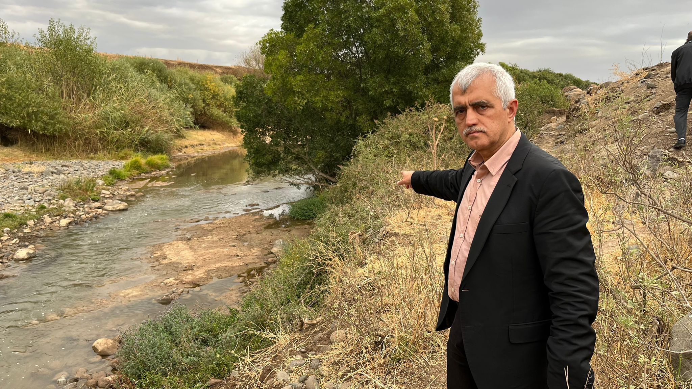
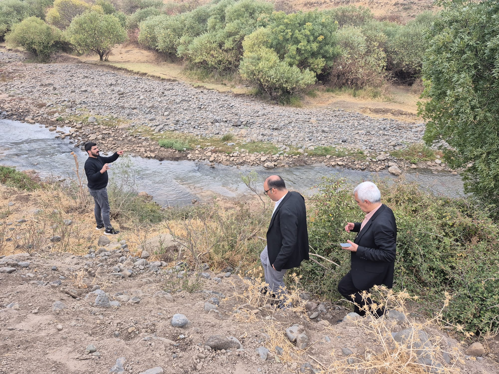

{fig-align="center" width="70%"}

*Independent Türkçe*

## DEM Parti Milletvekili Ömer Faruk Gergerlioğlu, Narin Güran'ın köyünde incelemelerde bulundu

{fig-align="center" width="70%"}

DEM Parti Kocaeli Milletvekili Ömer Faruk Gergerlioğlu, Diyarbakır Tavşantepe Köyü'nde 8 yaşındaki Narin Güran'ın öldürülmesi olayıyla ilgili aileyi ziyaret etti. Gergerlioğlu, 54 gündür adalet nöbeti tutan Güran ailesinin taleplerini dinledi, olay yerinde ve dava dosyasında incelemelerde bulundu.

Gergerlioğlu, yaptığı değerlendirmede, "Narin ve ailesi için adaletin mutlaka sağlanması gerekir" dedi.

### "Şehir efsaneleriyle yargılandılar"

Narin Güran'ın mezarı başında nöbet tutan ailenin yaşadıklarını anlatan Gergerlioğlu, baba Arif Güran, anne Yüksel Güran ve amca Salim Güran'ın ağır koşullarda cezaevinde tutulduklarını belirtti. Ailenin kendilerini medya linçine uğramış ve haksız biçimde suçlanmış hissettiklerini ifade eden Gergerlioğlu, "Bu insanlar şehir efsaneleriyle süslü bir yargılamaya maruz kalmış. Büyük bir haksızlık ve zulüm yaşanıyor." dedi.

### Yakınları konuştu

Cezaevinden yeni çıkan Fuat Güran, Gergerlioğlu'na olay günü Van'da olduğunu, buna rağmen iftiralarla tutuklandığını belirtti. Narin'in yengesi Hediye Güran ise suçsuz yere cezaevinde kaldığını belirterek, "Zulme, işkenceye ve haksızlığa uğradım. Rabbim Narin'in hakkını bırakmasın inşallah." dedi.

Gergerlioğlu'na konuşan Narin'in babası Arif Güran, yargılamanın adil olmadığını belirterek, "Mahkemede ailemi diri diri gömdüler. Her şey tek taraflı değerlendirildi. Medyanın yalanlarıyla bir aile linç edildi." ifadelerini kullandı. Arif Güran, baz istasyonu raporlarının bilim dışı olduğunu, yedi defa ifadesini değiştiren birinin beyanıyla aile bireylerinin müebbet ceza aldığını söyledi. Ailenin yaşlı annesi Remziye Güran, adaletin sağlanması çağrısı yaptı. "Allahtan korksunlar, bu iftiralara son verilsin" diyen yaşlı kadın, evin bakımını yaşına rağmen kendisinin üstlendiğini anlattı. Gergerlioğlu'nun konuştuğu Salim Güran'ın eşi Melek Güran, olay günü evde olduklarını ve eşiyle yemek yediklerini söyledi. "Altı çocuğumla birlikte Salim'in evde olduğuna şahidiz ama kimse bizi dinlemiyor." diyen Melek Güran, olay anına ilişkin ayrıntılı bir anlatımda bulundu.

### Avukatlarla keşif yaptı

{fig-align="center" width="70%"}

Gergerlioğlu, Av. Mustafa Demir ve Av. Onur Akdağ ile birlikte olay yerinde incelemelerde bulundu. Avukatlar, kamera ve telefon kayıtlarının Nevzat Bahtiyar'ın Narin ile son görülen kişi olduğunu gösterdiğini belirtti. Görgü tanıkları da Bahtiyar'ın Narin'e zaman zaman para verdiğini ifade etti. Avukatların aktardığına göre, Narin'in en son görüldüğü dakikalar, sanık Nevzat Bahtiyar'ın evi önünden geçtiği ana denk geliyor. Bahtiyar'ın o sırada Salim Güran'ı araması, olay zamanlaması açısından çelişkili bulundu. Avukatlar, iyileştirilmiş kamera görüntülerinde, Narin'in Bahtiyar'la 15.11 civarında aynı noktada "karartı" olarak görüldüğünü belirtti.

Av. Onur Akdağ, kritik kamera görüntülerinin silindiğini, Salim Güran'ın kayıp ihbarından sonra jandarmaya "kameralara bakılsın" dediğini ancak 15 gün sonra kayıtların bulunamadığını açıkladı. Avukatlar, bu durumu koruculuk bağlantıları ve kollukla yakın ilişkilere dayandırabileceklerini ifade etti. Gergerlioğlu ve avukatlar, Ulusal Kriminal Büro raporundaki "piksel kayması" tespitini yerinde test etti. Gergerlioğlu'nun aynı patikayı yürüdüğü denemede yetişkinlerin bile 2 dakika 14 saniyede tırmanabildiği görüldü. Bu bulgu, 8 yaşındaki Narin'in 51 saniyede çıkmasının fiziksel olarak imkânsız olduğunu ortaya koydu. Av. Akdağ, adli tıp raporunda Narin'in kıyafetinde PSA (meni proteini) tespit edilmesine rağmen, kimliklendirici DNA testlerinin yapılmadığını söyledi. "Bu testler yapılsaydı PSA'nın yabancı bir kişiye ait olup olmadığı anlaşılırdı" diyen Akdağ, adli sürecin eksik ve yüzeysel yürütüldüğünü belirtti.

### "Daraltılmış baz raporu bilimsel değil"

Avukatlar, davanın temel dayanağı haline gelen daraltılmış baz yönteminin bilimsel geçerliliği olmadığını, mahkemenin bu rapora dayanarak hüküm vermesinin "hukuki güvenliği" tehdit ettiğini vurguladı. Raporun, Salim Güran'ın evde olduğunu gösteren somut telefon verileriyle çeliştiği ifade edildi. Avukatlar, cinayet sonrası cesedin taşınması ve saklanması sürecinin, iddia edildiği gibi 6 dakikalık zaman diliminde gerçekleşmesinin mümkün olmadığını belirtti. "Bu eylemler en az 15 dakika sürer, bu da mahkeme anlatımının tutarsız olduğunu gösterir." dediler. Avukatlar, Eğertutmaz Deresi'nde 38 dakika süren bir hareketliliğe dikkat çekti. Nevzat Bahtiyar'ın Narin'in cansız bedenini gömdüğü sırada, askeri üsse ait kameraların olay anını kaydettiği ancak kayıtların alınmadığını belirttiler. Avukatlar, bu eksikliğin cinayetin aydınlatılmasını engellediğini söyledi.

### "Bu dosya film konusu olur"

Gergerlioğlu, olayın bir aileyi nasıl medya algısıyla suçlu ilan ettiğini gösterdiğini belirterek, "Bu yaşananlar ileride bir film senaryosu olabilir. Toplumsal yargının nasıl yönlendirildiğini görmek gerekiyor." dedi. Gergerlioğlu, yetkililere çağrıda bulunarak, "Gerçek adalet için dosya yeniden ele alınmalı." ifadelerini kullandı.

*Independent Türkçe*
