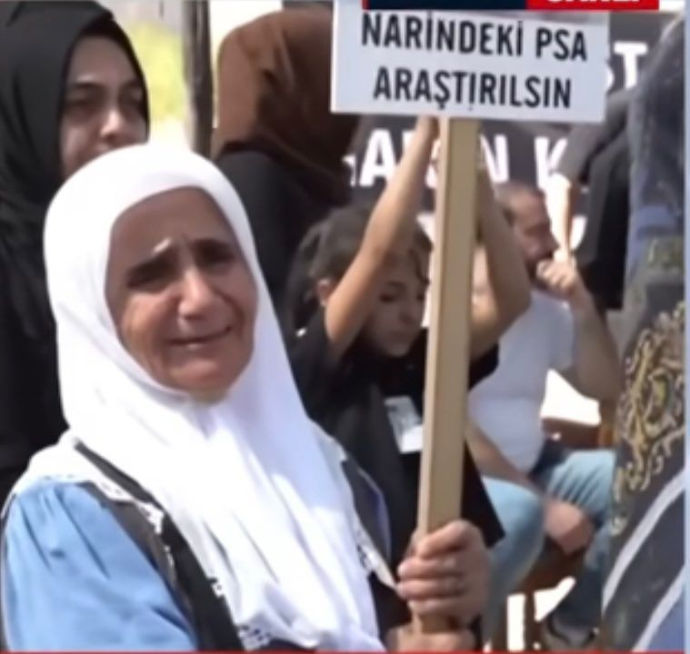

{fig-align="center" width="70%"}

Narin Güran soruşturmasının son şüphelisi Nevzat Bahtiyar, dosyanın en az konuşulan ismi oldu. Her ne kadar bir kısmi ikrarda bulunmuş olsa da, sanıklar arasında en suskun kalan kişiydi. Tutarsız ifadeleri, mahkeme tarafından kendini ifade edemeyen birinin sözleri olarak yorumlanarak adeta önemsizleştirildi.

Bu bölümde tercihim, Nevzat Bahtiyar ve ifadeleri üzerine konuşmayı ertelememek ve bu benim için, soğuk ve karmaşık dosya yazılarının en zorlu evresine adım atmak anlamına geliyor.

Hatırlanacağı üzere Nevzat Bahtiyar yakalandığında, sekiz gün önce cinayet şüphesiyle tutuklanan Salim Güran'ın kendisine Narin'in cansız bedenini verdiğini iddia etmiş, ancak senaryosunu üç kez değiştirmişti.

Muhtemelen, birinin suç ortağı tutuklandığında, ilk endişesi onun konuşarak kendisini ele vermesi olur. Suçtaki payı kıyaslanamayacak kadar küçükse, itirafçı olmaya daha yatkın olması beklenir. Hele ki suça tehditle karışmışsa…

> [Narin Güran için bir mum I: Yanlış İliklenen İlk Düğme](../yanlis-iliklenen-ilk-dugme)

Bahtiyar'da ise, Salim Güran'ın tutuklanmasının ardından ne böyle bir endişe ne de itiraf etme eğilimi görülüyordu. Yakalanana kadar susmayı tercih etti. Hatta yakalanmadan dört gün önce, Salim Güran'ı 15.08'de araması nedeniyle Jandarma Komutanlığı'na çağrılmış; görüşmeyi ilk etapta hatırlamamış, kayıtlar gösterilince kabul etmişti. Olay gününe ilişkin gün boyunca köy dışında olduğunu ileri sürerek yalan beyanda bulunmuştu.

Bu durumda olan bir suçlunun, suç ortağı tutukluyken yakalandığında olayın nasıl gerçekleştiğine dair bambaşka bir senaryo anlatması da pek muhtemel görünmez. Kendisinden sonra suç ortağının ifadesine başvurulacağını bilir. Hatta halihazırda tutuklu bulunanın itirafı üzerine yakalandığını da düşünebilir. Bahtiyar'ın ifadeleri yakalandığından yargılaması tamamlanana kadar sürekli değişti. Ana hatlarıyla üç farklı senaryosunu inceleyebiliriz.

### İlk Senaryo

Saat 15.08'de Salim Güran'la evindeki su meselesi nedeniyle kısa bir telefon görüşmesi yaptığını, ardından kendi evinden aracıyla evinden ayrıldığını söyledi. Mezarlık yoluna saptığında, arkasından Salim Güran'ın aracının geldiğini fark ettiğini aktardı. Güran'ın selektör yaparak kendisini durdurduğunu, aracının ön sağ koltuğunda battaniyeye sarılı bir cansız beden gösterip "Bunu yok edeceksin" dediğini anlattı.

Bahtiyar'a göre Güran, önce "aileni düşün" diyerek tehditte bulunmuş, ardından hasattan sonra 200 bin lira ödeme teklif etmişti. Sonrasında, 'çuval var mı?' diye sormuş Bahtiyar bagajından bir çuval çıkarmıştı. Çuvala cansız bedeni birlikte koyup kendi aracına yerleştirdiklerini iddia etti. Güran'ın "Onu göle at, yok et" gibi basit bir talimat verdiğini, ardından oradan ayrıldığını söyledi.

Bahtiyar'ın yakalanmasının ardından ifadesine başvurulan eşi de benzer bir anlatımda bulundu. Buna göre Nevzat, saat 15.08'de Salim Güran'ı aramıştı. Görüşmede Salim Güran evde yemek yediğini, yemeğini bitirdikten sonra yetkilileri arayacağını söylemişti. Nevzat Bahtiyar ise bu konuşmanın hemen ardından evden ayrılmıştı.

Nevzat Bahtiyar'ın bu ilk ifadesi, Salim Güran'ın 31 Ağustos'ta gözaltına alınmasının ardından, onun son Facebook paylaşımının altına yorum yapan ve kendilerini bir benzin istasyonu çalışanı olarak tanıtan hesapların anlattıklarıyla neredeyse aynıydı. Bu benzerlik nedeniyle ifade, kamuoyunda hızla kabul gördü. Oysa tam da bu yüzden, güvenlik birimlerinin doğruluğuna kuşkuyla karşılaması gereken bir ifadeydi.

Yapılan incelemeler, söz konusu hesapların sahte olduğunu ortaya koydu; ne öyle bir benzinlik ne de iddia edilen çalışanlar vardı. Dahası, Salim Güran'ın köyden çıkıp böyle bir benzinliğe uğraması ve ardından geri dönmesi, olay saatinin zaman aralığına sığmıyordu.

Nevzat Bahtiyar'a, bu paylaşımları görüp görmediği ilk duruşmada soruldu; kendisi ise "Görmedim, ama duydum" yanıtını verdi.

Ancak bu paylaşımlar ile Bahtiyar'ın ifadesi arasında bir ortak yön maddi bir delile işaret ediyordu: Salim Güran'ın aracında tespit edilen DNA verisiyle örtüşüyordu. İlginç olan, söz konusu paylaşımların DNA tespitinin yapıldığı gün yayımlanmış olmasıydı. Dahası, paylaşımlar, soruşturmanın senaryolarından haberdar olunuyormuş izlenimi veriyordu. Anne Yüksel Güran ve ağabey Enes Güran'a işaret ediliyor, medyadan sıkça duyduğumuz ve bugün asılsız olduğu anlaşılan görüşme trafiklerine değiniliyordu. Amca Salim Güran'a ilişkin ise, 18.55'teki köyden çıkış görüntüsüne dayanan bir senaryo kurgulanmıştı.

Ön koltukta ceset taşınması da olağan bir durum sayılmazdı ama Salim Güran'ın aracını bilen birileri böyle bir tanıklığı ancak bu şekilde ileri sürülebilirdi; zira aracın arka camları filmliydi!

Tüm sorun bunlarla da sınırlı değildi. Salim Güran'ın, Nevzat Bahtiyar'ın tarif ettiği şekilde onu takip edebilmesi için önce okulun önünden geçmesi ve dolayısıyla okul kamerasına takılması gerekiyordu. Ancak okul kamerasında böyle bir kayıt bulunmuyordu. Bahtiyar'ın sorgu tutanaklarında, bu çelişkiye ilişkin herhangi bir soru yöneltildiğine dair kayıt yer almıyor; buna karşın savcılık sorgusunda, Bahtiyar bu çelişkiyi giderdiği yeni bir senaryoyla karşımıza çıkıyordu.

> [Narin Güran için bir Mum III: Önyargılar, Medya ve Kollektif Kötülük](../onyargilar-medya-ve-kollektif-kotuluk)

### İkinci Senaryo

İkinci anlatıma göre, Nevzat Bahtiyar 15.08'de su arızasıyla ilgili görüşmeyi yaptıktan sonra dışarı çıkmış ve annesinin tesisatından çektiği hortumla bahçe sulamaya başlamıştı. Yaklaşık 15 dakika sonra, Salim Güran, baba Arif Güran'ın (Narin'in) evinin bulunduğu tepeden Bahtiyar'a "Nevzat, beni bekle, seninle işimiz var" diye seslenmişti. Bahtiyar da evinin önünde onu beklemeye başlamıştı.

Salim Güran, kendi aracıyla 'okul yönünden değil de camii yönünden' (Tutanakta aynen bu ifadelerle geçer) Bahtiyar'ın evinin önüne gelmiş ve "Arabana bin, beni takip et" dedikten sonra, taş yolda cansız bedeni Bahtiyar'a teslim etmişti. Bahtiyar, geri geri giderek ikametine dönmüş, bir çuval almış ve gömeceği yere götürmek yerine cansız bedeni evinin önünde çuvala yerleştirmişti.

Yargılama aşamasında incelenen Daran 2 kamera kayıtlarında, camii yolundan Bahtiyar'ın ikametine doğru giden bir araç olmadığı tespit edildi.

Bahtiyar ayrıca savcıların bir sorusu üzerine aile üyesi iki kadının Salim Güran'la ilişkisi olabileceğini, köyde bu yönde dedikodular olduğunu söylemişti.

### Soruşturmaya yön veren ikinci hipotez: Görmemesi gereken bir şey gördü / Suç Motivasyonu

Bu tarz ilişkilere işaret eden hiçbir veri olmadığı halde bu ifadenin ve benzer söylentilerin temelini biraz irdeleyelim.

İlk yazıda, soruşturma sürecinin, olay saatine dair bir hipotez üzerine şekillendiğine değinmiştim. Cinayetin nedeni hakkında geliştirilen, Narin'in "görmemesi gereken bir şey gördüğü" varsayımı da soruşturmada aynı derecede belirleyici oldu.

Kursa gitmek için evden çıkan Narin, kursa birlikte gitmeyi planladığı kuzenlerini sormak üzere bir amcasının evine uğramıştı. Kuzenlerinin evde olmadığını öğrenince doğrudan kursa yönelmişti. Okul kamerasına yansıyan görüntülerde hızlı hareket ettiği ve ara ara arkasına dönüp baktığı görülüyordu.

Kolluk, Narin'in bu davranışlarını "şüpheli" bulmuş ve buradan yola çıkarak onun uygun karşılanmayacak bir fiile tanık olduğu varsayımını geliştirmişti. Bu yaklaşımı, Arif Güran'ın, Narin'in kaybolduğu ilk günlerde kolluk personeliyle yaptığı görüşmeleri aktardığı duruşma ifadesinde de görebiliyoruz:

> "Narin Hüseyin Amca'nın evinden koşarak geliyordu. Kamerayı gösterdi, 'Kızım koşuyor, yani koşarak…' Koştuğu zaman üç defa arkasına bakıyor. Bu kız niye arkasına bakıyor, hani ben ne bileyim komutanım? Burada bir şey var dedi, bu evde bir şey var, o zaman bu kız buradan koşarak geldi."

Ayrıca, Güran ailesinin büyüklerinden Ali Rıza Güran, medyaya yaptığı açıklamalarda, olayın üçüncü günü bir kolluk personelinin Narin'in kendi evinde uygun olmayan bir fiile tanık olduğunu düşündüklerini aktarır.

Anlaşılan, annesinin ifadelerinden de anlaşılacağı üzere, kursa geç kaldığı için doğal olarak telaşlı davranan Narin'in okul kamerasına yansıyan bu görüntüleri üzerine kurulan "görmemesi gereken bir şey gördü" hipotezi, kolluk açısından iki evi kuşkulu hâle getirmişti.

Çocuk cinayetlerinde yaygın bir sebep olmamasına rağmen, bu varsayımdan hiçbir zaman vazgeçilmedi. Bu kabul medyaya da sızıp magazinel bir ilgi uyandırınca, herkesin herkesle eşlendirildiği ilişki kombinasyonları üretilmeye başlandı; ensest, homoseksüel ilişki ve hatta hayvan istismarı ihtimalleri dahi dile getirildi. Sonradan ilgili görüntülerin sosyal medyaya servis edilmesiyle spekülasyonlar iyice alevlendi.

Adli tıp incelemesinde ortaya çıkan; vajen, iç çamaşırı gibi kritik bölgelerde ve çantadaki kurs kıyafetlerinde tespit edilen PSA bulgusu dahi 'tanık olduğu uygunsuz bir fiilden bulaşmış' şeklinde yorumlandı. Bu bulgunun cinayet saikiyle bağlantısını irdelemek yerine, yoruma dayalı ilk tahminde hâlâ ısrar edildiğini ve hâlâ 'Narin görmemesi gereken ne gördü?' sorusunun sorulduğunu görüyoruz.

Dosyaya kuvvetli istismar ihtimalini ortaya koyan uzman mütalaası sunulmuş olmasına rağmen, bu ciddi somut veri, kör inanç haline gelmiş bir kabul uğruna gölgede bırakıldı. Nevzat Bahtiyar'ın Narin'e para verdiği gibi ifadelerse dikkate bile alınmadı.

Narin'in gizli kalması gereken bir fiile tanık olduğu varsayımı, hiçbir şeyin sır olarak kalmadığı soruşturmada; kolluğun kurduğu senaryoların medya, sosyal medya ve köy dedikodularına ilham verdiği bir ortamda güç kazandı. Bazı aile üyeleri bu varsayımı daha ilk günlerden bizzat kolluktan duydu. Herkesin güvendiği biriyle bu bilgiyi paylaşılması bile köy dedikodularına dönüşmesi için yeterliydi…

Bahtiyar da kolluğun üzerinde durduğu iki evde yaşayan kadınların adını vermişti. Sorgulamalara göre de ifadesine biçim verdiği anlaşılan Bahtiyar'ın bir sorudan mı etkilendiğini bilemiyoruz. Ancak, soruşturmanın seyri dikkate alındığında, medyadaki haberlerden önce dahi bu tür dedikoduları duymuş olması şaşırtıcı olmazdı.

### Üçüncü Senaryo

Yerel mahkemenin kararını dayandırdığı, Bahtiyar'ın iddianame sunulmadan iki gün önce verdiği son ifade oldu.

Bu anlatıma göre, nedense onu bahçe sularken hazır bulacağını bilen Salim Güran tepeden seslenmiş, Bahtiyar'ı yukarı çağırmış ve birlikte Arif Güran'ın evine girmişlerdi. Burada Salim Güran, Narin'i annesiyle ilişkisine tanık olduğu için öldürdüğünü söylemişti. Ancak böylesi bir tanıklık yüzünden öz yeğenini öldüren birinin, bu sırrı yetişkin bir yabancıya açıklaması başlı başına çelişkiliydi. Mahkeme ise bu çelişkiyi şöyle yorumlayacaktı: Salim Güran gerçekte daha vahim bir gerekçeyi saklamak için yalan söylüyordu!

Bahtiyar, bu ifadesinde tehdit iddialarını da çeşitlendirmişti. Bu detayları geçersek, cansız bedeni battaniyeye birlikte sarıp Arif Güran'ın evinden çıkarmışlardı. Nevzat Bahtiyar'ın ikinci ifadesinde, "dışarıda öldürüldüğünün kanıtı" olarak gösterdiği çocuğun ayağındaki terlikler ise bu kez evin kapısının önünden alınmıştı. Ayrıca, gerekçeli kararın cinayetin ahırda başlayıp evde devam ettiği senaryosunu dikkate alırsak, çoktan dağılmış olmasını bekleyebileceğimiz terlikler kapıdaydı.

Bahtiyar, anlatımına göre, elinde battaniyeye sarılı cansız bedenle yüz metrelik bir tepeyi inerek kendi ahırına gelmiş, burada bedeni bir çuvala koymuştu. Duruşma sorgusunda çuvalın kendi fikri olduğunu söyledi. Salim Güran'ın ise peşinden geleceğine dair hiçbir şey söylemediğini eklemişti. Buna rağmen Salim Güran'ın geleceğini her nasılsa sezen Bahtiyar, bir elinde çuval, diğerinde battaniye ile aracına gitmiş; çuvalı aracının arka paspaslığına yerleştirirken battaniyeyi dışarıda bırakmıştı. Bu sırada tepede Yüksel Güran'ı ağlarken gördüğünü öne sürmüştü. Ancak Yüksel Güran'ın avukatına göre, Bahtiyar'ın tarif ettiği noktadan kendisini görmesi fiilen mümkün değildi. Ne var ki, savunma makamının talep ettiği yerinde inceleme (keşif) prosedürü gerçekleştirilmeden, Bahtiyar'ın beyanı geçerli kabul edildi.

Tam da Nevzat hazır olur olmaz Salim Güran, (elbette yine cami yönünden) aracıyla gelmiş, eliyle dereyi işaret ederek "Onu götür, gerekirse parçala" demiş ve battaniyeyi alarak aracıyla uzaklaşmıştı.

Sürekli değişen, inandırıcılıktan yoksun ve delillerle çelişen ifadeleri yanı sıra Nevzat Bahtiyar'ın hakkında soru işareti yaratan başka hususlar da vardı.

### Nevzat Bahtiyar'ın Salim Güran ve Arif Güran'la ilişkileri

Bahtiyar ve Salim Güran'ın öncesinde yoğun iletişimleri olduğu hâlde, son üç aydır (Bahtiyar'ın her ay bir kez olmak üzere üç araması dışında) bu iletişimin kesildiği görülüyordu. Duruşmalarda Salim Güran, bunun nedenini köyün ileri gelenlerinin araya girerek çözdüğü bir alacak-verecek meselesiyle doğan kırgınlıkla açıkladı. Bu mesele Arif Güran ile Nevzat Bahtiyar arasındaydı. Salim Güran'sa kolaylık olsun diye sıvacılık yapan Bahtiyar'a borcu karşılığında iş teklif etmiş, ancak Bahtiyar yüksek fiyat istediği için anlaşamamışlardı. Nihayetinde mesele kapanmış gibi görünse de, detaylarına inildiğinde tatlıya bağlanmamış bu anlaşmazlık yüzünden hem Salim Güran'ın hem Arif Güran'ın Nevzat Bahtiyar'la arası açılmıştı.

Güran ailesi ile Nevzat Bahtiyar arasında sanıldığı gibi tahakküm ve itaate dayalı bir ilişki olmadığı, sırf bu olaydan dahi anlaşılıyor. Öyleyse, Salim Güran arasının artık iyi olmadığı bu komşuyu kendine tanık yaratma pahasına neden seçmişti, kimse bilmiyor. Zaten Bahtiyar'ın ifadelerine bakılırsa, tanık yaratmak Salim Güran için pek de sorun teşkil etmiyor!

Kamuoyunda yerleşik kanaate göre ise zaten herkes her şeyi biliyor. Oysa bugün sürecin bütününe baktığımızda, bu kanaatin de bizzat soruşturmanın bir varsayımı olduğunu görüyoruz. Aile üyesi sanıklar lehine dikkate alınmayan tanıkların çokluğu, çok sayıda suç ortağının bulunduğu bir organizasyonu varsaymayı gerekli kılıyor. Böyle bir tabloda, herkesin bildiği şeyi ve bunu herkesin bildiğini Arif Güran'ın evinin dibindeki Bahtiyar'ın bilmemesi mümkün müydü? Narin'e ne olduğunu ikna edici şekilde açıklayamamış, göstermelik biçimde arama faaliyetlerine katılmış ve aile üyelerini teselli etmişti.

### Nevzat Bahtiyar, kolluğu nasıl atlattı?

Kamera kayıtları ve Yüksel Güran'ın ifadesi dikkate alınmış olsaydı, daha ilk günden şüpheli olarak öne çıkabilecek Bahtiyar fark edilebilirdi; oysa kendisinden önce köyde yaşayan 256 kişinin bilgisine başvurulmuştu.

Arif Güran'ın açıklamalarına göre, jandarma personeli kendisine herhangi biriyle alacak verecek sorunu olup olmadığını sorduğunda, Arif Güran Bahtiyar ile bir başka kişinin adını vermişti. Ancak bu bilgiler dikkate alınmamıştı.

Nevzat Bahtiyar, 4 Eylül'de alınan ifadesi sayesinde arama kayıtlarıyla çelişmeyen bir ifade vermesi gerektiğini öğrenmiş olmalıydı. İfadelerinde Salim Güran'ın bir korna çalıp, selektör yaptığını; bir tepeden seslendiğini söyledi. Ancak hiçbir zaman bir aramadan bahsederek 'hata' yapmadı. Salim Güran'dan cansız bedeni çuval içinde aldığını söyleyebilirdi; bu belki daha inandırıcı olurdu ama malum paylaşımlar nedeniyle —battaniye hiç bulunamadığı hâlde— battaniyeli senaryolarıyla çuval konusunda da açık vermedi. Tüm tutarsızlıklarına rağmen, başlangıçta ilk delillerle çelişmeyen ifadeler vermesi mümkün oldu.

Bahtiyar'ın üçüncü ifadesini kendi iradesiyle mi yoksa savcıların çağrısıyla mı verdiği tartışmalı bir husustur. Kamuoyuna farklı yansısa da, duruşmada Bahtiyar bu ifadeyi savcıların çağırması üzerine verdiğini söyledi. Anne Yüksel Güran ve Ağabey Enes Güran'ın yargılanmasını mümkün kılan bu üçüncü anlatım oldu. Ancak Bahtiyar bu ifadesiyle adli merciler dışında belki ikna edebileceği kişilerin muhtemel güvenini yitirmiş gibiydi. Yüksel Güran, duruşmada bu noktayı şöyle dile getirdi: "Eğer Nevzat, Narin'i Salim'den arabada aldığını söyleseydi, derdim ki ikisi yapmış; anne yüreği… ama Nevzat yalan söylüyor."

### Olay Sonrası Nevzat Bahtiyar

Nevzat Bahtiyar, Narin'i gömdüğü dere yatağında yaklaşık 38 dakika geçirdiğini, çuvalı bağlayacak uygun bir ip bulamayınca çocuğun çantasının kemerini hatırlayarak çuvalı onunla bağladığını söyledi. Ardından başka bir köyde yaşayan baldızının evine gidip çay içmiş, peynir almış ve Tavşantepe'deki evine dönmüştü.

Bahtiyar'ın döndüğü sırada Salim Güran artık tarladaydı. Anlaşılan Salim Güran'ın bir el işareti, bir cümle dışında katkı sunmadığı örtbası tek başına planlayıp tamamlayan Bahtiyar'ın kendisine verilen görevi hallettiğini Salim Güran'a iletmek konusunda bir acelesi yoktu. Olaydan sonra Salim Güran'la ne telefonla ne de yüz yüze iletişim kurmadığını söyleyen de yine Bahtiyar'dı.

Baldızı ve üç kızı ise Bahtiyar'ın her zamanki gibi olduğunu, kaygılı ya da olağan dışı bir davranış fark etmediklerini ifade etti. Bahtiyar, cinayetten sonra günlük yaşamına soğukkanlı ve olağan bir şekilde devam etmiş görünüyordu; peynir almak gibi sıradan bir işi bile ertelememişti.

Nevzat Bahtiyar'ın eşi, soruşturmanın ilk aşamalarında o gün Nevzat'tan peynir almasını isteyenin kendisi olduğunu söylemişti. Ancak duruşmada farklı bir beyanda bulundu: "Kız kardeşime iki-üç gün önce peynir yapmasını söylemiştim. Aradığımda Nevzat yanımdaydı. Saat beş miydi neydi… Nevzat bize peynir getirdi. Getirdiğinde peyniri bıraktı, birkaç dakika balkonda oturdu. Sonra yine gitti. 'F.. işten gelir, ben Çarıklı'dan onu alıp eve getireceğim' dedi."

Bu ifade doğruysa, Bahtiyar birkaç gün önce tanık olduğu bir görüşme nedeniyle peynir almıştı. Bu durumda peynir almanın hiçbir acelesi yoktu. Ancak köye döndüğünde, çocuğun kaybolduğunu ve kendisinin köyden şüpheli çıkışını fark eden birileriyle karşılaşsaydı açıklama yapabilecek durumdaydı: Peynir almaya gitmişti!

Nevzat Bahtiyar'ın şehir dışında olan ve olay gününden iki gün sonra köye dönen oğlunun bilgisine, Bahtiyar yakalandıktan altı gün sonra başvuruldu ve köye döndüğü güne ilişkin ifadesinden bir kesit dikkat çekiciydi: "Anneme sordum, Narin nasıl kaybolmuş? O da 'Bilmiyorum, biz de aradık, bulamadık' dedi. Babam evde miydi diye sordum, 'Peynir almaya gitmişti' dedi…"

Elbette bu, sonraki bilgilerden etkilenmiş bir ifade de olabilirdi. Ama şu husus irdelenmemişti: Bahtiyar yakalanana kadar olay saatini kolluk dahi tespit edememişken, daha iki gün sonra Bahtiyar'ın eşi bunu nereden biliyordu?

Çocuğu kasten öldürme suçundan beraat eden Nevzat Bahtiyar, cansız bedene teması kesin olarak bilinen tek sanık olmasına ve ikametinin de olay örgüsünün merkezinde yer almasına rağmen evinde hiçbir biyolojik örnek araması yapılmadı. Aile üyeleri etkin biçimde sorgulanmadı. Dahası, telefon trafiğini ortaya koyan HTS kayıtları bile ancak Güran ailesinin müdafilerinin talebi üzerine, karar duruşmasından önce dosyaya girdi.
