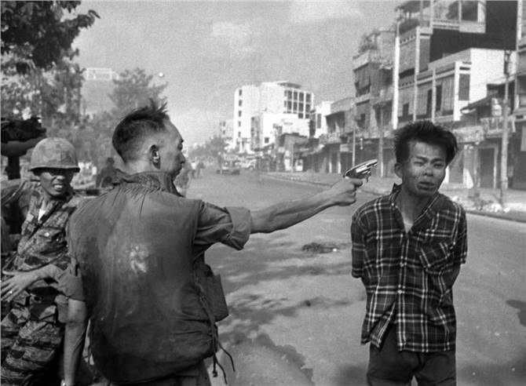

{fig-align="center" width="70%" fig-alt="Narin Güran"}

Fotoğraf tarihinin ikonik görüntülerinden birisidir. Güney Vietnam polis şefi Nguyễn Ngọc Loan, Saygon'da bir Vietkong gerillasını Amerikalı foto muhabiri Eddie Adams'ın gözü önünde kafasından vurarak öldürmüştür. Adams'ın bu fotoğrafı, savaş karşıtlığını güçlendiren görüntülerden birisi olarak biliniyor. Peki fotoğrafta gördüğümüz, gerçeğin ne kadarını anlatıyor? Ya da bir insanın infazı, onun kimliğinden bağımsız olarak tek başına insani duygularımızı harekete geçirebilir mi?

John Berger "Görme Biçimleri" adlı eserinde biraz da bu konulara yanıt arar. Bütün dünyada Amerikan emperyalizmine karşı savaşan Vietnamlı gerillalara büyük bir sempati vardır. Fotoğrafa bakan gözün, kendi ülkesinin bağımsızlığı için savaşan bir kişiye, üstelik esir alınmış; karşı çıkma şansı olmayan bir direnişçiye sempati duyması ve onu öldüren kişiye nefreti anlaşılır bir durumdur.

Peki ama görüntü, gerçeğin tamamına ilişkin bir hüküm vermemiz için yeterli midir? Ya da yazının başındaki soruya dönersek; gördüklerimize benliğimizle, duygularımızla, düşüncelerimizle, inançlarımızla hangi anlamları yükleriz? Berger şu soruyu sorar: Bu fotoğrafın altında infaz edilen kişiye yönelik olumsuz ifadeler olsaydı, yine de aynı duyguları taşır mıydık? Örneğin bir tecavüz zanlısı, bir savaş suçlusu, ya da bir işbirlikçi… İnancına, etnik kökenine, değerlerine hatta o andaki psikolojisine göre her kişi farklı cevaplar verebilir.

{fig-align="center" width="70%" fig-alt="Eddie Adams'ın Saygon fotoğrafı: Güney Vietnam polis şefi Nguyễn Ngọc Loan'ın bir Vietkong gerillasını infazı."}

*Image Credit: Eddie Adams*

## Tüm Türkiye'nin yargıcı olduğu cinayet

Bütün Türkiye'yi kilitleyen, toplumun bütün kesimlerinin dikkatini Diyarbakır'da küçük bir köye yönelten olay 21 Ağustos 2024'de Narin Güran'ın okuldan evine döndüğü yolda kaybolması ile başladı. Başlangıçta çok ilgi çekmedi. Bu ülkede kaybolan ilk çocuk değildi. Fakat olay kısa sürede sosyal medyada yapılan paylaşımlarla kartopunun çığa dönüşmesi gibi bütün toplumsal, sınıfsal kesimleri kapsayan bir histeriye dönüştü. Sanırım Türkiye'nin yakın tarihinde böylesine ortaklaşılan bir başka olay yoktur. Narin Güran'ın kaybolması ve bir dere yatağında cenazesinin bulunmasının ardından laik, anti-laik, Müslüman, Sünni, Alevi, Kürt, Türk bütün inanç, etnik köken ve farklı ideolojilere sahip insanların aynı noktada buluşması, farklı nedenlerle ortak tepki vermesi bana hep Eddie Adams'ın bu fotoğrafı üzerine John Berger'in yazdıklarını hatırlatır. Bunda sanırım yeni çağın yeni medyası, sosyal medya ve değişen medya gerçeğinin önemli bir rolü var.

O dönem çalıştığım Gazete Duvar'da, itiraf ediyorum bu histeriye kısa bir zaman dilimi de olsa biraz kapılmıştım. Bende de köyden birçok kişinin bir kız çocuğun cinayetine şu veya bu şekilde katıldığına, bir sessizlik yasasının uygulandığına ilişkin izlenim oluşmuştu. Fakat cinayetin ayrıntıları ortaya çıktıkça hızla şüphe duymaya başladım.

Olaylar zincirini hatırlamakta fayda var:

Cinayetin işlendiği Tavşantepe köyü için dile getirilmeyen iddia kalmadı. Köyün resmi imamı dahi bu iddialardan nasibini aldı. Ailenin neredeyse gözaltına alınmayan tek üyesi, abi Baran Güran'ın hükümet yanlısı medya tarafından Newroz'da çekilmiş görüntüleri servis edilerek PKK'lı olduğuna ilişkin imalar yapıldı. Hizbullah'ın başka yerlerde çekilmiş mezar evlerinden çıkan görüntüler bu köyde olmuş gibi paylaşımlar gerçekleşti. Ailenin Hüda-Par'ı desteklediği de politik Kürt çevrelerinde dillendirilen bir iddia oldu. Ama Hizbullah'ı destekleyen bazı hesaplarda da, Narin Güran'ın PKK tarafından YPG'ye götürüldüğüne ilişkin paylaşımlar yaptı. Laik milliyetçi Türkler açısından ise zaten her ikisi de bir nefret nedeniydi. "Kürtler arası ensest ilişkiler", "ailenin Kürt olması", "Hizbullah yanlılığı" vs. meşrebe göre her iddia sosyal medyanın karanlık hesapları arasında dolaştı.

## Sosyal medyayı tetikleyen paylaşım

Peki bu süreç nasıl başladı?

21 Ağustos'ta Narin Güran'ın kaybolmasından sonra sosyal medyada paylaşılan bir yazı belki de bu olayın fitilini ateşledi. 4 Eylül günü bir benzin istasyonu çalışanı olduğunu iddia eden Murat Çınar Çatalca'nın yazdığı söylenen bir not bütün medya ve sosyal medyada haber oldu.

Notta şunlar yazıyordu:

> "Salim Güran köyün muhtarıdır. HTS kayıtlarında öncesi ve sonrasında Narin Güran'ın annesi ile hem mesajları hem de arama kayıtları var. Olay günü Narin kaybolduktan 15-20 dk. sonra bu it Salim Güran kendi aracıyla köyden çıktı. Yakıtını da almıyor. Bir petrole giriyor marketten ıslak mendil alıyor. Kamera kayıtları alındı. Yemin ederim kamera kayıtlarını kendim verdim jandarma komutanına. Benim görüntülerden hiçbir şey paylaşmamam istendi. Hatta paylaşırsam delilleri medyaya vermekten ceza alacağım söylendi. Bu muhtar Narin'in erkek kardeşi Enes'le de görüşüyordu. Telefon kayıtlarına göre olay sonrası ve kamera kayıtlarında ne yazık ki Narin ya baygın ya da Salim elleriyle boğmuş vaziyette yatıyor ön koltukta ve üstünde koyu kahve renginde bir battaniye vardı. Muhtarı petrol çalışanları da tanıdığı için şüphe yoktu. Ayrıca muhtar telefonu kapalıydı ve 2 saat sonra köye karanlıkta dönüyor. Bu sefer köye döndüğünde sanki hiçbir şeyden habersiz gibi davranıp ne olmuş Narin'e diye ağlamış üzüntü süsü vermiştir."

**(Kişinin ifadesi doğrudan alıntılanmıştır. Bozuk cümle yapıları kendisine aittir.)**

Bu cinayet, o dönem çalıştığım Gazete Duvar'da da haftalık haber toplantılarında yoğun bir şekilde ele alınmaya çalışılmıştı. Fakat cinayete ilişkin kamusal atmosfer aslında herkesi etkisi altına almıştı. Farklı bir ses çıkmıyordu. Fakat okuduğum haberlerden sonra bende birtakım şüpheler oluşmaya başladı. Evet, köye ilişkin çok fazla iddia vardı. Olaya ilişkin karanlık nokta çoktu. Ama neden kimse cesedi gömen Nevzat Bahtiyar'a ilişkin şüphe duymuyordu. Geçmişte sosyal medyanın ve "mahalle baskısının" yoğun hissedildiği, bu yüzden farklı seslerin çok duyulmadığı bazı davalardan dolayı temkinliydim. Rabia Naz, genç bir Kürt kadının intiharı ile sonuçlanan Musa Orhan davası gibi davaları biraz aklı başında gazeteciler sırf bu mahalle baskısı nedeniyle bütün yönleriyle tartışamadı.

Bir süre sonra Yıldıray Oğur'un Karar gazetesindeki köşesinde "Fransa'da yüksek lisans yapan, mahalleyle ve aileyle bir yakınlığı olmayan Diyarbakırlı Miham Akkul'un en başından itibaren bütün haberleri, delilleri, ifadeleri takip ederek yazdığı çarpıcı" [mektubu](../../yildiray-ogur/tavsantepe-koyu-masum-olabilir-mi) okudum. Akkul, benim duyduğum kuşkuları derli toplu şekilde dile getiriyordu. Çok yoğun bir manipülatif haber bombardımanı içinde önümüzde duran basit gerçeği görmek, kabul etmek gerekiyor ki çok zorlaşmıştı. Örneğin geçmişte ailenin bir çocuğu daha ölmüştü. Gün, yıl gibi net tarihler ve hastane adı verilerek yapılan haberlere ve paylaşımlara göre 2019 yılında bu çocuk da merdivenlerden düşerek, itilerek vs. ölmüştü. Haberlerde tek doğru bilgi hastanenin adıydı. Oysa Diyarbakır'da, orada yaşayan ve Narin davasını izleyen onlarca gazeteci vardı. Bir gazetecilik ilkesine göre yapılması gereken basit bir yöntem vardı. Hastaneyi ararsınız ve bu çocuğun ölüm kayıtlarını istersiniz. İstanbul'da konuyla pek de ilgisi olmayan bir gazeteci olarak bu soruyu sordum.

O dönem Gazete Duvar'da yerel bir haber ağını yönetiyordum. Duygu Kıt, Dersim'de yaşayan genç bir gazeteci kadındı. Duygu'ya ailenin daha önce ölen bu ferdini araştırmasını istedim. Konuyu konuşmamızdan birkaç saat sonra haber önüme geldi. Bu haberler yayınlandığı anda hastane yönetimi de durumu araştırmış ve Narin Güran'ın ablası ile ilgili kayıtlara bakmıştı.

Duygu'nun haberinden aktarayım:

> "Hastane kaynaklarından edindiğimiz bilgiye göre 2009'da 5 yaşında ve bedensel engelli olan abla Tülin Güran, Diyarbakır Çocuk Hastalıkları Hastanesi'ne zatürre (pnömoni) sebebiyle kaldırıldı ve burada vefat etti. Buna göre iddiaların aksine hastanedeki ölüm raporunda abla Güran'ın vefatında herhangi bir şüpheli durum ya da travma bulgusu bulunmadığı belirtildi. Tülin Güran'a tedavi sürecinde hayatını kaybettiği için otopsi de yapılmadığı belirtildi."

Yaptığımız bu habere rağmen çeşitli TV programlarında, haberlerde, sosyal medya paylaşımlarında bu iddia dile getirilmeye devam etti.

{fig-align="center" width="70%" fig-alt="Narin Güran."}

## Dezenformasyon patlaması

Yukarda verdiğimiz ilk sosyal medya paylaşımından sonra aile hakkında birbiri ardına bazen gerçeğin manipüle edildiği, çoğunluğu yalan haberlerde büyük patlama oldu. Bütün Türkiye medyası, Youtuber'lar, Instagram fenomenleri köye gittiler. Dijital dünyanın bir çılgınlık hali gibiydi. Başta muhalif medyanın amiral televizyonu ve muhabiri olmak üzere günün her saatinde canlı yayınlar yapıldı. Yapılan haberlerde, benzincide çalışan Murat Çınar Çatalca'nın jandarmaya verdiği ifade de yer almıştı. Üstelik benzincinin sahibi de benzer paylaşımlar yapmıştı. Çalışanı Murat Çınar Çatalca'nın Güran ailesi tarafından tehdit edildiğini de söylüyordu. Elbette güvenlik güçleri bu paylaşımları da izliyordu. Ancak ufak bir sorun çıkmıştı. Ne böyle bir benzinlik ne benzinlikte çalışan böyle bir isim vardı. Hesaplar kapatılmış ve ortadan kaybolmuşlardı. Kimdiler, neden böyle bir paylaşımda bulunmuşlardı bilinmiyor. Ama bu haberleri okuyan biri daha vardı.

## Sosyal medyanın, Nevzat Bahtiyar'ın ifadelerine etkisi

Narin'in kaybolmasından neredeyse yirmi gün sonra bölgedeki jandarma karakolunun kamerasının incelenmesinde bir şey fark edildi. Oysa ilk incelenmesi gereken bu kameralardı. Salim Güran köyün muhtarı olarak Narin'in kaybolmasından sonra karakolu aramış ve kızın kaybolduğunu bildirmişti. Salim Güran'ın karakol komutanı ile yaptığı konuşmada kritik bir bilgi vardı. Komutanın sorusu üzerine Salim Güran köye Romanların gelmiş olabileceğini ve kırmızı bir aracın köyden ayrıldığının görüldüğünü söylemişti. Nedense kolluk köyün çıkışında bir noktayı gören kameralara incelemeyi dava Türkiye'nin gündemine girince akıl etmişti.

Kamera incelemelerinde Narin Güran'ın kaybolduğu 21 Ağustos'ta kırmızı bir aracın 15.40'da dereye yakın park ettiği ve elli dakika boyunca orada kaldığı görülüyordu. Birkaç gün süren aramalardan sonra 8 Eylül'de Narin'in cesedi bulundu. Bir çuval içindeki ceset suyun içinde üzerine taş konmuş olarak duruyordu. Kırmızı aracın sahibini bulmak zor olmadı. Salim Güran'ın komşusu Nevzat Bahtiyar hemen göz altına alındı. Peki küçük bir köyde o kırmızı aracın Nevzat Bahtiyar'a ait olduğu neden ilk baştan anlaşılmamıştı. Çünkü araç köyde oturmayan Nevzat Bahtiyar'ın oğluna aitti ve aracı bir gün önce almıştı.

Nevzat Bahtiyar, muhtar Salim Güran'ın tutuklanmasına yol açan ilk ifadesini verdi. Kendisi de aramalara katılan Bahtiyar, medyada dolaşan o ilk ifadesinde, aracın ön koltuğunda battaniyeye sarılı duran ceset hikayesini aynen kullanmıştı. Jandarmanın yaptığı gözaltı işlemine rağmen Nevzat Bahtiyar bütün haberlerde "itirafçı" olarak yer aldı.

Davanın sonraki ayrıntıları bu yazının boyutlarını çok aşar. Ama bir tanesini daha aktarmak gerekiyor. Çünkü Salim Güran ile Anne Yüksel Güran arasında bir ilişki yaşanmış olabileceği iddiası buradan çıkmıştı. Nevzat Bahtiyar kollukta verdiği ifadede yer vermediği bir iddiaya savcılık ifadesinde söylemişti. Bahtiyar savcılığa verdiği ifadede:

> "Salim Güran'ın Yüksel Güran (Narin'in annesi) ve amcasının eşi Maşallah Güran ile ilişkisi olduğu konuşuluyordu. Ama bu hususta kimsenin ifade vereceğini düşünmüyorum. Benim tahminin bu kadınlardan biriyle yaşadığı cinsel ilişkiyi Narin'in gördüğü yönünde. Bu nedenle Narin Güran'ı öldürebileceğini düşünüyorum. Ancak ben kendi gözlerimle bu kadınlardan biriyle bir ilişki yaşadığını görmedim"

diyordu. Bu iddia ifadeden önceki gün bir televizyon kanalında gündüz kuşağı programları yapan bir yorumcu tarafından iddia edilmişti. Bahtiyar medyada ve sosyal medyada dolaşan iddialardan mantıklı bulduklarını kendi ifadesine ekliyordu.

Sonrasında bir kartopunun çığa dönüşmesi gibi köy hakkında gerçek olan, olmayan her iddia canlı yayınlarda dile getirilmeye ve davaya bağlanmaya çalışıldı. Kolluğun bu aşamadaki tutumu ise bir olay yeri inceleme faciasıydı. Narin Güran'ın DNA'sının çıktığı söylenen araç evin önünde duruyor. Youtuber'lar aracın yanında yayın yapıyordu.

{fig-align="center" width="70%" fig-alt="Tavşantepe mahallesinden bir kare. (Diyarbakır/Bağlar)"}

*Tavşantepe mahallesinden bir kare. (Diyarbakır/Bağlar)*

Davaya ilişkin büyük soru işaretleri bunlar…

Ama Berger'in "Görme Biçimleri"nde ifade ettiği gibi, ya toplumun bütün kesimleri bu davada görmek istediğini gördüyse? Bütün bir Türkiye toplumunun içine Narin davası özelinde kendini yansıttığı ruh hali bu yanıyla incelenmeye değer. Son yıllarda 'Yeni Nesil Çeteler' ile ilgileniyorum. TikTok'da Narin'in mezarını Karadenizli bir mafya liderinin ziyaret ettiğini görmüştüm. "Yeni Nesil Çeteler"in en önemlilerinden Daltonlar'ın liderlerinden Sinan Memi, polis dinlemesine takılan bir telefon görüşmesinde Diyarbakır'dan kendilerine katılmak isteyen bir çete üyesine "bir hayır işi var" diyerek para almadan Salim Güran'ın evini kurşunlamasını istiyordu.

## Medya, toplum ve 'Faşizmin Kitle Ruhu'

Vietnam'daki ünlü Tet saldırısı sonrasında çekilen fotoğrafa dönersek, neden Türkiye toplumunun bütün katmanları Diyarbakır'ın bir köyündeki çocuk cinayetine bu kadar "duyarlı" oldu? Narin Güran'ın yarım bırakılan çocukluğuna duyarlılık mıydı bu, yoksa gördüğümüz fotoğrafa kendi alt metinlerimizi mi yükledik?

Gözümüzün önünde duranı; aydını, gazetecisi, akademisyeni, siyasetçisi, seküleri, dindarı, Kürdü ya da Türk milliyetçisi olarak beynimizin içindeki şablonlara mı uydurduk? Eğer ikincisi ise bugün bir anne, bir amca ve bir kardeş kendi çocuklarının yasını tutamadan onların katili olarak tutuklu demektir. Belki yıllar sonra gazetecilik okullarında bir iletişim faciası olarak ya da bir toplumun topluca girdiği histerinin örneği olarak anlatılacak bir olayı hep birlikte yaşadık.

Sanırım farklı kültürlerden, sınıflarda, katmanlardan, ideolojilerden bunca insanın aslında "öteki"ye karşı duydukları nefretin tepkinin ortaklaşmasında "sosyal medyanın ve medyanın" birleştirici bir gücü var. Wilhelm Reich, "Faşizmin Kitle Ruhu" anlayışı kitabında bu tepkinin bir ideolojinin içine sokulmasının ve kullanılmasının belirleyici olduğunu aktarır. Farklı olana yönelik bu tepkinin egemenler açısından kullanışlı bir yanı vardır. 1930'ların Almanya'sında faşizm bu tepkiyi kullanır ve yönlendirir. Faşizmin propaganda bakanı Goebbels o dönemin yeni iletişim medyası radyoyu bu amaçla kullanan ve öneminin farkına varan ilk isimdir. Birinci dünya savaşının yıkıntılarından yeniden doğmaya çalışan Almanya'da başta işçi sınıfı egemen sınıflara karşı yoğun bir tepki içindedir. Eğer erken bir ayaklanmaya itilmeseydi Alman Komünist Partisi'nin iktidarı ele geçirmesinin önünde neredeyse fazlaca bir engel yoktu. Buna rağmen sosyal demokratlar ve komünistler ülkenin en kalabalık partileridir. Adı Nasyonal Sosyalist Parti olan Hitler'in liderliğindeki faşist parti propagandasının temeline Yahudi burjuvaziyi koyar. Yoksulların zenginlere olan nefretini "kurnaz zengin Yahudi'ye" yöneltir. Alt sınıfların bilince çıkartılmamış tepkisinin kolayca kanacağı bir figür yaratılır. Bu nedenle de Alman faşistleri, işçi sınıfının özellikle lümpen kesimlerinden ciddi bir oy alırlar.

## Bir toplum mühendisliği olarak 'negatif kimliklenme'

Bu yanıyla Narin davası Türkiye'deki her toplumsal kesimin başkalarına karşı duyduğu tepkiyi ortaya çıkartan bir turnusol kâğıdı işlevi gördü. Fakat bu kadar farklı kesimlerin hepsinin tek bir olay karşısında bu kadar ortaklaşmasının bir başka örneği var mıdır bilmiyorum. Narin davası özelinde Türk ve Kürt milliyetçisi, laik ve anti laik, Alevi ve Sünni, iktidarı ve muhalefeti aynı ortak noktada buluşabilmiştir. Bir yanıyla egemenler tarafından bir toplum mühendisliği ile tam da Reich'ın sözünü ettiği "öteki"ye karşı duyulan nefretin kullanışlı haline gelmesinin ne kadar kolay olabileceğinin bir örneği olarak da bu dava karşımızda duruyor. Bu yanıyla özellikle sosyal medyanın nasıl bir güç olduğunun da ayırdına varabileceğimiz bir deneyim yaşadık. Bu negatif kimlik anlatımı örneği ile sorunların kaynağının "başka yerde" aramanın ne kadar kolay olabildiğini gördük. Bir köy, bir aile, bir kimlik özelinde nasıl kolayca aklın kenara bırakıldığı ve nefretin nasıl ortaklaşabileceği önümüzde yaşandı.

Son olarak Minguzzi davasıyla birlikte "Suça Sürüklenen Çocuklar" ve onların etnik kimliği üzerinden bir başka tartışma yürütülüyor. Oysa suçun nedenleri, kaynakları, neden oluştuğu tartışması bir yana, bu yasanın politik muhalefetin genç unsurlarına karşı nasıl kullanılabileceği bile düşünülmeden kestirmeci bir bakış açısıyla yine bir başka akıl tutulması yaşamaya başladık. Unutmayalım "öteki"ye duyulan nefret her zaman egemenlerin kullandığı en büyük silahtır.

**Notlar:**

Reich, W. (2014). *Faşizmin kitle psikolojisi* (Y. Pazarkaya, Çev.). Cem Yayınevi.
